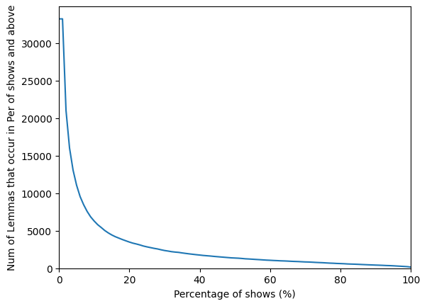
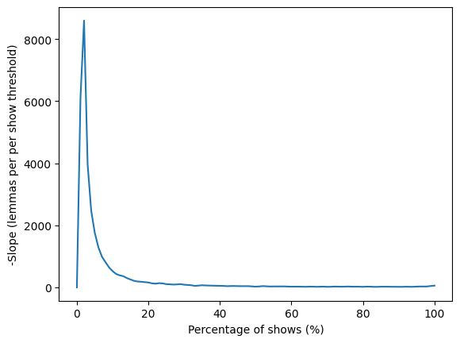
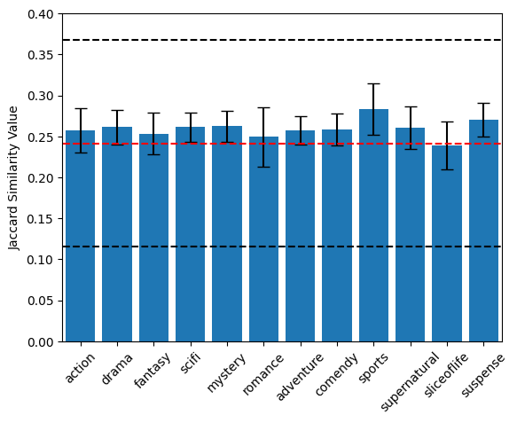
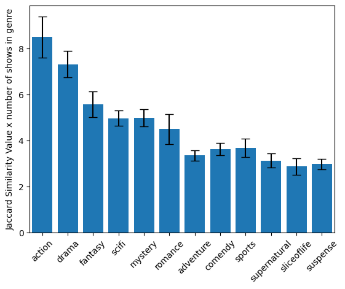
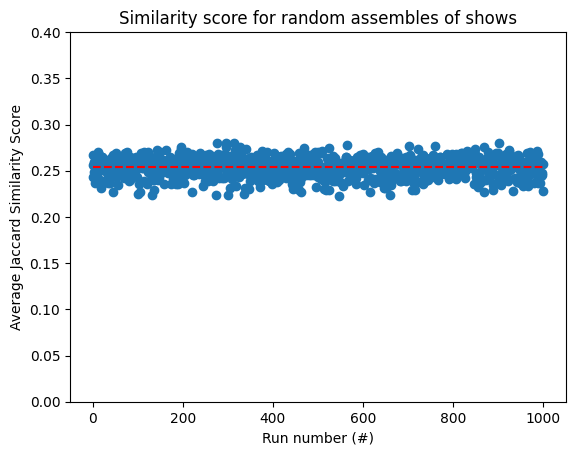

# Japanese Similarity Analysis of Anime Genres

## Introduction
Immersion learning is a method of foreign language learning (also called acquisition) which emphasizes the learning of a foreign language using native content in the language as the primary study material.
For Japanese, one source of content for use in immersion learning is anime.
Anime is attractive content because of the large volume and diversity of media available as well as the presence of subtitles which act as transcripts for the spoken dialogue of an episode.
Different methods and approaches for using anime to learn the Japanese language have been presented on different internet sites and platforms, one example being AJATT (All Japanese All The Time) [[1](https://tatsumoto-ren.github.io/blog/whats-ajatt.html)] and its various adaptations and modifications.

One source of information relating to tips, strategies, and tools for applying an AJATT style approach to Japanese learning using Anime is a YouTube channel called Matt vs Japan [[2](https://www.youtube.com/@mattvsjapan)].
One idea that has been presented by MattvsJapan, as well as on the Refold language learning guide is the idea of language "domains", or genres of content which have a specific subset of language that is commonly used (e.g. fantasy vs. crime drama vs. slice-of-life) [[3](https://refold.la/simplified/stage-2/b/immersion-guide)].
By focusing on a single domain, words unique to a domain can be encountered more frequency, thus increasing the chance of acquiring them for long term retention.
The aquisition of words has been deemed as highly important for learning a language, such as by Steve Kaufmann (one of the founders of LingQ) [[4](https://www.youtube.com/@Thelinguist)] [[5](https://www.lingq.com/en/)].
Repeated exposure to the same vocabularly can also enhance the subconscious comprehension of those words which is also a good place to start when wanting to begin speaking (or outputting) in a language [[6](https://youtu.be/19OKvadH_D0?si=G6hqqONS8XB4ntoH)].
Therefore, focusing on a single domain when immersing is an attractive strategy for quickly aquiring foreign language vocabulary.

One idea to determine the domain of a show/piece of content is by the genre of the media (e.g. slice-of-life).
While this seems to be a sensible categorization of media into language domains, the question remains (at least to me) whether shows within a single genre quantitatively have a higher language similarity than shows across different tagged genres.

The aim of this repo is to provide an analysis of the language content from different anime shows to quantify the degree of similarity in the language used, as well as to provide tools for identifying vocab-similar and vocab dis-similar shows.
The objectives are as follows:
- Develope criteria for comparing the similarity of the language present between any two shows.
- Identify and differentiate between "core language" and "domain language".
- Compare the degree of similarity of the language of shows in a single genre compared to shows across genres.

References:

[1] https://tatsumoto-ren.github.io/blog/whats-ajatt.html

[2] https://www.youtube.com/@mattvsjapan

[3] https://refold.la/simplified/stage-2/b/immersion-guide

[4] https://www.youtube.com/@Thelinguist

[5] https://www.lingq.com/en/

[6] https://youtu.be/19OKvadH_D0?si=G6hqqONS8XB4ntoH

## Dataset and Analysis Methods
### Description of Dataset
Subtitle files for analyzing were acquired by downloading from Kitsunekko.net under the Japanese subtitles page (https://kitsunekko.net/).
(As of 2026-04-09 the actual site seems to be down, so some subtitles alternatively were obtained by cloning https://github.com/Ajatt-Tools/kitsunekko-mirror/tree/main)
For analysis, SRT subtitle files were solely used because of their simple text formatting compared to ASS files.
For some shows with subtitles only available in the ASS format, conversion of these files to SRT was done using the subtitle tool Aegisub (https://aegisub.org/) by exporting as SRT files after choosing the "clean tags" option in the export window.

The subtitles for 100 shows were obtained as the dataset for analysis (stored in the Data folder), with the genres for the chosen shows taken from the information present in their respective listings on MyAnimeList (https://myanimelist.net).
A complete list of all the shows used with their genres (as well as additional information) is included in the "Supporting Info/show_genres.xlsx" spreadsheet.

The distribution of genres for the shows is as follow:

- Action: 33
- Drama: 28
- Fantasy: 22
- Sci-Fi: 19
- Mystery: 19
- Romance: 18
- Adventure: 13
- Comedy: 14
- Sports: 13
- Supernatural: 12
- Slice of Life: 12
- Suspense: 11
- Ecchi: 2
- Avant Garde: 1

Given that the Ecchi and Avant Garde genre only show up a small number of times, these two categories are excluded from the analysis.

### Analysis Methods
#### Lemma Extraction
For quantifying the similarity between two (or more) selections of japanese text, a lemmas-based comparison approach was chosen, with the first step being to break the entire text into its component lemmas.
In linguistics, lemmas are the "dictionary form" of a word, and can be thought of as the 'base' form.
For example, in English the words _break_, _broke_, _broken_, and _breaking_ all share the same lemma: **break** (See [Wiki](https://en.wikipedia.org/wiki/Lemma_(morphology))).

For a similarity analysis between two bodies of Japanese text, I am interested in what unique words are present in a show or shared between shows, not whether the same forms of a word are shared.
In other words, whether the base word 'to go' (行く) is shared, and not whether specific conjugations (such as 行きます, 行きません) are shared.
Therefore, the lemmas present in a block of Japanese text are chosen as the components for further comparison.

To give an example, consider the following 4 sentences, each with one additional change to the words used compared to the original, first sentence:
- (0) original: "私の友達は親切な人です"
- (1) one change: "彼の友達は親切な人です"
- (2) two changes: "彼の彼女は親切な人です"
- (3) three changes: "彼の彼女は内気な人です"

With each sentence, the content becomes more distinct/unique from the original sentence.

Using the fugashi package with the Tagger class, we can extract the lemmas present in each of the above sentences.


```python
"""
Example for Lemma extraction from text using fugashi
"""
from fugashi import Tagger

def lemma_extract(text):
    """
    Short function for returning a list of words and a list of the lemmas
    """
    words = tagger(text)

    lemma_list = []
    for word in words:
        lemma_list.append(word.feature.lemma)

    return words, lemma_list


tagger = Tagger('-Owakati')

orig_sent = "私の友達は親切な人です"  # base sentence for comparison
sent_1diff = "彼の友達は親切な人です"  # one word difference
sent_2diff = "彼の彼女は親切な人です"  # two words different
sent_3diff = "彼の彼女は内気な人です"  # three words different

text = [orig_sent, sent_1diff, sent_2diff, sent_3diff]

word_list = []
lemma_list = []
for sentence in text:
    words, lemmas = lemma_extract(sentence)

    word_list.append(words)
    lemma_list.append(lemmas)


print(f"Original Sentence: {text[0]}")
print(f"Original lemmas: {lemma_list[0]}\n")
print(f"1 diff Sentence: {text[1]}")
print(f"1 diff lemmas: {lemma_list[1]}\n")
print(f"2 diff Sentence: {text[2]}")
print(f"2 diff lemmas: {lemma_list[2]}\n")
print(f"3 diff Sentence: {text[3]}")
print(f"3 diff lemmas: {lemma_list[3]}\n")
```

    Original Sentence: 私の友達は親切な人です
    Original lemmas: ['私-代名詞', 'の', '友達', 'は', '親切', 'だ', '人', 'です']
    
    1 diff Sentence: 彼の友達は親切な人です
    1 diff lemmas: ['彼', 'の', '友達', 'は', '親切', 'だ', '人', 'です']
    
    2 diff Sentence: 彼の彼女は親切な人です
    2 diff lemmas: ['彼', 'の', '彼女', 'は', '親切', 'だ', '人', 'です']
    
    3 diff Sentence: 彼の彼女は内気な人です
    3 diff lemmas: ['彼', 'の', '彼女', 'は', '内気', 'だ', '人', 'です']
    
    

#### Calculating the Similarity of Lemma sets

For English text, similarity scores between sets of documents or text can be done fairly easily using criteria such as the Term Frequency-Inverse Document Frequency (IF-IDF) and libraries such as scikit with sklearn.
One challenge I faced while trying to set these tools up however was in modifying the workflow from English to Japanese.
While there are a few sites which describe adapting sklearn to Asian languages, specifically using the TfidfVectorizer class with a custom tokenizer (such as [here](https://investigate.ai/text-analysis/how-to-make-scikit-learn-natural-language-processing-work-with-japanese-chinese/)) (which is what I originally wanted to do), I wasn't quite able to figure out how to apply this using the fugashi package which I was more comfortable with using, and so I decided to try a different approach.

In the previous code block, lists of the lemmas present in each of the example sentences were generated.
If the frequency of occurence of each lemma in the sentence is ignored, then each list can be converted into a set, resulting in a collection listing the unique lemmas present in a given text.
From here, methods which quantify the similarity between two sets can be applied to quantify how similar the lemma collection between the sentences are.

The value I am using to evaluate the similarity of sets is the [Jaccard Similarity Coefficient](https://en.wikipedia.org/wiki/Jaccard_index), and is defined as the size of the intersection between two sets divided by the size of the union of the sets.

$$
J(A, B) = \frac{\left| A \cap B \right|}{\left| A \cup B \right|}
$$

where $A$ and $B$ are two sets for comparison.
The calculation is commutative, so order of the sets does not matter.

Setting up calculating the Jaccard Similarity can easily be done in python, as shown [here](https://www.annasguidetopython.com/python3/data%20structures/lists-finding-the-jaccard-similarity-between-two-sets-in-a-list/) ( or [here](https://www.geeksforgeeks.org/data-science/how-to-calculate-jaccard-similarity-in-python/)) and demonstrated below.


```python
"""
Quantifying the similarity of sentences using Jaccard Similarity on sets of the lemmas present
"""
set1 = set(lemma_list[0])
set2 = set(lemma_list[1])
set3 = set(lemma_list[2])
set4 = set(lemma_list[3])

def jaccard_similar(set1, set2):
    return len(set1.intersection(set2)) / len(set1.union(set2))

print(f"1 against 1: {jaccard_similar(set1, set1)}")
print(f"1 against 2: {jaccard_similar(set1, set2)}")
print(f"1 against 3: {jaccard_similar(set1, set3)}")
print(f"1 against 4: {jaccard_similar(set1, set4)}")
```

    1 against 1: 1.0
    1 against 2: 0.7777777777777778
    1 against 3: 0.6
    1 against 4: 0.45454545454545453
    

As expected, the similarity value for a lemma set compared against itself is 1, meaning the sets are identical.
As each sentence becomes more and more different than the original, the Jaccard coefficient decreases, with a value of ~0.45 for a sentence with 4 changed words from the original.

To recap, in order to compare the similarity of the language used in between two anime shows, the following steps will be done:
- extract a set of the lemmas present within the subtitle files of each show
- calculate the Jaccard Similarity Coefficient between the shows.

## Results
In this section, subtitle files for each show in the 'Data' folder is parsed to create sets of the unique lemmas present in each show.
This lemma set for each show will serve as the base data for analysis.

### Creating database of lemmas from shows


```python
"""
Creating a database of lemmas by reading in and parsing the subtitles files in the 'data' folder
"""
from fugashi import Tagger
from subtitleparsing import create_lemma_database

data_folder = 'Data'  # folder with subtitles
tagger = Tagger('-Owakati')

lemma_database = create_lemma_database(data_folder, tagger)  # dictionary of shows with associated set of the lemmas in that show

print("")
print("Lemma database from Data subtitles generated")
```

    -- Beginning parse of shows in subtitle folder --
    
    Show currently parsing: 07-ghost
    Show currently parsing: 100-man no Inochi no Ue ni Ore wa Tatteiru
    Show currently parsing: 3-gatsu-no-lion
    Show currently parsing: 7seeds
    Show currently parsing: 91-days
    Show currently parsing: acca-13
    Show currently parsing: Ahiru-no-Sora
    Show currently parsing: Aho-Girl
    Show currently parsing: aico-incarnation
    Show currently parsing: akebi-chan-no-sailor-fuku
    Show currently parsing: amagi-brilliant-park
    Show currently parsing: Ao-no-Hako
    Show currently parsing: appare-ranman
    Show currently parsing: assassination-classroom
    Show currently parsing: baby-steps
    Show currently parsing: ballroom-e-youkoso
    Show currently parsing: banana-fish
    Show currently parsing: barakamon
    Show currently parsing: Beastars
    Show currently parsing: blue-lock
    Show currently parsing: blue-period
    Show currently parsing: bocchi-the-rock
    Show currently parsing: Boku dake ga Inai Machi
    Show currently parsing: boku-no-hero-academia
    Show currently parsing: bungo-stray-dogs
    Show currently parsing: burn-the-witch
    Show currently parsing: chainsaw-man
    Show currently parsing: charlotte
    Show currently parsing: chihayafuru
    Show currently parsing: cider-no-you-ni-kotoba-ga-wakiagaru
    Show currently parsing: death-note
    Show currently parsing: deca-dence
    Show currently parsing: dr-stone
    Show currently parsing: drifting-dragons
    Show currently parsing: eighty-six
    Show currently parsing: fire-force
    Show currently parsing: flying-witch
    Show currently parsing: free
    Show currently parsing: fruits-basket
    Show currently parsing: fugou-keiji
    Show currently parsing: giant-killing
    Show currently parsing: gleipnir
    Show currently parsing: great-pretender
    Show currently parsing: haikyuu
    Show currently parsing: hibike-euphonium
    Show currently parsing: Higashi-no-Eden
    Show currently parsing: horimiya
    Show currently parsing: hyouka
    Show currently parsing: id-invaded
    Show currently parsing: iron-blooded-orphans
    Show currently parsing: jujutsu-kaisen
    Show currently parsing: k-return-of-kings
    Show currently parsing: kabukichou-sherlock
    Show currently parsing: kaze-ga-tsuyoku-fuiteiru
    Show currently parsing: kobayashi-san-dragon-maid
    Show currently parsing: kuroko-no-basket
    Show currently parsing: lycoris-recoil
    Show currently parsing: magic-kaito-1412
    Show currently parsing: mahoutsukai-no-yome
    Show currently parsing: maou-gakuin-no-futekigousha
    Show currently parsing: mawaru-penguindrum
    Show currently parsing: megalobox
    Show currently parsing: mushishi
    Show currently parsing: nagi-no-asukara
    Show currently parsing: Natsume-Yuujinchou
    Show currently parsing: no-guns-life
    Show currently parsing: Non-non-biyori
    Show currently parsing: orbital-children
    Show currently parsing: paripi-koumei
    Show currently parsing: peachboy-riverside
    Show currently parsing: planetes
    Show currently parsing: plunderer
    Show currently parsing: princess-principal
    Show currently parsing: psycho-pass
    Show currently parsing: relife
    Show currently parsing: ReZero
    Show currently parsing: sayounara-zetsubou-sensei
    Show currently parsing: shirobako
    Show currently parsing: sirius-the-jaeger
    Show currently parsing: Sket-Dance
    Show currently parsing: ssss-dynazenon
    Show currently parsing: suisei-no-majo
    Show currently parsing: sukitte-ii-na-yo
    Show currently parsing: summer-time-rendering
    Show currently parsing: takt-op-destiny
    Show currently parsing: tales-of-zestiria-the-x
    Show currently parsing: tamako-love-story
    Show currently parsing: tanaka-kun-wa-itsumo-kedaruge
    Show currently parsing: tantei-wa-mou-shindeiru
    Show currently parsing: tonari-no-kaibutsu-kun
    Show currently parsing: usagi-drop
    Show currently parsing: vanitas-no-karte
    Show currently parsing: vinland-saga
    Show currently parsing: violet-evergarden
    Show currently parsing: vivy-flourite-eyes-song
    Show currently parsing: wotaku-ni-koi-wa-muzukashii
    Show currently parsing: yakusoku-no-neverland
    Show currently parsing: yofukashi-no-uta
    Show currently parsing: yowamushi-pedal
    Show currently parsing: yuru-camp
    
    Lemma database from Data subtitles generated
    

### Exploring the generated dataset

The generated data set (lemma_database) is set up as a dictionary with the show names as keys and their associated value a list of the lemmas present. This list contains the unique lemmas present in all the subtitles for a given show (duplicates removed by converting the list of lemmas present into a set).

An example of requesting a lemma set for a given show as well as confirming its data type is shown below.


```python
# Example of the contents of the lemma_database dictionary
print(lemma_database['charlotte'])
print(f"The type of show lemma list is {type(lemma_database['charlotte'])}")
```

    {'兎に角', '強いる', '居着く', 'クロハ', '方', '側', 'スーパー-super', '崩壊', '切れる', '事実', 'よ', 'デ', 'そろそろ', '実際', 'リーグ-league', '連行', '教師', '嘘', '幾', '着席', 'サンド-sandwich', 'ポスト-post', '読者', 'メリット-merit', '一切', 'こそ', 'スパイス-spice', 'まい', '了解', 'られる', '変', '旨い', '豪語', '取る', '交際', '頼む', '切る', '○', '暴力', '泊まり', '得る', '電池', '視認', '勇気', '親', '抜群', '両方', '逮捕', 'アイドル-idol', '詰まり', '感じ', 'デビュー-debut', '着替える', '選手', 'ばい', '見渡す', '両親', '秘伝', '御飯', '臭い', '度肝', 'です', '一番', '処分', '分', '家出', '何事', '聞き込み', '」', '礼', '関わる', 'ハロー-hello', '器用', '警告', 'どう', '影', '海', '柚子', '即', '連絡', 'ファン-fan（熱狂者）', '間違える', '好物', '巻く', '覚える', 'よし', '陣', '話', '間', 'やら', 'スポーツ-sport', '育てる', '最早', 'まじ', '最も', '分かる', '作る', '大勢', 'プロテクター-protector', '縦し', '能力', '厄介', '性格', '因る', '更なる', '死ぬ', '小さい', 'チーム-team', '信頼', '奇麗', '規則', 'ほら', '週', '其奴', '投手', '赤い', '仲良し', '室', '楽しみ', 'を', '＆', '肉', '阿諛', 'ゲーム-game', '詰め込む', 'しか', 'ステーキ-steak', '貯金', '自然', '見下ろす', '球', '行成', '掛ける', '媚びる', '責任', '美しい', 'うう', '大人しい', 'どころ', 'スチール-steel', '落とし穴', '白い', '重ねる', 'ビンゴ-bingo', '只管', '至当', '小', '振る', 'メート-mate', '以上', 'リサーチ-research', '急', '構う', '委員', '窓', '決める', 'ウ', '接する', '星', '追い追い', '狡', '末代', '冴え', '観念', '動く', '腹癒せ', 'まさか', '噂話', '着', 'ＰＶ', '以下', '甲子', '見詰める', '所為', '新入', '玉蜀黍', 'オカルト-occult', '反対', '美味しい', '貸す', '減る', 'キン', '抜く', '可能', '偶然', '偶に', '引き継ぐ', '奴', '投球', 'ルックス-looks', '特定', '日曜', '化け物', '最大', 'あからさま', '理由', '混み合う', '拍子', '平日', '欲しい', 'じゃん', 'しょっぴく', '目当て', '少年', '書', '対応', '冗談', '然し', 'ファウル-foul', '追い払う', 'ストライク-strike', '受験', 'さっさと', '至急', 'メール-mail', '獲得', '面白い', 'ＧＰＳ', '最低', '嬉しい', '無くなる', '振り逃げ', 'き', '手分け', '向こう', '我慢', '増える', 'ぴたり', '似る', '如何に', '握り', '去る', '喜ぶ', '回転', '可笑しな', '破廉恥', '揃う', '煩い', '終わる', 'おっと', '転校', 'そう-伝聞', '追う', '第', '今日', '晩御飯', '引っ張る', '，', '会長', 'っち', '調子', '開ける', 'ファースト-first', '現状', '読む', '止め', 'セキ', '失敗', '用意', '部', '荷物', '伝わる', 'とろっとろ', '時々', '日差し', '朝食', '軈て', '感激', '徹底', '良く', 'のろのろ', '制御', '御前', 'モデル-model', '電話', '容易い', '宜しく', '守る', '焜炉', '指', '眠る', 'キョウト', '弱い', '胸', '状況', 'ニュース-news', '姿', '他言', 'リカ', 'テンション-tension', '転入', '住む', '後ろ', '我', None, '敵う', '凄い', '諦める', 'メロディー-melody', '風', '初耳', '着痩せ', '女子', '近付き', '口', '片付く', '大物', '品', '不可思議', '的', '告げる', '我が', '終了', '大袈裟', '下がる', '専属', '探す', '性', '件', '誰', 'あの', '垂れ', '精々', '良い', '半年', '入学', '楽園', '病気', '似合い', '回答', 'フライング-flying', 'プレー-play', '視界', 'て', '最初', '博士', '頭脳', '通報', 'とも', 'バンド-band（帯）', '独りぼっち', '都合', '最', '昔', 'ちょこちょこ', '不味い', '全身', 'クッション-cushion', '契約', 'はぶる', '土', 'きり', 'ず', '揺れる', '為', '頑張る', '違い', '何奴', '占い', '承諾', '聞き出す', '彼是', '逃げる', '彼の', '教頭', '否', 'ショット-shot', '隠し味', '旋律', '祝い', 'ヒノモリ', '同情', '授業', '被る', '辿り着く', '回復', '新', '商品', '遥か', '選び取る', '破く', '築く', '幾ら', '寿司', 'ちょん', '自覚', 'シリーズ-series', '引く-他動詞', '思う', '日', '時', '脅す', 'ベース-base', '一緒', '違う', '組', '興味', '術', '大人', '名門', '見舞い', '学食', '頭', '物', '制服', '彼氏', 'まあ', '向ける', 'オオムラ', '熱い', 'いしょ', '自体', '気配', '説明', '生活', '恵まれる', '傾向', '日常', '特上', '定石', '込む', '甘い', '強い', '変わる', 'フォー-for', 'と', '持つ', '実験', '路地', 'がる', '楽しい', '奏でる', '断ち切る', '舌', '見せ場', '集合', '反応', 'させる', '事', '薬', 'さっき', '売る', '此の', 'スペシャル-special', '前提', 'へえ', '交換', 'ヒット-hit', '子', '伝える', '起こす', '降参', '証拠', 'アイディア-idea', '考える', '—', '口止め', '君-代名詞', 'フレンチ-French', '名', '歩む', 'マナー-manner', '早退', 'ＣＤ', '実', '捕まる', '無用', '合格', '映る', 'ずつ', 'バンド-band（団）', '足跡', 'ビザ-visa', '面倒', 'どうぞ', '逆', '唐突', '来る', '弁当', '大きい', 'ぽい', '遣る気', '駅弁', 'めえ', '零', 'ちょ', '馬鹿馬鹿しい', '事情', '校長', '驕る', '黒羽', '引っ越し', '平気', '掟', '救う', '焼く', 'やれ', '皹', '降板', '果たして', 'イメージ-image', 'ギター-guitar', '混乱', '妹', '検査', 'コンテスト-contest', '申し訳', '長期', '死者', '駆け抜ける', '流行る', '感ずる', '個', 'タイプ-type', '休む', '掻き込む', '張る', '下校', '探る', 'たって', '人事', '焼き', '飛び下りる', '景色', '此方', 'キジマ', '約', '痛い', 'オトサカ', '何故', 'なり-断定', '信用', 'てく', 'カンニング-cunning', '全寮', '立てる', '仲間', '蟹', '微笑ましい', '偏食', 'こら', 'ショート-short', '保健', '申す', 'っ', 'より', '調べる', '憑依', 'スカイ-sky', '失う', 'ティーン-teen', '往生', '作戦', 'さえ', '様々', '多重', 'スペアリブ-spareribs', '素晴らしい', '良し', '初めまして', '皆', '貴様', '返す', '私', '撃退', '添える', '男性', 'まで', '落とす', '目指す', '立場', 'さ', '受ける', 'さっ', '時間', '登用', '転機', '答え', '投合', '御免', '雲', 'プロデューサー-producer', 'ちまう', '未来', '曲', '＠', 'ミート-meet', '其方', 'さようなら', 'アシスト-assist', '然も', '生徒', '高熱', '降霊', '余計', '現役', '証明', '誌', '呉れる', '親友', 'ダブり', '倒す', '彼', '渡す', '代々', '恋', 'など', '改造', '脳', '面会', 'タオル-towel', 'マドンナ-Madonna', '直様', '制', '校', '残念', '小学', '加わる', '全球', '突き出す', '細い', '僕-代名詞', '殺す', 'ちゃん', 'つ', '仕方無い', 'せる', '因み', '上昇', '進む', '振動', 'チェック-check', '手伝う', 'うー', '聞く', '突き立てる', '狭い', '御座る', '帰省', '焼き立て', '台', '邪', 'シロップ-siroop', '死角', '騒ぐ', '程度', '要る', '女性', '迎える', '通称', '柚', '大好き', 'テーブル-table', '有り難い', '上', '追い込む', 'って', '晩飯', '殴る', '車', '焼き殺す', '嫌々', 'モルモット-marmot', '結局', '全', '挽く', '筈', 'いたこ', 'か', 'メジャー-major', '欄', '顔色', 'バット-bat(棒)', 'オフ-off', 'シチュー-stew', '遂に', '実力', '代表', 'ナイス-nice', '大学', '併設', 'つう', '入る', '作り物', '劇', '道', '少し', '褒める', '登校', '暗記', '発生', '他', '匙', '優秀', '｜', 'コミヤマ', '馳走', '心', 'カット-cut', '続く', '形', '素', '予想', '次第', '念', 'エンジョイ-enjoy', 'コヤマ', 'おい', '席', '空', '状態', 'ゴロ-grounder', '残り', '嘗て', '専用', 'が', 'プチ-petit', '半端', '等', '彼女', '大丈夫', '付き合う', '故人', 'ぇ', 'べし', 'リンチ-Lynch', 'システム-system', '決まる', '日本', '願う', 'ごろごろ', '今更', '寝付く', '勿体', '近付く', '浴びる', 'ロック-lock', '静か', '平熱', '世話', '勝算', '彼奴', '作り出す', '持ち帰る', '変装', '簡単', '押し掛ける', '男勝り', '話す', '入れる', '不安', '計算', '与える', '論点', '全員', 'みいはあ', '着替え', '参り', '此処', 'ああ', 'わ', 'カレー-curry', '午後', 'つつ', '決着', '自炊', '丁度', '無い', '悪', '中等', '本名', '悲しむ', '勝つ', '甘み', '直接', '走る', 'ば', '羨ましい', '弓道', '隠れる', '言う', '認める', '芸能', '現われる', '知り合い', 'ナオ', '麒麟', '例えば', '非常', '効果', '言い草', 'とる', '店', '始まる', '有', '故', '夢見', '見える', '未だ未だ', '影響', 'だらけ', '見え透く', '泣く', '…', '病', 'バイト-Arbeit', '内申', 'ラーメン-Rahmen', 'クラスメート-classmate', '封印', '交代', '雨霰', '枯れ草', 'カメラ-camera', '宇', '味', '試練', '運動', 'そう-様態', '脚光', '隣り', '滑茸', 'ロー-low', '其の', '出来る', '異能', '明日', 'みたい', '特効', '現場', '盛大', '色々', '昨日', 'ちんけ', 'ど', '駄目', '容疑', '男の子', '一', '毎日', '左右', 'どんな', 'っこ', '保つ', '暇', '光景', '近所', '放置', 'れる', 'けれど', 'ショー-Shaw', '初めて', '回', '神', '子供', '付属', 'むかつく', '昼', '速攻', '全体', '逆らう', '埋める', 'なり', '捕球', '拾う', '無事', '犠牲', '中辛', '燃やす', '練習', 'ジョー-外国', '口癖', '同じ', '武道', '試合', '慈悲', '若い', '元気', '親元', '腰', '自己', '選ぶ', '直後', '釣り合う', 'りん', '線路', '寝る', '特別', '二人', 'ジャミング-jamming', '決して', '目', '何方', '人', '直る', '今', '満更', '夢中', '両目', 'アクシデント-accident', '有り難う', '需要', '判断', 'ちゃんと', '代走', '求める', '大男', '首尾', '付き合い', '年', 'なんだ', '思いの丈', '賢い', '温かい', '医者', 'チャンス-chance', '君', 'ちゃう', '以外', 'オイカワ', '本物', '退', '欠席', '剤', 'はい', '点', '悪い', 'マスク-mask', 'サキ', 'まあまあ', '怒る', 'カツ-cutlet', '全部', '川', '唸る', '甚だ', '熱', '一昨日', '目覚める', '上げる', '譲る', '中々', '出す', '疲れる', '付く', '原付き', 'り', '部長', '取れる', '普段', '録画', '有する', 'オムライス', '狙う', '禁止', '合宿', '彗星', '週末', '許す', 'まー', '何百', '優しい', '完全', '歌', '听', '撮影', '弾く', 'ね', '狂う', '教室', '親権', '再生', '鼻血', '限り', '冷静', '安全', '益々', '権', '打順', '柄', '「', '員', '伺う', '聞こえる', 'から', '直情', '特待', '発想', 'リンチ-lynch', '収まる', '此奴', '力', '揺るぐ', '身', '気っ風', '食欲', 'くる', '変化', '解剖', 'ブロッコリー-broccoli', '母親', '国立', '張り', '満足', '余る', '沢山', '真', '主', '着込む', '出席', '鮫', '健康', '吐く', '付ける', '要', 'もの', '高', '前髪', '本人', '能', '異様', '揺らす', '情報', '食う', '賢明', 'キオスク-kiosk', '伸ばす', '羽根', '惜しむ', '危険', '人差し', '打撲', '紹介', '偉い', '落ちる', '徹する', '血', '正夢', '歩', '任せる', '本気', 'テント-tent', '収穫', '都内', '不思議', '着信', '賭け', '急行', '本', '過ごす', 'らしい', '言い返す', '解く', '狡猾', '才能', 'バナナ-banana', '深い', '世の中', '男', '疑問', '生', '振り返し', '遠い', '具体', '呼ぶ', '問い掛ける', 'ます', 'くらい', 'ソース-sauce', 'ユサ', '野村', '空気', '御早う', '遅れる', '私有', '素敵', '円-助数詞', '早い', '字', 'ぶつかる', '舞台', '闘病', '私欲', '地面', '癖', '招く', '優先', '流石', '体', '発言', '触れる', '中学', 'くそ', '燃える', '思い付く', 'ムーブメント-movement', '前', '格好', '帯', '語る', '使い込み', 'スピリチュアル-spiritual', '迚も', '来店', '恐怖', '善哉', '鍛える', '暫く', '許可', '対する', 'クロバネ', '維持', '唯一', '場', 'あー', '患者', '答', '呼吸', '存知', '．', '予感', '辛い', 'ない', 'とっとと', 'グラウンド-ground', 'よっしゃ', '余り', 'そして', '漸と', '学園', 'スリル-thrill', '崩れる', '手掛かり', '万全', '人生', '行き', '矢', 'エリート-elite', '危ない', '体調', '大層', '消える', '局', '走り抜ける', 'セット-set', 'しも', 'ローテーション-rotation', '巡る', '呪い', '事故', '兼ねる', '判別', '矛盾', 'ばき', '見せる', '学', '襲う', 'のみ', '糸', 'さん', '同士', '今晩', '勝手', '確かめる', '間隔', '旅', '立つ', '参る', 'ジャック', '無償', '卒業', '其処', '！', '動画', '拭く', '是非', '球種', 'ゆさり', '食料', '大臣', 'センス-sense', '一方', '絶景', '紙袋', '自得', '誤解', 'きつい', 'たい', 'てる', 'トライ', '念写', '中', '風邪', '合わせる', '出来事', '当然', '勝負', '奮発', '告白', 'ＷＷＷ', 'うん', '黒', '未', '名乗る', '名高い', 'ファッション-fashion', '上玉', '一杯', 'いー', '翌年', 'ピザ-pizza', '存在', '任務', '照れ隠し', '訳', '塾生', '久々', '専門', '魔', 'すっ', '貰う', '住み着く', '高等', '何時', '勤める', '起きる', '代わり番', '場所', '乗せる', '断る', '御陰', 'てまえ', 'そう', '砂糖', 'ボール-ball', '内容', 'ワン-one', '恐ろしい', 'なんて', '漏らす', '動揺', '瞬間', '何れ', 'サイトウ', '粥', '内緒', '仕事', '注目', '確保', 'イチロウ', '発火', 'ずっと', '流れる', '行動', '非力', '診断', 'ビデオ-video', '発症', '指図', '加減', 'シスコン-sister complex', '悪夢', 'そんな', '写真', '快挙', '丸焼き', 'クライ-cry', '今度', '兼備', 'で', 'フォーク-fork', '離婚', '本当', '困る', '彼方', '急度', '愛', '世界', '飛ぶ', 'ライブ-live', '移る', '振り返す', '埃', '予約', '仕方', '為さる', '風呂', 'レトルト-retort', '負ける', 'もてる', '心配', '入り', '仕様', '自分', '喧嘩', '終える', '代わり', '得意', 'トップ-top', '雪', '精神', '野球', '茶', '様子', '下座', 'スピード-speed', '冷たい', '世', '止める', '金', '在', '下りる', '盛り上がる', '如何', '元', '志望', '眠気', '酷い', '役目', '巻き込む', '社会', '流れ', '付き', '歩く', '発揮', '広がる', '会', '突', '八百', '解答', 'もう', 'やばい', '始める', '焦れる', 'ナッシング-nothing', '疲れ', '塾', '届く', '徐々', 'ちっ', 'ハリウッド-Hollywood', '頃', '作曲', '肉体', '捕まえる', 'うんと', 'クッキー-cookie', '存分', '答案', 'マンション-mansion', 'トラップ-trap', '直入', '思い出す', '忘れる', '広い', '送り', 'クロハネ', 'タイヨウ', 'ごと', '番組', '捲る', 'サンドイッチ-sandwich', '彼れ', '仲直り', '最強', '人目', '自身', '二', '単なる', '侭', '隠す', '辺り', '叱る', '級', '哲学', '売れる', '奪う', '名前', '違反', '過ぎる', '誘う', '時期', '見付かる', '型', 'ばれる', '繰り返す', 'おお', '番', '不', '一人', 'ボーカル-vocal', '茶番', '着る', '仲良く', '底', 'バッター-batter', '対象', '誓う', '同一', '女の子', '穴', '新曲', '知る', '多', 'んー', '微', '詰む', '悉く', '何の', 'スクープ-scoop', '葬る', '病人', '好み', '全て', '音楽', '癪', '昼間', '注文', 'リン', 'グランプリ-grand prix', 'トモリ', '転落', '明晰', '居る', 'つく', 'ラジャー-roger', '壊す', '普通', '先ず', '会心', 'レギュラー-regular', '売り捌く', '思い', '路', '関係', '糞', 'スター-star', '所存', 'ＣＭ', 'マシュマロ-marshmallow', '殆ど', '学年', '被験', '飲む', 'も', '伝統', '眠り病', '大量', '全く', '夢', '振るう', '興奮', '商', '合う', '返る', '特製', '孤独', '片付ける', '単刀', 'ワイルド-wild', '注意', '先週', '見守る', '憶測', 'は', 'だ', '吹く', '温まる', '挙動', '度', '感謝', '溢れる', '夕飯', '無し', '広大', '慎重', '三', '学校', '折る', '突然', '特殊', '見事', 'ニシモリ', '大事', '出演', '忙しい', '恐れ', 'たり', '呼ばわり', '詰まる', 'セーフ-safe', '笑う', '骨折', '妥当', '独り立ち', '野放し', '首', 'いてて', '派', '並み', '御出座', '警察', 'カトウ', '悪魔', '怖い', '春', '透明', '御', '危害', '信ずる', '送る', '動力', '展開', 'ずぶ濡れ', '便利', '可愛い', '寂しい', '従う', '長い', '見せ所', '友情', '静まる', '止血', '号', '相応', '生きる', '塒', '逝く', '院', 'ながら', '和', '既に', 'なんか', '抜け駆け', '潰れる', '客', '運', '才色', '直ぐ', '五', '纏わる', '極度', '園', '通信', '聴取', 'し', '熟す', 'ウイナー-winner', '布団', '下される', '食事', 'こう', '声', '踊る', 'えっ', 'ナックル', 'おー', '恐らく', '時代', '於く', '暗示', 'がち', '兄弟', 'でかい', '好き', '無理', '母', '真っ当', '式', '犯人', '牛タン', '人間', '通り', 'パンケーキ-pancake', '則', '暗い', 'シングル-single', 'あんな', '恥ずかしい', '邪魔', '嫌', '見当', '様', '感', '自業', '食べる', '迸る', 'リーダー-leader', '幸せ', 'オーディション-audition', '数々', '黒い', '相手', '缶', '果て', 'ユミ', '監視', '遣る', 'ジューシー-juicy', '寝坊', '狙い', '爆発', '嫌う', '先程', '成し遂げる', '用', '紙', '真似る', '咲き', '人格', '口寄せ', '自由', 'ヒューマノイド-humanoid', '十分', '写る', '恩人', '数多く', '人体', 'シラヤナギ', 'ツー-two', '素質', 'ウドウ', '真実', 'たっぷり', 'バッテリー-battery', '大変', '全然', '驚く', '活動', '別れる', 'スマホ', '見付ける', '投げる', 'げろ', 'ロック-rock（音楽）', '遠慮', 'ゆっさ', 'ややこしい', 'ユウ', 'クラブ-club', '安い', 'の', '買う', '洗う', '唯', '放棄', '止まる', '消す', '一寸', '回る', '思春', '作業', '締まる', '高校', 'タイミング-timing', '殿', '通り抜ける', 'ぜ', '場面', '怪我', '遠く', '待つ', '馬鹿', '類い稀', '挟む', '忍び込む', 'えーと', '防火', '気持ち', 'ピンチ-pinch ', '貴方', '今朝', '組む', 'チャンポン', '呪う', '日課', '出る', '業界', '字幕', '引っ越す', '無駄', '肩', '混ざる', '手当て', '栗', '未だ', '掛かる', '果てる', '井戸', '光', '記事', 'ホーム-home', 'ビル-building', '経験', '意味', '見', '石鹸', '満点', '交流', '歳', '寝込む', '移動', 'デメリット-demerit', '次々', '浮遊', '悟る', '必死', '布巾', '悪用', '野暮', 'パスタ-pasta', '寄越す', '亡くなる', '蛸', '向かう', '芸名', '服', 'サボる', '闇', 'ストレート-straight', '一々', '教科', 'クラス-class', '促す', '成績', '気付く', 'トースト-toast', 'びっくり', '喋る', '退学', '苦労', '地', '頂く', '仕舞い', '呼び出す', 'その', 'ハロハロ', '案内', '内', '事件', '休める', '科学', '環境', '取り敢えず', '無視', '小松', '意気', 'こんな', '白', '会う', '彼処', '忘れ物', '最高', '来客', 'む', '数量', '虹鱒', '最近', '演ずる', '前兆', '落ち着く', '私-代名詞', '末', '包む', '一塁', 'タカギ', '死', '見失う', '癒す', '伯父', '過ぎ', '中指', '越える', '遊ぶ', '更に', '後', '勉強', '只今', 'アウト-out', '呼び出し', '食器', '通う', '無', '人気', 'ストーカー-stalker', 'ばかり', '勿論', '晴らす', 'ラジオ-radio', '動かす', 'ニュー-new', '任す', '利用', '箱', '示す', '達', 'ユリコ', '追い掛ける', '抑', '手伝い', '共', 'ヒロシ', 'オーバー-over', '四', '開始', 'レコード-record', 'ばら蒔く', '敷地', 'アクセント-accent', '成る', '丁重', '友達', '積り', '目立つ', '周り', '所属', '貧乏', '仮', '少ない', '今回', '朝', '到着', '教える', '手', '吊る', '下さる', 'ＯＲＧ', '至る', '秀才', '終わり', '病院', '死人', '家族', '結果', '献立', 'もっと', '下る', '馬鹿げる', 'ナックル-knuckle', '壊れる', '結構', '表わす', '押さえる', 'メルアド', '思い切り', '確り', '当てる', '下着', '有史', '必要', '自慢', '成功', '連れる', '期', '協力', '連中', '新しい', 'とく', '見る', '放課', '只', '秒', '警備', 'プロ-pro', '晩', '月曜', '払う', '一瞬', '人物', '夕食', '超', 'やがる', '私利', '言葉', '渡る', '傷', '何処', '間違い', '好', '体育', '森', 'ロッカー-locker', '際', 'タカヒト', '正に', '絶対', '然', '此れ', '面', '集める', '知れる', '及び', '無量', 'さっぱり', '限界', '生かす', '易い', '思い込む', '平凡', '待ち伏せ', '電波', '相性', '遠ざける', 'た', '音色', 'えー', '次', '詳しい', 'に', '後回し', '材料', '乗り移る', '外', '期待', '意識', '余裕', '用途', '離れる', '別', '連れ出す', '空中', '何', '有る', '命', '毎回', 'テレビ-television', '話し合う', '続ける', '助かる', '入院', '難い', '噛む', '由', 'トラック-truck', 'キャッチャー-catcher', '勝ち目', 'レビ-Levite', '間に合う', '本題', '視聴', '今日は', '特に', '関する', '家', 'クリーム-cream', '調達', '手早い', '不肖', 'てらっしゃる', 'あら', '業者', '中日', 'ライター-writer', 'パン-pao', 'にて', '下', '置く', '気', '煙', '高い', '騒ぎ', '玉砕', 'ピッチャー-pitcher', '実質', '物凄い', 'ださい', '準備', '体質', '済む', 'ハイ-high', '懲りる', '他人', 'け', 'サウンド-sound', '一員', 'な', '黙る', '発見', '門', '腹', '仕舞う', '確か', 'ぎりぎり', '姉', '又', '電源', '変わり', '逃げ出す', '山', '昨夜', '加える', 'ごとし', 'テスト-test', 'ばらす', '変える', '弓', '押し付ける', 'ぞ', '夢見る', '料理', '残酷', '察', '臨む', 'スパゲッティ-spaghetti', '基本', '多い', '神経', '今後', '向け', '会社', '鎮静', 'ええ', 'プレーヤー-player', '初め', '但し', '捜査', '振り', '巻き返す', '食費', '入れ替え', '此の世', '戻す', 'コニシ', '限定', 'ミサ', '救急', '顔', '掴む', '計画', 'メッセージ-message', 'いんちき', '西', 'コンビニ-convenience', 'めでたい', '唾液', '本日', '何者', '丸で', '跡', '尽きる', '行き渡る', '兄', 'や', '？', '可笑しい', '新聞', '問題', '所', '防具', 'イエス-Iesous', '突き動かす', '偏る', '矢張り', '分かれる', 'いけメン', '双', '近い', '湯', '煩わしい', '翌日', '起こる', 'じゃ', '当たる', '俺', '石', '朝御飯', 'ほど', '空く', 'やんちゃ', '突入', '塞ぐ', 'ドキュメント-document', '見張る', '若し', '其々', '失礼', '研究', '使う', '其れ', 'バーベキュー', '乾', '一向', '遅い', '相当', '漸く', '同行-連れ立つ', '見せびらかす', '騙す', '品定め', '助ける', '予選', 'ピッチ-pitch', 'オーライ-all right', '手品', '長', '不審', '一体', 'あっ', '為る', '目的', '女', '映像', '予算', '安心', '恨み', '破壊', '部屋', '野菜', '主導', '無謀', 'せめて', '量', '行く', '大', '先', '迷う', '美形', '生ずる', '我々-代名詞', '男子', '確実', 'へ', 'コピー-copy', 'だけ', '日々', '休み', '文句', '速度', '気分', '進学', '病み上がり', '最後', '打つ', 'カッター-cutter', 'ナンバ', 'ー', 'カンナイ', '者', '部室', '見掛け', '出会う', '家計', '急ぐ', 'どっこい', '連続', '寄る', '戻る', '慣れる', '受かる'}
    The type of show lemma list is <class 'set'>
    

The total number of unique lemmas in the entire dataset (i.e. for all shows) can be found by creating a union of the lemmas sets for all shows.


```python
# Number of unique lemmas are present in the entire dataset
unique_lemmas = set()

for series in lemma_database:
    unique_lemmas = unique_lemmas.union(lemma_database[series])

print(f"The total number of unique lemmas in the dataset is {len(unique_lemmas)}")
```

    The total number of unique lemmas in the dataset is 33207
    

Additionally the number of lemmas in each show is show below.


```python
# Number of lemmas in each show

for series in lemma_database:
    print(f"{series}, number of lemmas = {len(lemma_database[series])}")
```

    07-ghost, number of lemmas = 2490
    100-man no Inochi no Ue ni Ore wa Tatteiru, number of lemmas = 2570
    3-gatsu-no-lion, number of lemmas = 4401
    7seeds, number of lemmas = 3055
    91-days, number of lemmas = 2162
    acca-13, number of lemmas = 3244
    Ahiru-no-Sora, number of lemmas = 3241
    Aho-Girl, number of lemmas = 1831
    aico-incarnation, number of lemmas = 2824
    akebi-chan-no-sailor-fuku, number of lemmas = 1589
    amagi-brilliant-park, number of lemmas = 3285
    Ao-no-Hako, number of lemmas = 2349
    appare-ranman, number of lemmas = 2774
    assassination-classroom, number of lemmas = 3555
    baby-steps, number of lemmas = 3375
    ballroom-e-youkoso, number of lemmas = 2260
    banana-fish, number of lemmas = 4812
    barakamon, number of lemmas = 3030
    Beastars, number of lemmas = 2889
    blue-lock, number of lemmas = 2266
    blue-period, number of lemmas = 2938
    bocchi-the-rock, number of lemmas = 3053
    Boku dake ga Inai Machi, number of lemmas = 2181
    boku-no-hero-academia, number of lemmas = 3945
    bungo-stray-dogs, number of lemmas = 3568
    burn-the-witch, number of lemmas = 1140
    chainsaw-man, number of lemmas = 1473
    charlotte, number of lemmas = 2149
    chihayafuru, number of lemmas = 3532
    cider-no-you-ni-kotoba-ga-wakiagaru, number of lemmas = 896
    death-note, number of lemmas = 1981
    deca-dence, number of lemmas = 2366
    dr-stone, number of lemmas = 2940
    drifting-dragons, number of lemmas = 2482
    eighty-six, number of lemmas = 2856
    fire-force, number of lemmas = 3276
    flying-witch, number of lemmas = 2176
    free, number of lemmas = 2482
    fruits-basket, number of lemmas = 2763
    fugou-keiji, number of lemmas = 2098
    giant-killing, number of lemmas = 2367
    gleipnir, number of lemmas = 2013
    great-pretender, number of lemmas = 2831
    haikyuu, number of lemmas = 2545
    hibike-euphonium, number of lemmas = 2451
    Higashi-no-Eden, number of lemmas = 2542
    horimiya, number of lemmas = 2289
    hyouka, number of lemmas = 3288
    id-invaded, number of lemmas = 2920
    iron-blooded-orphans, number of lemmas = 3010
    jujutsu-kaisen, number of lemmas = 3258
    k-return-of-kings, number of lemmas = 3438
    kabukichou-sherlock, number of lemmas = 4588
    kaze-ga-tsuyoku-fuiteiru, number of lemmas = 2523
    kobayashi-san-dragon-maid, number of lemmas = 2514
    kuroko-no-basket, number of lemmas = 3690
    lycoris-recoil, number of lemmas = 3285
    magic-kaito-1412, number of lemmas = 4567
    mahoutsukai-no-yome, number of lemmas = 3291
    maou-gakuin-no-futekigousha, number of lemmas = 1709
    mawaru-penguindrum, number of lemmas = 2528
    megalobox, number of lemmas = 1876
    mushishi, number of lemmas = 3697
    nagi-no-asukara, number of lemmas = 2173
    Natsume-Yuujinchou, number of lemmas = 2165
    no-guns-life, number of lemmas = 4162
    Non-non-biyori, number of lemmas = 2486
    orbital-children, number of lemmas = 2449
    paripi-koumei, number of lemmas = 3541
    peachboy-riverside, number of lemmas = 2441
    planetes, number of lemmas = 3617
    plunderer, number of lemmas = 3302
    princess-principal, number of lemmas = 3099
    psycho-pass, number of lemmas = 3628
    relife, number of lemmas = 2467
    ReZero, number of lemmas = 3449
    sayounara-zetsubou-sensei, number of lemmas = 3329
    shirobako, number of lemmas = 5255
    sirius-the-jaeger, number of lemmas = 2971
    Sket-Dance, number of lemmas = 3311
    ssss-dynazenon, number of lemmas = 1950
    suisei-no-majo, number of lemmas = 1932
    sukitte-ii-na-yo, number of lemmas = 2171
    summer-time-rendering, number of lemmas = 2542
    takt-op-destiny, number of lemmas = 2594
    tales-of-zestiria-the-x, number of lemmas = 3438
    tamako-love-story, number of lemmas = 1064
    tanaka-kun-wa-itsumo-kedaruge, number of lemmas = 2080
    tantei-wa-mou-shindeiru, number of lemmas = 2989
    tonari-no-kaibutsu-kun, number of lemmas = 1692
    usagi-drop, number of lemmas = 2018
    vanitas-no-karte, number of lemmas = 2575
    vinland-saga, number of lemmas = 2743
    violet-evergarden, number of lemmas = 2149
    vivy-flourite-eyes-song, number of lemmas = 2731
    wotaku-ni-koi-wa-muzukashii, number of lemmas = 2596
    yakusoku-no-neverland, number of lemmas = 2088
    yofukashi-no-uta, number of lemmas = 2338
    yowamushi-pedal, number of lemmas = 4776
    yuru-camp, number of lemmas = 2363
    

The range of unique lemmas in the shows is actually somewhat large, the smallest being 896 for "cidar no you ni", suggesting the lowest diversity of words used in this media, and the largest being "Shirobako" at around 5255, suggesting a large diverstiy of words. To note, these numbers aren't scaled by the number of episodes considered for each show (more episodes in a show can introduce more lemmas than less shows). For each, approximately 12 episodes for each show were used although this number was not strictly fixed, and also doesn't apply to "cidar no you ni" because it's a movie.

### Core-language vs. Domain-language
Now that the lemma database has been generated, the first question to ask is how do we define "Core-language" vs. "Domain-language"?
If we take the idea of "Domain-language", or a subset of vocabulary unique to a particularly "domain", as true, then we can generally define "Core-language" as language that is present in everything, while "Domain-language" is only present in a subset of everything. This can be visualized in the image below: Core language forms the base of all the media, with the domain language for each media in addition to the core-language but separate from each media.


Figure 1: Diagram illustration of core-vocabularly vs domain-vocabular. Core vocab forms a foundations for all of media in a given set, while the domain language fills out the remaining vocab and is potentially shared with other media, but not across all media.

To start, let's define "Core Vocabulary" as the set of lemmas which occur in 100% of the shows in the dataset.


```python
from lemma_database_analysis import percentage_vocab_list

lemmas_all_shows = percentage_vocab_list(lemma_database, 100)

print(f"Number of lemmas present in all shows: {len(lemmas_all_shows)}, {(len(lemmas_all_shows) / len(unique_lemmas))*100: .3f} % of the total lemmas in the dataset")
```

    Number of lemmas present in all shows: 156,  0.470 % of the total lemmas in the dataset
    

So from the above calculation, for the dataset of subtitles analyzed there are only 156 lemmas that are present in every show, about 0.47% of all lemmas present.
We can see how much this number depends on the threshold percentage.


```python
import matplotlib.pyplot as plt
import numpy as np

num_of_lemmas = []
for i in range(101):
    num_of_lemmas.append(len(percentage_vocab_list(lemma_database, i)))

plt.plot(range(101), num_of_lemmas)
# plt.hlines(max(num_of_lemmas)/(np.e**2), 0, 100, linestyles='--')
plt.xlabel("Percentage of shows (%)")
plt.ylabel("Num of Lemmas that occur in Per of shows and above")
plt.ylim(0, None)
plt.xlim(0, 100)
```


    (0.0, 100.0)


    

    


Figure 2: Dependence of the number of lemmas which occurs in a percentage of the shows as a function of threshold percentage. The smallest number of lemmas occur at 100% (representing the lemmas which are in 100% of the shows) and increase as the threshold percentage is decreased. At 0% the number of lemmas equals the total number of unique lemmas in the dataset.

From the above graph, as the threshold for show occurence decreases, the number of lemmas which satisfy the criteria of occuring in at least that % of shows increases.
As the percentage threshold decreases, the number of lemmas begins to quick increase in a reciprocal fashion, beginning to increase rapidly below 10-15%.
In other words, there are a lot of lemmas which only are found in < 10% of the shows.

Below is the gradient of the above plot, which also shows that the rate in which the lemmas increases spikes rapidly below 10%.


```python
import matplotlib.pyplot as plt
import numpy as np

gradient = np.gradient(num_of_lemmas, 1)

plt.plot(-gradient)
plt.xlabel("Percentage of shows (%)")
plt.ylabel("-Slope (lemmas per per show threshold)")
```


    Text(0, 0.5, '-Slope (lemmas per per show threshold)')


    

    


Figure 3: Negative derivative of the lemmas vs percentage of shows % graph in Figure 2.

Overall, the number of lemmas which occur in 100% of the shows in the dataset is very small compared to the total lemma set (~0.47%). While this set does represent the Core-vocabulary as previously defined (from being in all media), separately considering core-vocab is not necessary for further analysis because (1) it is so small compared to the total lemmas and (2) this core-vocab set would just a similarity background to the score of all shows, therefore it would not impact the relative similarity difference between all shows (i.e. just shifts all the scores up and down if we include or ignore it).

### Calculate a similarity matrix between each show

For calculating the Jaccard Similarity between the lemma sets of each show, the python calculations were performed the same as shown above using the singular sentence as the example.

Showing an example using the constructed lemma database, let's calculate the similarity between the shows "Hyouka" and "Charlotte".


```python
set1 = lemma_database['charlotte']
set2 = lemma_database['hyouka']

intersection_len = len(set1.intersection(set2))
union_len = len(set1.union(set2))

print(f"Lemmas shared between Charlotte and Hyouka: {set1.intersection(set2)}")
print(f"Total unique lemmas in both shows combined: {set1.union(set2)}")
print(f"Size of intersection set: {intersection_len}")
print(f"Size of union set: {union_len}")
print(f"Jaccard Similarity score: {intersection_len / union_len}") 

```

    Lemmas shared between Charlotte and Hyouka: {'仲間', '解く', '兎に角', '嫌う', '才能', '深い', '用', '紙', '男', '申す', '方', '疑問', 'っ', '生', '自由', 'より', '調べる', '十分', '失う', '側', '遠い', '具体', '呼ぶ', 'さえ', 'ます', 'くらい', '切れる', '事実', 'よ', '空気', '素質', 'そろそろ', '御早う', '実際', '良し', '遅れる', '素敵', '円-助数詞', '真実', '早い', '字', '大変', '全然', '皆', '教師', '舞台', '驚く', '嘘', '活動', '幾', '返す', '癖', '着席', '見付ける', '読者', '招く', 'まで', '優先', '流石', '体', '一切', 'こそ', '触れる', '中学', 'くそ', '遠慮', '了解', 'られる', '変', '立場', '旨い', '思い付く', '前', '格好', 'さっ', '取る', 'さ', '受ける', 'ユウ', '頼む', '切る', '暴力', '時間', '帯', 'クラブ-club', '泊まり', '答え', '得る', '語る', '安い', 'の', '買う', '御免', '迚も', '唯', '雲', '両方', '逮捕', '止まる', '詰まり', '感じ', '消す', '一寸', '回る', '未来', '暫く', '許可', '曲', '作業', '締まる', '高校', 'タイミング-timing', '殿', '其方', 'ぜ', '場面', '怪我', '遠く', '御飯', 'さようなら', '待つ', '臭い', '然も', '馬鹿', '挟む', '生徒', '唯一', '場', 'あー', 'です', '一番', 'えーと', '処分', '分', '予感', '辛い', '証明', 'ない', '気持ち', '余り', 'そして', '貴方', '今朝', '漸と', '」', '手掛かり', '呉れる', '親友', '関わる', '人生', '倒す', '彼', '渡す', '矢', '危ない', '体調', '出る', 'など', 'どう', '消える', '影', '無駄', '脳', '連絡', 'セット-set', '制', 'ファン-fan（熱狂者）', '間違える', '未だ', '掛かる', '巻く', '覚える', '残念', '加わる', '呪い', '光', 'よし', '僕-代名詞', '事故', '殺す', '兼ねる', 'ちゃん', '記事', 'ホーム-home', '陣', '話', '矛盾', '間', 'つ', '経験', 'やら', 'スポーツ-sport', '意味', '最早', '仕方無い', '見せる', 'せる', 'まじ', '因み', '歳', '進む', '寝込む', '移動', 'チェック-check', '最も', '分かる', '作る', '手伝う', 'うー', 'さん', '聞く', '御座る', '能力', '台', '厄介', '性格', '因る', '旅', '立つ', '死ぬ', '小さい', '死角', '卒業', '騒ぐ', '程度', '要る', '女性', '信頼', '奇麗', 'ほら', '迎える', '寄越す', '其処', '！', '亡くなる', '週', '其奴', '拭く', '是非', 'テーブル-table', '向かう', '上', '服', 'って', '一方', '室', '殴る', '楽しみ', '車', '闇', 'を', '結局', 'きつい', 'ストレート-straight', 'たい', '全', '挽く', 'てる', '筈', '教科', 'クラス-class', 'しか', 'か', '成績', '気付く', '地', 'びっくり', '喋る', '退学', 'シチュー-stew', '苦労', '自然', '代表', '中', 'ナイス-nice', '風邪', '頂く', '合わせる', '仕舞い', '球', '出来事', '呼び出す', '当然', '行成', '掛ける', '大学', '勝負', '案内', '責任', '美しい', '内', '事件', 'うう', '取り敢えず', '無視', '告白', 'どころ', 'こんな', '重ねる', 'ビンゴ-bingo', '小', '白', 'うん', 'つう', '会う', '以上', '入る', '未', '道', '急', '構う', '委員', '窓', '彼処', '決める', '最高', 'む', 'ファッション-fashion', '少し', '星', '一杯', '褒める', '観念', 'いー', '動く', '落ち着く', 'まさか', '私-代名詞', '末', '他', '死', '優秀', '存在', '伯父', '訳', '馳走', '見詰める', '心', '所為', '貰う', '新入', '続く', '形', '過ぎ', '何時', 'オカルト-occult', '反対', '予想', '勤める', '美味しい', '起きる', '乗せる', '場所', '貸す', '減る', '次第', '念', '更に', '断る', '後', '御陰', '勉強', '抜く', '只今', '可能', '偶然', '偶に', 'アウト-out', 'そう', 'ボール-ball', '内容', '恐ろしい', 'おい', '通う', 'なんて', '無', '席', '人気', '状態', 'ばかり', '勿論', '何れ', '奴', '残り', 'ラジオ-radio', '内緒', '嘗て', '特定', 'が', '仕事', '日曜', '確保', '等', '利用', 'ずっと', '理由', '行動', '彼女', '大丈夫', '箱', '示す', '達', 'べし', '拍子', '平日', 'システム-system', '追い掛ける', '決まる', '日本', '抑', '欲しい', '願う', '共', '今更', 'じゃん', 'ビデオ-video', '四', '開始', '加減', '目当て', '書', '冗談', '近付く', '悪夢', '然し', 'そんな', '成る', '写真', 'ロック-lock', '友達', '積り', 'メール-mail', '目立つ', '静か', '面白い', '周り', '最低', '嬉しい', '無くなる', '所属', '世話', '貧乏', '仮', '彼奴', '少ない', '持ち帰る', 'き', '手分け', '簡単', '向こう', '今回', '今度', '話す', '朝', '入れる', 'で', '増える', '似る', '去る', '喜ぶ', '教える', '可笑しな', '揃う', '本当', '手', '煩い', '困る', '終わる', 'おっと', '彼方', '吊る', '下さる', 'そう-伝聞', '急度', '愛', '至る', '全員', '世界', '飛ぶ', '追う', '第', '此処', 'ああ', '終わり', '今日', '病院', '会長', '家族', 'わ', '結果', '午後', 'もっと', '開ける', 'つつ', '下る', '決着', '仕方', '現状', '読む', '為さる', '結構', '風呂', '負ける', '丁度', '心配', '無い', '確り', '当てる', '失敗', '用意', '部', '必要', '自慢', '荷物', '中等', '伝わる', '連れる', '時々', '勝つ', '自分', '喧嘩', '直接', '期', '協力', '得意', '連中', '新しい', 'とく', 'ば', '徹底', '良く', 'トップ-top', '見る', '羨ましい', '茶', '放課', '只', '御前', '様子', '下座', '晩', '言う', '電話', '認める', '現われる', '宜しく', '払う', '守る', '一瞬', '眠る', '例えば', '止める', '人物', '弱い', '胸', '非常', '状況', '金', '効果', '言い草', 'やがる', '下りる', '盛り上がる', '如何', 'とる', '元', '言葉', '店', '何処', '始まる', '間違い', '好', '体育', '酷い', '役目', '巻き込む', '社会', '姿', '際', '歩く', '故', '夢見', '広がる', '正に', '絶対', '会', '突', '見える', '然', '此れ', '影響', '解答', 'もう', '集める', '知れる', '始める', None, '泣く', '凄い', '諦める', '…', '易い', '思い込む', '風', '疲れ', 'クラスメート-classmate', '女子', 'カメラ-camera', '味', '届く', '運動', '口', 'た', 'そう-様態', '音色', 'えー', '次', '片付く', '品', '詳しい', 'に', '的', '隣り', '我が', '終了', '大袈裟', 'ちっ', '其の', '出来る', '外', '頃', '明日', '探す', '性', 'みたい', '捕まえる', '期待', '意識', '件', '現場', '盛大', '誰', '別', '色々', 'あの', '昨日', '精々', 'ど', '何', '良い', '駄目', '思い出す', '毎日', '一', '忘れる', '広い', '入学', '有る', '命', 'テレビ-television', '病気', '話し合う', '似合い', 'どんな', '続ける', '回答', '暇', '助かる', '視界', '難い', '放置', 'れる', '捲る', '彼れ', 'けれど', '人目', 'て', '最初', '初めて', '頭脳', '回', '自身', '二', '単なる', '今日は', '子供', '侭', '特に', '隠す', '辺り', '関する', 'とも', '叱る', '売れる', '名前', '家', '都合', '全体', '埋める', '最', '昔', '過ぎる', 'クリーム-cream', '不味い', '全身', '無事', '犠牲', '誘う', '時期', '見付かる', 'ばれる', '繰り返す', 'おお', '土', '同じ', 'あら', 'きり', '番', 'ライター-writer', '不', '元気', '一人', '茶番', '着る', 'ず', '下', '置く', '気', '高い', '揺れる', '自己', '選ぶ', '為', '直後', '頑張る', '違い', '何奴', '占い', '女の子', '準備', '承諾', '知る', '済む', 'んー', '寝る', '特別', 'け', '二人', '逃げる', '彼の', '否', '決して', '目', 'な', '黙る', '何方', '人', '旋律', '発見', '悉く', '仕舞う', '何の', '授業', '確か', '葬る', '今', '好み', '辿り着く', '全て', '姉', '音楽', '又', '有り難う', '昼間', '新', '注文', '判断', 'ちゃんと', '山', '求める', '加える', 'ごとし', 'テスト-test', '変える', '明晰', '付き合い', '年', '幾ら', '居る', 'なんだ', 'つく', '普通', '先ず', '自覚', '温かい', 'ぞ', 'レギュラー-regular', '引く-他動詞', '思う', '料理', '君', 'ちゃう', '思い', '日', '時', '関係', '糞', '臨む', '以外', '基本', '剤', '一緒', 'はい', '点', '悪い', '多い', '向け', '違う', '殆ど', '組', 'まあまあ', '興味', '怒る', '学年', '飲む', '会社', '術', 'ええ', 'も', '全部', '伝統', '熱', 'プレーヤー-player', '初め', '大量', '一昨日', '頭', '物', '全く', '夢', '振るう', '振り', '彼氏', '上げる', '譲る', '合う', '返る', '入れ替え', 'まあ', '片付ける', '戻す', '中々', '出す', '疲れる', '熱い', '付く', '自体', '説明', '生活', '注意', 'り', '顔', '部長', '掴む', '込む', '取れる', '計画', 'メッセージ-message', '普段', '強い', '変わる', 'は', 'めでたい', 'だ', '吹く', '本日', '丸で', 'と', '跡', '度', '持つ', '禁止', '合宿', '夕飯', 'や', '無し', '？', '許す', '可笑しい', '三', '新聞', '学校', '楽しい', '折る', 'まー', '突然', '特殊', '問題', '集合', '見事', '反応', '大事', '優しい', '完全', 'させる', '出演', '事', 'さっき', '所', '忙しい', '売る', '此の', '撮影', '前提', 'たり', 'ね', '矢張り', 'へえ', '分かれる', '子', '近い', '伝える', '教室', '詰まる', '湯', '笑う', '起こる', '証拠', 'アイディア-idea', '妥当', '考える', 'じゃ', '首', '当たる', '限り', '君-代名詞', '並み', '俺', '名', '安全', '警察', 'ほど', '空く', '益々', '怖い', 'ＣＤ', '実', '突入', '御', '塞ぐ', '信ずる', '「', '員', '伺う', '送る', '合格', '展開', '若し', '其々', '失礼', '可愛い', '研究', '聞こえる', 'から', '使う', 'ずつ', '慣れる', '足跡', '其れ', '乾', '寂しい', '長い', '面倒', '遅い', 'どうぞ', '相当', '漸く', '騙す', '来る', '助ける', '大きい', 'ぽい', '発想', '号', '生きる', 'めえ', '収まる', '院', 'ながら', '此奴', 'なんか', 'ちょ', '力', '馬鹿馬鹿しい', '事情', '校長', '長', '変化', '潰れる', '客', '運', '解剖', '一体', 'あっ', '為る', '直ぐ', '纏わる', '目的', '満足', '余る', '園', '女', '沢山', 'やれ', '真', '映像', '予算', '安心', '果たして', 'し', '部屋', '妹', '健康', '吐く', 'コンテスト-contest', '付ける', '布団', '死者', '食事', 'こう', '声', '要', '無謀', 'もの', 'えっ', 'せめて', '量', '行く', '大', 'おー', '恐らく', '先', '流行る', '時代', '於く', '暗示', '感ずる', '迷う', '本人', '休む', '張る', '兄弟', 'でかい', '探る', '好き', '食う', 'たって', '無理', '我々-代名詞', '母', '式', '犯人', '惜しむ', '危険', '確実', '人間', '通り', 'へ', 'コピー-copy', '則', '暗い', 'だけ', '日々', '紹介', '休み', '文句', 'あんな', '気分', '恥ずかしい', '景色', '此方', '落ちる', '邪魔', '最後', '打つ', '血', '嫌', '見当', '様', '感', 'ー', '者', '部室', '食べる', '痛い', 'リーダー-leader', '任せる', '本気', '収穫', '急ぐ', '不思議', '何故', 'なり-断定', '相手', '連続', 'てく', '急行', '本', '監視', '寄る', '戻る', '過ごす', '立てる', '対する', '遣る', 'らしい'}
    Total unique lemmas in both shows combined: {'兎に角', '強いる', '道具', '然程', '総勢', '情けない', '前略', 'クロハ', '注ぐ', '方', '幼稚', 'プラカード-placard', '側', '夕暮れ', '切れる', 'アンケート-enquete', '点呼', '連行', '時効', '教師', '嘘', '持ち込む', 'きゃあ', '着席', '読者', '心理', '事後', '一切', '指定', '変', '到達', '取る', 'シンボル-symbol', 'ざわめく', '頼む', '切る', '大泣き', '○', '泊まり', '電池', '毛', '総務', '勇気', '所謂', '踏む', '親', '要求', '両方', '逮捕', '被害', 'ドア-door', '感じ', '行く行く', '狒々', '着替える', '売り上げ', '選手', '見渡す', 'フユミ', '世紀', '秘伝', 'ドラマ-drama', '）', 'ずれ込む', '度肝', 'です', '発行', '一番', '処分', '分', '何事', '」', '消滅', '手短', '脅迫', '高まる', 'うねる', '影', '叫ぶ', '部分', '託する', '柚子', '隅', '迂闊', '即', '乗り出す', 'ファン-fan（熱狂者）', '有効', '獰猛', '覚える', '仕上がる', '出入り', 'よし', '剥がす', '数学', '陣', '話', '世間', '交渉', '最早', '破片', 'まじ', '憧れ', '分かる', '共感', 'プロテクター-protector', '温泉', '縦し', '能力', '性格', '因る', 'チーム-team', '組み立てる', '信頼', 'ＭＶＰ', '奇麗', 'ほら', '様態', '屋敷', 'アクト-act', '其奴', '常', '投手', '適合', '赤い', '室', '遣らかす', '固い', '分担', '屋', '年間', '＆', '阿諛', 'ステーキ-steak', '昆布', '箇所', '自然', '媚びる', '美しい', 'うう', '大人しい', 'リスト-list', 'マヤカ', 'どころ', '落とし穴', '白い', '重ねる', 'ビンゴ-bingo', '只管', '小', '振る', '国家', '委員', '荒い', '窓', '宿題', '接する', '追い追い', '末代', 'サワキ', '動く', '天使', '縮小', '甲子', '見詰める', '疎遠', '題', '開き', '美味しい', '呟く', '博識', '螽斯', '乾かす', '扉', '抜く', '尤も', '定番', '欠陥', '追撃', 'チョコレート-chocolate', '茂る', '引き継ぐ', '断片', '兵', '奴', '投球', '目線', '光量', '最大', 'あからさま', '画面', '一時', '任期', '甲斐', 'しょっぴく', '目当て', '書', '本意', 'ぶら下がる', '無論', '然し', 'ファウル-foul', '活力', '追い払う', '収める', '至急', '獲得', '歩み', 'ＧＰＳ', '振り逃げ', '深窓', '冷やかし', '絆', '我慢', '町', '”', 'ぴたり', '回転', '去る', '喜ぶ', '破廉恥', '煩い', '終わる', '転校', 'ひょっと', 'そう-伝聞', '職権', '第', '今日', '晩御飯', '不出来', '引っ張る', 'カミテ', '調子', '樟', '珍しい', '読む', '止め', '機械', 'チャイム-chime', 'セキ', '街', '失敗', '用意', '風呂場', '時刻', '部', '伝わる', 'とろっとろ', '時々', '朝食', '気味', '青春', '足りる', '欠かす', '感激', 'アマチュア-amateur', '義', 'コントロール-control', '徹底', 'のろのろ', '登山', '制御', '御前', '驚かす', 'ローマ-Roma', '観客', 'モデル-model', '抜ける', '宜しく', '薬品', '焜炉', '指', '重要', '噂', '途中', '甘んずる', 'カワサキ', '乾燥', '熱狂', '展示', '他言', '応ずる', 'モーゼ-外国', '転入', '部外', '腹立つ', '見合う', '奇妙', '我', '怒らす', '凄い', '入手', '着痩せ', '近付き', '候補', '顧問', '再度', 'サイクリング-cycling', '処罰', 'パトリキ-patricii', '然りとて', '片付く', '大物', '品', '不可思議', '告げる', '我が', '終了', '大袈裟', 'へい', '最終', '専属', '性', '原則', '滴', '誰', '読み取る', '良い', '半年', '否定', '入学', '除外', '話題', '脆い', 'リスク-risk', '当て', '役割', '書道', 'フライング-flying', '女郎', '視界', 'ノブバラ', '最初', '博士', '頭脳', 'フウ', '独りぼっち', '荘', '営々', '都合', '呼び立てる', '等分', '最', 'ちょこちょこ', '幽霊', '不味い', '抜かす', '契約', '土', 'スペース-space', '差', '揺れる', '為', '占い', '設置', '聞き出す', '下見', '位置', '膏', 'フク', '掻く', '駄洒落', '語呂', '逃げる', '教頭', 'ショット-shot', 'ちい', '除く', '旋律', 'ヒノモリ', '頼み', 'シャーロック', '農家', '新', '技量', '商品', '台詞', '選び取る', '破く', 'さく', '争い', '幾ら', '技術', '自覚', 'ほほう', '引く-他動詞', '思う', '愚痴', 'ベース-base', '答える', '録', '違う', '宣伝', 'マヤ', '名門', '物', '出し入れ', 'オオムラ', '熱い', 'いしょ', '気配', '恵まれる', '生活', '傾向', '担当', '悪者', 'コネ-connection', '込む', '甘い', '書庫', 'フォー-for', '持つ', '施設', '実験', 'がる', 'ノイズ-noise', '冷しゃぶ', '奏でる', '纏め', '拡張', '夕闇', '舌', '見せ場', '集合', '反応', '踏み込む', 'さっき', '切り開く', '苦手', '完売', 'スペシャル-special', '前提', '怨霊', 'へえ', '交換', 'ヒット-hit', '意義', '降参', '回りくどい', '証拠', 'アイディア-idea', '考える', '廃村', '—', '用紙', '最悪', '口止め', '君-代名詞', 'フレンチ-French', '名', '歩む', 'マナー-manner', '食べ物', '早退', '一人っ子', 'ＣＤ', '実', '英雄', '独り言', '無用', 'サトシ', '合格', '引き立つ', 'ずつ', '足跡', 'ビザ-visa', '逆', '唐突', '来る', '弁当', '貴族', '駅弁', 'めえ', '貸し', '寝起き', '出品', '事情', '校長', '戦い', '黒羽', '裏', 'ぴん', '本の', '捕らえる', '赤外', '警戒', '平気', '掟', '嘉美', '皹', 'イメージ-image', 'ポカリ-Pocari', '検査', 'さあ', '話し掛ける', '途端', 'グループ-group', 'コンテスト-contest', '中退', '侵入', '王道', 'キス-kiss', '意志', '感ずる', '個', '休む', 'いや', '損ねる', '張る', 'たって', '人事', '課', '焼き', '殺人', '文字', '言い触らす', '多数', '涙', '景色', '今週', 'エバ', 'オトサカ', 'なり-断定', 'てく', 'カンニング-cunning', '頼る', '全寮', '立てる', '仲間', '匂い', '微笑ましい', '読み', '残す', '人海', '配布', '申す', 'っ', 'より', '憑依', '枯れる', '胡散', 'うぐ', '失う', '往生', 'はる', 'さえ', 'セント-saint', '多重', '素晴らしい', '良し', '製品', '見透かす', '携帯', '経過', '改めて', '貴様', '祭', '方程', '特権', 'ジュンヤ', '寛容', '落とす', '全般', '単元', '票', '立場', '非情', 'さ', '保管', '登用', '転機', '答え', '御免', '斬新', 'プロデューサー-producer', '即ち', '＠', '其方', 'さようなら', '生み出す', '再開', '高熱', '降霊', '余計', '現役', '日頃', 'センサー-sensor', '証明', '努力', 'ダブり', '倒す', '渡す', '代々', '恋', '上せる', 'など', '仕甲斐', '鏡', '廃部', '漬け', '言い張る', '改造', '引かす', '脳', 'タオル-towel', 'マドンナ-Madonna', '直様', '校', '小学', '加わる', '全球', '細い', '泥臭い', '懐く', '仕組む', 'スプレー-spray', 'つ', '愛読', '運営', '仕方無い', 'トモエ', '因み', 'チェック-check', 'うー', '法律', '安静', '聞く', '最果て', '狭い', '御座る', '焼き立て', '台', '書く', 'シロップ-siroop', '死角', '迎える', '通称', '大好き', 'テーブル-table', '書肆', '上', '追い込む', '登場', '不幸', '晩飯', '殴る', '嫌々', 'パーツ-parts', '折', '前触れ', '挽く', '筈', '秘訣', 'か', '独創', 'シュ', '欄', '顔色', '姉貴', 'オフ-off', '乗り乗り', '自負', '代表', 'ナイス-nice', '兎も角', '張り切る', '部類', '爺', '先輩', '成り立つ', 'ナカジョウ', 'つう', '入る', '作り物', '劇', '道', '勤勉', '美貌', '成立', '館', '変わり者', '発注', '少し', 'イスタンブール-Istanbul', '叩く', 'ばっちり', '発生', '匙', '寝返り', '｜', '馳走', '心', '自主', '誘導', 'マニアック-maniac', '続く', '形', 'がかる', '予想', '久しい', '採用', '断言', '訪れる', '次第', '天性', '怒り', '縁側', '資料', '席', '手芸', '襲い掛かる', '空', '悩み', '状態', '肌', '補欠', '染み通る', 'フェア-fair(公正な)', '残り', '軋む', '嘗て', '専用', 'が', '正解', '与太話', '新装', '彼女', '大丈夫', '故人', 'べし', 'リンチ-Lynch', 'システム-system', 'ごろごろ', '今更', '騒動', '反る', '重', '浴びる', '撓', 'ロック-lock', '名付ける', '司会', '脇汗', '指折り', '旧家', '割れる', '世話', '持ち帰る', '変装', '簡単', '押し掛ける', 'とことん', '男勝り', '差し込む', '範囲', '去年', '計算', 'ははあ', '惚れる', '脚力', 'ヤマウチ', 'ははは', '論点', '自虐', 'みいはあ', '見掛ける', '遠', 'カキウチ', '作為', '干す', '憤怒', 'カレー-curry', '午後', '夏祭り', '合同', '希望', '亀', '勉学', '丁度', '無い', '頼り', '中等', '本名', '悲しむ', '栄光', '甘み', '方面', '直接', '走る', '羨ましい', '囲碁', '奇', '隠れる', '言う', '差す-他動詞', '認める', '宙', '現われる', 'ナオ', 'インド-India', '打ち上げ', '乗り越える', '非常', '進水', '効果', '言い草', '露天', '確信', '凶暴', 'どんぴしゃり', '激戦', '説', '患う', '史', '無稽', '有', '故', '夢見', 'ひっそり', '見える', '尽くす', '未だ未だ', '見え透く', '順', '塞がる', 'がたがた', 'ケース-case', 'バイト-Arbeit', '内申', 'ラーメン-Rahmen', 'クラスメート-classmate', '検証', '以降', '枯れ草', '地異', '作中', '運動', '脚光', '細やか', 'ロー-low', '其の', '異能', 'ずば抜ける', '横', '特効', '現場', '盛大', '書き写す', '色々', '長女', 'ちんけ', 'ど', '密室', '関の山', '見計らう', '助', 'どんな', 'っこ', '保つ', '纏める', 'げえ', '文庫', '設定', '放置', '蚊帳', '貸し出す', '耳', 'けれど', '歌う', '回', '神', '川辺', '子供', '付属', '灰色', '少数', '速攻', 'たら', '全体', '逆らう', '有名', '拾う', '犠牲', '中辛', '燃やす', '練習', '口癖', '同じ', '武道', '好く', '印刷', '記録', '晩成', '慈悲', '突破', 'ねえ', '元気', '焼け', '一欠片', '自己', '選ぶ', '直後', '独占', '釣り合う', '引き金', 'りん', 'ミス-mistake', '議員', '決して', '盲点', '油売り', 'タイマー-timer', '何方', '人', '迫力', '正しい', '押し', '右側', '直る', '尋', '不足', '満更', '夢中', 'アクシデント-accident', '有り難う', '需要', 'すら', '代走', '扱い', '求める', 'スギムラ', '映画', '闘士', '本来', '切れ目', 'なんだ', '思いの丈', '不毛', '色', '賢い', '君', 'ちゃう', 'ラッキー-lucky', '補足', '軌道', '欠席', 'そそる', '剤', '点', '悪い', '祭り', 'サキ', '会議', '彼方此方', 'まあまあ', '怒る', '閃き', '把握', '楢', '唸る', '甚だ', '熱', '券', '目覚める', '踏まえる', '物理', '譲る', '突っ込み', 'クリスティー-Christie', '責める', '出す', '傍ら', '闘争', '近付ける', 'り', '部長', 'バスケ-basketball', '内部', 'オムライス', '巨大', '金庫', '染まる', '禁止', '彗星', '想像', '退屈', '毎年', '嗅覚', 'まー', '何百', '完全', '真似', '人影', '悔しい', '歌', 'けち', '听', 'タマ', '仕組み', '狂う', '太鼓', '父', '再生', '輪', '消化', '鼻血', '文化', '燃え上がる', '杯', '安全', '益々', '打順', '割り', '柄', '聞こえる', 'から', '覚める', '器', '全力', '発表', '何しろ', 'ずれ', '局面', '特待', '役者', '浸入', '降る', '一戦', '此奴', 'プレブス-plebs', '論外', '力', '身', '手柔らか', '鰻', '気概', '食欲', 'プライベート-private', 'くる', '先走る', '然う然う', '変化', 'ブロッコリー-broccoli', '国立', '聞き入る', '満足', '余る', '沢山', '作', '真', '意外', '主', '健康', '吐く', '制作', 'シーン-scene', '要', '楽', '揺られる', 'もの', '立ち', '口添え', 'ソデ', 'リエ', '保存', '脇', '福', '娘', '勘弁', '食う', '賢明', '吹き飛ばす', 'シンナー-thinner', '伸ばす', '打撲', 'オル', 'プレート-plate', '紹介', '数字', '平面', '徹する', '別れ', '増やす', '正夢', '抜かり', 'アイス-ice', '要約', '終点', '助け', '歩', '一斉', '任せる', '本気', '籠もる', '散る', '収穫', '真っ直ぐ', '都内', '不思議', '着信', '賭け', '急行', '本', '過ごす', '突き立つ', '謝る', '狡猾', '解ける', '万人', 'がり版', '描写', '各部', '世の中', '男', 'シフト-shift', '疑問', '魅力', 'いいえ', '持ち', '資金', '生', '反動', 'とある', 'ラスト-last', '遠い', '民宿', '呼ぶ', 'ぴったり', '問い掛ける', 'ます', '選択', 'ユサ', 'アオヤマ', '明るい', '空気', '御早う', '私有', 'くん', '素敵', '村', '字', 'よる', 'ぶつかる', '舞台', '闘病', '借りる', '私欲', '癖', '招く', 'たる', '侘しい', '流石', '称える', '発言', '心霊', '七', 'くそ', '思い付く', '前', '帯', '格技', 'スピリチュアル-spiritual', '迚も', '難しい', '間違う', '解決', '鍛える', '美術', '確定', '唯一', '場', 'あー', '答', '池', '気前', '呼吸', '偽物', 'ない', 'よっしゃ', '余り', '質問', '一昨年', 'バリュー-value', '無色', 'スリル-thrill', '崩れる', '万全', '人生', '行き', '大層', '体調', '友人', '消える', 'トイレ-toilet', '慎む', '割と', '月報', 'セット-set', '巡る', '呪い', '兼ねる', '落ち', '矛盾', '発展', '｀', '捻る', '見せる', '追い詰める', '襖', '視点', '襲う', '筋', 'さん', 'スタンプ-stamp', 'はあ', '香水', '壁', '傾ける', '今晩', '手続き', '勝手', '確かめる', '友', '参る', 'ジャック', '右', '校務', '不能', '日間', '留める', '動画', '拭く', '是非', '球種', '食料', 'カヨ', '大臣', 'センス-sense', 'イミテーション-imitation', '夕べ', '寸前', '一方', 'きちんと', '紙袋', '誤解', '立', '開会', '実在', 'トライ', '昼御飯', '猛獣', '念写', '色んな', '手順', '合わせる', 'フォーマル-formal', '勝負', '班', 'ＷＷＷ', '遠路', '名乗る', '名高い', 'ファッション-fashion', '放水', '書き手', '翌年', 'ピザ-pizza', '存在', '任務', '照れ隠し', '作家', '訳', '周年', '塾生', '久々', '専門', '魔', '貰う', '住み着く', '間違え', '高等', '東側', 'カード-card', 'ＳＦ', '起きる', '代わり番', '乗せる', '断る', '九', '御陰', '提示', '指名', '内容', 'ワン-one', '恐ろしい', 'なんて', '動揺', '定期', '強欲', '将棋', '譚', '粥', '寝静まる', '仕事', '注目', '親しい', '発火', 'ずっと', '流れる', '行動', 'はっ', '考え出す', '運ぶ', '前例', 'ビデオ-video', '不可視', '指図', '加減', '乱れる', '合図', '要領', '悪夢', 'そんな', '関与', '自信', '快挙', '思い出', '犯行', '一味', 'フォーク-fork', '離婚', '本当', '困る', '使い道', '捩じ曲げる', '愛', '飽きる', '生真面目', '図', '突っ走る', '余程', '振り返す', '可成', '仕方', '風呂', '暑い', '負ける', '怪', '心配', '傘', '椎茸', '放る', '控え室', '検討', '玩具', '喧嘩', '代わり', '得意', '雪', '精神', '茶', '演劇', '婆', '不可欠', '在', '下りる', '何物', '如何', '元', 'オリエント-Orient', 'データーベース-database', '割り出す', '酷い', '動機', '付き', '広がる', '会', '突', '解答', 'もう', 'やばい', '焦れる', '談話', 'ナッシング-nothing', '公平', '塾', '屠殺', '届く', '書き込み', '見積もる', '上出来', 'ハバ', '陰気', '肉体', 'スケジュール-schedule', 'クッキー-cookie', 'マンション-mansion', 'トラップ-trap', '煩悩', '理解', '編集', '次期', '思い出す', '忘れる', '八', '禁句', '水墨', '勧誘', '調停', '沙汰', 'ハッセー-Hussey', 'ごと', '番組', 'オフィシャル-official', '謄写', '彼れ', 'ジュース-juice', '最強', '単なる', '盗み聞き', '迫る', '侭', '疑心', 'サディスティック-sadistic', '天賦', '哲学', '店番', 'ショッキング-shocking', '営む', 'ホラー-horror', '茨', '組織', '誘う', '時期', '売り子', '教育', '浮かび上がる', 'おお', '番', '方向', '不', '一人', 'ボーカル-vocal', '着る', '仲良く', '底', '誓う', '同一', '穴', '知る', '多', '感じ取る', 'わくわく', 'んー', '時計', '詰む', '悉く', 'スクープ-scoop', '葬る', '試供', '病人', '好み', '取り下げ', '全て', '当日', '注文', 'セイザン', '大いに', '用語', 'グランプリ-grand prix', '居る', '謎掛け', 'ラジャー-roger', '普通', '会心', 'レギュラー-regular', '祭る', '売り捌く', '空ける', '路', '関係', '糞', 'スター-star', 'ＣＭ', '正しく', '殆ど', '総合', '扱う', 'も', 'シャーロッキアン-Sherlockian', '伝統', '無効', '眠り病', '大量', '同性', '夢', '振るう', '合う', 'パンク-punk', '返る', '特製', '片付ける', '単刀', '進級', 'ヨウコ', '人材', 'ワイルド-wild', '注意', 'インク-ink', '手間取る', '吹く', '温まる', '挙動', '度', '感謝', '決', '頂き物', '末裔', '夕飯', '無し', '広大', '慎重', 'チーズ-cheese', '折る', '特殊', '見事', 'ニシモリ', '大事', '昼休み', 'コスプレ-costume play', 'コーディネート-coordinate', '元老', '忙しい', '切れ端', '一致', 'ハマナ', '恐れ', '詰まる', '界', '教わる', 'セーフ-safe', '骨折', '氷菓', '妥当', '野放し', '首', '盛り上げる', '変異', '回す', 'いてて', '豪農', '派', '並み', '御出座', '倉', '悪魔', '不運', '衒う', '怖い', '春', '評価', '（', '動力', 'ずぶ濡れ', '発散', '便利', '湖', '指示', '長い', '静まる', '止血', '制限', '号', '“', 'ごまかす', '塒', '逝く', '締める', 'ながら', '和', '天然', '既に', '古風', '月明かり', '返却', '抜け駆け', '戦果', '潰れる', '客', '運', '才色', '直ぐ', 'アドバイス-advice', '極度', '園', '風通し', '記憶', '聴取', '要素', '人数', 'ふむ', 'ポピュラー-popular', 'キャンプファイア-campfire', 'こう', '踊る', '怪談', 'えっ', '扠', 'ナックル', '感性', '恐らく', '時代', '於く', '暗示', 'がち', '一般', '即興', '不評', '好き', '無理', '母', '牛タン', '式', '有能', '案', 'エル', '菓子', 'パンケーキ-pancake', '堪る', '暗い', 'シングル-single', 'あんな', '忌ま忌ましい', '厳しい', '人使い', '残る', '散らばる', '嫌', '様', '食べる', 'リーダー-leader', '幸せ', '黒い', '何せ', '相手', '缶', '果て', '痕跡', 'ユミ', '遣る', 'ジューシー-juicy', '寝坊', '爆発', 'アイ-eye', 'イハラ', 'ずれる', '嫌う', '乱れ髪', '帰り', '大会', '用', '危ぶむ', '紙', '真似る', '人格', '自由', '恩人', '受け取る', '果たす', '願い', '数多く', 'シラヤナギ', 'ウドウ', 'い', '階', 'たっぷり', '大変', '作り', '全然', '活動', '塵', '期間', '別れる', '刺激', '見付ける', '投げる', 'げろ', '諮問', '逸れる', '真意', 'ひひひ', 'ユウ', '小六', '極めて', '引き受ける', '止す', '洗う', '以前', '多分', '賑やか', '然る', '唯', 'ロール-roll', '居残り', '一寸', '回る', '思春', '斯く', '導く', '締まる', '高校', '飛び抜ける', '通り抜ける', 'ぜ', 'ベスト-best', '漫画', '怪我', '馬鹿', '挟む', 'オレキ', '後日', '忍び込む', 'えーと', 'マツエ', 'ピンチ-pinch ', '今朝', '冷徹', 'チャンポン', '呪う', '立ち上がる', '出る', '支える', '印', '依然', '引っ越す', '別解', '肩', '手当て', '栗', '古', '心象', '掛かる', 'そぐう', '果てる', '打ち合わせ', '記事', '寒い', 'ホーム-home', '経験', 'ホウタロウ', '自発', '長年', '見', 'ショック-shock', '朝日', '満点', '研', '日時', '交流', '歳', '主観', 'デメリット-demerit', '次々', '再建', '慌てる', '漫才', 'うら', '悟る', '必死', '布巾', '悪用', '野暮', '絡む', '挨拶', 'パスタ-pasta', '版', '寄越す', '蛸', '向かう', '張り紙', 'カンダカ', '散歩', '学外', '仕上がり', '窓際', 'トリック-trick', 'ばつ', '教科', '成績', '憧れる', '気付く', '両側', '話し合い', '眉', '呼び出す', 'その', 'ハロハロ', '目標', '案内', 'サンセイ-外国', '文章', '取り敢えず', '小松', '向日葵', '曹司', 'あやす', '忘れ物', '来客', '最近', '市', '演ずる', '落ち着く', '私-代名詞', '死', '以来', '癒す', '伯父', '妄想', '科目', '志', '中指', '越える', '珍品', '値域', 'アクセル-accelerater', '更に', '勉強', '旧姓', 'イベント-event', 'アラーム-alarm', '只今', 'アウト-out', '宿', '県内', '呼び出し', '食器', '通う', '読書', 'ストーカー-stalker', 'ばかり', '勿論', '作法', '履く', 'セイ-say', '動かす', 'ニュー-new', '遂げる', '任す', '箱', '示す', 'ユリコ', '追い掛ける', '抑', '手伝い', '下調べ', '短い', '四', '開始', 'レコード-record', 'ばら蒔く', '敷地', '館内', '出身', '由来', '目立つ', '提唱', '元々', '周り', 'キャンセル-cancel', '知識', '仮', '披露', '強烈', '才', '朝', '教える', '志願', '修正', '混浴', '寺子', '楽しむ', '渾名', '至る', '秀才', '図書', '死人', '家族', '結果', '教員', 'めかす', 'もっと', 'ナックル-knuckle', '出場', '壊れる', '表わす', '押さえる', 'サターン-Saturn', '決定', '当てる', '気道', '打ち切る', '客室', '下着', '社交', '自慢', '成功', '取材', '連れる', '見越す', '期', '協力', '秒', 'プロ-pro', '晩', '月曜', '一瞬', '見習う', '職員', '夕食', '致命', 'フン-外国', '言葉', '傷', '間違い', '好', 'ロッカー-locker', '論', '然', '群れる', '此れ', '知れる', '血糊', 'さっぱり', '限界', '生かす', '呼び止める', '気弱', '待ち伏せ', '順調', '相性', 'た', '音色', '使用', 'えー', '次', '詳しい', '面識', '外', 'ぐったり', 'カイトウ', '離れる', 'もしもし', '誇る', '有る', '毎回', 'テレビ-television', '話し合う', '経路', '助かる', '難い', '秀麗', '確認', 'キャッチャー-catcher', '姉妹', 'イラスト-illustration', '手洗い', '特に', '関する', 'ランラン', '原因', 'イトイガワ', 'あはは', '上手', '割る', '細かい', 'クリーム-cream', '手配', '手早い', '無念', '不肖', 'てらっしゃる', 'あら', '業者', '中日', 'ライター-writer', 'プリシュティナ', 'ネーム-name', '騒ぎ', '実質', '意見', '物凄い', 'ださい', '方針', '寧ろ', 'ジュン', '済む', 'ＵＦＯ', '領収', '仮称', 'サウンド-sound', '発見', '門', '仕舞う', '確か', '中卒', 'ぎりぎり', '溢れ出る', '学業', '変わり', '植える', '建物', '必ず', '探求', '闘志', '閃く', '先取り', '廊下', '変える', 'ぞ', '散乱', '夢見る', '残酷', '臨む', '通常', '青い', '基本', '今後', 'サンキュー-thank you', '会社', 'ええ', '代償', 'ザイゼン', 'プレーヤー-player', 'ウイスキー-whisky', 'かん', '捜査', '入れ替え', '簡易', '戻す', '芝生', 'コニシ', '貶める', '限定', '計画', 'いんちき', '針', '西', 'コンビニ-convenience', '強ち', 'めでたい', '唾液', '本日', '何者', '丸で', '重視', '知人', '聞かす', '兄', 'や', '増し', '可笑しい', '代', '新聞', '座る', '仕掛ける', 'ははん', '問題', 'チャット-chat', '探偵', '通達', 'イエス-Iesous', '可哀想', '校内', '戸惑う', '突き動かす', '偏る', 'ルート-route', '上がる', '売り場', '分かれる', '立地', 'いけメン', 'トーナメント-tournament', '特集', '湯', '心底', '煩わしい', '翌日', '起こる', '当たる', 'トモヒロ', '鋭い', '俺', 'ほど', '空く', 'おほ', 'やんちゃ', '編', '室内', 'ドキュメント-document', '若し', '学力', '悲しい', '被服', '古典', 'ボンボン-bonbon', '無能', '其れ', 'バーベキュー', '地区', '乾', '浅漬け', '一向', '相当', '漸く', '見せびらかす', '屋根', '尾花', '助ける', '渋る', '板', '大体', '倒れる', '介入', 'ピッチ-pitch', 'ほう', '早急', 'カミヤマ', '中身', '手品', '死体', '不審', '結び目', '向く', '見抜く', '映像', '安心', '恨み', '破壊', '考え付く', '空き部屋', '野菜', 'じっと', 'ホンゴウ', 'ちょいちょい', '主導', '無謀', '方法', '反論', '後味', '関心', '迷う', '生ずる', '休日', 'ガラス-glas', '収拾', 'インタビュアー-interviewer', '続き', '男子', 'へ', '前回', '真向かい', '気分', '進学', '手厳しい', '活躍', '最後', '打つ', 'カッター-cutter', 'ナンバ', 'ー', 'カンナイ', '見掛け', 'けり', '不慣れ', '家計', '領事', '照明', '急ぐ', 'どっこい', '懐かしい', '寄る', '戻る', '敬礼', '慣れる', '予め', '対する', '夏', 'カメラマン-cameraman', '居着く', 'バス-bus', 'でぶ', '極く', '単に', 'おわ', 'スーパー-super', '崩壊', '好む', '事実', '別館', 'よ', 'デ', 'そろそろ', '実際', 'リーグ-league', '思い違い', '勧め', '買い被る', '足元', '幾', 'ノート-note', 'ミスリード-mislead', '気の毒', '学生', 'サンド-sandwich', '終わり頃', 'ポスト-post', 'メリット-merit', '改める', '処する', '勧める', '真相', 'こそ', 'おりゃ', 'スパイス-spice', 'まい', '了解', 'られる', '旨い', '豪語', 'リラックス-relax', 'リアル-real', '交際', '回収', '暴力', '得る', '情熱', '祓い', '覚悟', '視認', 'ショー-show', '秘話', '血液', '不明', '遅刻', '抜群', 'ふざける', 'アイドル-idol', '詰まり', 'デビュー-debut', 'さす', 'ばい', '両親', '内側', 'ナカ', '御飯', '臭い', '大罪', '難題', '当時', '家出', '貸し出し', '聞き込み', '礼', 'フクベ', '十戒', '関わる', 'イエッサー-yes sir', 'ハロー-hello', '器用', '通す', '警告', 'ふっ', 'どう', '海', 'コーヒー-coffee', '連絡', '間違える', '好物', '巻く', '自ら', '間', 'やら', 'スポーツ-sport', '育てる', '減点', '鍵', '輝き', '最も', '作る', '組合', 'アンテナ-antenna', '大勢', '潰し', '伏せる', '犬', '行事', '戸締まり', '血走る', 'ビースト', '厄介', '果敢', '更なる', '死ぬ', '小さい', '模試', '整理', '規則', '週', '演説', '殺し', '顎', '仲良し', 'シナリオ-scenario', '見晴らし', 'エナミ', '楽しみ', 'を', '肉', '役', 'ゲーム-game', '詰め込む', 'コース-course', 'しか', '消費', '根本', '疎い', '即する', '貯金', '派手', '見下ろす', '球', '行成', '掛ける', '表', '何時頃', '責任', '相対', 'スチール-steel', 'エネルギー-energy', '至当', 'メート-mate', '人殺し', '以上', '働く', 'リサーチ-research', '急', '構う', '決める', 'ウ', '且つ', '星', '狡', '冴え', '観念', '辻褄', '腹癒せ', 'ウリエル-Uriel', 'まさか', '噂話', '雷', '着', '雹', 'ＰＶ', '以下', '所為', '新入', '玉蜀黍', '推定', 'オカルト-occult', '反対', '髪', 'ポケット-pocket', '貸す', '減る', '佳人', '染める', '令嬢', 'キン', '浮かぶ', '可能', '偶然', '偶に', '使い', '根拠', '数', 'ルックス-looks', '手助け', '半壊', '特定', '農民', '臭', '日曜', '化け物', '理由', '混み合う', '拍子', '平日', '初心', '欲しい', 'じゃん', '感情', '少年', '対応', '冗談', '揺さぶり', 'さっさと', 'ストライク-strike', '受験', '一面', 'メール-mail', '面白い', '最低', '嬉しい', '無くなる', '線', '御握り', 'き', '手分け', '向こう', '粋人', '増える', '似る', '握り', '如何に', '進める', 'セキ-seki', '可笑しな', '揃う', 'おっと', '使い込む', '謎解き', '絞る', '追う', 'ねた', '，', '遠ざかる', '会長', 'っち', '書き込む', '開ける', 'タニ', 'ファースト-first', '荒れる', '滑り下りる', '現状', 'わあ', '技能', '宣言', 'あれ', '荷物', '箏', '日差し', '軈て', '良く', '色恋', '穏やか', '及ぶ', 'ザイル-Seil', '電話', '容易い', '酔っ払い', '妙', '守る', '眠る', '多彩', 'キョウト', '秘密', '弱い', '拒絶', '胸', 'はは', '状況', '掲示', '画鋲', '効率', '接触', 'ニュース-news', '遥々', '姿', '体制', '推測', 'リカ', 'テンション-tension', '散々', '住む', '枚', '参加', '後ろ', '限る', None, '敵う', '指導', '諦める', 'メロディー-melody', '風', 'アドリブ-ad lib', '初耳', '女子', 'ひい', 'こだわり', '口', 'タナベ', '苛立つ', '冊', 'カワチ', '的', '下がる', '昇降', '一撃', '探す', '溜まる', '件', 'カーテン-curtain', 'あの', '垂れ', '屈託', '精々', '狼狽える', '愈', '企画', '楽園', '駄々', '病気', '似合い', '回答', '三角', '訂', 'プレー-play', '違和', '出番', 'て', '宿命', '無茶', '通報', 'とも', '見取り', 'バンド-band（帯）', '例', '省エネ', '捜索', '気合い', '昔', '歴史', '道連れ', '手袋', '出来', '全身', '独り占め', '西側', 'キリ-cruz', 'クッション-cushion', 'はぶる', 'きり', 'ず', '木', '荒唐', '玄関', '〝', 'アップ-up', '頑張る', '違い', '何奴', '条件', '承諾', '金曜', '彼是', '気楽', '望み薄', '彼の', '否', '隠し味', '丸', '観', '祝い', '同情', '授業', '美徳', 'エッチ-H', '被る', '辿り着く', '回復', '人嫌い', '腕', '絡み付く', '議事', '遥か', '罵倒', '百', '築く', '赤髪', '睨む', '寿司', 'ちょん', '柵', 'シリーズ-series', '日', '時', '脅す', '一緒', '組', '興味', '術', '復活', '蜘蛛', '大人', '四角', '身分', 'せ', '桁', 'ゼロ-zero', '断念', '弔い', '文', '見舞い', '学食', '頭', '目玉', '制服', '彼氏', '軽音', '破る', 'まあ', '梅', '向ける', 'ポイント-point', '自体', 'ゆっくり', '説明', '日常', '特上', '定石', '強い', '変わる', 'と', '怠惰', '機', '前世', '路地', '汗', '楽しい', '断ち切る', 'させる', '事', '薬', '保留', '売る', '女帝', '此の', '子', '伝える', '起こす', 'バック-back', '元通り', '抑圧', '利く', 'うふふ', '押す', 'かしら', '捕まる', '生き残る', '抽象', 'トウキョウ', '急く', '禍根', '映る', 'バンド-band（団）', '偶々', '乍ら', 'バン-van', '浪費', '消臭', '保証', '面倒', 'どうぞ', 'レンタル-rental', '遣る気', '大きい', 'ぽい', '零', 'コウノス', '中断', 'ふん', 'ちょ', 'オノミチ', '馬鹿馬鹿しい', '衣装', '十', '驕る', '見落とし', '引っ越し', '黒板', '救う', '焼く', 'やれ', 'タロット-tarot', '降板', '果たして', 'ギター-guitar', '混乱', '妹', '申し訳', '長期', '死者', '駆け抜ける', '留守', '流行る', '魔術', '事故る', 'タイプ-type', '掻き込む', '立ち止まる', '殿堂', '下校', '創作', '放り出す', '探る', '一口', '工夫', '思わす', '名目', '飛び下りる', '役立つ', '夜', '此方', 'キジマ', '約', '一夜', '曖昧', '痛い', '何故', '信用', '辿る', '司書', '出歯', '蟹', '偏食', 'アイテム-item', 'こら', 'ショート-short', '移入', '保健', '科', 'メンバー-member', '路線', '原稿', '調べる', 'スカイ-sky', '前金', 'ホッカイドウ', '筋合い', '雨', 'ティーン-teen', '作戦', '漫研', '様々', 'スペアリブ-spareribs', '方々', '初めまして', '皆', '返す', '私', '撃退', 'がり', '添える', '男性', '敷く', 'まで', '接近', '生産', '目指す', 'さっ', '受ける', '装丁', '時間', '投合', 'ぐっ', '難局', '着く', '雲', '考え', 'ちまう', '未来', '曲', 'ミート-meet', 'アシスト-assist', '然も', '日程', '生徒', 'フォンデュ-fondue', '逆光', '回り', 'からかう', '誌', '相', '呉れる', '親友', '迷惑', '彼', '後輩', 'デザート-dessert', 'ユアサ', '寸法', 'ペン', '一席', '強度', '面会', 'ぼんやり', '眼中', '制', '一雨', 'ジャンル-genre', '残念', '突き出す', '盗む', '僕-代名詞', '殺す', 'ちゃん', '本分', 'せる', '豊穣', '上昇', '内心', '進む', 'タナ', '振動', '手伝う', '真裏', '突き立てる', '見取る', 'トラブル-trouble', '帰省', '火傷', '取り掛かり', '邪', '衆人', '騒ぐ', '程度', '要る', '女性', 'マスター-master', '途絶える', '柚', '俯く', '家柄', '手作り', '有り難い', 'って', '手紙', 'たん', '乗り', '系', '車', '焼き殺す', 'モルモット-marmot', '結局', '全', 'しめる', '夏休み', 'いたこ', '言い逃がれ', '分野', '今年', 'メジャー-major', 'バット-bat(棒)', 'シチュー-stew', 'ケーキ-cake', '遂に', '実力', '恐縮', '大学', '両手', 'ラン-run', '仕掛け', '併設', '勢力', '持たす', '無料', '此の間', '褒める', '登校', '閉じ込める', '暗記', '真面目', '流す', '他', '優秀', '手向け', 'コミヤマ', '完成', 'カット-cut', 'ホームズ-Holmes', '素', 'メモ-memo', '納得', '仮説', '粗末', '不快', '捏ねる', '念', 'エンジョイ-enjoy', '扱き使う', 'コヤマ', 'おい', '蕪', '極める', '湯中り', 'ゴロ-grounder', 'プチ-petit', '半端', '合', '等', '水分', 'ストレス-stress', '付き合う', 'ぇ', '甘える', '決まる', '日本', '味噌', '願う', '響く', '寝付く', '勿体', '近付く', '演技', '静か', '平熱', '乗る', '勝算', '彼奴', '作り出す', '開催', '心当たり', '話す', '入れる', '堅気', '将来', '不安', '監督', '畜生', '当て嵌める', '混じり合う', '与える', '場合', '全員', 'うわ', '着替え', 'ライオン-lion', '参り', '眉目', '此処', 'ああ', '妖怪', 'わ', '噛ます', '見せしめ', 'つつ', '決着', '自炊', '理', '行為', '手放し', '態度', 'マーク-mark', '悪', '勝つ', '歯痒い', 'ば', '驚き', '遠近法', '弓道', '浸かる', '力無い', 'がたごと', '望み', '反発', '芸能', '知り合い', '序文', '麒麟', '知名', '例えば', '捜し回る', 'ピックアップ-pick-up', '養う', '大した', 'とる', '完璧', '店', '平均', '始まる', 'タイトル-title', '影響', '麗しい', 'だらけ', '分け入る', '泣く', '…', '棟', '趣味', '病', '封印', '交代', '雨霰', '習う', '悔やむ', 'カメラ-camera', '宇', '味', '開く', '試練', '乗り気', 'そう-様態', '語弊', '勅令', 'タムラ', '隣り', '滑茸', '決勝', '出来る', '明日', 'みたい', '昨日', '駄目', '容疑', '男の子', '一', '毎日', '左右', '明らか', 'カップル-couple', '両者', '暇', '光景', '深遠', '近所', 'れる', 'ＯＧ', '筆', 'ショー-Shaw', '初めて', '初見', '事務', 'むかつく', 'モチーフ-motif', '換気', '昼', '順番', '埋める', 'なり', '捕球', '無事', '不法', 'ジョー-外国', '試合', '若い', '謎', '親元', '腰', '掻き回す', '逢瀬', '余地', '折角', '大胆', 'はっきり', '率直', 'キイ', '線路', '寝る', '特別', '二人', 'ジャミング-jamming', '目', '辛辣', '召す', '批判', '可', '今', '体操', '両目', '鳴り止む', '行方', '判断', 'ちゃんと', '大男', '本体', '首尾', '逃走', '付き合い', '年', '温かい', '遊ばす', 'ベルト-belt', '医者', 'チャンス-chance', '以外', 'オイカワ', '本物', '忍ぶ', '退', '過大', 'はい', 'マスク-mask', '寒村', 'カツ-cutlet', '全部', '川', '報告', '一昨日', '恒例', '上げる', 'コオリヤマ', 'χ-chi', '中々', '抹茶', '疲れる', '付く', 'ちょちょ', '事項', '原付き', 'じっとり', '取れる', '普段', '結末', '録画', '取り込む', '有する', '狙う', '名作', '合宿', '万華', '主役', '週末', '許す', 'ミューテーション-mutation', '泊まる', 'くしゅん', '速やか', '眼鏡', 'グローバル-global', 'フロル', '優しい', '個人', '犯す', '温厚', '撮影', '弾く', 'ね', '環視', '教室', '親権', '限り', '冷静', '悪戯', '暗す', '歯', '象徴', '女王', '権', '月', '「', '員', '伺う', '背負い込む', 'デモ-demo', '直情', '思考', 'ムウ-外国', '一休み', '蛞蝓', '審判', '発想', '華々しい', 'リンチ-lynch', '天才', '収まる', '床の間', '揺るぐ', '撮り直す', '気っ風', '解剖', '母親', '月光', '張り', '籤', 'めく', '着込む', '二十', 'ピアノ-piano', '秘策', '出席', '今夜', '鮫', '付ける', '付け上がる', 'ベナレス-Benares', '高', '見通し', '頷く', '刈り込む', '前髪', '教諭', '呆れる', '匂う', 'カメラワーク-camerawork', '本人', '能', '異様', '揺らす', 'チタンダ', '情報', '届け', 'キオスク-kiosk', '要する', '羽根', '惜しむ', '危険', '人差し', '高菜', '偉い', '落ちる', '血', '電車', 'スタイル-style', '欺瞞', '天', '約束', 'テント-tent', '行う', '側面', 'らしい', '言い返す', '解く', '赤点', 'いらっしゃる', '発明', '才能', 'バナナ-banana', '深い', '唐', '外す', '振り返し', '天変', '具体', '野村', 'くらい', 'ソース-sauce', '進度', '折り入る', '遅れる', '円-助数詞', '米', '早い', '大食', '記念', '地面', '劇中', 'ぐぐぐ', '出来心', '優先', '体', '触れる', '中学', '校舎', '燃える', '電灯', 'ムーブメント-movement', '格好', '支持', '語る', '使い込み', 'ロープ-rope', '閉じる', '来店', '恐怖', '善哉', '安寧', 'ファイト-fight', '化', '暫く', '許可', '袖', '華奢', '優れる', 'スクリーム-scream', 'クロバネ', '向かい', '維持', '患者', '受信', '逃す', '込める', '存知', '．', '予感', '辛い', 'とっとと', 'グラウンド-ground', 'そして', '大器', '漸と', '学園', '手掛かり', '丘', '矢', 'エリート-elite', '危ない', '解釈', '夜中', '夕日', '補習', '局', 'ロケ-location', '傲慢', '走り抜ける', 'ローテーション-rotation', 'しも', '立法', '正直', '嘗める', '陸上', '板書', '事故', '飽くまで', '判別', 'ばき', '学', 'のみ', '糸', 'ふかふか', '物語', '同士', '奇遇', '一応', '解散', '間隔', '旅', '立つ', '夏草', '無償', '卒業', '酔う', '崖', '纏まる', '其処', '！', '粒', 'ゆさり', '怪人', '一旦', '絶景', '大きな', '作文', '自得', 'きつい', '現在', 'たい', 'てる', '同時', 'フィルム-film', '鏑矢', '中', '風邪', 'モットー-motto', '近況', '情', '出来事', '近道', '当然', '本質', '奮発', '告白', '早く', '結ぶ', 'うん', '英語', '黒', '重大', '全学', '未', '座興', '上玉', '一杯', '知恵', 'プラスチック-plastics', '母性', 'いー', 'ううん', 'ブラッディー-bloody', 'すっ', '週間', '何時', '己', '勤める', '場所', '創刊', 'てまえ', 'そう', '砂糖', 'ボール-ball', '漏らす', '当たり前', 'マユ', 'チイ', '瞬間', '何れ', '雨音', 'サイトウ', '存ずる', '内緒', '確保', 'イチロウ', '気勢', 'どうせ', '非力', '診断', '官職', '発症', '教材', '教養', 'シスコン-sister complex', '役場', 'ふふ', '写真', '徘徊', '丸焼き', '望む', 'クライ-cry', '付け', '属性', '不良', '近く', '今度', '兼備', 'で', '随分', '直す', '彼方', '急度', '昔日', '世界', '飛ぶ', 'ライブ-live', '帳', '負う', '構成', '移る', '暮らす', '埃', '予約', '他薦', '斬撃', '名誉', '為さる', 'レトルト-retort', 'もてる', '出迎える', '入り', '厚い', '足', 'ハンガー-hanger', '仕様', '嬢', '火事', '苦しむ', '自分', '終える', 'よいしょ', 'トップ-top', '野球', '様子', '下座', 'スピード-speed', '限り無い', '後ろめたい', '冷たい', '世', '止める', '金', '類い', '扇風', '引き会わせる', '幅', '盛り上がる', '半', '逆転', '志望', '眠気', '似合う', '小さな', 'ずばり', '役目', '巻き込む', '社会', '流れ', '歩く', '掻い出す', '推理', '発揮', '区別', '八百', 'エルム-elm', '始める', '聖域', '疲れ', '手駒', '乱用', '率いる', '気晴らし', '徐々', '正確', 'ちっ', 'ハリウッド-Hollywood', '頃', '作曲', '捕まえる', 'うんと', '貴重', '存分', '答案', '案外', '経つ', '直入', '強盗', '広い', '葉っぱ', '送り', 'クロハネ', 'タイヨウ', '愛想', '裏付ける', '百日紅', '脚本', '暴動', '種', '捲る', 'サンドイッチ-sandwich', '仲直り', 'ヒサ', '人目', '文集', '自身', '二', '隠す', '辺り', '叱る', '級', '値', '権力', 'しき', '売れる', '互い', '奪う', '名前', '違反', '激しい', '過ぎる', '御腹', '見付かる', '型', 'ばれる', '探し物', '繰り返す', '茶番', '却下', 'バッター-batter', '丈夫', '対象', '師', '女の子', '新曲', '正体', '行い', 'ゆらゆら', '成る程', '微', '垂らす', '何の', 'ロマン-roman', '校門', '音楽', '癪', '昼間', '荒らし', 'リン', 'トモリ', '転落', '明晰', '背伸び', '正義', 'つく', '壊す', '先ず', '掃除', '適当', '思い', '事態', '稀', '所存', 'マシュマロ-marshmallow', '機関', 'ノックス', '学年', '被験', '飲む', '小四', '同然', '再現', '通る', '全く', '興奮', '感想', '内面', '商', '当店', 'カンダ', '孤独', '首吊り', 'すっきり', '先週', '見守る', '憶測', 'は', 'だ', '生い茂る', '溢れる', '試験', '微笑み', '化け', '三', '執筆', '行き先', '学校', '未完', '突然', 'ピンク-pink', '早技', '出演', '衝動', 'たり', '学歴', '態々', '映す', 'ウンナン', '伸す', '呼ばわり', '払い', 'いえ', '笑う', '起立', '糾弾', '独り立ち', '厭う', '貸し借り', '警察', 'カトウ', '振り返る', '損なう', '透明', '御', '危害', '信ずる', '送る', '展開', '手間', '可愛い', '裏手', '平等', '寂しい', '従う', '共通', '逃げ道', '見せ所', '友情', '正当', '後半', '草', '訂正', '相応', '生きる', '向学', '状', '直', '院', 'なんか', '迷宮', '管理', '観察', 'ギャラクシー-galaxy', '五', '放題', '纏わる', '悲鳴', '贅沢', '光源', '狂い', '通信', '心境', 'し', 'がっかり', '熟す', 'ウイナー-winner', 'ナンバー-number', '酔い', '布団', 'グラタン-gratin', 'ミサキ', '間抜け', '厳い', '下される', '食事', '声', 'おー', '後付け', '合流', 'キャスト-cast', '突き止める', '兄弟', 'でかい', '恐喝', '真っ当', '犯人', '人間', '通り', '則', '生死', '生まれる', '恥ずかしい', '眠い', '邪魔', '演出', '見当', '感', '自業', '生物', '迸る', '命題', 'オーディション-audition', '数々', '邸', '庇う', '魂', '監視', '亡者', '俗称', '骸', '狙い', '先程', '頂戴', '成し遂げる', '中間', '咲き', '乗ずる', '半ば', '口寄せ', 'ヒューマノイド-humanoid', '始め', '十分', '写る', '有り', 'ポスター-poster', '古い', '人体', 'ツー-two', '素質', 'セキヤ', '次回', '真実', '驚愕', 'バッテリー-battery', '我楽多', '推論', 'かこん', '驚く', '出口', '共和', 'ざっ', '満', 'スマホ', '健闘', 'ロック-rock（音楽）', '蓋', '目撃', '誑し込む', '予定', '遠慮', 'ゆっさ', 'ややこしい', '部活', 'ディクタトル', '疑う', '賛成', '程', 'クラブ-club', '安い', 'の', '買う', '整う', '放棄', '止まる', '消す', '外見', '作業', '殿', 'タイミング-timing', '場面', '遠く', '待つ', '類い稀', '区切り', '防火', '花', '団結', '気持ち', '貴方', '芸術', 'ぼうっと', 'ノブハラ', '組む', 'ねたばれ', '有志', '枕', '日課', '摘む', '業界', '字幕', '羞恥', '表裏', '無駄', '異議', '職', '混ざる', '辺', '未だ', '浴衣', '庭', '井戸', '光', 'ビル-building', '怪しい', '描く', '意味', '石鹸', '勘違い', '寝込む', '移動', '薔薇色', '土曜', 'こだわる', 'クイズ-quiz', '浮遊', '水', '物臭', '弟', '全国', 'ハラ', '劇場', '鳴る', '死亡', '実行', '立ち入る', 'のっ', '亡くなる', '退く', '入部', '召し上がる', '嫌い', '芸名', '服', '戦術', 'ズタボロ', 'サボる', '闇', 'ナレーター-narrator', '上位', '上向き', 'ストレート-straight', '一々', 'クラス-class', '促す', '罪', 'ミステリー-mystery', 'ごう', 'トースト-toast', 'びっくり', '喋る', '退学', '苦労', '地', 'ディベート-debate', 'ぐぐ', 'エンタープライズ-enterprise', '真っ赤', '頂く', '仕舞い', 'ハッピー-happy', '持ち出す', '評判', '休める', '内', '事件', 'アポ-appointment', '見上げる', '科学', '環境', '無視', '意気', 'こんな', '明治', '白', '会う', '叙述', '彼処', '最高', '音', 'む', '掛け持ち', '言い訳', 'アップル-apple', '数量', '虹鱒', '前兆', '明く', '末', '包む', '一塁', 'タカギ', '毒', '見失う', 'ピアニスト-pianist', '湯飲み', '過ぎ', 'サラエボ-Sarajevo', '遊ぶ', '背負う', '幸運', '取り付ける', '後', '小説', '無', '人気', '箇月', '標的', '典型', '覗く', '親戚', '晴らす', 'ラジオ-radio', 'ルール-rule', '利用', '雨戸', '達', '刀', '共', 'ヒロシ', 'オーバー-over', '辞令', '桁上がり', '取り上げる', 'アクセント-accent', '成る', '神社', '丁重', '友達', '積り', '広報', '物置', '所属', '貧乏', '通路', '少ない', '今回', '意地', '経営', '到着', '忠実', '浮かす', '手', '吊る', '下さる', 'ＯＲＧ', '信条', '本館', '終わり', '病院', '半分', 'ふふふ', '献立', '部員', '過去', '下る', '馬鹿げる', '結構', '叫び', '嫉妬', 'マサシ', 'メルアド', '思い切り', '確り', '有史', '必要', '相談', '迎え打つ', '新しい', 'とく', '連中', 'エンド-end', '地学', '見る', '放課', '色欲', '只', '警備', '生温かい', '尊敬', '緊張', '奥', '払う', '尋ねる', '合戦', '人物', '特技', '間接', '統一', '超', 'やがる', '私利', '渡る', '何処', '体育', '下手', '森', '存続', '際', 'タカヒト', '正に', '絶対', '面', '集める', '暗鬼', '及び', '策', '無量', '易い', '思い込む', '平凡', '当番', '電波', '繋ぎ合わせる', '跳ね', '遠ざける', '致す', 'ルーム-room', '一言', 'に', '後回し', '記述', '材料', '乗り移る', '期待', '意識', '余裕', '用途', '正面', '揺する', '別', '表紙', '連れ出す', '空中', '何', 'くんくん', '結論', '命', '続ける', 'レア-rare', '入院', 'ざっくり', '呼び名', '噛む', '由', '覚ます', 'トラック-truck', '勝ち目', '真剣', 'レビ-Levite', 'わお', '対抗', '間に合う', '本題', '視聴', '今日は', '毎週', '題材', '決め付ける', '家', 'ごっ', '踏み込み', '愚者', '盾', '持ち主', '調達', 'ぴりぴり', 'パン-pao', 'にて', '下', '置く', '気', '煙', '高い', '絵の具', '玉砕', '学期', 'ピッチャー-pitcher', '捩じ込む', '準備', '体質', 'ヒント-hint', '稚拙', '繋がる', 'ハイ-high', '懲りる', '他人', 'キー-key', '兎', '歴', 'け', '微妙', '熱心', '一員', 'な', '黙る', '暴走', '腹', '祝砲', '先生', '姉', '又', '心強い', '電源', '逃げ出す', '山', '昨夜', '加える', '発', '段', 'ごとし', '流行', 'テスト-test', 'ばらす', '悲劇', '首部', 'えへへ', '弓', '押し付ける', 'コンスル-consul', '趣', '募集', '装い', '伝説', '守り', '料理', 'たがる', '察', '進出', '葬儀', 'スパゲッティ-spaghetti', '不可', '多い', '神経', '宅', '欠ける', 'おっ', '向け', '防ぐ', '鎮静', '将又', '窪', '素人', '逃がす', '初め', '但し', '釜', '振り', '巻き返す', '食費', '懐中', '此の世', '持ち掛ける', '参考', 'ミサ', '救急', '全校', '顔', '国会', '掴む', '公的', 'メッセージ-message', '合理', '似非', '乱暴', '平民', '跡', '区', '尽きる', '喧しい', '積む', 'ボイコット-boycott', '行き渡る', '計', '返事', '？', '幾許', '後ろ向き', '人聞き', '一日', '食堂', '所', '防具', '建て替え', '矢張り', '双', '近い', 'ジョーク-joke', 'じゃ', '大抵', '王', '石', '朝御飯', '軸', '休止', 'オブザーバー-observer', '花火', '濡れる', '表明', 'ロビー-lobby', '突入', '関知', '塞ぐ', 'パンフレット-pamphlet', '見張る', '弄する', '其々', '失礼', '研究', '錯覚', '使う', '一通り', '模擬', '見当たる', '卓球', '善', '遅い', '同行-連れ立つ', '騙す', 'べい', '品定め', '論理', '橋', '予選', 'カツタ', 'オーライ-all right', '承知', '一身', '現地', '試写', '長', 'コラム-column', '一体', 'あっ', '為る', '大騒ぎ', '主義', '済し崩し', '痺れる', '木石', '目的', '女', '予算', '名家', '部屋', '生け贄', '見え', '殉ずる', '量', 'せめて', '行く', 'ナカグスク', '大', '改装', '絵', '立派', '先', '仲', '美形', '堂', '欲深', '我々-代名詞', '或る', '確実', 'コピー-copy', 'メンツ', 'ページ-page', 'だけ', '日々', '休み', '文句', '速度', '好奇', '病み上がり', '者', '部室', '傷付く', '出会う', '堂々', 'アクセス-access', '万', '連続', '産物', '受かる'}
    Size of intersection set: 1116
    Size of union set: 4321
    Jaccard Similarity score: 0.25827354778986344
    

The intersection shows all the lemmas which are shared between the two shows, while the union shows the total list of unique lemmas from both shows combined.

Calculating the Jaccard Similarity between all show combinations gives the following:


```python
from itertools import product  # for helping iterate through the shows
import numpy as np

# Get number of shows
num_shows = len(lemma_database)

similarity_matrix = np.zeros((num_shows, num_shows))  # zero matrix for over-writing with values

# Calculate Jaccard similarity, also create index of show names for future reference
def jaccard_similar(set1, set2):
    return len(set1.intersection(set2)) / len(set1.union(set2))


show_list = []
for key in lemma_database:
    show_list.append(key)  # add key to show list


for i,j in product(range(num_shows), range(num_shows)):
    jaccard_value1 = jaccard_similar(lemma_database[show_list[i]], lemma_database[show_list[j]])

    similarity_matrix[i, j] = jaccard_value1


# Printing the similarity matrix for initial inspection.
print(similarity_matrix)
```

    [[1.         0.26880642 0.24229313 ... 0.28335991 0.24545766 0.22303427]
     [0.26880642 1.         0.25265049 ... 0.28683797 0.26046671 0.23232576]
     [0.24229313 0.25265049 1.         ... 0.2626944  0.30041094 0.24452622]
     ...
     [0.28335991 0.28683797 0.2626944  ... 1.         0.26448631 0.25661588]
     [0.24545766 0.26046671 0.30041094 ... 0.26448631 1.         0.22180387]
     [0.22303427 0.23232576 0.24452622 ... 0.25661588 0.22180387 1.        ]]
    

The result is two matrices of dimensions (n x n) where n is the number of shows in the dataset.
As expected, the matrix has a diagonal of 1's and is diagonally symmetric, since the diagonal represents the similarity of a show with itself, and since the Jaccard Similarity is commutative the similarity of Show 1 to Show 2 is the same as Show 2 to Show 1.

(The next code section is a quick check to make sure I can reliably retrieve the right similarity score between any two show names, as well as confirm the similarity value is as it should be)


```python
# Two shows I want to compare
show1 = 'baby-steps'
show2 = 'banana-fish'

# Get index value from show list using index()
index1 = show_list.index(show1)
index2 = show_list.index(show2)

# For manual calculating similarity
set1 = lemma_database[show1]
set2 = lemma_database[show2]

intersection_len = len(set1.intersection(set2))
union_len = len(set1.union(set2))

# Print results
print(f"Lemmas shared between {show1} and {show2}: {set1.intersection(set2)}")
print(f"Total unique lemmas in both shows combined: {set1.union(set2)}")
print(f"Size of intersection set: {intersection_len}")
print(f"Size of union set: {union_len}")
print(f"Jaccard Similarity score: {intersection_len / union_len}") 
print(f"Check with similarity_matrix: {similarity_matrix[index1][index2]}")
print(f"Same value: {intersection_len / union_len == similarity_matrix[index1][index2]}")
```

    Lemmas shared between baby-steps and banana-fish: {'兎に角', '浅い', '道具', '業', '試す', '情けない', '方', '極く', '側', '切れる', '懸命', '事実', 'よ', '鯛', 'そろそろ', '実際', '稼ぐ', '嘘', '幾', 'ノート-note', 'きゃあ', '心理', 'こそ', 'まい', '了解', '変', 'られる', '地獄', '旨い', '取る', '頼む', '切る', '暴力', '得る', '覚悟', 'ショー-show', '勇気', '親', '要求', '付け込む', 'ふざける', '詰まり', '感じ', '比べる', '狒々', '着替える', '野郎', '選手', '両親', '御飯', '）', '臭い', 'です', '浸る', '一番', '分', '」', '問う', '礼', '反撃', '関わる', '時点', '通す', '警告', 'ふっ', 'どう', 'どんどん', 'びびる', '連絡', '有効', '稼ぎ', '覚える', 'よし', '自ら', '話', '間', 'やら', 'スポーツ-sport', '育てる', '最早', 'マックス-max', 'まじ', '最も', '分かる', '作る', '現実', '縦し', '厄介', '性格', '因る', '死ぬ', '小さい', 'サイド-side', '信頼', '奇麗', 'ほら', '細胞', '屋敷', '其奴', 'ごちゃごちゃ', '奇跡', '固い', '楽しみ', 'を', '屋', '年間', '＆', '役', 'しか', '親父', '同様', '自然', '派手', '行成', '表', '掛ける', '責任', 'うう', '大人しい', 'リスト-list', '知らせ', '夕方', 'どころ', '小', '因縁', '引き摺る', '振る', '以上', '委員', '構う', '急', '窓', '決める', '星', '動く', '達者', 'まさか', '重い', '所為', '反対', '美味しい', '資格', '貸す', '減る', '浮かぶ', '抜く', '可能', '偶然', '偶に', '打たす', '逃れる', '奴', '数', '手助け', '最大', '理由', '一時', '欲しい', '機会', 'じゃん', '感情', '書', '冗談', '中央', '然し', 'イン-in', 'さっさと', '至急', 'メール-mail', '面白い', '引き出す', '嬉しい', '無くなる', '線', '聴覚', 'カウント-count', 'き', '生き延びる', '向こう', '町', '視力', '我慢', '”', '増える', '似る', '進める', '喜ぶ', '揃う', '打ち壊す', '煩い', '終わる', 'おっと', 'ひょっと', '軽い', '鬼', 'そう-伝聞', '絞る', '追う', '第', '潜在', '今日', '，', '調子', '珍しい', '開ける', 'ファースト-first', '読む', 'わあ', '機械', 'アカデミー-academy', '用意', '失敗', 'あさって', 'あれ', '部', '認識', 'リード-lead', '荷物', '時々', '気味', '取り返す', '欠かす', '足りる', 'アマチュア-amateur', 'コントロール-control', '徹底', '良く', '脚', '御前', '及ぶ', '電話', '抜ける', '宜しく', '妙', '守る', '眠る', '秘密', '弱い', 'はは', '重要', '状況', '噂', '途中', '狡い', '接触', '凡そ', '姿', '取り消す', '端', '真っ白', '雑誌', '散々', '参加', '後ろ', None, '敵う', '凄い', '諦める', '風', 'ひい', '候補', 'こだわり', '口', '的', '下がる', '我が', '終了', '大袈裟', '探す', '性', '溜まる', '素直', '手首', '痛', '誰', '染みる', '申し込む', 'あの', '精々', '良い', '半年', '愈', '晒す', 'とんでも', '現', '脆い', 'リスク-risk', '似合い', '餓鬼', '深', 'て', '最初', 'わっ', 'とも', '見学', 'スタッフ-staff', 'ジャンプ-jump', '昔', '最', '不味い', '契約', 'きり', '並べる', 'ヤード-yard', '薄い', 'ず', '差', '説得', '為', '〝', '頑張る', '違い', '条件', '位置', 'あっさり', '掻く', '逃げる', '否', '彼の', '除く', '丸', '祝い', '頼み', '回復', '腕', '遣り合う', '争い', '幾ら', '自覚', '曲げる', '引く-他動詞', '思う', '日', '時', '答える', '一緒', '違う', '興味', 'エリア-area', '大人', 'せ', 'ゼロ-zero', '前向き', 'なあ', '生む', '頭', '物', '目玉', '目茶苦茶', 'まあ', '向ける', '敵意', 'ゆっくり', '説明', '生活', '恵まれる', '気配', '込む', '半身', '甘い', '強い', '変わる', '伝言', '汚れる', 'と', '持つ', '施設', '機', 'がる', '手子摺る', '楽しい', '反応', 'させる', '事', 'さっき', '物質', 'Ｂ', '売る', '此の', 'へえ', '子', '伝える', '起こす', '供給', '意表', '証拠', 'バック-back', 'だあ', '考える', '最悪', '利く', '押す', '君-代名詞', '名', 'かしら', '粘る', '実', '捕まる', '生き残る', '群', '勘', 'トウキョウ', '安定', 'ずつ', '支度', '保証', '面倒', 'どうぞ', '逆', '六', '遣る気', '来る', '大きい', 'ぽい', '出でる', '折れる', 'ふん', 'ちょ', '伸びる', '戦い', '見せ掛ける', '膝', '本の', '捕らえる', '落ち込む', '警戒', 'やれ', '混乱', 'さあ', '弱冠', '申し訳', '異例', '感ずる', 'タイプ-type', '休む', 'いや', '恐れ入る', '張る', '強靭', 'たって', '苦しい', '生き生き', '役立つ', '突く', '夜', '此方', '約', '主に', '痛い', '察知', 'なり-断定', '何故', 'てく', '頼る', '立てる', '今頃', '匂い', '提出', '読み', '残す', 'こら', 'データ-data', 'っ', 'より', '調べる', 'うぐ', '作戦', 'はる', 'さえ', '様々', '一気', '素晴らしい', '良し', '縮める', '見極める', '皆', '携帯', '貴様', '返す', '私', 'どわ', 'まで', '本部', '落とす', 'ランク-rank', '訓練', 'タイ-Thailand', '立場', 'さ', 'さっ', '受ける', 'ぐあ', '時間', '答え', '御免', '駆け付ける', '年齢', '一目', 'ぐっ', '後悔', '考え', 'ちまう', '裂く', '攻める', '其方', 'さようなら', '然も', '生徒', '余計', '相', '呉れる', '親友', '迷惑', '対', '倒す', '彼', '渡す', 'など', '下げる', '漬け', '低下', '残念', '小学', '僕-代名詞', '火', '殺す', 'ちゃん', 'サイン-sign', 'つ', '執念', '仕方無い', 'せる', '身長', '上昇', '進む', 'サラダ-salad', '手伝う', 'うー', '聞く', '御座る', 'トラブル-trouble', 'コール-call', '台', '書く', '破れる', '揺さぶる', '死角', '程度', '要る', '女性', 'あらゆる', '迎える', '通称', '上', '有り難い', 'くっ付く', 'って', '不幸', '系', '殴る', '車', '戦う', '結局', '全', 'スイート-suite', 'しめる', '筈', '取り戻す', 'か', '今年', 'メジャー-major', '詳細', '御覧', '恐れる', '遂に', '実力', 'ナイス-nice', '兎も角', '大学', '両手', 'ブロック-block', '爺', 'つう', '陰', '入る', '道', '成立', '少し', '叩く', '褒める', 'ばっちり', '流す', '他', 'しつこい', 'レベル-level', '馳走', '完成', '肝心', '心', '続く', 'メーカー-maker', '形', '素', '予想', '久しい', '次第', '念', '狸', '資料', 'こつ', 'おい', 'キョ', '状態', '肌', '残り', 'が', '半端', '正解', '等', '彼女', '大丈夫', '付き合う', 'べし', '決まる', '日本', '願う', '今更', 'つい', '勿体', '重', '近付く', '外れる', 'タチ-外国', '背', '乗る', '世話', '勝算', '彼奴', '作り出す', '簡単', 'とことん', '話す', '入れる', '将来', '去年', '不安', '陥る', '来週', '計算', '寝', '惚れる', '与える', 'ははは', '魔法', '場合', 'うわ', '見掛ける', '全員', '此処', 'ああ', 'わ', '午後', 'つつ', '決着', '希望', '丁度', '無い', '頼り', '悪', '勝つ', '直接', '走る', 'ば', '誂え向き', '隠れる', '言う', '反発', '認める', '現われる', '知り合い', '例えば', 'スランプ-slump', '乗り越える', '仕込む', '効果', '大した', '序で', '確信', 'とる', '完璧', '店', '始まる', '史', '手前', '見える', '尽くす', '未だ未だ', '影響', 'だらけ', 'サポート-support', '泣く', '…', 'ケース-case', '趣味', '習う', '運動', 'そう-様態', 'なんぞ', '隣り', '法', '其の', '出来る', '横', '明日', 'みたい', '節介', '色々', '昨日', 'ど', '駄目', '毎日', '一', '反省', '明らか', 'どんな', '保つ', '暇', 'れる', '飯', 'けれど', '初めて', '回', '歌う', '子供', 'むかつく', '昼', '順番', '全体', 'ノー-no', '埋める', '根性', 'プレッシャー-pressure', '拾う', '同じ', '記録', '好く', '成り行き', '強いて', '元気', '焼け', '腰', '選ぶ', '大胆', '折角', 'インタビュー-interview', 'はっきり', 'ドクター-doctor', '左', '寝る', '特別', '二人', '決して', '目', '何方', '人', '迫力', '片', '正しい', '今', 'しい', '不足', '有り難う', 'すら', 'ちゃんと', '扱い', '判断', '求める', 'バイ-by', '映画', '付き合い', '年', '色', '温かい', '医者', 'チャンス-chance', '君', 'ちゃう', 'ゴー-go', '以外', '本物', 'ファイル-file', '確率', 'はい', '点', '悪い', '過ぎ-時間', 'まあまあ', '怒る', 'マイク-microphon', '全部', '川', '報告', '上げる', '責める', '中々', '出す', '理想', '疲れる', '近付ける', '隙', '付く', 'り', '取れる', '普段', '狙う', '大-大学', '禁止', '想像', 'あは', '許す', 'まー', '眼鏡', '優しい', '個人', '完全', '真似', '悔しい', '犯す', 'ね', '狂う', '父', '限り', '冷静', '安全', '歯', '象徴', '益々', '権', '阿呆', '月', '「', '員', '聞こえる', 'から', '器', '足腰', '天才', '此奴', '含める', '力', '身', '変化', '笑い', '張り', '満足', '沢山', 'スリー-three', '意外', '真', '今夜', '吐く', '惜しい', 'いで', '付ける', '楽', '乱す', 'もの', '高', '頷く', '本人', '情報', '食う', '無理矢理', '危険', '紹介', '偉い', '落ちる', '差し入れ', '電車', 'アイス-ice', '歩', '封ずる', '本気', '任せる', '約束', 'ザ-the', '行う', '真っ直ぐ', '不思議', '賭け', '本', 'らしい', '謝る', 'いらっしゃる', '才能', '宝', '深い', '男', '成る可く', '疑問', 'いいえ', '生', 'ラスト-last', '遠い', '具体', '呼ぶ', 'ぴったり', '選択', 'ます', 'くらい', '御早う', '遅れる', '村', '円-助数詞', '早い', '字', 'よる', 'ぶつかる', '借りる', '癖', 'ぐずぐず', 'けん', 'たる', '優先', '流石', '体', 'くそ', '前', '格好', '瓶', '崩す', '迚も', '難しい', '間違う', 'ライン-line', '意思', '鍛える', '打ち合う', '暫く', '許可', '化', '突き込む', '優れる', '唯一', '場', 'あー', '逃す', '予感', '辛い', 'ない', '主人', '余り', 'そして', '漸と', '逞しい', '人生', '行き', '油断', '体調', '危ない', '一見', '消える', '食らう', '主な', 'セット-set', '正直', '嘗める', '事故', '武器', '兼ねる', '飽くまで', '届ける', 'シャツ-shirt', '先手', '磨く', '見せる', '学', '追い詰める', '筋', 'さん', 'はあ', '体力', '手続き', '一応', '勝手', '立つ', '手始め', '右', '卒業', '！', '其処', '日間', '是非', 'くっ', 'きちんと', '大きな', 'センター-center', '誤解', '現在', 'たい', 'てる', '同時', '全面', '攻撃', '猛獣', '中', '色んな', '合わせる', '当然', '勝負', '炎', '机', 'うん', '英語', '複雑', 'ヨウヘイ', '言わば', '具', '最小', '一杯', 'いー', '増す', 'ううん', '一部', '訳', '専門', 'すっ', '貰う', '猶', '週間', '高等', '何時', '己', '起きる', '乗せる', '場所', 'トレーニング-training', '術中', '苛つく', '限', '断る', '御陰', 'てまえ', 'そう', '出発', 'ワン-one', 'なんて', '当たり前', '何れ', '存ずる', '頂上', '内緒', '仕事', '注目', 'イッ', 'ずっと', '行動', 'はっ', 'どうせ', '加減', '曲がる', '進歩', 'そんな', 'ふふ', '自信', '引き上げる', '望む', '付け', 'うげ', '思い出', '不良', '通ずる', '近く', '今度', 'で', 'えい', '随分', '本当', '直す', '困る', '彼方', '急度', '飛ぶ', '世界', '負う', '飲み物', '余程', '可成', '仕方', '為さる', '負ける', '心配', '足', '仕様', '略', '嬢', '放る', '自分', '喧嘩', '終える', '得意', 'トップ-top', '雪', '野球', '茶', '精神', '様子', 'スピード-speed', '冷たい', '戦闘', '止める', 'むき', '段階', '金', '焼ける', '如何', '元', '半', '似合う', '小さな', '酷い', '動き', '会', '各', 'やばい', 'もう', '始める', '地点', 'キロ-kilo', '疲れ', '届く', '正確', 'ちっ', '頃', '肉体', '捕まえる', '経つ', '思い出す', '忘れる', '打ち込む', '耐える', '沙汰', '回し', '捲る', '彼れ', '実る', '自身', 'うあ', '二', '単なる', '侭', '辺り', '多く', '互い', '奪う', '名前', '激しい', '過ぎる', '追い返す', '誘う', '本能', '見付かる', '距離', '型', 'ばれる', 'おお', '番', '有利', '不', '一人', '別人', '仲良く', '構造', '女の子', '穴', '知る', 'んー', '成る程', '角度', '何の', '集中', '異常', '全て', '詰める', '引退', '居る', 'つく', '決まり', '壊す', '普通', '先ず', '味方', '思い', '事態', '関係', '稀', '糞', '殆ど', '飲む', 'カボチャ-Cambodia', '下手糞', '書類', 'も', '飛行', '強引', '解放', '再現', '通る', '全く', 'ちぇっ', '夢', '合う', 'クール-cool', '返る', '片付ける', '飛ばす', '注意', 'は', 'だ', '度', '体重', '感謝', 'フリー-free', '無し', '運転', '三', '学校', '突然', '見事', '大事', '忙しい', 'たり', '態々', 'たり-断定', '詰まる', '教わる', '通用', '笑う', 'いてて', '並み', '成果', '料', 'オーケー-okay', '怖い', '（', '御', '信ずる', '展開', '欠点', '可愛い', 'ジム-gym', '指示', '従う', '長い', '同類', '手段', '生きる', '“', '特徴', '海外', '締める', 'ながら', '既に', 'なんか', '県', '運', '早速', 'くう', '直ぐ', 'タイム-time', '記憶', 'し', '熟す', 'ふむ', '達する', '声', 'こう', '食事', 'えっ', '扠', 'おー', '仰る', '恐らく', '時代', '於く', '獲物', '一般', 'でかい', '不利', '好き', '無理', '付き纏う', '母', '通り', '人間', '格', '生まれる', 'あんな', '恥ずかしい', '眠い', '邪魔', '残る', '嫌', '様', '売り', '食べる', '心臓', '幸せ', '何せ', '庇う', '相手', 'ぐう', '遣る', '狙い', '爆発', '嫌う', '停止', '用', '漁る', '紙', '及ぼす', '自由', '始め', '有り', '一生', '願い', 'い', 'たっぷり', '大変', '全然', '驚く', '弱み', '活動', '後戻り', 'ざっ', '塵', '刺激', '見付ける', '弱点', '予定', '遠慮', '疑う', '止す', 'クラブ-club', 'の', '買う', '以前', '多分', '唯', '止まる', '対等', '一寸', '消す', 'ぃ', '高校', 'タイミング-timing', 'ぜ', '遠く', '怪我', '待つ', '馬鹿', 'えーと', 'ウオ', 'ぶっ', '花', '気持ち', 'ピンチ-pinch ', '貴方', 'ぼうっと', '組む', '出る', '無駄', '引き付ける', '肩', '玉', 'サービス-service', '古', '辺', '未だ', '掛かる', '果てる', '庭', '年下', '経験', '大分', '描く', '意味', '姿勢', '歳', '移動', '痛み', '慌てる', 'アメリカ-America', '水', '必死', 'ばらばら', '実行', '覇者', '挨拶', '向かう', '息子', '嫌い', '服', '規模', '生まれ育つ', '骨', 'スパイ-spy', '幼い', 'ストレート-straight', '一々', '気付く', '両側', 'びっくり', '地', '苦労', '餌食', '鼻鼻', '頂く', '仕舞い', '持ち出す', '休める', '内', '案内', '環境', '無視', 'こんな', '叩き込む', '白', '会う', '敵', '彼処', '最高', '頬', '音', 'む', '言い訳', 'やあ', '最近', '市', '囲む', '落ち着く', '私-代名詞', '末', '以来', '伯父', '一種', '毎', '過ぎ', '越える', '幸運', '結び付く', '更に', '後', '勉強', '剥き出し', '根', '却って', '集まる', 'ジャパン-Japan', '通う', '無', '読書', '箇月', '右肩', '汚す', 'カム-come', 'ばかり', '勿論', '覗く', '成長', '動かす', '利用', '達', '抑', '手伝い', '共', '短い', '応援', '痛める', '出身', '成る', '友達', '積り', '目立つ', '元々', '周り', '知識', '所属', '少ない', '態と', '会場', '今回', '強烈', '意地', '朝', '教える', '追い出す', '手', '新人', '身近', '進行', '低い', '楽しむ', '下さる', '至る', '恩返し', '重たい', '終わり', '越す', '家族', '結果', 'ふふふ', '過去', 'もっと', '結構', '壊れる', '押さえる', 'ペース-pace', '決定', 'バックアップ-backup', '思い切り', '確り', '必要', '成功', '連れる', '相談', '期', 'とく', '新しい', '協力', '見る', '只', '握る', 'プロ-pro', '奥', '一瞬', 'フン-外国', 'やがる', '渡る', '言葉', '筋肉', '何処', '間違い', '下手', '際', '正に', '絶対', '然', '此れ', '面', '集める', '知れる', '策', 'さっぱり', '生かす', '限界', 'ひゃあ', '易い', '見逃す', '順調', '相性', '出掛ける', '致す', 'た', '一言', 'えー', '次', '詳しい', 'に', '外', '期待', '意識', '余裕', '正面', '離れる', 'もしもし', '別', '一遍', '何', '大切', '有る', 'テレビ-television', '続ける', '土産', '避ける', '助かる', '難い', '兄貴', 'うお', '駅', '苦しめる', '勝ち目', '間に合う', '今日は', '特に', '数える', 'ふ', '原因', 'あはは', '家', '提案', '細かい', 'あら', 'ぶん殴る', '下', '置く', '気', '高い', '騒ぎ', '意見', 'コウ', '準備', '繋がる', '済む', 'ハイ-high', '懲りる', 'け', '熱心', 'な', '黙る', '発見', '仕舞う', 'メートル-metre', '確か', '先生', 'ぎりぎり', '姉', '又', 'ぎゃあ', '僅か', '変わり', '山', '発', '加える', '必ず', 'テスト-test', 'ハネダ', 'グリップ-grip', '変える', 'ぞ', '守り', '表情', 'たがる', '社', '基本', '多い', '神経', '今後', 'サンキュー-thank you', 'おっ', '向け', '会社', 'ええ', '素人', '振り', '引き離す', '顔', '掴む', '計画', '針', 'めでたい', '本日', '何者', '丸で', '区', '尽きる', '復習', '兄', 'や', 'ウォン', '増し', '？', '可笑しい', '代', '仕掛ける', '問題', 'ウイーク-week', '用事', 'パーセント-percent', '所', '上がる', '矢張り', '近い', '痙攣', '起こる', 'じゃ', '当たる', '俺', '空く', 'ほど', '～', '見張る', '若し', '其々', '失礼', '研究', '使う', '其れ', '地区', '喉', '戦略', '遅い', 'んっ', '助ける', '倒れる', '大体', 'ほう', '立ち直り', '育つ', '捨てる', '不審', '一体', 'あっ', '為る', '主義', '破壊', 'じっと', 'せめて', '行く', '個性', '大', '方法', '絵', '立派', '先', '仲', '用件', '迷う', '長引く', '戦場', '一流', '理論', '確実', 'へ', 'ページ-page', 'だけ', '公式', '気分', 'ぐわ', '活躍', 'パターン-pattern', '打つ', '最後', 'ー', '者', '傷付く', '始まり', '見掛け', '出会う', '迷子', '負け', '急ぐ', '万', '連続', '懐かしい', '分析', '転ぶ', '戻る', '慣れる', '対する', '割', '夏'}
    Total unique lemmas in both shows combined: {'飼い犬', 'レール-rail', '兎に角', '浅い', '際どい', '息の根', '強いる', '道具', '業', '計り知れる', 'ヒロト', '情けない', '注ぐ', '外道', '方', '収入', '休憩', 'ヨシアキ', '側', '惑わす', '想定', 'ブルックリン-Brooklyn', '結晶', '姫', '切れる', '懸命', '猶予', 'ディナー-dinner', '手並み', '稼ぐ', 'オクムラ', '悩ます', '教師', '証券', 'コニー・アイランド', '嘘', '持ち込む', 'シャンパン-champagne', 'きゃあ', '炎天', 'カラオケ', '虫螻', 'アレックス', '大いなる', '心理', '一切', '指定', 'がっちり', 'イヤー-year', '順位', '変', '単純', '地獄', 'いら', '取る', 'ざわめく', '頼む', '切る', '結婚', 'アバウト-about', '勇気', '踏む', 'ドリンク-drink', '親', '要求', 'ダクト-duct', '両方', '逮捕', '被害', '以内', '感じ', '皆殺し', '比べる', '父親', '狒々', '着替える', '野郎', '選手', '沈む', '売り上げ', '透かす', '審査', '莫大', '野蛮', '正々', '早める', '嫌味', '）', '比べ', 'です', '浸る', '遣り取り', '一番', 'チャイニーズ-Chinese', '処分', '分', 'フォーティー-forty', '何事', '」', 'ダイリン', '上がり目', '時点', '繋ぐ', '児', '肘', '加速', '幕切れ', '退散', '高まる', 'どんどん', '拗ねる', '叫ぶ', '完敗', 'スミス-Smith', '部分', '迂闊', '買春', '即', 'てい', '後者', '有効', 'ファン-fan（熱狂者）', '稼ぎ', '覚える', '膨らむ', '感傷', 'よし', '出入り', '数学', '脱ぐ', '話', '世間', '画家', '交渉', '取り柄', '領域', '最早', 'バーバラ-外国', '司令', '代数', '暴れ回る', 'マックス-max', '尽き', '追い上げる', '受け', 'まじ', 'フォーム-form', '所見', '刷り込む', '準々', '虎', '分かる', '現実', '締め', 'オー-aux', 'フォアハンド-forehand', 'ゴクウ', 'むか', '縦し', '上等', '能力', '山猫', 'パンツ-pants', '性格', '因る', '勢い', 'ニュージャージー', '捕らわれる', 'チーム-team', '恨む', 'サイド-side', '信頼', '生まれ', '奇麗', 'ほら', '弥', '屋敷', '常', '其奴', 'ごちゃごちゃ', 'アイザック-Isaac', '行き止まり', '告訴', '奇跡', '跪く', '校外', '降臨', '室', '遣らかす', '捜し求める', '梅干し', '固い', '屋', '年間', '＆', '黒人', 'カーニバル-carnival', '講ずる', '実績', '昆布', '強がる', '箇所', '自然', '厳守', 'ラウンダー-rounder', '引き渡す', '美しい', 'うう', '大人しい', '恵み', 'リスト-list', '置き去り', 'どころ', '白い', '小', '足す', '重ねる', 'ビンゴ-bingo', '振る', '武装', 'セカンド-second（秒）', '数式', '国家', '企業', '委員', '荒い', 'スコット-Scott', '窓', '殺し合う', '宿題', '偽', 'クラッキング-cracking', '追い追い', '炎症', '掻き切る', '抹殺', 'タナカ', 'シラカワ', 'チャン-channel', '動く', '満遍', '塀', '天使', '触覚', 'マックス-外国', 'グリフ', '重い', '甲子', 'ヤン-Jan', '違', '駆り立てる', '開き', '売れっ子', '倉庫', '美味しい', '呟く', '魔物', '魔王', 'ベッド-bed', '亡命', 'イノセント-innocent', '縁', '抜く', 'ラウンド-round', '恍ける', '尤も', 'フットワーク-footwork', 'リュウ', '逃れる', 'チョコレート-chocolate', '目線', '兵', '奴', '原石', '吹っ切れる', 'ヘリポート-heliport', '最大', '一時', 'プリント-print', 'ゾンビ-zombie', '甲斐', '目当て', '瞬時', '片手', '書', 'ビ-vie', '無論', '見返り', '中央', '然し', '充実', 'イン-in', '偏に', '至急', '獲得', '気力', '引き出す', '寒気', '深窓', '絆', '無敵', 'カウント-count', '別荘', '生き延びる', 'スプリンター-sprinter', '同化', '町', '我慢', '理性', '”', '救出', '回転', '手遅れ', 'プリンター-printer', '島々', '喜ぶ', '去る', '育ち盛り', '菜', '煩い', '錘', '終わる', 'ネット-net', 'ひょっと', '軽い', '鬼', 'そう-伝聞', '長身', 'サトウ', '症状', 'きれい', '第', '同', '潜在', '今日', '的確', '引っ張る', '常識', '調子', '御転婆', '見所', 'ブローカー-broker', '珍しい', '粘り気', '因果', '笑い声', '応急', '風景', '読む', '奮闘', '機械', '止め', '株', '医', '傘下', 'どさくさ', 'ルー-roux', '街', '失敗', '用意', 'あさって', '鋭角', '部', '認識', '立ち会う', '伝わる', '時々', '朝食', '気味', '引き裂く', '妻', '欠かす', '足りる', 'アマチュア-amateur', 'コントロール-control', '溜まり場', '徹底', '御前', '虚無', '観客', '驚かす', '殺戮', 'モデル-model', '押し寄せる', '同居', '抜ける', '宜しく', '蝋燭', '見覚え', '手出し', 'シンプル-simple', '指', '打点', '重要', '長生き', '急性', '噂', '臆病', '途中', '拒否', '狡い', 'ドル-dollar', 'カワサキ', '見縊る', '缶詰め', '友好', '儲かる', '機嫌', '取り消す', '展示', 'サーキット-circuit', '熱意', '強者', '真っ白', '元凶', '応ずる', 'らりる', '鈍感', '部外', '直訳', '奇妙', '職探し', '脱がす', '兵士', '我', 'ロシア-Rossiya', '凄い', '退ける', '雇う', '翡翠', 'コード-code', '候補', '顧問', '犯罪', '隠れ', '品', '持ち堪える', '大物', '片付く', 'タブレット-tablet', '病室', '我が', '終了', '大袈裟', '最終', 'へい', '性', '素直', '手首', '恥', 'ＣＩＡ', '痛', '束', '尻', '誰', '染みる', '解任', 'ブログ-blog', '読み取る', '良い', '半年', '否定', 'モード-mode', '準', 'とんでも', '働き', '脆い', 'リスク-risk', 'イズモ', '切り口', 'スマイルズ-Smiles', '当て', 'カウンター-counter', '餓鬼', '脅威', '差し上げる', '架線', '近隣', '碌な', '最初', '筋トレ', '博士', '頭脳', 'わっ', '慰謝', 'フウ', '初恋', 'ラリー-rally', 'マイケル-Michael', 'カンパニー-company', '押し切る', '化合', '見学', '頂', 'パパ-papa', '都合', 'スタッフ-staff', '投与', '慰め', '最', '幽霊', '不味い', 'ヒサシ', '三十', '抜かす', '脳天', '契約', '豹', '打っ壊れる', 'びし', '片腕', '強硬', 'スペース-space', '薄い', '差', 'オトワ', '説得', '為', 'むら', '殺し合い', '拡大', '設置', '羽目', 'ヘリ-helicopter', '臨時', '聞き出す', 'スイカ', '位置', '悲願', '掻く', '全敗', 'グロテスク-grotesque', '逃げる', 'ショット-shot', '放り込む', '沿う', '除く', '道程', '挟み打ち', '頼み', '裏切る', '新', 'ゆき', '技量', '捕虜', '商品', '突き合わせる', '毒殺', '台詞', '官', '岬', '遣り合う', '制球', '同期', '無勢', '来す', '争い', '幾ら', '生き写し', '技術', '亡霊', '自覚', 'ほほう', 'パイロット-pilot', '引く-他動詞', '思う', '迷路', 'ヨーロッパ-Europa', '宜しい', '答える', 'ベース-base', '強化', '聞き捨てる', '青髭', '最新', '違う', '催涙', 'エリア-area', '八方', '宣伝', 'スマイル-smile', '先端', '親愛', '薄情', 'ウィック', '水路', 'アレクシス-Alexis', '前向き', '名門', '配置', 'なあ', '生む', '物', '目茶苦茶', '詰め', 'ミリ-milli', 'ブル-bull', '現行', 'タリア', '勘繰り', '緩急', 'フィッシュ-fish', '駐留', '熱い', '気配', '恵まれる', '生活', '親切', '担当', '込む', 'ひょろ長い', '決め球', '甘い', '他人事', '硬直', '各階', '伝言', 'フォー-for', '回り込む', '持つ', '施設', '実験', '励む', 'かっと', '弱音', 'がる', '真っ先', '出しゃばる', '発つ', 'イエン', '手子摺る', 'Ｕ', 'すぱーん', '位', 'ソー-saw', '冷酷', '申し出る', '舌', '集合', '反', '振り出し', '反応', '食い止める', '踏み込む', 'さっき', '願い下げ', '纏め上げる', '糸口', '物質', '逸早く', '切り開く', 'Ｂ', '苦手', '襤褸', '完売', '同い年', 'へえ', 'マリブ', 'ヒット-hit', '交換', '絶妙', '供給', '意表', '証拠', 'アイディア-idea', 'だあ', '考える', '切り刻む', '病理', '最悪', '咲く', 'ヘルス-health', '君-代名詞', '名', '歩む', '宮', '食べ物', 'マナー-manner', '待ち', '誘い出す', '一人っ子', '見直す', '実', 'ブラック-black', '群', '分ける', 'チキン-chicken', '両端', '安定', 'ずつ', '要因', '植物', 'ビザ-visa', '捜し出す', '擦り上げる', '便', 'フィート-feet', 'フィリップス-Philips', '旧', '逆', '送還', '六', '愛敬', '釘付け', '来る', '弁当', 'コラムニスト-columnist', '貴族', '照れる', '身辺', 'めえ', '出でる', '妨げる', 'アブ', '貸し', '寝起き', '折れる', '毒入り', '潜る', '事情', 'ガールフレンド-girlfriend', '伸びる', '戦い', '隠れ蓑', '裏', '英', '八つ裂き', 'シャンプー-shampoo', '裏切り', '本の', '捕らえる', '立て直す', '赤外', '警戒', '平気', '掟', '黙秘', '破口', 'マック-外国', 'イメージ-image', '養育', 'へし折れる', 'さあ', '検査', '解除', '話し掛ける', '途端', 'グループ-group', '猫', '地道', '弱冠', '侵入', 'オア-or', 'キス-kiss', '思い知る', 'コルト-Colt', '異例', 'ユウキ', '意志', '感ずる', '個', '休む', 'いや', '損ねる', '張る', '入れ直す', '強靭', 'たって', '苦しい', '殺人', '寝惚ける', '文字', '張り込む', '連れ', '言い触らす', '突く', 'レフト-left', '球出し', 'ハロウィーン-Halloween', 'こつこつ', '満々', 'ステップ-step', '涙', '幾代', 'ミヤガワ', 'ぼやぼや', '誘拐', 'まんまと', '年頃', '移す', '楽々', '容赦', '凄味', '拝見', 'なり-断定', '暴く', 'てく', '頼る', 'フランシス-外国', '立てる', '挽回', '今頃', '匂い', '仲間', '埠頭', '読み', '残す', '急死', '差し違える', 'データ-data', '申す', '片方', '職人', 'っ', '運び', '崖っ縁', '浅め', 'より', '防犯', '思い知らす', 'うぐ', '失う', '泳ぐ', 'はる', 'さえ', '気紛れ', '素晴らしい', '良し', 'オリジナル-original', '翻す', '見極める', '邸宅', 'ばればれ', '見透かす', '躍り出る', '天国', '携帯', '経過', '繁栄', '改めて', '貴様', '祭', '寝室', '格下', '滞空', '方程', 'どわ', '克服', '詮索', 'オースター-Auster', '落とす', '犯', 'ランク-rank', '票', 'タイ-Thailand', '立場', '浮き世', 'エンジン-engine', '暴行', 'さ', '生気', '本音', '対角', 'ぐあ', '甘やかす', '答え', '敗北', '御免', '年齢', '断然', '打ち分ける', '不全', '後悔', '障害', '象', '乗り切る', '勢揃い', '接点', '素振り', '両-助数詞', '成年', '引っ込む', 'アプローチ-approach', '蛆虫', '其方', '持ち直す', 'じんじん', 'さようなら', '再開', '嫌悪', '余計', '逸る', '証明', '白状', '努力', '性悪', 'マゾ-masochist', '対', 'ぶん', '破棄', '倒す', '渡す', '閉所', '構える', '抱え込む', '府', 'セックス-sex', 'など', '両打ち', '漬け', 'フォーメーション-formation', '改造', 'タオル-towel', '脳', '筆記', '校', '小学', '細い', '東門', 'サイン-sign', '仕組む', 'ムッシュー-monsieur', '張本', '和む', 'つ', '執念', '愛読', 'ミスる', '仕方無い', '定義', '身長', '因み', '惨い', 'チェック-check', 'ポジティブ-positive', 'うー', '法律', 'コーン-corn', '聞く', 'キッチン-kitchen', 'パフォーマンス-performance', 'Ａ', '狭い', '御座る', '最短', '納豆', '養子', 'コール-call', '台', '書く', '繰る', '一節', '破れる', 'マイ-my', '揺さぶる', '追い付き', '死角', '思い切る', 'あらゆる', '迎える', '早', '通称', '外れ', '租税', 'ハワード-Howard', 'テーブル-table', '屁っ放り', '殴り込む', '上', 'くっ付く', '追い込む', '登場', '不幸', '出揃う', '殴る', '新入り', '習慣', 'サカイ', '嫌々', '仰せ', '旦那', 'スイート-suite', '取り戻す', '筈', 'か', 'ポリス-police', '受け継ぐ', 'シュ', '詳細', '御覧', '顔色', '恐れる', '姉貴', '持久', '代表', 'ナイス-nice', '憎悪', '兎も角', 'はぐらかす', '都会', '爺', '先輩', '豚箱', '成り立つ', '先日', '示し合わせる', '嵌まる', '油絵', 'ナカジョウ', '変更', 'つう', '対戦', '陰', '入る', '道', '美貌', '成立', '館', '少し', '切り抜ける', '叩く', 'バッグ-bag', '手軽', 'ばっちり', '発生', 'しつこい', 'レベル-level', 'クロース-cloth', '馳走', '一任', '自主', '心', 'ともあれ', '屑', '誘導', '続く', '形', '予想', '久しい', '誘き寄せる', '政策', '聞き分け', '寄り付き', '訪れる', '出国', '天性', '次第', 'マスミ', '怒り', '剥製', '感動', '止む', 'へま', '海兵', 'ドラッグ-drug', '資料', '嗅ぎ付ける', '席', 'バウンド-bound', 'オリ', '空', '申し込み', '状態', '肌', '傀儡', 'フェア-fair(公正な)', '残り', '嘗て', '云々', '専用', 'が', '苛々', '正解', '配る', 'オオバヤシ', '蔑む', '与太話', '彼女', '大丈夫', 'だだ', 'べし', '懲役', 'システム-system', 'サリンジャー', '今更', '主体', 'つい', '詩', 'ごろごろ', '騒動', '団', '重', '訪ねる', 'たた', '自我', 'しょっちゅう', '外れる', '浴びる', 'ロック-lock', 'ムービー-movie', 'タフ-tough', 'ペット-pet', '割れる', 'ウッド-wood', '世話', '高跳び', '使い物', 'ガン-gun', '簡単', '押し掛ける', 'とことん', '国際', 'スムーズ-smooth', '範囲', '去年', '陥る', '来週', '喚く', '計算', '目茶', '惚れる', '脚力', 'サトル', 'わんさか', 'ははは', '長髪', '包囲', '地位', 'ぬう', '撥ね付ける', '見掛ける', '些細', '土日', '曲線', '切り売り', '裏口', '許し', '挙げ句', '午後', '大目', 'マルオ', '合同', '希望', '苛む', '傑作', '丁度', '無い', '頼り', '叩きのめす', '喉笛', '勝機', '本名', '春休み', '悲しむ', 'ほれ', '近々', '直接', 'ジャングル-jungle', '走る', '羨ましい', '離れ', 'エクスキューズ-excuse', 'ウォーク-walk', '堅実', '隠れる', '言う', '差す-他動詞', '認める', '所望', '現われる', '白豚', '抗争', '敏感', '手打ち', 'スランプ-slump', '打ち上げ', '乗り越える', 'ベール-veil', '点滴', '末弟', '非常', '閣下', '効果', '歳月', '確信', '凶暴', '生憎', 'とんずら', '露天', '蠅', '勝者', 'バレー-volley', 'どんぴしゃり', '乾杯', '犬死に', '説', '史', '勝敗', '故', 'ひっそり', '見える', '尽くす', '未だ未だ', '潜り込む', 'キャンバス-canvas', '南', '情夫', '順', 'サポート-support', '料金', 'ケース-case', '菠薐', '難易', '見込み', '噛み砕く', '以降', '志向', '運動', '不尽', 'コンプレックス-complex', '新館', '食い込む', '到来', '小僧', '処理', '踵', '其の', 'ずば抜ける', '横', '血塗れ', '企み', 'コッド-Cod', '通り越す', '丸潰れ', '現場', '人種', '色々', 'ど', '種類', '切れ', 'うわー', '助', 'エロい', '虫', '同族', 'どんな', '愛する', 'っこ', '保つ', '議題', '手帳', '纏める', 'げえ', 'オーマ', '放置', '競技', 'しん', '貸し出す', '苛める', '耳', 'けれど', 'カントウ', '回', '打ちのめす', '歌う', '神', '背く', '立案', '子供', 'ハンド-hand', '粗悪', '磨き上げる', 'ダッシュ-dash', '速攻', '賎しむ', 'たら', '向上', '全体', '逆らう', 'アルパ', '余所', '有名', '拾う', '軍人', '光栄', '犠牲', '練習', '作用', '酒', 'ノボリカワ', 'マット-mat', '同じ', '口癖', '記録', '好く', '突破', '成り行き', 'ウエー-way', 'ねえ', '強いて', '心棒', '特化', '元気', '焼け', '修行', '寄せ付ける', '看護', '名物', '自己', 'オブ-of', '選ぶ', '息', '直後', 'ミス-mistake', '最速', '引き金', '議員', '苦しみ', '蕩ける', '左', 'そっち退け', 'オーバーカム-overcome', '新た', '仮病', '決して', '何方', '人', '迫力', '乱れ', 'テーラー-tailor', '白紙', '正しい', '右側', '直る', '億', '尋', '不足', '夢中', '有り難う', '放す', '都度', 'すら', '扱い', '駆使', '求める', '自棄糞', '田舎町', '巣', '映画', 'サイレン-siren', 'きん', '症', 'マンハッタン-Manhattan', '本来', 'なんだ', '強打', '再戦', '色', '損ない', '賢い', 'ハスキー-husky', '動産', '君', 'ちゃう', '欲求', 'ラッキー-lucky', '軌道', 'ファイル-file', '確率', '剤', '点', '悪い', '中毒', 'サキ', '食らい付く', 'ゲット-get', '国内', '祭り', '過ぎ-時間', '心酔', '会議', '寄り道', 'まあまあ', '党', '怒る', '爪', '把握', 'マイク-microphon', 'たらしい', '掠り傷', 'うがうが', 'くよくよ', '赴任', '汁物', '熱', '新米', '仕業', 'アニキン', '労働', '外出', '宝刀', '遅め', '執行', '目覚める', '撤退', '物理', '譲る', '優雅', '責める', '自宅', '袋', '出す', '理想', '近付ける', '頭取', 'ウーキー-Wookiee', '司る', 'ＩＤ', 'り', 'オーソドックス-orthodox', '無縁', 'ホテル-hotel', '屈指', '等しい', '内部', '鉄', '巨大', '腸', '大-大学', '立ち会い', '禁止', '彗星', '有りの侭', '想像', '退屈', 'クリミア-Crimea', '嗅覚', '供する', 'まー', '有力', '不当', '完全', '真似', '模倣', 'セクハラ-sexual harassment', 'カリブ-Carib', '抱き込む', '悔しい', '常連', '跳び越える', '歌', '東', "アイム-'m", '美', '正気', 'タマ', '狂う', '立ち入り', 'セレモニー-ceremony', '父', '顔合わせ', '下品', '頑丈', '消化', '引き返す', '文化', '横たわる', '歴然', '傷薬', '抽出', '冬期', 'パーティー-party', 'ナイフ-knife', '軍部', '杯', '安全', '押し流す', '見惚れる', '遣っ付ける', '中立', '列', '益々', 'ユーシス', '側近', '最上', '躊躇う', '聞こえる', 'から', '覚める', 'げっ', 'ファイブ-five', '器', '追及', '全力', '発表', '何しろ', '原型', '凌ぐ', '局面', 'ディス-this', '私情', '今一', '寄せる', '一定', '全額', 'アルカロイド-alkaloid', 'ガッツ-guts', '査察', '係', 'フィジカル-physical', '役者', '降る', '定める', '揃い', '此奴', '接戦', '含める', '力', '土壇場', '不意', '身', '食欲', '然う然う', '投資', '川蝉', '変化', '午前', '笑い', '感付く', '足労', '国立', '災い', '満足', '余る', 'パスワード', 'オオサ', '沢山', '分度', '作', '新星', '意外', '真', '役立てる', '心肺', '主', '踏み入れる', '吐く', '健康', 'フランコ-Franco', '団体', 'チャーリー-外国', 'いで', 'シーン-scene', '割れ', '要', '楽', '乱す', 'もの', '客人', '詫び', 'ドリーム-dream', '威嚇', '薬物', '見張り', '脇', '圧倒', '投ずる', '勘弁', '娘', '粘り強い', '食う', '賢明', '吹き飛ばす', '送金', '骨格', '利子', '紹介', '数字', '後任', '濃度', '銀行', '別れ', '操作', '取っ捕まえる', '数段', '増やす', 'ライフル-rifle', '雑魚', 'アイス-ice', '終点', '無様', '認否', '歩', '封ずる', '本気', '任せる', '助け', '装填', '一斉', 'まぐれ', '真っ直ぐ', '不思議', '賭け', '急行', '本', '過ごす', '謝る', '下々', '解ける', '支払い', 'ＩＱ', '男', '成る可く', '疑問', '魅力', 'いいえ', '持ち', '実戦', '資金', '消毒', '生', '収容', '扇形', 'ラスト-last', '証', '遠い', '呼ぶ', 'ぴったり', '力強い', '手強い', '選択', 'ます', '孫', '荒む', '肉離れ', '明るい', '空気', '法則', '手術', '御早う', '村', '素敵', '字', 'よる', 'ぶつかる', '同じく', '借りる', 'エントリー-entry', '癖', 'ぐずぐず', '戦意', '嬲る', '招く', 'たる', '流石', '上院', '入れ替わる', 'グレゴリー-Gregory', 'くそ', '使い手', '思い付く', '前', '蜂', '命懸け', '全滅', '瓶', '順当', '腹膜', 'カナリア-canaria', '擦れ擦れ', 'プロジェクト-project', '迚も', '大々', '多少', '難しい', '突き進む', 'マル', '間違う', '節穴', '解決', '務所', 'ライン-line', 'ブレーク-break', '意思', '鍛える', '打ち合う', '相応しい', '伝達', '助け出す', '突き込む', 'ぽっち', '赴く', '一括', '美術', '手負い', '唯一', '場', 'あー', '池', '買い物', '不確か', '呼吸', '完膚', '偽物', 'ない', 'よっしゃ', '軍', '主人', '余り', 'ショップ-shop', '段落', '質問', '崩れる', '騙る', '万全', '良心', 'うひゃ', '人生', '行き', '油断', '体調', '憎', '右折', '苛め', '一見', '勝ち負け', '友人', '消える', 'トイレ-toilet', 'ムーン-moon', 'お手上げ', '匹', '猿山', 'ランニング-running', '掻き立てる', 'セット-set', '巡る', '振り回す', '武器', '兼ねる', '落ち', 'プラン-plan', '矛盾', '発展', 'うむ', '捻る', 'あい', '磨く', '覆う', 'ハイウエー-highway', 'マサイ', '見せる', '追い詰める', 'ボス-boss', '視点', '麻薬', '襲う', 'しんと', 'ラケット-racket', 'ハンバーガー-hamburger', '筋', 'さん', 'はあ', '夏期', 'ジュニア-junior ', '香水', '壁', 'テラジマ', '傾ける', '今晩', '手続き', '勝手', '逃げ隠れ', '力み', '確かめる', '参る', 'ジャック', '坊や', '入り江', '手始め', '右', '奇襲', 'フィナーレ-finale', '日間', '煩わす', 'か弱い', '是非', 'くっ', '球種', '大股', '食料', 'センス-sense', 'ロサンゼルス-Los Angeles', '嬲り殺し', '一方', '任せ', '母体', '黄色', 'きちんと', '毒物', '隠遁', '布告', 'センター-center', '誤解', 'レッスン-lesson', '床', '全面', '氷', '締め殺す', 'ファイン-fine', '猛獣', 'セントラル-central', '籠の鳥', '特訓', '中止', '色んな', '本流', 'ラオ', '錠剤', 'ぶきっちょ', 'フォールト-fault', '合わせる', '飢え死に', 'コルシカ-Corsica', '勝負', '返球', '合成', '点数', '時速', '引け', '三様', '撤収', '複雑', '温存', 'ヨウヘイ', '見捨てる', 'ベトナム-Viet Nam', '甚振る', '具', '最小', '御伽話', 'ファッション-fashion', '上る', 'ヒロミ', 'がら空き', 'ボン', '白衣', '比較', 'しら', 'チャレンジャー-challenger', '存在', '任務', '訳', '割合', '専門', '喜び', '箸', '魔', '貰う', '高等', 'カード-card', 'ＦＢＩ', '令息', '起きる', '乗せる', '術中', '限', '断る', '九', '御陰', 'スイング-swing', 'ショーター-shorter', '丸分かり', '巣くう', '廃人', '出発', '内容', 'ワン-one', '吐き気', '恐ろしい', 'なんて', '突っ掛かる', '動揺', '痛感', '遣り返す', '本戦', 'キング-king', '近寄る', '将棋', '見境', '頂上', '入会', '貞淑', 'サッカー-soccer', '仕事', '端くれ', '注目', '親しい', '分け', '魔性', '寝かせる', 'ずっと', '放し', '行動', '探り出す', '流れる', '献身', '支障', '起動', 'はっ', '考え出す', '運ぶ', '野獣', 'ビデオ-video', '加減', 'アポイント-appointment', '曲がる', '積み重ね', '射る', '頃合い', '執事', '馳せる', '悪夢', '図体', 'そんな', '備わる', 'リーダーシップ-leadership', 'アメリカン-American', '自信', '関与', '射殺', '緩める', '本国', '弾幕', '几帳面', '恋愛', 'ぶつける', 'うげ', '思い出', '犯行', '一味', '派遣', '本当', 'コシミズ', '困る', '豪快', '飽きる', '総', 'ウォーム-warm', 'ダブル-double', '図', 'おひたし', '打っ潰す', '飲み物', 'マネー-money', '白人', '余程', '流れ込む', 'ショウ', '可成', '未熟', '外側', '仕方', '♪', 'フライ-fry', '暑い', '風呂', '薄汚い', '負ける', '心配', 'ユキ', 'オフィス-office', '放る', '検討', '足手', '玩具', '喧嘩', 'サーティー-thirty', '代わり', '連休', '得意', '柔らかい', '雪', '茶', '精神', 'ワタ', 'ゲスト-guest', '焼け死ぬ', '不活', '婆', '棒', '繁盛', 'むき', '段階', '地盤', '不可欠', '各自', '脳波', '撒く', '下りる', 'ソーリー-sorry', '如何', '元', '酷い', '注進', '付き', '手足', '教え子', '会', '突', '各', 'べえ', '看守', 'やばい', 'もう', 'すか', 'すい', '魚', '地点', '小火', '坊', '発作', '修羅', '待ち遠', '塾', 'ゴッホ-Gogh', '攫う', '戦士', '引っ掻く', '届く', 'ちょくちょく', '風情', '逐一', '申し子', '宝石', '肉体', 'スケジュール-schedule', '処置', '追っ手', 'マンション-mansion', 'グリーン-green', '理解', '抗議', '編集', '次期', '思い出す', '忘れる', '才知', '粘り', '無限', '八', '検索', '高ぶる', '長老', '耐える', 'けっ', '沙汰', '嫁入り', '輩出', '海岸', '大嫌い', '照準', '彼れ', '実る', 'ジュース-juice', '立ち向かう', '最強', '国', 'うあ', '単なる', '迫る', 'サボテン', '侭', '弱気', '渾身', '凶器', '焼かす', 'ホラー-horror', '海洋', 'おいおい', 'モスクワ-Moskva', 'レポート-report', '組織', '追い返す', '誘う', '不在', '教育', 'ゴー-外国', '仕切る', '片端', 'ハート-heart', '真っ黒', '性器', 'おお', '刳り抜く', '番', '方向', 'ＬＳＤ', '有利', '不', '一人', '斜め', '跡継ぎ', '着る', '仲良く', '底', 'すっかり', '客寄せ', '欧米', '定年', '水成', '戦績', '見込む', '誓う', '監禁', '穴', 'ぱぱ', '知る', 'ヤナセ', 'アクション-action', 'バイク-bike', 'んー', 'ミヤモト', '爽快', '冷やす', '変死', '終らす', '集中', 'スクープ-scoop', '切り札', '葬る', '飼い主', '全て', 'プログラム-program', '露出', '無礼', '詰める', '補', '突っ張る', '注文', '箋', '打ち抜く', '大いに', '用語', '語', '北側', '出し', '引退', '倍数', '居る', 'ジャッジ-judge', '決まり', '塞がり', '普通', '手荒', '幼馴染み', '関係', '相乗', '糞', '誘き出す', 'サウスポー-southpaw', 'スター-star', 'ホル', 'サヨ', 'びいびい', '散髪', '寺', '殆ど', '総合', '書類', 'も', '酷使', '飛行', '扱う', 'ランタン-lantern', '逃げ腰', '伝統', 'ペヨーテ-peyote', 'アフガニスタン-Afghanistan', '俗', '大量', 'ちぇっ', '夢', 'イケ', '合う', 'フューチャー-future', '瘤', 'だち', '返る', '罠', '指揮', '片付ける', '無くす', '巡り合わせ', '野心', '疲弊', '注意', '骨抜き', '水泳', '顔触れ', '市警', '丁目', '吹く', '度', '体重', '感謝', '決', '舞い戻る', '夕飯', '平然', '無し', 'パーフェクト-perfect', '多用', 'ハレム-harem', '慎重', '処方', '特殊', '見事', '大事', 'タカユキ', '保釈', '水先', '野良', '忙しい', '一致', '高み', '強力', 'アクティブ-active', '詰まる', '教わる', '界', '通用', '首', '反吐', '盛り上げる', '変異', '回す', '形振り', 'いてて', 'ひょろ', '肉食', '並み', '派', '成果', '投げ出す', '反旗', '悪魔', '打ち合い', '料', '屋上', '怖い', '春', '（', '壁打ち', '純粋', '召し使う', '背中', '便利', '実益', '重傷', 'さらば', '氏', 'ジム-gym', '指示', '長い', 'ボディーガード-bodyguard', '塩分', '直ちに', '蝦', '止血', '潮', '号', '結紮', '上がり際', '“', '特徴', '拉致', '海外', '貧しい', 'ごまかす', '撥ねる', '逝く', '紛らわしい', '関わり', '締める', 'ながら', '既に', '県', '銃口', 'うえ', 'マラソン-marathon', '試作', '躄る', '潰れる', '客', '運', '隊', '重荷', 'リバー-river', 'くう', '直ぐ', 'アドバイス-advice', 'テラシマ', '網', '園', '記憶', '復員', '奨学', '要素', '主婦', '人数', 'ふむ', '愚か', '組み立て', 'サマー-summer', '発条', '触る', 'こう', '踊る', '弛緩', '要人', 'えっ', '扠', '恐らく', '時代', '於く', '暗示', '年上', '一般', '入り込む', '不利', '好き', '仮令', 'ぺー', '無理', '付き纏う', '母', '式', 'ＣＳＩ', '利', '堪る', 'イワサ', '格', '暗い', '一心', 'あんな', '忌ま忌ましい', '厳しい', '残る', 'ウェブスター-Webster', '蛙', '嫌', '様', '食べる', 'リーダー-leader', '成り下がる', '幸せ', '悔い', '何せ', '黒い', '手薄', '申し開き', '相手', '胸糞', 'ぐう', '呉々', '果て', '痕跡', '経費', '侮る', '遣る', 'ほっと', '年越し', '爆発', '傾倒', 'ずれる', '嫌う', 'アイ-eye', '停止', '帰り', '大会', '総裁', '用', '紙', 'やった', '自由', '日和', 'くらくら', '恩人', '受け取る', '果たす', '一生', '願い', '利かす', '事業', 'リープ-leap', '貸し金', 'い', '階', 'たっぷり', '政府', '手柄', '侍', '大変', '民族', '全然', '活動', '後戻り', '搭乗', '塵', '期間', '刺激', '別れる', '見付ける', '投げる', 'シューズ-shoes', '視', '公', 'キャリア-career', '名字', 'ぐえ', 'クラック-crack', '真意', '毟る', '拒食', '逃げ込む', 'ひひひ', 'ヘロイン-Heroin', '知性', 'ユウ', '市内', '血腥い', '極めて', '引き受ける', 'トンネル-tunnel', '移民', '止す', '左足', '以前', 'スタンス-stance', '暗号', 'リビング-living', '多分', 'チェンジ-change', 'ヘルシー-healthy', '地上', 'ずっしり', '唯', 'ナニワ', '財界', '見届ける', '対等', '一寸', '回る', 'ぃ', '高校', '飛び切り', 'ぜ', 'ウィリー', 'ベスト-best', '漫画', 'フェース-face', '怪我', '希少', 'ロング-long', '馬鹿', '風向き', 'フロリダ-Florida', 'えーと', 'ウオ', '瞑る', 'ピンチ-pinch ', 'ダブルス-doubles', '今朝', '左折', '破滅', '呪う', '食い', '階段', '塔', '出る', '支える', '優勝', '印', '負かす', 'ボストン-Boston', '劣勢', '引き付ける', '受け付ける', '肩', '先頭', '特性', 'サービス-service', '手当て', 'え', '古', '義務', 'フロア-floor', '掛かる', '凍り付く', '果てる', '虚仮', '陪審', '年下', '寒い', '記事', 'ホーム-home', '経験', 'ドースン', 'バッド-bad', 'ショック-shock', 'ニューヨーク', '満点', '歳', '部下', 'アマ-amateur', '痛み', '次々', '慌てる', '格下げ', '贔屓', '迎え', 'アメリカ-America', 'うら', '祟り', '見てくれ', '平穏', '度胸', 'ストップ-stop', '必死', 'ずるずる', '矢鱈', '半纏', 'ボルフガング-Wolfgang', '鷹', '覇者', '挨拶', '絡む', '野暮', '版', '寄越す', '湿度', 'ジェニファー', 'シンガー-singer', '向かう', '陸', '御袋', 'スパイ-spy', '散歩', '餡', 'オウ', '強請る', '幼い', '鶏冠', '遭遇', 'トリック-trick', '困難', 'いかれる', 'ばつ', '教科', '属する', 'ロブ-lob', '無断', '成績', '事前', '気付く', 'チャイナタウン-Chinatown', 'しゃる', '両側', 'アタ', '差し出す', 'スパイウェア-spyware', '連れ去る', '眉', '掲載', 'コング-Kong', 'サイクロ', '呼び出す', 'その', 'ポプラ-poplar', '目標', '案内', '文章', '手土産', '争う', '取り敢えず', '暁', '荒っぽい', '球威', '曹司', '猛牛', 'アスク', 'ぐお', '執着', '忘れ物', '共同', '親米', '頬', '上達', 'ターン-turn', '最近', '市', '演ずる', 'ジュース-deuce', '親分', '呵責', '落ち着く', '絶好', '私-代名詞', '以来', '死', 'サンデー-Sunday', '伯父', '毎', '科目', '開き直る', '助っ人', '越える', '妻子', '逸材', 'ジャスミン-jasmine', 'チバ', '先回り', '更に', '染み', '勉強', '仕付ける', '剥き出し', '只今', 'ジエチルアミド-diethylamide', 'アウト-out', 'グース', '富', '縮こまる', '呼び出し', '勇名', 'ジャパン-Japan', '持論', '通う', 'シュート-shoot', '読書', '右肩', '両', '汚す', 'ストーカー-stalker', 'ばかり', '住所', '勿論', '本命', '履く', '成長', '愉快', 'クレバー-clever', '発熱', '動かす', 'ニュー-new', '鼻息', '示す', 'クロッケー-croquet', '抑', '追い掛ける', '手伝い', '証言', '短い', '懐', '四', '開始', '快い', 'ビッグ-big', 'ぶっ飛ぶ', '茣蓙', '館内', '巾着', '撫でる', 'ごっこ', '奴隷', '出身', '暗殺', '泡', 'ヤク-yak', '目立つ', '元々', '周り', '倒錯', '恩', '真逆', 'キャンセル-cancel', '知識', '通り名', '古めかしい', '会場', 'ロス-loss', '弾', 'ミネラル-mineral', '強烈', '朝', 'おや', '勝ち', '教える', '下げ', '修正', '新人', 'うんざり', '低い', '楽しむ', '賊', '至る', '図書', '疲労', 'スウ', '敗れる', '兵器', '死人', 'ファウスト-Faust', '家族', '結果', 'もっと', '出場', '壊れる', '表わす', 'グラント-Grant', 'ギャラリー-gallery', '押さえる', 'ヤマモト', 'ペース-pace', '決定', '糧', '当てる', '失点', '成功', '取材', '連れる', 'ベイ-bay', '見越す', '我が儘', '創造', '期', '協力', '気質', 'ドロップ-drop', '施す', '敗因', '秒', '上り', '握る', 'プロ-pro', 'そっくり', '晩', '個別', 'レオナルド-Leonard', '倍する', '一瞬', '見習う', 'サリー-sari', 'なまじ', '抱える', '競う', '単語', 'フン-外国', 'うううう', '言葉', '筋肉', '傷', '間違い', '好', '勝る', '銃身', '見せ付ける', '落差', '自滅', '地球', '出歩く', '論', 'コスト-cost', '然', '落ち着ける', '此れ', '飲み込む', '負担', '知れる', '速報', '軟禁', '仕留める', 'さっぱり', '生かす', '限界', '経歴', '幸福', '見逃す', '罵る', '追跡', '順調', 'ぼちぼち', '相性', '出掛ける', '応用', '日没', 'た', '使用', '弄る', 'えー', '次', '暴落', '動体', '詳しい', '宣戦', '外', 'スパン-span', '強弱', '蠍', '離れる', 'もしもし', '誇る', '一遍', '大切', '畑', '処刑', '有る', '毎回', '足掻く', 'テレビ-television', 'ショク', '野生', '免ずる', '経路', '飯店', '避ける', '助かる', 'タックス-tax', '外国', '懇意', '難い', '痺れ', '支え', '確認', '苦しめる', '飛び級', '成分', '悲しみ', '特に', '関する', '動脈', '権利', 'ふ', '原因', 'けばい', '睫', '悪酔い', 'あはは', '縦', '鼻', 'スティーブン-外国', '上手', '割る', '細かい', 'ケイン', 'インディー', '手配', '損害', 'テロ-terrorism', '出資', 'てらっしゃる', 'あら', '呼び掛ける', 'ライター-writer', '敬語', '序盤', 'ネーム-name', '騒ぎ', '次元', '意見', '観光', '掠る', '高度', '物凄い', '騙し', 'ディーノ', '済ます', '寧ろ', '済む', '自殺', '東洋', 'ペーパー-paper', 'サバイバル-survival', '模様', '避暑', 'タッチ-touch', '発見', 'トス-toss', '門', 'ぶれ', '仕舞う', '確か', '王者', 'ガバメント-government', 'ぎりぎり', 'ぎゃあ', '鬱する', '僅か', '弾倉', '変わり', '建物', '探求', '必ず', '護衛', '送り届ける', 'グリップ-grip', '廊下', '戦利', '変える', '況して', '皮肉', 'バランス-balance', '繋げる', 'ぞ', 'ナラ', '生け捕り', 'あちち', '里', '主催', 'オオサカ', 'カリフォルニア-California', '掌', '残酷', '臨む', 'ほお', '血の気', '社', '基本', '青い', '撃鉄', 'ちんぴら', '今後', 'ＳＴＣ', 'サンキュー-thank you', 'コールド-called', '岩', '会社', 'ウエスト-waist', '検事', '縞', '皺', 'ええ', 'ちゃら', '難関', 'ぱっ', '香り', '代償', 'プレーヤー-player', 'ナーバス-nervous', '単調', '男爵', 'イラク-Iraq', 'インスタ', '捜査', 'ポリ-poly', 'レイプ-rape', '善良', 'カゲヤマ', 'アドレス-address', '戻す', 'シングルス-singles', '女房', '引き離す', '限定', '計画', '針', '擦る', '西', 'めでたい', '重視', '本日', '何者', '丸で', '漏れる', '上り詰める', '兄', 'や', 'ウォン', '並び立つ', '増し', '可笑しい', '代', '仕掛ける', '座る', '新聞', 'ジョージ-George', '問題', '負け犬', '離縁', '取っ捕まる', '用事', 'パーセント-percent', '思案', '可哀想', 'レストラン-restaurant', 'イエス-Iesous', '雌', '校内', '畏怖', '戸惑う', '偏る', 'ルート-route', '訴える', '上がる', '右寄り', 'トーナメント-tournament', 'サカキバラ', '榊', '真上', '囚人', '丸腰', '太極', '心底', '嬲り殺す', '特集', '痙攣', '医務', '起こる', 'レブ-revolution', '孝行', '当たる', '脱走', 'ショーター-外国', '鋭い', 'クリア-clear', '俺', '空く', 'ほど', '～', '運搬', '恋しい', '書記', '室内', 'カヨウ', 'ボーン-bone', 'モーツァルト-Mozart', '勝ち残る', '若し', '合衆', 'ばむ', '悲しい', '丑', 'ボンボン-bonbon', '其れ', '地区', '伯母', '留置', '償う', '一向', '相当', '漸く', '気色', 'ブロンド-blond', '悪態', '炙り出す', '助ける', '酸素', '倒れる', '大体', '介入', '気性', '御負け', 'ほう', '装う', '立ち直り', '打っ掛ける', '甚振り', '新鮮', '中身', '加勢', '死体', 'パートナーシップ-partnership', '不審', '豊富', '一暴れ', '向く', '光り輝く', '映像', '安心', '連れ戻す', '攻め', '恨み', '破壊', '考え付く', 'ボーイ-boy', '殺生', '隼人', 'じっと', '盛る', '人望', '考慮', '主導', '無謀', '体勢', '繰り返し', '児童', '方法', '用件', 'オペラ-opera', '迷う', '長引く', '引き続く', '留学', '生ずる', 'ブロードウェー-Broadway', 'ディフェンス-defense', 'ガラス-glas', '声明', '追い付く', '舌舐り', '男子', '州刑', '誤り', 'へ', '前回', '真向かい', '公式', '気分', '進学', '活躍', '落とし前', '睨み付ける', '打つ', '最後', 'ナンバ', '右腕', '一泡', 'ー', 'ラフ-rough', 'とと', '始まり', '見掛け', 'けり', 'しろ', '腐る', '領事', '迷子', '照明', '急ぐ', '帰還', '懐かしい', '赤毛', '分析', 'クロス-cross', '序の口', '駐屯', '考え事', '寄る', '戻る', '予め', '慣れる', '対する', 'エイイチロウ', '割', '夏', '文献', 'もがく', '低め', 'カメラマン-cameraman', '汚', 'ロボ-robot', '含む', '熊', '試す', 'バー-bar', 'ノッド-nod', 'ベルベット-velvet', '満たす', '前日', 'バス-bus', 'ユキチ', 'でぶ', 'コンピューター-computer', '極く', '単に', '試合前', '呼応', '速球', '肋', '引き起こす', 'スーパー-super', 'トウカイドウ', '好む', '事実', '庫', 'よ', '鯛', 'そろそろ', '実際', '小便', 'リーグ-league', '州', 'トー-toe', 'ぐちゃぐちゃ', 'ふらつく', '下す', '原本', '幾', '足元', '騒がしい', 'ノート-note', '気の毒', '学生', 'ポスト-post', '脱税', 'フラット-flat', '婦', '吸収', '具合', '地下', 'ああん', '大手', 'コーナー-corner', 'だん', 'こそ', '弁舌', 'ドロー-draw', 'おりゃ', 'まい', '了解', 'ミスター-mister', 'られる', '旨い', '高一', 'リアル-real', '回収', '執拗', 'ぞっと', 'リターン-return', '伸し上がる', '暴力', '悪鬼', 'セサミ-sesame', '仰ぐ', '得る', 'ずく', '情熱', '覚悟', '日直', '差し入れる', 'ショー-show', 'ギヤ-gear', '有り様', '血液', '秘書', 'うぎゃ', '巨額', '不明', '遅刻', '付け込む', 'ふざける', 'ゆう', 'アイドル-idol', '詰まり', 'デビュー-debut', 'すう', 'アカウント-account', 'ばい', '借り', '官民', 'ヒトミ', '竦む', '両親', 'ＡＳ', '苦戦', '御飯', '臭い', 'ゲート-gate', '比類', '肉饅', 'イベ', '押っ放る', 'アッシュ', '身内', 'ディキンソン-Dickinson', '家出', '厚生', '問う', 'スライス-slice', '礼', '対決', '反撃', '関わる', 'ママ-mama', '用済み', '器用', '疾っく', '待ち合わせ', 'ハロー-hello', '闇雲', '通す', '原動', '警告', 'ふっ', 'どう', 'びびる', '威勢', 'しおらしい', '海', '似', '水曜', 'テクニック-technic', 'コーヒー-coffee', '覚え', '連絡', '人身', '同数', 'コシ', '間違える', '濃い', '縋る', 'バグダッド-Bagdad', '自ら', '鈍る', '間', 'イズ-is', 'やら', 'スポーツ-sport', '育てる', '積み重ねる', '対面', 'やさ', '一昨', '鍵', 'バナ', '最も', '瞳孔', '作る', '大勢', '伏せる', '正念', '胃腸', '犬', '泣き声', '戸締まり', '明かす', '厄介', '視覚', '工房', '休み明け', '嫌気', '更なる', '持て成す', '死ぬ', '気迫', '小さい', 'ホルス-Horus', 'フウ-Hoo', '模試', '細胞', '整理', '全開', '週', '殺し', '杖', '化ける', 'スチュアート-Stewart', '顎', '銃声', '仲良し', '快楽', 'シナリオ-scenario', '再三', '楽しみ', 'を', '噛み付く', '受け付け', '役', 'ゲーム-game', '治療', 'きっちり', 'コース-course', 'しか', '親父', '根本', '同様', 'シールド-shield', '幸', '派手', '墓場', '球', '育ち', 'サラリーマン-salaryman', '行成', '表', '掛ける', '責任', '功績', '段々', '知らせ', '夕方', '混沌', '被告', '勝利', '因縁', '引き摺る', 'えげつない', 'ミスプリント-misprint', '人殺し', '以上', '働く', '急', '構う', '鉛玉', '人質', '決める', '且つ', '星', '乃至', '同胞', '年寄り', '辻褄', '流血', 'パワー-power', '感心', '腹癒せ', '達者', '雰囲気', 'まさか', '源', '以下', 'ほ', '所為', '倍', '玉蜀黍', '竜', '反対', '生命', '怪物', '退去', '髪', 'ポケット-pocket', '資格', 'フー', '貸す', '減る', 'マリ-Mali', 'アダム-Adam', '砂', '時価', '畏まる', '浮かぶ', '解消', 'メレディス-Meredith', '苦痛', '可能', 'ぎこちない', '偶然', '偶に', 'スープ-soup', '使い', '田舎者', 'キープ-keep', 'アッシュ-ash', '打たす', '弾き出す', '修道', '心中', '身体', 'ブース-booth', '振る舞い', '数', '手助け', '特定', '日曜', '化け物', '理由', 'ふらふら', '初心', '欲しい', '反復', '機会', 'カレン-Karen', 'じゃん', '感情', '少年', '対応', '冗談', '記す', 'リ', 'ドーソン-Dawson', 'さっさと', '運命', '受験', '察する', 'メール-mail', '出所', '面白い', 'タクマ', 'ビューティー-beauty', '最低', '嬉しい', '無くなる', '線', '焚き出し', '聴覚', '収集', 'き', '向こう', '上前', '視力', 'ナッ', '易しい', '増える', '似る', '進める', '如何に', '世辞', '変則', '船着き', 'インター', '可笑しな', '利益', '身の程', '揃う', '打ち壊す', '立ち直る', 'グレン', 'おっと', '所詮', '来年', 'エガワ', 'オカダ', '絞る', '追う', '用心', 'ひいひい', '選出', 'ねた', '，', '会長', '措置', 'フォロー-follow', '書き込む', '記入', '開ける', 'ファースト-first', 'わあ', '傭兵', '辱しめる', '標本', '良好', 'アカデミー-academy', '宣言', '勝', 'ＰＣ', 'あれ', '海流', 'リード-lead', '荷物', '空挺', '下腹', 'へし折る', '三昧', '軈て', '取り返す', '組み直す', '大掛かり', 'ミーティング-meeting', '高二', 'チュウトウ', '箔', '尻尾', '歴戦', '良く', '脚', '感覚', '棺桶', '穏やか', '及ぶ', '洗濯', '遡る', '立ち寄る', '電話', '酔っ払い', '妙', '鳴き声', '守る', '眠る', '多彩', '秘密', '弱い', '埋まる', '真ん中', 'はは', '胸', '良', '状況', '入念', 'クリスマス-Christmas', '誠実', '断ずる', '調査', '効率', '部隊', '片付け', '絞り込む', '羨む', '接触', '凡そ', 'ニュース-news', '姿', '過剰', '推測', '鬼気', '端', '雑誌', 'テンション-tension', '散々', '住む', '枚', '参加', '後ろ', '打ち勝つ', '腹切り', '断トツ', None, '限る', 'チョウ', '足音', '敵う', '指導', '絶望', '諦める', 'げらげら', '前半', '風', 'ドラッグ-drag', '物分かり', '女子', 'ひい', '毒蛇', '隠れ家', 'こだわり', 'じっくり', '口', '少々', '目通り', '査問', '冊', '的', '下がる', '嘸', '首席', '殺', '一撃', '探す', '襲撃', '溜まる', '件', '景気', '必勝', '申し込む', 'あの', '垂れ', 'しゃぶる', '精々', '署', '症例', '狼狽える', '愈', '復讐', '晒す', '譫言', 'ユダヤ-Judaea', '現', '病気', '似合い', '真偽', 'ずらかる', '好調', 'プレー-play', '違和', '技', '仏心', '出番', '滅多', '深', 'て', '毎朝', '無茶', '通報', 'スイッチ-switch', 'とも', '見取り', '番狂わせ', '市場', 'フカザワ', '例', 'ぶれる', '気合い', '捜索', 'ジャンプ-jump', '昔', '歴史', '出来', '全身', '西側', '言い争う', '打っ飛ばす', '降り懸かる', '入り口', '思想', '心構え', 'きり', 'エアー-air', '害虫', 'しゃあ', 'うろうろ', '並べる', 'ヤード-yard', '系統', 'ず', '木', 'スキャンダル-scandal', 'パッシング', '復帰', '古代', '〝', '避難', 'アップ-up', '頑張る', '違い', '何奴', '見世物', '磨き', '条件', '承諾', 'ピーク-peak', '本心', '彼是', '未知', '気楽', 'あっさり', '損', '否', '彼の', '丸', '観', '祝い', '同情', '授業', '被る', 'チャイナ-China', 'メーン-main', '回復', '腕', 'ライナー-liner', 'ブレックファースト-breakfast', 'ライバル-rival', '早々', '異', 'うへ', '寿司', 'もっ回', '髪型', '曲げる', '務め', 'シリーズ-series', '日', '時', '脅す', '気品', '境', '一緒', '絶', '士', '組', '興味', 'ぐぐぐぐ', '乾く', 'ディフェンシブ', '復活', '術', '間際', '大人', '張り合う', 'あしらう', '公職', '四角', 'せ', 'ゼロ-zero', '隠し持つ', '子猫', '引き受け', '価値', 'ハヤシ', '頭', '助兵衛', '目玉', 'ぷんぷん', '彼氏', '破る', 'マッチ-match（火）', '愛称', '取り入れる', 'シャフト-shaft', 'まあ', '梅', '向ける', 'しがみ付く', 'ホール-hall', '敵意', 'ポイント-point', '共存', '自体', '実践', '説明', 'ゆっくり', '特上', 'トムソン-Thomson', '半身', '強い', '変わる', 'リザーブ-reserve', '汚れる', 'と', 'メキシカン', '機', 'ルナ', '心技', 'α-alpha', '汗', '楽しい', '断ち切る', '分散', 'ハッキング-hacking', '止まり', 'ポルノ-pornography', '発売', '衰える', 'させる', '事', '薬', '雄', 'セールス-sales', '秤', '売る', '此の', '子', '伝える', '厳密', '起こす', '要望', 'バック-back', 'ファッジ-fudge', '呻き声', '利く', 'うふふ', '押す', '任意', 'パワフル-powerful', '責め', 'かしら', '粘る', '捕まる', '中佐', '生き残る', '破瓜', '抽象', '交互', '勘', 'トウキョウ', 'リー-Lee', '急く', '合法', '墓地', '誕生', 'アイ-I', 'ナンベイ', '引き連れる', '映る', '大差', '偶々', '支度', 'バン-van', '保証', '面倒', 'アオイ', 'どうぞ', 'ちゃーん', '遣る気', '大きい', 'ぽい', '麻痺', '血族', 'オーダー-order', '培う', '仲違い', '牙', '硝煙', '表記', 'ふん', 'ちょ', '馬鹿馬鹿しい', '合い言葉', '十', '敢えて', '喚問', '危うい', '見せ掛ける', '膝', '驕る', '取り乱す', '田舎', '掃き溜め', 'シャッター-shutter', '追い抜く', '陰謀', '落ち込む', '強要', 'クレナイ', '神聖', '秩序', '救う', 'やれ', '制裁', '太陽', '命拾い', '混乱', '妹', '狩り', '光る', '至難', '醜態', '申し訳', '長期', '糞垂れ', '死者', '精液', 'ダウンタウン-downtown', '近年', '切り', 'うだうだ', '初詣で', '流行る', 'ハンティング-hunting', '人権', 'タイプ-type', '動作', '突出', '立ち止まる', '亀裂', '恐れ入る', 'ランダム-random', '未曾有', '天王', '放り出す', '探る', '生き生き', '赤', 'めそめそ', '名目', 'リセット-reset', '滑る', 'アマデウス-Amadeus', 'スコア-score', '役立つ', 'プレ-pre', 'レセプション-reception', 'トリート', '基準', '夜', '卑怯', '此方', '約', 'シミュレート', '訛る', '焦る', '主に', '痛い', '引き攫う', '血眼', '察知', 'ディアー-dear', '何故', '信用', '除隊', '明朝', '留まる', '虱', 'リズム-rhythm', '提出', 'クライド-Clyde', 'こら', '吠える', '標準', 'べったり', '裁く', 'ビリー-外国', '主賓', '鉛', '科', '路線', '前面', '薬学', '調べる', '年玉', '失脚', '雨', 'ソビエト-Soviet', '作戦', 'ハヤト', '愛用', 'セルゲイ-Sergey', '優等', '様々', '一気', 'プラチナ-platina', '方々', '前進', 'かまける', '歩幅', '縮める', '皆', '浮かれる', '左肩', '将校', '刑務', '蛇', '返す', '私', '緩め', 'がり', '添える', 'ピース-piece', 'まで', '接近', '本部', '憎む', '生産', '命令', '一族', '目指す', '訓練', 'どじ', 'さっ', '受ける', '急患', '戸', '密売', '因子', '時間', '掌握', '干涸びる', '駆け付ける', '一目', '援助', 'ぐっ', '着く', 'ギズモ-gizmo', 'スピン-spin', '考え', '飛び出す', 'ブルドッグ-bulldog', '理事', '立て籠もる', 'ちまう', '裂く', '曲', '攻める', '誘惑', '旅行', '完了', '踏み止まる', '然も', '遠征', '日程', '生徒', 'ジョニー-外国', 'ニューヨーカー', 'ヘーブン-haven', '素早い', '正式', 'からかう', '舞い下りる', '締め上げる', '設備', '相', 'スーツ-suit', '呉れる', '親友', '迷惑', '組み合わせ', '沈める', '失策', '彼', '踏み付ける', '後輩', '工作', '悪意', '抜き', '下げる', '帰国', 'ずし', '詩人', '低下', '先人', 'がっくり', '面会', '眼中', '初', '下種', '残念', '陸軍', 'ク', '迷い込む', 'カナガワ', '盗む', '僕-代名詞', '火', '殺す', 'リース-lease', 'ちゃん', '逆さ', '年金', 'ルン-外国', 'せる', '上昇', '滾る', '減らす', '進む', '落下', 'サラダ-salad', 'トーン-tone', 'かりかり', '手伝う', '重み', '水の泡', '沈着', '風下', '痣', '基礎', 'ハアハア', '鞄', 'トラブル-trouble', '口答え', '北', 'オール-all', '来たる', '議会', '配球', '程度', '土竜', '騒ぐ', '要る', '女性', 'シャオ', 'マスター-master', '資材', '警部', '走', '老い', 'ログ-log', '有り難い', 'って', '手紙', 'たん', 'モノホン-monophon', 'デウス-Deus', '系', '車', '鼠', '遺体', '戦う', '大概', 'モルモット-marmot', '前身', '結局', '全', 'しめる', '夏休み', '心得る', 'スキップ-skip', '阿婆擦れ', 'アイランド-island', '分野', 'へばる', '今年', 'メジャー-major', '内陸', 'ちゃち', '嘘吐き', '関連', '骨頂', '捩じ伏せる', '起訴', '衣紋', 'ケーキ-cake', '遂に', '実力', 'セイ', '異国', '目掛ける', '流出', '恐縮', '大学', '両手', 'ブロック-block', '老後', '素面', 'ダミー-dummy', 'ラン-run', "クーデター-coup d'Etat", '死神', '滑らか', '勢力', '粉末', '無料', '足留め', '同罪', '此の間', '反射', '現に', 'オーナー-owner', '褒める', '憎い', '閉じ込める', '死刑', '真面目', '流す', '取り下げる', '他', '年度', 'ベビー-baby', 'くっ付ける', '優秀', '完成', '肝心', 'ユン', '長兄', 'カット-cut', 'メーカー-maker', 'メモ-memo', 'ボレーヤー', '素', '掻き乱す', '納得', '触れ回る', 'しぶとい', '宿る', '喪失', '念', 'ウィリアム-William', '子息', 'めぼしい', 'エイブリー', 'マグナム-magnum', 'ブランカ-外国', '爽やか', '狸', '痛め付ける', 'こつ', 'おい', '冬休み', 'キョ', '根絶やし', '挑戦', 'モリモト', '強豪', '繊細', '泣き叫ぶ', '半端', '痴呆', '等', '付き合う', '沈黙', '集団', '決まる', '日本', '要所', '味噌', '願う', '導管', '国々', 'パズル-puzzle', 'だらだら', '栽培', '大佐', '勿体', 'ドライブ-drive', '近付く', 'タチ-外国', '楼', '足る', 'さ迷う', '連盟', 'コンパクト-compact', 'フェリー-ferry', '静か', '脱出', '背', '小遣い', '乗る', '勝算', '彼奴', '作り出す', '一夕', '芥子', '葱', '心当たり', '始終', '真っ向', '話す', '入れる', '固執', '将来', '壮絶', 'マッチ-match（合致・試合）', '異状', '不安', '監督', '畜生', '寝', '与える', 'ギャング-gang', '魔法', '場合', '進化', 'うわ', '全員', 'アンダー-under', 'ライオン-lion', 'ハンスト-hunger strike', 'セオリー-theory', '此処', 'ああ', '刃向かう', '転ずる', '干渉', '絡み', 'わ', 'セント-cent', 'つつ', '臍', '決着', '売春', '末子', '暗闇', '理', '行為', '態度', 'マーク-mark', '太刀打ち', '太る', 'コメント-comment', '水道', '口出し', '悪', 'ぎゃあぎゃあ', '匿う', '信義', '勝つ', '顔面', '歯痒い', 'いっそ', '灰', 'かっか', 'ば', 'があ', '脅かす', '×', '液', '口座', '問', '誂え向き', '庇護', '寒', 'しょぼい', '反発', '望み', '知り合い', '例えば', '捜し回る', '仕込む', 'カ', '大した', '序で', 'トリップ-trip', 'とる', '仮定', '完璧', '店', '平均', '始まる', '異株', 'フレデリック-Frederick', 'センチ-centimetre', '手前', '見送る', '揉め', '毎月', '影響', 'だらけ', '何分', '泣く', '別物', '法規', '…', 'シャワー-shower', '趣味', '対立', 'プール-pool', '使い捨て', '交代', '習う', '布陣', 'シード-seed', '這う', '悔やむ', 'カメラ-camera', 'スキッパー-skipper', '味', '開く', '万能', '競り勝つ', '外部', 'そう-様態', 'なんぞ', '隣り', '決勝', '法', '不可解', '出来る', '甘ったれ', '明日', 'みたい', '額', '操る', '走り込む', '節介', 'ポテト-potato', 'ラオ-外国', '昨日', '駄目', '周辺', '容疑', '毎日', '一', '男の子', '早朝', '反感', '真っ暗', '怠い', '反省', '左右', '明らか', 'バン-Van', 'カップル-couple', 'スクエア-square', '両者', '暇', '代物', '近所', '波', 'しゅん', '強姦', '大作', '丁場', 'れる', '飯', 'グレート-great', 'トーマス-Thomas', '内密', '偽者', '初めて', '婦人', 'ぐふふ', 'キラー-killer', '口走る', 'サーブ-serve', '実現', '事務', 'むかつく', '両立', 'ストリート-street', '踏ん張る', '怯える', '昼', '：', '順番', '当局', '弾む', 'ノー-no', '変質', '埋める', '聞き分ける', '根性', '知らす', 'プレッシャー-pressure', '坊主', '別々', '天罰', '無事', 'ピーター-Peter', 'サークル-circle', '盛り返す', 'スタート-start', '平常', '強', '試合', 'エ-et', 'マア', 'インテリ-intelligentsiya', '若い', '交尾む', '財閥', '脳裏', '腰', '講習', '真っ平', '大胆', '折角', '余地', 'ストレッチ-stretch', 'インタビュー-interview', '予測', 'はっきり', 'トム-Thom', 'サンプル-sample', 'ドクター-doctor', '食い物', '率直', '判事', 'ガス-gas', '工業', '寝る', '特別', '二人', '目', '関門', '引き締める', '片', '召す', '批判', 'いい', 'ジャケット-jacket', 'ショウナン', '主力', '今', 'しい', 'カザフ-Qazaq', '両目', '行方', '豆腐', 'ら', '判断', 'ちゃんと', '案の定', '画', 'バイ-by', 'ミルク-milk', '助力', '崎', '緊急', 'エコ-eco', 'とりゃ', 'ずば', '立ち上がり', '逃走', '閉鎖', '置き場', '付き合い', '年', '依頼', '決め', '数千', '温かい', '一思い', '医者', 'チャンス-chance', '親子', '周', 'ゴー-go', '工事', 'パニック-panic', '以外', '本物', '核', 'はい', '国税', '殺し屋', '兵役', 'いざこざ', '夜逃げ', '独り善がり', '格納', 'キャラ-character', '血圧', '全部', '川', '地味', '報告', 'バースデー-birthday', 'しな', 'ロケット-rocket', '走り込み', '歓迎', '一昨日', '清水', '上げる', '粉薬', '俊足', '継続', 'ドロップアウト-dropout', '縄張り', '瞬発', '中々', '欄外', 'セカンド-second（第２）', '疲れる', 'クテ', '熟', '隙', '付く', '事項', '引き取る', '知り合う', '合点', 'つれない', '取れる', '普段', '絶する', '餅', '狙う', '変態', 'ライジング-rising', '名士', '独り歩き', 'うろちょろ', 'フィニッシュ-finish', 'あは', '許す', '言い聞かせる', '哀れ', '故郷', '速やか', '眼鏡', '纏い', '指数', '優しい', '個人', '圧勝', 'ギャラ-guarantee', '一息', 'リョウ', '犯す', '暴れる', '麻酔', '余所者', 'グレード-grade', 'ね', 'ケープ・コッド-Cape Cod', 'カーブ-curve', '続出', '教室', '見え見え', '機能', '項', '限り', '這い上がる', '冷静', '逃亡', '暗す', 'エイブラハム-Abraham', '精度', '歯', '一歩', '象徴', '突発', 'グラビア-gravure', '保険', '前代', '権', '悠長', 'ハイム', '備える', '阿呆', '月', '「', '員', '書き足す', '伺う', '商談', 'ローアー-lower', '異な', '足腰', '例え', '一休み', '蛞蝓', '審判', 'レバー-lever', '抱負', '華々しい', '狙撃', 'バイヤー-buyer', '貿易', '天才', '収まる', '尊大', '擬装', '応戦', '薔薇', '解剖', '母親', '完勝', 'ホワイト-white', '張り', 'プレゼン-presentation', 'めく', '籤', 'プエルトリカン', '数列', '無数', 'スリー-three', 'フード-food', '補う', 'イデ', '今夜', '出席', '造作', '惜しい', '付ける', '付け上がる', '手下', '右奥', 'おっかない', 'からっきし', '高', '見通し', '頷く', '前後', '壁蝨', 'パンフ-pamphlet', '至近', 'マフィア-Mafia', '呆れる', '学者', '愛玩', 'ダメージ-damage', '本人', '原点', '刑事', '凶悪', '異様', '情報', 'ナ', '江', 'ブランカ-blanca', '無理矢理', '眼力', '要する', '羽根', '危険', '揃える', '高地', '中国', '捨て駒', '偉い', '祈り', '戦', 'さて', '落ちる', 'ボヤージュ-voyage', 'オート-auto', 'ダイ', '血', '差し入れ', 'バックハンド-backhand', '電車', 'スタイル-style', '切っ掛け', '約束', 'ザ-the', '引っ繰り返す', '推挙', '腕力', '行う', '飼い猫', 'てっきり', '分割', '繰り出す', '検屍', '激化', '尚更', '症候', '敵対', '選抜', '内臓', '側面', 'らしい', '言い返す', '体得', '解く', '解読', 'いらっしゃる', 'スナイパー-sniper', '才能', '宝', '得点', 'バナナ-banana', '深い', '外す', '煮物', 'じりじり', '抜け出す', '移送', '塗れる', '大雑把', '具体', 'くらい', '早死に', '賞金', 'タクヤ', '逸らす', '遅れる', '円-助数詞', 'キュウシュウ', '幻覚', '早い', '使い走り', '記念', 'コーク-coke', '一丁', '地面', '有耶無耶', '揉む', 'けん', 'プライド-pride', '優先', 'ワイド-wide', '体', 'マスタード-mustard', '触れる', '中学', '飛び出る', '燃える', '支配', '格好', 'ソニー', '掛け合う', '本領', '凹む', '語る', '崩す', '悪運', '恐怖', '庇', '同感', 'デート-date', 'スケッチブック-sketchbook', 'ごまんと', '槍玉', 'ファイト-fight', '化', '暫く', 'たったった', '許可', 'ストック-stock', '華奢', '囮', 'リボルバー-revolver', '優れる', '補給', '朝飯', '維持', '浮き彫り', '患者', '付け入る', '手札', '逃す', '予感', '．', '辛い', 'とっとと', 'グラウンド-ground', '応接', '衛生', 'ワタリ', 'そして', '大器', '漸と', '逞しい', '学園', '手掛かり', '丘', '確執', 'オファー-offer', '矢', 'エリート-elite', '危ない', 'きっぱり', '食らう', '局', 'やや', 'エヌワイ', '主な', '正直', '儲ける', '嘗める', '当たり', '浮く', '事故', '届ける', '飽くまで', '屁', 'シャツ-shirt', '先手', '招待', '学', 'のみ', '糸', '物語', '面する', '体力', '同士', '良縁', '奇遇', 'へいへい', '著しい', 'スマッシュ-smash', '一応', '指紋', '永続', '表彰', '主将', '立つ', '急病', '尋問', '卒業', 'フランク-Frank', '焼き付く', '酔う', 'ジョーンズ-Jones', 'ホンコン', '命乞い', '！', '其処', 'スカート-skirt', '屈伏', '偵察', 'びびり', '一旦', '絶景', '軍属', '四股', '挑む', 'マッ', '大きな', '掻き攫う', '何十', '体験', '組み合わさる', '和食', 'うは', 'きつい', '現在', 'たい', '向こう気', 'てる', '楽勝', '同時', '芝居', '攻撃', 'エドアルド-Eduardo', '狭める', '釈放', 'フィルム-film', '引き出し', 'ハナ', '到頭', '中', '嘲笑う', '風邪', 'ミドル-middle', '情', '酸', '近道', '出来事', '当然', '腹心', '告白', '泣き喚く', '配慮', '付近', '炎', '机', '屋外', '優位', 'ソウ', 'フィフティーン-fifteen', 'うん', '英語', '重大', '跳ねる', '抵抗', 'ラー', '未', 'リンク-link', '言わば', '曰く', '強める', '一杯', '知恵', 'いー', '増す', '諦め', 'エイジ', 'ううん', 'ガール-girl', '強情', '預ける', 'ペントハウス-penthouse', 'ケープ-cape', 'クッソ-kousso', '一部', '諸国', '過激', '燐', 'すっ', '猶', 'フロッグ', '週間', '何時', '警報', '己', '即行', '始末', '退路', '場所', 'トレーニング-training', '苛つく', '利き腕', '欲', 'てまえ', '憂慮', '鮮明', '引っ掛かる', '小道', 'そう', '砂糖', 'ボール-ball', 'ナリキヨ', '当たり前', 'ハウス-house', '瞬間', '何れ', '吊り上がる', 'ランキング-ranking', 'ペナルティー-penalty', 'トック', '存ずる', '内緒', '飼い慣らす', '言い残す', '確保', 'イッ', 'イチロウ', '雑', '焦り', 'どうせ', 'セキュリティー-security', 'ブラボー-bravo', 'チャンプ-champ', '律儀', '進歩', '取り引き', 'ふふ', '写真', '大敗', 'ツー-to', 'テンパる', '引き上げる', 'ナツ', 'マネージャー-manager', '体格', '童顔', '望む', '付け', 'タイ-tie', '不良', '通ずる', '近く', '今度', 'ハニー-honey', '低', '助手', 'で', 'えい', '随分', '狐', 'ドッグ-dog', '一刻', '政治', '直す', '有り丈', '彼方', '急度', '四方', 'ＧＰＵ', '飛ぶ', '世界', '帳', 'ハウ-how', '財', '負う', '構成', '裁判', '移る', '紋章', '暮らす', '七色', '予約', 'マインド-mind', '為さる', 'ピンポイント-pinpoint', 'もてる', '厚い', '空港', '吹っ掛ける', '足', '仕様', '略', '嬢', '無駄口', '気負う', '雇われ', '火事', '滅ぼす', '苦しむ', 'へばり付く', '声援', '自分', '上回る', '終える', 'よいしょ', '天気', 'トップ-top', '野球', '様子', 'スピード-speed', 'へへ', '冷たい', 'すかさず', '戦闘', '止める', '持続', 'アナウンス-announce', '金', 'アンド-and', '類い', '幅', 'アドバンテージ-advantage', '焼ける', 'どわー', 'メニュー-menu', '盛り上がる', '半', '逆転', '志望', '似合う', '小さな', 'おら', '役目', '測る', '流れ', 'ぶらぶら', '巻き込む', '社会', '歩く', 'フレーム-frame', '動き', '発揮', 'ビン-bin', '格上', '推理', '知能', '繋がり', '憂える', 'ナターシャ-外国', '始める', '房', 'キロ-kilo', '図星', '多大', '打倒', '出欠', '茶化す', 'フォックス-外国', '投降', '疲れ', '両雄', '手駒', '今朝方', '遣り手', '精鋭', '慌ただしい', '正確', '徐々', '心無い', '来月', '中年', 'ちっ', '頃', '捕まえる', '林', 'ラブ-love', '貴重', '存分', '答案', '案外', '経つ', 'フランス-France', '県外', '請う', 'ジェシカ', '強盗', '広い', '博物', 'ケータリング-catering', '打ち込む', '皮', '盗聴', '市民', 'リベンジ-revenge', 'あちゃ', '回し', 'お釈迦', '財団', '躊躇い', '常時', 'にっ', '暴動', '種', '捲る', 'サンドイッチ-sandwich', '覆い隠す', '意', '自身', '感服', '二', 'ウォーター-water', '御曹司', '食わす', '隠す', '辺り', '弁護', 'さかい', '値', '権力', '多く', '互い', '奪う', '名前', 'スロー-slow', '多発', '激しい', 'あいこ', '過ぎる', '直前', '幸い', '御腹', '騒々しい', '本能', '見付かる', '距離', '型', '裏付け', 'ばれる', 'コンティ-Conti', '打ち返す', '短', '繰り返す', '密輸', '拠点', '未聞', '枠', '醤油', '別人', '茶番', '却下', '暴君', '構造', '甘ったれる', '対象', '師', '飼う', '女の子', '病棟', '登竜', 'フェア-Fehr', '正体', 'ハルド-Hald', '清書き', 'おし', 'ゆらゆら', '成る程', '無実', '微', 'すんなり', '角度', '愛しい', '何の', '異常', '都県', 'こく', '音楽', '給水', '昼間', 'あいた', '返り討ち', '山勘', '直結', '思い上がり', 'つく', '壊す', '先ず', '味方', '掃除', '定着', '広', '泣きべそ', '実地', '医局', '近代', 'あわわ', '差し', '思い', '事態', '稀', '広場', '医療', '全勝', '有機', '耄碌', '受け入れる', '掻き混ぜる', '機関', '学年', '被験', '飲む', '打ち上げる', 'カボチャ-Cambodia', '人寄せ', '下手糞', '否々', '上がり', 'ぐわあ', '強引', '見出だす', '解放', '同然', '豚', '再現', '通る', '全く', '興奮', '感想', '暮れる', '飲ます', '商', 'クール-cool', '設計', 'カンダ', '季節', '孤独', '練', '独自', '疑り深い', '語り草', '飛ばす', 'すっきり', '署長', '昼食', '調べ直す', '巧妙', '若僧', '手筈', '歯止め', 'は', 'だ', '催眠', '妾', '助長', 'パソコン-personal computer', '好き嫌い', '後ろ盾', 'フリー-free', '血中', '銃', '瞳', '試験', '弱る', '運転', '化け', '統率', '三', '未完', '行き先', '学校', '吉', '突然', '商売', 'わんさ', '躍進', 'ぉ', '身元', 'セーフティー-safety', 'デリケート-delicate', 'きち', '釈明', 'たり', '態々', '抜け穴', 'らん', '手書き', 'たり-断定', '中三', '痛む', 'いえ', '笑う', '占領', 'ヨーク-yoke', '警察', 'サーバー-server', '打っぱなす', '米国', 'ライト-light（光）', 'マスコミ', 'オーケー-okay', 'マイク-外国', '御巡り', '振り返る', '損なう', '御', '危害', '信ずる', '送る', '展開', '手間', '欠点', '可愛い', '崇拝', '放つ', 'アサルト-assault', '就任', '平等', 'トリビューン-tribune', 'ゲイ-gay', '従う', 'ゴウ', '友情', '疑惑', '後半', '引き止める', '正当', '草', '同類', '手段', '相応', '生きる', 'スターター-starter', '状', '直', '利害', '反則', 'イレブン-eleven', 'なんか', 'ライス-rice', '緩い', '情け', '観察', '流し込む', '導き出す', '副', '補佐', '高速', '早速', 'パー-par', '五', 'ヘブライ', '台風', '放題', 'カップ-cup', '悲鳴', 'まどろっこしい', '実用', 'タイム-time', '数値', 'し', 'がっかり', '熟す', 'ナンバー-number', '守備', '＝', '達する', 'ウェッソン', '保護', '間抜け', '声', '食事', '羽振り', 'センリ', '鶏', 'キャッチ-catch', '奔走', 'おー', '仰る', 'エージ-age', '合流', '早まる', '丸裸', '獲物', '突き止める', 'でかい', '兄弟', 'ベースライン-baseline', '味わう', '実感', '世捨て', '対極', 'カバー-cover', '犯人', '逃げ延びる', 'シンデレラ-Cinderella', '通り', '人間', '生死', 'がんがん', 'スクール-school', '飛び込む', '生まれる', '恥ずかしい', '眠い', '邪魔', '殺害', '地方', '感', '売り', '生物', '生き物', '心臓', 'デジタル-digital', '数々', '企む', '庇う', '取り', '魂', 'マービン-外国', 'ナタリア-外国', '監視', '呆気ない', '特例', '狙い', '立証', 'キッド-kid', 'サッ', '率', '防音', '便所', '先程', '汚名', '及ぼす', '漁る', '正', 'ＧＡＴＴ', 'クロスビー', 'フロント-front', '食い下がる', '適う', '貢献', '始め', '十分', 'ヒステリー-Hysterie', '有り', '籠', 'ハード-hard', 'アスリート-athlete', '跳ね上がる', 'モ-mot', '古い', '胞衣', '人体', '伊', 'ツー-two', '寛大', '向き合う', '次回', '性的', '真実', '陽', 'バッテリー-battery', '極端', '物心', '驚く', '弱み', '泥棒', '精', '共和', '騒乱', 'ざっ', '誤差', 'わし', '怖じける', '主治', '実態', '呼び込む', '外人', '弱点', '誑し込む', '人形', '予定', '仇', '妥協', '金髪', '据える', '師匠', '遠慮', '自白', '蓄積', '部活', 'べらべら', '疑う', '先刻', '日帰り', '満喫', 'ユー-you', 'クラブ-club', '安い', '空しい', 'の', '買う', '一人前', '整う', '獣', '鋼', '腑抜け', '退役', '色調', 'ＤＩＣ', '島', '止まる', '消す', '電気', 'マニア-mania', '作業', '殿', 'タイミング-timing', '場面', '異母', '遠く', '待つ', '未明', '一朝', '謂れ', 'アラヤ', 'ぶっ', '花', '肢', '覆る', '気持ち', '貴方', 'ストローク-stroke', 'ぼうっと', '芸術', '組む', 'ステート-state', '不要', 'じゃじゃ馬', '蹴り', '消極', 'イースト-east', '気休め', '無駄', '滅びる', '餌', 'ミセス-Mrs', '化学', '玉', '死別', '戦争', '対策', 'めんどい', 'コーチ-coach', '辺', '未だ', '出来上がる', '庭', '祈る', '光', '方形', '調整', '画像', 'ビル-building', '怪しい', '決め手', '大分', 'ウエア-wear', '連取', '意味', '描く', '石鹸', '詫びる', 'エレベーター-elevator', '趣旨', '見殺し', '姿勢', '勘違い', '蜂の巣', '永遠', 'オーサー-author', '寝込む', 'フィガロ-外国', '移動', '偉大', '川沿い', '土曜', '嫌らしい', '決戦', '眼', 'こだわる', '充満', '名実', '水', '無敗', '弟', '全国', 'モネ-Monet', 'インチ-inch', '手緩い', 'ばらばら', '修復', '疾患', '鳴る', '死亡', 'やん', '実行', 'ちび', 'ラット-rat', '暫し', 'ネットワーク-network', '退く', '息子', '前屈み', '嫌い', '戦術', '服', '難なく', '規模', '用足し', '生まれ育つ', '骨', 'シュンイチ', 'コック-cook', 'サボる', '闇', 'マン-man', '生き甲斐', '上位', '登録', 'あくどい', 'ストレート-straight', '困惑', '一々', 'クラス-class', '罪', 'グリフィン', 'ミステリー-mystery', '気絶', 'ごう', '早め', '地', 'びっくり', '足掻き', '苦労', '餌食', '鼻鼻', 'アスラン', '喋る', 'ミウラ', '真っ赤', '頂く', '仕舞い', '持ち出す', '同房', 'パーク-park', '評判', '休める', '内', '事件', '仕返し', '環境', '科学', '無視', '輸送', '危なっかしい', '分間', 'リーチ-Leech', 'ドナルド-Donald', '意気', 'こんな', '叩き込む', '帳簿', '装置', '白', 'ぶつぶつ', 'ソ連', 'シャットアウト-shutout', 'ササキ', '子分', '学ぶ', '会う', '桐', '敵', 'わん', '彼処', '最高', '音', 'む', '言い訳', '掛け持ち', 'わわ', 'やあ', '穂', '越え', 'ダウン-down', 'キリマンジャロ-Kilimanjaro', '命取り', '捨身', '囲む', '決行', '末', '毒', '見失う', '一種', '本格', '切り替える', '心細い', '脈拍', '過ぎ', '遊ぶ', '自律', '何々', '明ける', '幸運', '立体', '都', '結び付く', '後', 'レスト-rest', '積み上げる', '根', 'スクランブル-scramble', '陥れる', '結び付ける', '青二才', '費やす', '小説', '却って', '集まる', '摩天', 'インプット-input', 'きつめ', '無', '人気', '箇月', 'エピソード-episode', '逃げ場', '標的', '齎す', 'カム-come', '無力', '菜っ葉', '休養', 'ヤッホー', '覗く', '心地', '放逐', 'だだだだ', '医学', '引きちぎる', 'ルール-rule', '半々', '利用', '忠告', '打ち殺す', '出血', '開発', '達', 'ホット-hot', '共', 'ヒロシ', 'オーバー-over', '高官', '応援', '肩入れ', '強み', '取り上げる', '痛める', '口説く', 'カート-cart', '成る', '友達', '積り', '模写', 'ハッチ-hatch', '所属', '貧乏', 'フラッシュ-flash', '少ない', '敗退', '態と', '今回', '互角', '踏み躙る', '意地', '経営', '未練', '忠実', '到着', 'サボり', '政権', 'はったり', '追い出す', '蒼天', '手', '身近', '進行', 'ダスト-dust', '下さる', '恩返し', '弁える', 'ふう', 'コート-coat', '罪状', '重たい', '終わり', '越す', '頼り無い', '病院', '御供', '半分', 'アシスタント-assistant', '順応', 'ふふふ', 'カバーリング-covering', '過去', '伝', '下る', '馬鹿げる', '鈍い', '結構', '日当たり', '吐き', 'せっかち', '魘される', '失態', 'バックアップ-backup', '嫉妬', 'マーケット-market', '思い切り', '確り', '達成', '幹部', '必要', '大統領', 'フォア-foie', 'フィールド-field', '相談', '新しい', 'とく', '連中', '見る', '放課', '来', '只', '警備', '生き血', '軟派', '同点', '尊敬', '牛耳る', '緊張', '奥', '払う', 'センチメンタル-sentimental', '物静か', '人物', '特技', '出版', 'タケシ', '超', '設立', 'やがる', '渡る', '何処', '鎮圧', '防御', 'シマネ', 'げげ', '下手', '藪', '森', '際', '肺', '斑', '正に', '絶対', 'しっくり', '画期', 'オオスギ', '面', '集める', '策', 'ドーナツ-doughnut', 'ひゃあ', '青年', '易い', '解毒', '思い込む', '当番', '掴ます', '温床', '手元', 'もげる', '萎縮', '丸切り', '剥く', '揉める', '客引き', '致す', '正月', '一言', 'ハイ-hi', 'に', '振り向く', '冷える', '近頃', '管轄', '一色', '期待', 'アライ', 'ヒラツカ', '鯵', '意識', '差別', '余裕', '正面', 'ロバート-Robert', '別', 'ブラッド-外国', '正門', '写す', 'みみっちい', '喋り', '連れ出す', '鬱陶しい', '空中', '何', 'ホールデン-Holden', '軍事', '連邦', '同級', '高級', '結論', 'クローズ-close', '命', '産業', '化け猫', '続ける', 'ファイナル-final', '土産', '入院', '突き付ける', 'アップタウン-uptown', '兄貴', 'うお', '駅', 'トラック-truck', '勝ち目', '真剣', '送り付ける', 'プレゼント-present', '満ちる', 'わお', '対抗', '間に合う', '称賛', '今日は', 'おちょくる', '数える', '毎週', 'フィボナッチ', 'キャンデー-candy', '揉め事', '打ち所', '段違い', '家', 'アキコ', 'ごっ', '提案', 'ズボン-jupon', 'プロフェッショナル-professional', '盾', '持ち主', '証し', '学院', 'ぴりぴり', 'シコ', '調達', '一服', '毛布', '枸櫞', 'スポット-spot', '共犯', '疫病', 'ぐだぐだ', 'ぶん殴る', '急所', '下', '置く', '気', '高い', 'ピッチャー-pitcher', '追い越す', 'アキレス-Achilles', '土台', '捩じ込む', '醜い', 'コウ', '加害', '準備', '学習', '一式', '繋がる', '将軍', 'キー-key', 'ハイ-high', '歴', '懲りる', '他人', '兎', '再び', '灯台', '生まれ変わる', '上部', 'け', '微妙', '熱心', 'な', '一員', '黙る', '世代', '腹', 'メートル-metre', '出回る', '娼婦', '先生', 'テニス-tennis', 'ＤＶＤ', '侮辱', 'ルポ-reportage', '時化', '姉', 'ウェーザー', '又', 'じろじろ', 'カシャ', '本望', '上々', '山', '発', '逃げ出す', '加える', '昨夜', 'ごとし', '夜明け', 'テスト-test', 'ハネダ', '予習', '済み', '或いは', '傷付ける', 'えへへ', 'バーボン-bourbon ', '証人', 'アボカド-avocado', 'イデオロギー-Ideologie', '押し付ける', '適度', 'インパクト-impact', '理屈', '守り', '内科', '表情', '料理', 'たがる', '察', '苦', 'ミリグラム', 'オープン-open', '最善', '進出', '目の敵', '多い', '神経', '欠ける', 'おっ', '向け', '物騒', '素人', 'カーネギー-Carnegie', '初戦', '逃がす', '教え込む', 'ナイトクラブ-nightclub', '猟銃', '初め', '但し', '爆破', '振り', '仕入れる', '育成', 'が格', '此の世', 'ジャーナリスト-journalist', 'ケア-care', '参考', '全校', '打', '救急', '見知り', '顔', '専ら', '掴む', '込み', '腿上げ', '乱暴', '取り替える', '虱潰し', '得', '幕', '区', '尽きる', '喧しい', '積む', 'ダーリン-外国', '睡蓮', 'セクシー-sexy', '復習', 'パスポート-passport', 'フル-full', 'ぷ', '返事', '？', '溜め込む', '幾許', 'オーウェン-Owen', '一日', 'ウイーク-week', 'アーサー-Arthur', '続々', '所', 'へへへ', '再', '矢張り', '息苦しい', '近い', 'スペツナズ', '暗黒', 'ジョーク-joke', '禿げる', 'じゃ', '短期', '大抵', '王', '着せる', '石', '引っ込み', '軍隊', '取り除く', '似付く', '除け者', '当分', '裏側', '警官', '循環', '吸う', '突入', '塞ぐ', '見張る', '男娼', '其々', '失礼', '汚い', '研究', '申請', '使う', '伝家', '一通り', '申し出', '名代', '人食い', '見当たる', '母音', '喉', 'ラボ-laboratory', '忍び', '気温', '戦略', '勝ち取る', '遅い', '騙す', 'べい', '預かる', 'んっ', '橋', 'イタ', '予選', '丸見え', '薬理', '形式', 'オーライ-all right', '承知', '盛況', '育つ', '長', '由無い', '承る', '試し', 'イルミネーション-illumination', '捨てる', '奪い返す', '右足', 'コラム-column', '一体', 'あっ', '為る', '下水', '大騒ぎ', '取り成す', '主義', '腰抜け', '名簿', '痺れる', '目的', '女', '華僑', 'シビア-severe', 'テンポ-tempo', '速力', '傷物', 'だらし無い', '見限る', '部屋', '後継', '孔雀', '自在', '引き上げ', '量', 'せめて', '送り込む', '行く', 'ホームシック-homesick', '個性', '大', '記者', '絵', '立派', '先', '仲', '並ぶ', '休業', '打ち負かす', '戦場', 'ハンサム-handsome', '聞き覚える', '一流', '呪縛', '我々-代名詞', '引き込む', '或る', '椅子', '理論', '五十', 'Ｅ', '確実', 'タウン-town', 'コピー-copy', 'メンツ', 'ページ-page', 'だけ', 'メード-made', '休み', '日々', '文句', '速度', 'ぐわ', '好奇', 'パターン-pattern', 'セレブ', '軽め', '煮やす', '洒落る', '作り上げる', '者', '傷付く', 'ゴッド-god', '出会う', '堂々', '敵襲', 'キャプテン-captain', '負け', 'アクセス-access', '万', 'ぷっつり', '顔向け', '連続', 'いちゃいちゃ', '持ち味', 'へとへと', 'エース-ace', '転ぶ', 'どうこう'}
    Size of intersection set: 1762
    Size of union set: 6425
    Jaccard Similarity score: 0.27424124513618675
    Check with similarity_matrix: 0.27424124513618675
    Same value: True
    

The next step is to compare the similarity scores within and across a genre. To start, we can assemble lists of each genre with each of the shows in it.


```python
import pandas as pd

# load in excel file with show names and genre lists
excel_sheet = pd.read_excel('Supporting Info/show_genres.xlsx')

# list to store show names
action_shows = []
drama_shows = []
fantasy_shows = []
scifi_shows = []
mystery_shows = []
romance_shows = []
adventure_shows = []
comedy_shows = []
sports_shows = []
supernatural_shows = []
slice_of_life_shows = []
suspense_shows = []
ecchi_shows = []
avant_shows = []

# specify excel sheet columns
show_list = list(excel_sheet['Title'])
genre_list = list(excel_sheet['Genre'])

# loop through series, the listed genres, and sort into their respective lists
for series in lemma_database.keys():
    genre_all = genre_list[show_list.index(series)]
    genre_split = genre_all.split(',')

    for genre in genre_split:
        if ' ' in genre:
            genre = genre.replace(" ", "")

        if genre == "Action":
            action_shows.append(series)

        elif genre == "Drama":
            drama_shows.append(series)

        elif genre == "Fantasy":
            fantasy_shows.append(series)

        elif genre == "Sci-Fi":
            scifi_shows.append(series)

        elif genre == "Mystery":
            mystery_shows.append(series)

        elif genre == "Romance":
            romance_shows.append(series)

        elif genre == "Adventure":
            adventure_shows.append(series)

        elif genre == "Comedy":
            comedy_shows.append(series)

        elif genre == "Sports":
            sports_shows.append(series)

        elif genre == "Supernatural":
            supernatural_shows.append(series)

        elif genre == "Slice-of-Life":
            slice_of_life_shows.append(series)

        elif genre == "Suspense":
            suspense_shows.append(series)

        elif genre == "Ecchi":
            ecchi_shows.append(series)

        elif genre == "Avant-Garde":
            avant_shows.append(series)
```

The set of shows in each genre can be analyzed to see big the unique lemmas set is for each genre.


```python
lemma_set = set()
for show in action_shows:
    lemma_set = lemma_set.union(lemma_database[show])

print(f"Number of lemmas in Action Shows = {len(lemma_set)}")

lemma_set = set()
for show in drama_shows:
    lemma_set = lemma_set.union(lemma_database[show])

print(f"Number of lemmas in Drama Shows = {len(lemma_set)}")

lemma_set = set()
for show in fantasy_shows:
    lemma_set = lemma_set.union(lemma_database[show])

print(f"Number of lemmas in Fantasy Shows = {len(lemma_set)}")

lemma_set = set()
for show in scifi_shows:
    lemma_set = lemma_set.union(lemma_database[show])

print(f"Number of lemmas in Sci-Fi Shows = {len(lemma_set)}")

lemma_set = set()
for show in mystery_shows:
    lemma_set = lemma_set.union(lemma_database[show])

print(f"Number of lemmas in Mystery Shows = {len(lemma_set)}")

lemma_set = set()
for show in romance_shows:
    lemma_set = lemma_set.union(lemma_database[show])

print(f"Number of lemmas in Romance Shows = {len(lemma_set)}")

lemma_set = set()
for show in adventure_shows:
    lemma_set = lemma_set.union(lemma_database[show])

print(f"Number of lemmas in Adventure Shows = {len(lemma_set)}")

lemma_set = set()
for show in comedy_shows:
    lemma_set = lemma_set.union(lemma_database[show])

print(f"Number of lemmas in Comedy Shows = {len(lemma_set)}")

lemma_set = set()
for show in sports_shows:
    lemma_set = lemma_set.union(lemma_database[show])

print(f"Number of lemmas in Sports Shows = {len(lemma_set)}")

lemma_set = set()
for show in supernatural_shows:
    lemma_set = lemma_set.union(lemma_database[show])

print(f"Number of lemmas in Supernatural Shows = {len(lemma_set)}")

lemma_set = set()
for show in slice_of_life_shows:
    lemma_set = lemma_set.union(lemma_database[show])

print(f"Number of lemmas in Slice-of-Life Shows = {len(lemma_set)}")

lemma_set = set()
for show in suspense_shows:
    lemma_set = lemma_set.union(lemma_database[show])

print(f"Number of lemmas in Suspenseon Shows = {len(lemma_set)}")
```

    Number of lemmas in Action Shows = 20689
    Number of lemmas in Drama Shows = 21474
    Number of lemmas in Fantasy Shows = 16223
    Number of lemmas in Sci-Fi Shows = 15495
    Number of lemmas in Mystery Shows = 16651
    Number of lemmas in Romance Shows = 14530
    Number of lemmas in Adventure Shows = 14701
    Number of lemmas in Comedy Shows = 16168
    Number of lemmas in Sports Shows = 12347
    Number of lemmas in Supernatural Shows = 12306
    Number of lemmas in Slice-of-Life Shows = 11328
    Number of lemmas in Suspenseon Shows = 12250
    

The average similarity between all shows within a genre is calculated and plotted.


```python
import numpy as np

# Pull the similarity values between the shows within the given category
def ave_similarity_in_category(genre):
    scores = []
    for i,j in product(genre, genre):
        # Two shows I want to compare
        if i == j:  # skipping comparing the same show with itself
            continue

        show1 = i
        show2 = j

        # Get index value from show list using index()
        index1 = show_list.index(show1)
        index2 = show_list.index(show2)

        similarity_score = similarity_matrix[index1][index2]

        scores.append(similarity_score)

    ave_score = np.average(scores)
    std_score = np.std(scores)

    return ave_score, std_score


# Calculate similarity average and std for genre groups
action_similarity, action_std = ave_similarity_in_category(action_shows)
drama_similarity, drama_std = ave_similarity_in_category(drama_shows)
fantasy_similarity, fantasy_std = ave_similarity_in_category(fantasy_shows)
scifi_similarity, scifi_std = ave_similarity_in_category(scifi_shows)
mystery_similarity, mystery_std = ave_similarity_in_category(mystery_shows)
romance_similarity, romance_std = ave_similarity_in_category(romance_shows)
adventure_similarity, adventure_std = ave_similarity_in_category(adventure_shows)
comedy_similarity, comedy_std = ave_similarity_in_category(comedy_shows)
sports_similarity, sports_std = ave_similarity_in_category(sports_shows)
supernatural_similarity, supernatural_std = ave_similarity_in_category(supernatural_shows)
sliceoflife_similarity, sliceoflife_std = ave_similarity_in_category(slice_of_life_shows)
suspense_similarity, suspense_std = ave_similarity_in_category(suspense_shows)

print("action", action_similarity, action_std)
print("drama", drama_similarity, drama_std)
print("fantasy", fantasy_similarity, fantasy_std)
print("scifi", scifi_similarity, scifi_std)
print("mystery", mystery_similarity, mystery_std)
print("romance", romance_similarity, romance_std)
print("adventure", adventure_similarity, adventure_std)
print("comendy", comedy_similarity, comedy_std)
print("sports", sports_similarity, sports_std)
print("supernatural", supernatural_similarity, supernatural_std)
print("sliceoflife", sliceoflife_similarity, sliceoflife_std)
print("suspense", suspense_similarity, suspense_std)
```

    action 0.2574988130732882 0.027051997041654244
    drama 0.261089144253779 0.02073432473807966
    fantasy 0.25341488464486567 0.025653553766408693
    scifi 0.26129737635687544 0.017724832253704054
    mystery 0.26217487556703245 0.019022011998600933
    romance 0.24939767285308326 0.03627563274618052
    adventure 0.2572952641897656 0.016936421464431854
    comendy 0.2583779327263732 0.019219301825605977
    sports 0.28324215253044216 0.03106506848267031
    supernatural 0.26033385000193043 0.02632321413357909
    sliceoflife 0.23875512605890445 0.02957073022384256
    suspense 0.27049364259388275 0.020424085066502673
    


```python
# Plotting the similarity values by genre
import matplotlib.pyplot as plt

data = {
        'action':action_similarity,
        'drama':drama_similarity,
        'fantasy':fantasy_similarity,
        'scifi':scifi_similarity,
        'mystery':mystery_similarity,
        'romance':romance_similarity,
        'adventure':adventure_similarity,
        'comendy':comedy_similarity,
        'sports':sports_similarity,
        'supernatural':supernatural_similarity,
        'sliceoflife':sliceoflife_similarity,
        'suspense':suspense_similarity
        }

std = {
        'action':action_std,
        'drama':drama_std,
        'fantasy':fantasy_std,
        'scifi':scifi_std,
        'mystery':mystery_std,
        'romance':romance_std,
        'adventure':adventure_std,
        'comendy':comedy_std,
        'sports':sports_std,
        'supernatural':supernatural_std,
        'sliceoflife':sliceoflife_std,
        'suspense':suspense_std
}

genres = list(data.keys())
values = list(data.values())
std = list(std.values())

# getting max and min values in similarity matrix for comparison plotting
x = []
for i,j in product(range(num_shows), range(num_shows)):
        if i == j:
                continue
        
        x.append(similarity_matrix[i][j])

max = np.max(x)
min = np.min(x)

# Plotting
fig = plt.figure()
plt.bar(genres, values)
plt.errorbar(genres, values, std, fmt='none', ecolor='black', capsize=5)
plt.hlines(max, -1, 12, 'black', linestyle='--')
plt.hlines((max + min)/2, -1, 12, 'red', linestyle='--')
plt.hlines(min, -1, 12, 'black', linestyle='--')
plt.xticks(rotation=45)
plt.ylabel("Jaccard Similarity Value")
plt.ylim((0, 0.40))
plt.xlim((-0.5,11.5))
```


    (-0.5, 11.5)


    

    


Figure 4: Jaccard similarity scores for all shows within a genre. Dashed lines are also plotted to show the max similarity in the similarity matrix between all shows, the minimum similarity, and the midway point between these two limits. Most genres had a similarity average greater than this midway point (apart from slice-of-life). The max similarity is found for the Sports genre.

Looking at the similarity matrix, the max Jaccard Similarity score amongst the show pairs calculated is 0.367, with the minimum score 0.115. The min similarity score of 0.115 is for the pair of "Banana Fish" and "Words bubble up like soda pop" (or Cidar no You ni Kotoba ga Wakiagaru).
This is sensible for these two shows, as Banana Fish takes places in a gritty New York City dealing with gangs and drug conspiracies, while Cidar no You takes place in Japan, is of a much lighter atmosphere, and is a slice of life rom-com involving a young boy and girl who have different insecurities they are dealing with.
Instead of just plotting the similarity score for the genres (as in Figure 4), we can also scale these similarity values by the number of shows in each genre list. The rationale for this would be that having a larger show list for a genre may introduce more unique vocabulary and decrease the overall similarity score. On the other hand, a genre list with a few number of shows can give a greater chance for more overlapping vocab, thus increasing the similarity.

By multiplying by the number of shows in a genre list, this can help to offset this trend.


```python
import matplotlib.pyplot as plt

data2 = {
        'action':action_similarity * len(action_shows),
        'drama':drama_similarity * len(drama_shows),
        'fantasy':fantasy_similarity * len(fantasy_shows),
        'scifi':scifi_similarity * len(scifi_shows),
        'mystery':mystery_similarity * len(mystery_shows),
        'romance':romance_similarity * len(romance_shows),
        'adventure':adventure_similarity * len(adventure_shows),
        'comendy':comedy_similarity * len(comedy_shows),
        'sports':sports_similarity * len(sports_shows),
        'supernatural':supernatural_similarity * len(supernatural_shows),
        'sliceoflife':sliceoflife_similarity * len(slice_of_life_shows),
        'suspense':suspense_similarity * len(suspense_shows)
        }

std2 = {
        'action':action_std * len(action_shows),
        'drama':drama_std * len(drama_shows),
        'fantasy':fantasy_std * len(fantasy_shows),
        'scifi':scifi_std * len(scifi_shows),
        'mystery':mystery_std * len(mystery_shows),
        'romance':romance_std * len(romance_shows),
        'adventure':adventure_std * len(adventure_shows),
        'comendy':comedy_std * len(comedy_shows),
        'sports':sports_std * len(sports_shows),
        'supernatural':supernatural_std * len(supernatural_shows),
        'sliceoflife':sliceoflife_std * len(slice_of_life_shows),
        'suspense':suspense_std * len(suspense_shows)
}

genres2 = list(data2.keys())
values2 = list(data2.values())
std2 = list(std2.values())

# Plotting
fig = plt.figure()
plt.bar(genres2, values2)
plt.errorbar(genres2, values2, std2, fmt='none', ecolor='black', capsize=5)
plt.xticks(rotation=45)
plt.ylabel("Jaccard Similarity Value x number of shows in genre")
# plt.ylim((0, 0.40))
plt.xlim((-0.5,11.5))
```


    (-0.5, 11.5)


    

    


Figure 5: Similarity scores within each genre list multiplied by the number of shows within that genre list.

Probably to be determined, but this scaling may give a more accurate representation of the similarity in a genre list of shows.
The ways these values trend though goes with the size of the genre set, so starting with a more equal number of shows in each genre list is probably the way to go for future calculations.
Action genre has the most number of shows in that list, so that may contribution to the higher similarity x length value.

Moving away from the genre analysis, we can look at see what the highest similarity match is for a given show in the dataset list. So doing more of an individual item-by-item evaluation.


```python
from pathlib import Path

# Getting the shows a pair show with the highest similarity score
write_list = []
with open(Path("Supporting Info", "shows_with_their_highest_similar_match.txt"), 'w') as f:
        for i in range(num_shows):
                series = list(lemma_database)[i]
                show_scores = similarity_matrix[i][:]
                show_scores[i] = None
        
                max_index = np.nanargmax(show_scores)

                write_list.append(f"'{series}' is most similar to '{list(lemma_database)[max_index]}' with a score of {show_scores[max_index]}\n")

        f.writelines(write_list)
```

For a number of these combinations, we can see that the closest matches share similar topics/content matter, particularly with sports related shows.
For example, "Ahiru no Sora" is most similar to "Kuroko no Basket" which are both basketball shows, and "Blue Lock" is most similar to 'Giant Killing", which are both soccer shows.
While this sport-specific similarity doesn't necessarily hold up for all sport shows (i.e. Haikyuu and Ahiru no Sora are highly similiar even though one is volleyball and the other is basketball), the sports association seems to be more common.
This can make sense because shows revolving around athletics and specific sports may have a more unique vocabularly compared to two action/adventure shows, which can possess a wider diversity of content.

Funny enough, Suisei no Majo (Witch from Mercury) is most similar to Iron blooded orphans, which are both Gundam shows. In contrast, Iron Blooded Orphans is calculated as most similar to K: Return of Kings. So while the similarity values between two shows are commutative with respect to the calculations, they are not commutative when considering the maximum similarity between a set of shows, such as in the data set used.

I.e. When considering two shows A and B, if B is maximally similar to A, A is not necessarily maximally similar to B.

The full similarity array is shown below.


```python
for i in range(num_shows):
        for j in range(num_shows):
                if i == j:
                        continue

                if i > j:
                        continue
        
                show1 = show_list[i]
                show2 = show_list[j]

                similarity_score = similarity_matrix[i][j]

                print(show1, ',', show2, ',', similarity_score)
```

    07-ghost , 100-man no Inochi no Ue ni Ore wa Tatteiru , 0.2688064192577733
    07-ghost , 3-gatsu-no-lion , 0.24229313142239048
    07-ghost , 7seeds , 0.2613739763421292
    07-ghost , 91-days , 0.2741714598740071
    07-ghost , acca-13 , 0.2745054456545899
    07-ghost , Ahiru-no-Sora , 0.265121412803532
    07-ghost , Aho-Girl , 0.2616058394160584
    07-ghost , aico-incarnation , 0.25626477541371157
    07-ghost , akebi-chan-no-sailor-fuku , 0.2282445046672689
    07-ghost , amagi-brilliant-park , 0.2667251590261022
    07-ghost , Ao-no-Hako , 0.2598281697474616
    07-ghost , appare-ranman , 0.2736511008952335
    07-ghost , assassination-classroom , 0.25885047896709706
    07-ghost , baby-steps , 0.2572347266881029
    07-ghost , ballroom-e-youkoso , 0.24443280062876604
    07-ghost , banana-fish , 0.264196675900277
    07-ghost , barakamon , 0.2591240875912409
    07-ghost , Beastars , 0.2880747126436782
    07-ghost , blue-lock , 0.2420997649516845
    07-ghost , blue-period , 0.2489645651173493
    07-ghost , bocchi-the-rock , 0.24758046365068648
    07-ghost , Boku dake ga Inai Machi , 0.2624324324324324
    07-ghost , boku-no-hero-academia , 0.24036237471087124
    07-ghost , bungo-stray-dogs , 0.2713536201469045
    07-ghost , burn-the-witch , 0.20437956204379562
    07-ghost , chainsaw-man , 0.25689819219790677
    07-ghost , charlotte , 0.27061079156395507
    07-ghost , chihayafuru , 0.24190554753557433
    07-ghost , cider-no-you-ni-kotoba-ga-wakiagaru , 0.17081604426002767
    07-ghost , death-note , 0.271977240398293
    07-ghost , deca-dence , 0.2702066439968611
    07-ghost , drifting-dragons , 0.2540415704387991
    07-ghost , dr-stone , 0.24799196787148595
    07-ghost , eighty-six , 0.2783357245337159
    07-ghost , fire-force , 0.27256676230412713
    07-ghost , flying-witch , 0.24993302973479775
    07-ghost , free , 0.2609688054780624
    07-ghost , fruits-basket , 0.2821576763485477
    07-ghost , fugou-keiji , 0.23765848394928513
    07-ghost , giant-killing , 0.25406661502711075
    07-ghost , gleipnir , 0.2988174214017883
    07-ghost , great-pretender , 0.24788930581613508
    07-ghost , haikyuu , 0.2574925074925075
    07-ghost , hibike-euphonium , 0.2553353658536585
    07-ghost , Higashi-no-Eden , 0.2536123567513702
    07-ghost , horimiya , 0.265625
    07-ghost , hyouka , 0.2492972972972973
    07-ghost , id-invaded , 0.26490530745849894
    07-ghost , iron-blooded-orphans , 0.27373784159333026
    07-ghost , jujutsu-kaisen , 0.2596975673898751
    07-ghost , kabukichou-sherlock , 0.26612558735583086
    07-ghost , kaze-ga-tsuyoku-fuiteiru , 0.24832451499118166
    07-ghost , kobayashi-san-dragon-maid , 0.2557615230460922
    07-ghost , k-return-of-kings , 0.2726347914547304
    07-ghost , kuroko-no-basket , 0.2452145879508362
    07-ghost , lycoris-recoil , 0.2656147271531887
    07-ghost , magic-kaito-1412 , 0.250132860938884
    07-ghost , mahoutsukai-no-yome , 0.28896321070234116
    07-ghost , maou-gakuin-no-futekigousha , 0.27126854374810777
    07-ghost , mawaru-penguindrum , 0.27070144340339325
    07-ghost , megalobox , 0.25243832472748134
    07-ghost , mushishi , 0.26085184430405545
    07-ghost , nagi-no-asukara , 0.2743919103580213
    07-ghost , Natsume-Yuujinchou , 0.2813102119460501
    07-ghost , no-guns-life , 0.27506229633889206
    07-ghost , orbital-children , 0.2347394540942928
    07-ghost , paripi-koumei , 0.23970883534136547
    07-ghost , peachboy-riverside , 0.2496891835888935
    07-ghost , planetes , 0.28645969214714323
    07-ghost , plunderer , 0.24964190710047063
    07-ghost , princess-principal , 0.30098831985624436
    07-ghost , psycho-pass , 0.2737010027347311
    07-ghost , relife , 0.2588477366255144
    07-ghost , ReZero , 0.28154084798345397
    07-ghost , sayounara-zetsubou-sensei , 0.2701026518391788
    07-ghost , shirobako , 0.248980467911569
    07-ghost , sirius-the-jaeger , 0.21776729559748428
    07-ghost , Sket-Dance , 0.28222587461845505
    07-ghost , ssss-dynazenon , 0.2588975694444444
    07-ghost , suisei-no-majo , 0.2806460917219498
    07-ghost , sukitte-ii-na-yo , 0.2383085970316438
    07-ghost , summer-time-rendering , 0.2714129841789416
    07-ghost , takt-op-destiny , 0.2605210420841683
    07-ghost , tales-of-zestiria-the-x , 0.2933095904350038
    07-ghost , tamako-love-story , 0.2920662598081953
    07-ghost , tanaka-kun-wa-itsumo-kedaruge , 0.20433751270755676
    07-ghost , tantei-wa-mou-shindeiru , 0.25136911281489593
    07-ghost , tonari-no-kaibutsu-kun , 0.28735902255639095
    07-ghost , usagi-drop , 0.25059808612440193
    07-ghost , vanitas-no-karte , 0.2602739726027397
    07-ghost , vinland-saga , 0.29209183673469385
    07-ghost , violet-evergarden , 0.2679912769566271
    07-ghost , vivy-flourite-eyes-song , 0.27937120794263653
    07-ghost , wotaku-ni-koi-wa-muzukashii , 0.266003879728419
    07-ghost , yakusoku-no-neverland , 0.24809815950920244
    07-ghost , yofukashi-no-uta , 0.2841514726507714
    07-ghost , yowamushi-pedal , 0.2833599149388623
    07-ghost , yuru-camp , 0.24545766198148783
    07-ghost , Non-non-biyori , 0.22303427419354838
    100-man no Inochi no Ue ni Ore wa Tatteiru , 3-gatsu-no-lion , 0.25265049415992813
    100-man no Inochi no Ue ni Ore wa Tatteiru , 7seeds , 0.2789904502046385
    100-man no Inochi no Ue ni Ore wa Tatteiru , 91-days , 0.24723247232472326
    100-man no Inochi no Ue ni Ore wa Tatteiru , acca-13 , 0.26804798255179935
    100-man no Inochi no Ue ni Ore wa Tatteiru , Ahiru-no-Sora , 0.28875582168995345
    100-man no Inochi no Ue ni Ore wa Tatteiru , Aho-Girl , 0.2639287765651924
    100-man no Inochi no Ue ni Ore wa Tatteiru , aico-incarnation , 0.2691764705882353
    100-man no Inochi no Ue ni Ore wa Tatteiru , akebi-chan-no-sailor-fuku , 0.23193127962085308
    100-man no Inochi no Ue ni Ore wa Tatteiru , amagi-brilliant-park , 0.276433398735557
    100-man no Inochi no Ue ni Ore wa Tatteiru , Ao-no-Hako , 0.2769989615784008
    100-man no Inochi no Ue ni Ore wa Tatteiru , appare-ranman , 0.28554245850372867
    100-man no Inochi no Ue ni Ore wa Tatteiru , assassination-classroom , 0.27763871506049226
    100-man no Inochi no Ue ni Ore wa Tatteiru , baby-steps , 0.2893081761006289
    100-man no Inochi no Ue ni Ore wa Tatteiru , ballroom-e-youkoso , 0.254871395167576
    100-man no Inochi no Ue ni Ore wa Tatteiru , banana-fish , 0.2535235184241807
    100-man no Inochi no Ue ni Ore wa Tatteiru , barakamon , 0.2587098224320072
    100-man no Inochi no Ue ni Ore wa Tatteiru , Beastars , 0.28145539906103284
    100-man no Inochi no Ue ni Ore wa Tatteiru , blue-lock , 0.2729665701500395
    100-man no Inochi no Ue ni Ore wa Tatteiru , blue-period , 0.2650436380339917
    100-man no Inochi no Ue ni Ore wa Tatteiru , bocchi-the-rock , 0.2618940754039497
    100-man no Inochi no Ue ni Ore wa Tatteiru , Boku dake ga Inai Machi , 0.2744098712446352
    100-man no Inochi no Ue ni Ore wa Tatteiru , boku-no-hero-academia , 0.2625968992248062
    100-man no Inochi no Ue ni Ore wa Tatteiru , bungo-stray-dogs , 0.2697558957385188
    100-man no Inochi no Ue ni Ore wa Tatteiru , burn-the-witch , 0.2096511248777307
    100-man no Inochi no Ue ni Ore wa Tatteiru , chainsaw-man , 0.25559006211180124
    100-man no Inochi no Ue ni Ore wa Tatteiru , charlotte , 0.2658261802575107
    100-man no Inochi no Ue ni Ore wa Tatteiru , chihayafuru , 0.26230864708316093
    100-man no Inochi no Ue ni Ore wa Tatteiru , cider-no-you-ni-kotoba-ga-wakiagaru , 0.17055048969942588
    100-man no Inochi no Ue ni Ore wa Tatteiru , death-note , 0.27087405752583077
    100-man no Inochi no Ue ni Ore wa Tatteiru , deca-dence , 0.2901202300052274
    100-man no Inochi no Ue ni Ore wa Tatteiru , drifting-dragons , 0.27990708478513354
    100-man no Inochi no Ue ni Ore wa Tatteiru , dr-stone , 0.2532870255519722
    100-man no Inochi no Ue ni Ore wa Tatteiru , eighty-six , 0.285781990521327
    100-man no Inochi no Ue ni Ore wa Tatteiru , fire-force , 0.2789323999124918
    100-man no Inochi no Ue ni Ore wa Tatteiru , flying-witch , 0.24796213515645543
    100-man no Inochi no Ue ni Ore wa Tatteiru , free , 0.2712632108706593
    100-man no Inochi no Ue ni Ore wa Tatteiru , fruits-basket , 0.27920364595826336
    100-man no Inochi no Ue ni Ore wa Tatteiru , fugou-keiji , 0.25013390465988217
    100-man no Inochi no Ue ni Ore wa Tatteiru , giant-killing , 0.26395289298515107
    100-man no Inochi no Ue ni Ore wa Tatteiru , gleipnir , 0.2953646127755794
    100-man no Inochi no Ue ni Ore wa Tatteiru , great-pretender , 0.26280102875847555
    100-man no Inochi no Ue ni Ore wa Tatteiru , haikyuu , 0.27238805970149255
    100-man no Inochi no Ue ni Ore wa Tatteiru , hibike-euphonium , 0.2621920563097034
    100-man no Inochi no Ue ni Ore wa Tatteiru , Higashi-no-Eden , 0.2557111274871039
    100-man no Inochi no Ue ni Ore wa Tatteiru , horimiya , 0.26536458333333335
    100-man no Inochi no Ue ni Ore wa Tatteiru , hyouka , 0.2525122942056874
    100-man no Inochi no Ue ni Ore wa Tatteiru , id-invaded , 0.28451099672437996
    100-man no Inochi no Ue ni Ore wa Tatteiru , iron-blooded-orphans , 0.27368180780643686
    100-man no Inochi no Ue ni Ore wa Tatteiru , jujutsu-kaisen , 0.2800351416648364
    100-man no Inochi no Ue ni Ore wa Tatteiru , kabukichou-sherlock , 0.27558386411889596
    100-man no Inochi no Ue ni Ore wa Tatteiru , kaze-ga-tsuyoku-fuiteiru , 0.24790794979079497
    100-man no Inochi no Ue ni Ore wa Tatteiru , kobayashi-san-dragon-maid , 0.26975816504612316
    100-man no Inochi no Ue ni Ore wa Tatteiru , k-return-of-kings , 0.27195396547410555
    100-man no Inochi no Ue ni Ore wa Tatteiru , kuroko-no-basket , 0.2702922077922078
    100-man no Inochi no Ue ni Ore wa Tatteiru , lycoris-recoil , 0.2828659070990359
    100-man no Inochi no Ue ni Ore wa Tatteiru , magic-kaito-1412 , 0.25673534072900156
    100-man no Inochi no Ue ni Ore wa Tatteiru , mahoutsukai-no-yome , 0.26779147739563053
    100-man no Inochi no Ue ni Ore wa Tatteiru , maou-gakuin-no-futekigousha , 0.25300146412884333
    100-man no Inochi no Ue ni Ore wa Tatteiru , mawaru-penguindrum , 0.2719560878243513
    100-man no Inochi no Ue ni Ore wa Tatteiru , megalobox , 0.2485256950294861
    100-man no Inochi no Ue ni Ore wa Tatteiru , mushishi , 0.25014961101137045
    100-man no Inochi no Ue ni Ore wa Tatteiru , nagi-no-asukara , 0.2611007710715235
    100-man no Inochi no Ue ni Ore wa Tatteiru , Natsume-Yuujinchou , 0.2606496272630458
    100-man no Inochi no Ue ni Ore wa Tatteiru , no-guns-life , 0.2594948550046773
    100-man no Inochi no Ue ni Ore wa Tatteiru , orbital-children , 0.2490118577075099
    100-man no Inochi no Ue ni Ore wa Tatteiru , paripi-koumei , 0.2764496439471007
    100-man no Inochi no Ue ni Ore wa Tatteiru , peachboy-riverside , 0.25870236869207003
    100-man no Inochi no Ue ni Ore wa Tatteiru , planetes , 0.29216090768437336
    100-man no Inochi no Ue ni Ore wa Tatteiru , plunderer , 0.26291079812206575
    100-man no Inochi no Ue ni Ore wa Tatteiru , princess-principal , 0.29567519858781993
    100-man no Inochi no Ue ni Ore wa Tatteiru , psycho-pass , 0.2765142985814006
    100-man no Inochi no Ue ni Ore wa Tatteiru , relife , 0.2582216808769793
    100-man no Inochi no Ue ni Ore wa Tatteiru , ReZero , 0.28593311207556804
    100-man no Inochi no Ue ni Ore wa Tatteiru , sayounara-zetsubou-sensei , 0.27036724356268466
    100-man no Inochi no Ue ni Ore wa Tatteiru , shirobako , 0.2553734837199404
    100-man no Inochi no Ue ni Ore wa Tatteiru , sirius-the-jaeger , 0.23364338641021598
    100-man no Inochi no Ue ni Ore wa Tatteiru , Sket-Dance , 0.27437902483900645
    100-man no Inochi no Ue ni Ore wa Tatteiru , ssss-dynazenon , 0.2674568965517241
    100-man no Inochi no Ue ni Ore wa Tatteiru , suisei-no-majo , 0.2761151891586674
    100-man no Inochi no Ue ni Ore wa Tatteiru , sukitte-ii-na-yo , 0.25090302861906083
    100-man no Inochi no Ue ni Ore wa Tatteiru , summer-time-rendering , 0.27206868795277706
    100-man no Inochi no Ue ni Ore wa Tatteiru , takt-op-destiny , 0.27576740703768404
    100-man no Inochi no Ue ni Ore wa Tatteiru , tales-of-zestiria-the-x , 0.28778054862842894
    100-man no Inochi no Ue ni Ore wa Tatteiru , tamako-love-story , 0.28129665173811047
    100-man no Inochi no Ue ni Ore wa Tatteiru , tanaka-kun-wa-itsumo-kedaruge , 0.19225721784776903
    100-man no Inochi no Ue ni Ore wa Tatteiru , tantei-wa-mou-shindeiru , 0.2537071987058506
    100-man no Inochi no Ue ni Ore wa Tatteiru , tonari-no-kaibutsu-kun , 0.2885952712100139
    100-man no Inochi no Ue ni Ore wa Tatteiru , usagi-drop , 0.253898205354516
    100-man no Inochi no Ue ni Ore wa Tatteiru , vanitas-no-karte , 0.26043956043956046
    100-man no Inochi no Ue ni Ore wa Tatteiru , vinland-saga , 0.2776260243357338
    100-man no Inochi no Ue ni Ore wa Tatteiru , violet-evergarden , 0.2677165354330709
    100-man no Inochi no Ue ni Ore wa Tatteiru , vivy-flourite-eyes-song , 0.26548672566371684
    100-man no Inochi no Ue ni Ore wa Tatteiru , wotaku-ni-koi-wa-muzukashii , 0.2697005988023952
    100-man no Inochi no Ue ni Ore wa Tatteiru , yakusoku-no-neverland , 0.27398273736128237
    100-man no Inochi no Ue ni Ore wa Tatteiru , yofukashi-no-uta , 0.2888765910348644
    100-man no Inochi no Ue ni Ore wa Tatteiru , yowamushi-pedal , 0.28683796539066597
    100-man no Inochi no Ue ni Ore wa Tatteiru , yuru-camp , 0.2604667124227866
    100-man no Inochi no Ue ni Ore wa Tatteiru , Non-non-biyori , 0.23232575568323757
    3-gatsu-no-lion , 7seeds , 0.27148703956343795
    3-gatsu-no-lion , 91-days , 0.22512600336008962
    3-gatsu-no-lion , acca-13 , 0.26656726308813783
    3-gatsu-no-lion , Ahiru-no-Sora , 0.2915328713875275
    3-gatsu-no-lion , Aho-Girl , 0.2291913214990138
    3-gatsu-no-lion , aico-incarnation , 0.23419883840109326
    3-gatsu-no-lion , akebi-chan-no-sailor-fuku , 0.20498893582780126
    3-gatsu-no-lion , amagi-brilliant-park , 0.2697835783908806
    3-gatsu-no-lion , Ao-no-Hako , 0.2668918918918919
    3-gatsu-no-lion , appare-ranman , 0.25196300820101203
    3-gatsu-no-lion , assassination-classroom , 0.26889952153110047
    3-gatsu-no-lion , baby-steps , 0.2910509712767724
    3-gatsu-no-lion , ballroom-e-youkoso , 0.23672484218343853
    3-gatsu-no-lion , banana-fish , 0.2709339219202649
    3-gatsu-no-lion , barakamon , 0.26852167975418234
    3-gatsu-no-lion , Beastars , 0.2769311613242249
    3-gatsu-no-lion , blue-lock , 0.22713049880360758
    3-gatsu-no-lion , blue-period , 0.26840649844452125
    3-gatsu-no-lion , bocchi-the-rock , 0.26898195437521283
    3-gatsu-no-lion , Boku dake ga Inai Machi , 0.25252140818268315
    3-gatsu-no-lion , boku-no-hero-academia , 0.25466025255562236
    3-gatsu-no-lion , bungo-stray-dogs , 0.2585281111813013
    3-gatsu-no-lion , burn-the-witch , 0.1469675015524736
    3-gatsu-no-lion , chainsaw-man , 0.19365982523877262
    3-gatsu-no-lion , charlotte , 0.23724971666037023
    3-gatsu-no-lion , chihayafuru , 0.2981508754704631
    3-gatsu-no-lion , cider-no-you-ni-kotoba-ga-wakiagaru , 0.1362076362076362
    3-gatsu-no-lion , death-note , 0.21956812535830308
    3-gatsu-no-lion , deca-dence , 0.23103511006003274
    3-gatsu-no-lion , drifting-dragons , 0.2389873417721519
    3-gatsu-no-lion , dr-stone , 0.2379496402877698
    3-gatsu-no-lion , eighty-six , 0.2522864538395168
    3-gatsu-no-lion , fire-force , 0.2476840565577767
    3-gatsu-no-lion , flying-witch , 0.25038022813688215
    3-gatsu-no-lion , free , 0.2613157412497709
    3-gatsu-no-lion , fruits-basket , 0.29057827418483156
    3-gatsu-no-lion , fugou-keiji , 0.21091857648593254
    3-gatsu-no-lion , giant-killing , 0.24640883977900552
    3-gatsu-no-lion , gleipnir , 0.24013921113689096
    3-gatsu-no-lion , great-pretender , 0.24005486968449932
    3-gatsu-no-lion , haikyuu , 0.2610748002904866
    3-gatsu-no-lion , hibike-euphonium , 0.2570170610897083
    3-gatsu-no-lion , Higashi-no-Eden , 0.228414720452937
    3-gatsu-no-lion , horimiya , 0.26345609065155806
    3-gatsu-no-lion , hyouka , 0.2633913900755833
    3-gatsu-no-lion , id-invaded , 0.2538105840041103
    3-gatsu-no-lion , iron-blooded-orphans , 0.2478531739350059
    3-gatsu-no-lion , jujutsu-kaisen , 0.2615714050403558
    3-gatsu-no-lion , kabukichou-sherlock , 0.2538387715930902
    3-gatsu-no-lion , kaze-ga-tsuyoku-fuiteiru , 0.2795729537366548
    3-gatsu-no-lion , kobayashi-san-dragon-maid , 0.25457510418554086
    3-gatsu-no-lion , k-return-of-kings , 0.24370503597122303
    3-gatsu-no-lion , kuroko-no-basket , 0.2918729043589334
    3-gatsu-no-lion , lycoris-recoil , 0.2583497053045187
    3-gatsu-no-lion , magic-kaito-1412 , 0.27858568577131454
    3-gatsu-no-lion , mahoutsukai-no-yome , 0.2807192807192807
    3-gatsu-no-lion , maou-gakuin-no-futekigousha , 0.19242779078844652
    3-gatsu-no-lion , mawaru-penguindrum , 0.2518518518518518
    3-gatsu-no-lion , megalobox , 0.21247826926791577
    3-gatsu-no-lion , mushishi , 0.26452217364147407
    3-gatsu-no-lion , nagi-no-asukara , 0.24933485366780692
    3-gatsu-no-lion , Natsume-Yuujinchou , 0.24757742732281968
    3-gatsu-no-lion , no-guns-life , 0.25926470588235295
    3-gatsu-no-lion , orbital-children , 0.2611243362021608
    3-gatsu-no-lion , paripi-koumei , 0.2208162537872037
    3-gatsu-no-lion , peachboy-riverside , 0.25843764855015056
    3-gatsu-no-lion , planetes , 0.24945215485756025
    3-gatsu-no-lion , plunderer , 0.2614852108244179
    3-gatsu-no-lion , princess-principal , 0.28597662771285476
    3-gatsu-no-lion , psycho-pass , 0.25439036628198697
    3-gatsu-no-lion , relife , 0.2448062015503876
    3-gatsu-no-lion , ReZero , 0.2727946627131208
    3-gatsu-no-lion , sayounara-zetsubou-sensei , 0.2687893971229998
    3-gatsu-no-lion , shirobako , 0.27179993418887793
    3-gatsu-no-lion , sirius-the-jaeger , 0.2837011433129487
    3-gatsu-no-lion , Sket-Dance , 0.24991522550016954
    3-gatsu-no-lion , ssss-dynazenon , 0.28
    3-gatsu-no-lion , suisei-no-majo , 0.242127909250929
    3-gatsu-no-lion , sukitte-ii-na-yo , 0.189519158527423
    3-gatsu-no-lion , summer-time-rendering , 0.263360246059208
    3-gatsu-no-lion , takt-op-destiny , 0.25347535656255643
    3-gatsu-no-lion , tales-of-zestiria-the-x , 0.25606033399174
    3-gatsu-no-lion , tamako-love-story , 0.255244195356285
    3-gatsu-no-lion , tanaka-kun-wa-itsumo-kedaruge , 0.16425223689816787
    3-gatsu-no-lion , tantei-wa-mou-shindeiru , 0.23424109693391734
    3-gatsu-no-lion , tonari-no-kaibutsu-kun , 0.27150722642807984
    3-gatsu-no-lion , usagi-drop , 0.2249698431845597
    3-gatsu-no-lion , vanitas-no-karte , 0.25567292644757433
    3-gatsu-no-lion , vinland-saga , 0.24172303310786758
    3-gatsu-no-lion , violet-evergarden , 0.23278688524590163
    3-gatsu-no-lion , vivy-flourite-eyes-song , 0.22384155455904334
    3-gatsu-no-lion , wotaku-ni-koi-wa-muzukashii , 0.23050379572118704
    3-gatsu-no-lion , yakusoku-no-neverland , 0.26390895953757226
    3-gatsu-no-lion , yofukashi-no-uta , 0.23552932216298553
    3-gatsu-no-lion , yowamushi-pedal , 0.26269439760164887
    3-gatsu-no-lion , yuru-camp , 0.30041093949270226
    3-gatsu-no-lion , Non-non-biyori , 0.24452621895124196
    7seeds , 91-days , 0.25378514780100936
    7seeds , acca-13 , 0.26893634165995167
    7seeds , Ahiru-no-Sora , 0.28149806635456953
    7seeds , Aho-Girl , 0.25442875481386396
    7seeds , aico-incarnation , 0.2596957360188558
    7seeds , akebi-chan-no-sailor-fuku , 0.2217837411207577
    7seeds , amagi-brilliant-park , 0.27591064600523246
    7seeds , Ao-no-Hako , 0.26202709014479214
    7seeds , appare-ranman , 0.2805360281195079
    7seeds , assassination-classroom , 0.26531393568147016
    7seeds , baby-steps , 0.2710021743427555
    7seeds , ballroom-e-youkoso , 0.2476525821596244
    7seeds , banana-fish , 0.26703172813657594
    7seeds , barakamon , 0.2677083333333333
    7seeds , Beastars , 0.29105125977410945
    7seeds , blue-lock , 0.24642773483251346
    7seeds , blue-period , 0.26115319865319864
    7seeds , bocchi-the-rock , 0.25472473294987674
    7seeds , Boku dake ga Inai Machi , 0.2677966101694915
    7seeds , boku-no-hero-academia , 0.25967248515386
    7seeds , bungo-stray-dogs , 0.26683244070390205
    7seeds , burn-the-witch , 0.18838526912181303
    7seeds , chainsaw-man , 0.2368205408358372
    7seeds , charlotte , 0.26280029119145837
    7seeds , chihayafuru , 0.2738348481918391
    7seeds , cider-no-you-ni-kotoba-ga-wakiagaru , 0.1569546120058565
    7seeds , death-note , 0.251802137708178
    7seeds , deca-dence , 0.26896067415730335
    7seeds , drifting-dragons , 0.2690516511430991
    7seeds , dr-stone , 0.2656
    7seeds , eighty-six , 0.272003443081558
    7seeds , fire-force , 0.2689917819202245
    7seeds , flying-witch , 0.25533957283417325
    7seeds , free , 0.27141216991963263
    7seeds , fruits-basket , 0.2891646354974518
    7seeds , fugou-keiji , 0.24049109292248436
    7seeds , giant-killing , 0.25277264325323473
    7seeds , gleipnir , 0.28498985801217036
    7seeds , great-pretender , 0.253941201533873
    7seeds , haikyuu , 0.2601260126012601
    7seeds , hibike-euphonium , 0.25478577939835917
    7seeds , Higashi-no-Eden , 0.25408917768317274
    7seeds , horimiya , 0.27056585829767
    7seeds , hyouka , 0.2637975692368998
    7seeds , id-invaded , 0.2756191289496157
    7seeds , iron-blooded-orphans , 0.26697305201587634
    7seeds , jujutsu-kaisen , 0.2699658016495675
    7seeds , kabukichou-sherlock , 0.2551710806108641
    7seeds , kaze-ga-tsuyoku-fuiteiru , 0.26644573322286663
    7seeds , kobayashi-san-dragon-maid , 0.25602341814906554
    7seeds , k-return-of-kings , 0.25881555153707053
    7seeds , kuroko-no-basket , 0.26334519572953735
    7seeds , lycoris-recoil , 0.26774645070985803
    7seeds , magic-kaito-1412 , 0.25527009222661395
    7seeds , mahoutsukai-no-yome , 0.2804681194511703
    7seeds , maou-gakuin-no-futekigousha , 0.22593926917138446
    7seeds , mawaru-penguindrum , 0.27349452554744524
    7seeds , megalobox , 0.24614607025524388
    7seeds , mushishi , 0.2758881330309902
    7seeds , nagi-no-asukara , 0.26954832442933463
    7seeds , Natsume-Yuujinchou , 0.27007299270072993
    7seeds , no-guns-life , 0.256441504178273
    7seeds , orbital-children , 0.2533363492422529
    7seeds , paripi-koumei , 0.25748229380854465
    7seeds , peachboy-riverside , 0.24617419232949178
    7seeds , planetes , 0.2772484313269812
    7seeds , plunderer , 0.2614861032331254
    7seeds , princess-principal , 0.2847615198059822
    7seeds , psycho-pass , 0.2649537512846865
    7seeds , relife , 0.2529058867641545
    7seeds , ReZero , 0.2791290247857308
    7seeds , sayounara-zetsubou-sensei , 0.26635514018691586
    7seeds , shirobako , 0.2599171107164002
    7seeds , sirius-the-jaeger , 0.24196682110297416
    7seeds , Sket-Dance , 0.27345731191885037
    7seeds , ssss-dynazenon , 0.2678749253136825
    7seeds , suisei-no-majo , 0.27159552845528456
    7seeds , sukitte-ii-na-yo , 0.2238036809815951
    7seeds , summer-time-rendering , 0.25958062183658714
    7seeds , takt-op-destiny , 0.27639680729760546
    7seeds , tales-of-zestiria-the-x , 0.27979157227004986
    7seeds , tamako-love-story , 0.2681640625
    7seeds , tanaka-kun-wa-itsumo-kedaruge , 0.1890877598152425
    7seeds , tantei-wa-mou-shindeiru , 0.23705131293664178
    7seeds , tonari-no-kaibutsu-kun , 0.2911770989104892
    7seeds , usagi-drop , 0.2478969505783386
    7seeds , vanitas-no-karte , 0.27302383939774155
    7seeds , vinland-saga , 0.27145438121047877
    7seeds , violet-evergarden , 0.2574278898286706
    7seeds , vivy-flourite-eyes-song , 0.24886009119270458
    7seeds , wotaku-ni-koi-wa-muzukashii , 0.2529233434387181
    7seeds , yakusoku-no-neverland , 0.25969683459652254
    7seeds , yofukashi-no-uta , 0.27522935779816515
    7seeds , yowamushi-pedal , 0.28191110054670787
    7seeds , yuru-camp , 0.26776752468836007
    7seeds , Non-non-biyori , 0.23416856492027335
    91-days , acca-13 , 0.2505204718945177
    91-days , Ahiru-no-Sora , 0.24895977808599168
    91-days , Aho-Girl , 0.2580340264650284
    91-days , aico-incarnation , 0.22566371681415928
    91-days , akebi-chan-no-sailor-fuku , 0.21273844164241837
    91-days , amagi-brilliant-park , 0.24360730593607305
    91-days , Ao-no-Hako , 0.24820143884892087
    91-days , appare-ranman , 0.27512270731077243
    91-days , assassination-classroom , 0.22498392971930575
    91-days , baby-steps , 0.22853339250055468
    91-days , ballroom-e-youkoso , 0.24004486819966347
    91-days , banana-fish , 0.2444682369735903
    91-days , barakamon , 0.24777697668829607
    91-days , Beastars , 0.25490683229813665
    91-days , blue-lock , 0.23273942093541203
    91-days , blue-period , 0.22067975107707036
    91-days , bocchi-the-rock , 0.22792559453732048
    91-days , Boku dake ga Inai Machi , 0.262867112532713
    91-days , boku-no-hero-academia , 0.2085889570552147
    91-days , bungo-stray-dogs , 0.243219787372532
    91-days , burn-the-witch , 0.2037914691943128
    91-days , chainsaw-man , 0.253448275862069
    91-days , charlotte , 0.25319767441860463
    91-days , chihayafuru , 0.2276843467011643
    91-days , cider-no-you-ni-kotoba-ga-wakiagaru , 0.17570165321030373
    91-days , death-note , 0.25621588841722254
    91-days , deca-dence , 0.2529053680132817
    91-days , drifting-dragons , 0.23088057901085646
    91-days , dr-stone , 0.24738114423851731
    91-days , eighty-six , 0.2532467532467532
    91-days , fire-force , 0.23900660742766006
    91-days , flying-witch , 0.2548452415389066
    91-days , free , 0.2370804475226425
    91-days , fruits-basket , 0.2618498590827569
    91-days , fugou-keiji , 0.2478031634446397
    91-days , giant-killing , 0.25006900358818657
    91-days , gleipnir , 0.27597799511002447
    91-days , great-pretender , 0.2567329473949157
    91-days , haikyuu , 0.23349056603773585
    91-days , hibike-euphonium , 0.23573533351192072
    91-days , Higashi-no-Eden , 0.23985239852398524
    91-days , horimiya , 0.2587669683257919
    91-days , hyouka , 0.23136014460009038
    91-days , id-invaded , 0.24011713030746706
    91-days , iron-blooded-orphans , 0.26146341463414635
    91-days , jujutsu-kaisen , 0.23942373656528698
    91-days , kabukichou-sherlock , 0.23948649845064188
    91-days , kaze-ga-tsuyoku-fuiteiru , 0.24035281146637266
    91-days , kobayashi-san-dragon-maid , 0.25166978359604597
    91-days , k-return-of-kings , 0.2462686567164179
    91-days , kuroko-no-basket , 0.2325189553496209
    91-days , lycoris-recoil , 0.2533364012885412
    91-days , magic-kaito-1412 , 0.22590635817088722
    91-days , mahoutsukai-no-yome , 0.25790080738177623
    91-days , maou-gakuin-no-futekigousha , 0.23516273133375878
    91-days , mawaru-penguindrum , 0.2536754878374766
    91-days , megalobox , 0.2614807872539831
    91-days , mushishi , 0.2334736842105263
    91-days , nagi-no-asukara , 0.2660630841121495
    91-days , Natsume-Yuujinchou , 0.2571179546775131
    91-days , no-guns-life , 0.24537219377707759
    91-days , orbital-children , 0.23256430654998675
    91-days , paripi-koumei , 0.22437599575146044
    91-days , peachboy-riverside , 0.22277015437392797
    91-days , planetes , 0.27506925207756233
    91-days , plunderer , 0.22983613534794636
    91-days , princess-principal , 0.2654006484483557
    91-days , psycho-pass , 0.2577097776715276
    91-days , relife , 0.2266949152542373
    91-days , ReZero , 0.2602777021508304
    91-days , sayounara-zetsubou-sensei , 0.24605818343326671
    91-days , shirobako , 0.22266755733689603
    91-days , sirius-the-jaeger , 0.2015227604082294
    91-days , Sket-Dance , 0.268660405338606
    91-days , ssss-dynazenon , 0.24414639690838827
    91-days , suisei-no-majo , 0.2703120172999691
    91-days , sukitte-ii-na-yo , 0.2202682563338301
    91-days , summer-time-rendering , 0.2577648766328012
    91-days , takt-op-destiny , 0.25876371420925875
    91-days , tales-of-zestiria-the-x , 0.26624068157614483
    91-days , tamako-love-story , 0.25391849529780564
    91-days , tanaka-kun-wa-itsumo-kedaruge , 0.21141569658280135
    91-days , tantei-wa-mou-shindeiru , 0.24253075571177504
    91-days , tonari-no-kaibutsu-kun , 0.2612634671890304
    91-days , usagi-drop , 0.24282489519509837
    91-days , vanitas-no-karte , 0.25600961538461536
    91-days , vinland-saga , 0.26185402237613215
    91-days , violet-evergarden , 0.26744186046511625
    91-days , vivy-flourite-eyes-song , 0.251015670342426
    91-days , wotaku-ni-koi-wa-muzukashii , 0.23716814159292035
    91-days , yakusoku-no-neverland , 0.2468553459119497
    91-days , yofukashi-no-uta , 0.2758931251876313
    91-days , yowamushi-pedal , 0.26227208976157085
    91-days , yuru-camp , 0.21484853790929784
    91-days , Non-non-biyori , 0.23129251700680273
    acca-13 , Ahiru-no-Sora , 0.2695771339075959
    acca-13 , Aho-Girl , 0.23840897999023913
    acca-13 , aico-incarnation , 0.2673350041771094
    acca-13 , akebi-chan-no-sailor-fuku , 0.21768707482993196
    acca-13 , amagi-brilliant-park , 0.2837200157294534
    acca-13 , Ao-no-Hako , 0.2613892647722147
    acca-13 , appare-ranman , 0.27392040643522436
    acca-13 , assassination-classroom , 0.2780075187969925
    acca-13 , baby-steps , 0.2687368219283113
    acca-13 , ballroom-e-youkoso , 0.23518850987432674
    acca-13 , banana-fish , 0.2734745494783433
    acca-13 , barakamon , 0.2502989238740534
    acca-13 , Beastars , 0.27850740045862
    acca-13 , blue-lock , 0.23128491620111732
    acca-13 , blue-period , 0.26214781543487137
    acca-13 , bocchi-the-rock , 0.2533837579617834
    acca-13 , Boku dake ga Inai Machi , 0.27108716026241797
    acca-13 , boku-no-hero-academia , 0.24852379298367488
    acca-13 , bungo-stray-dogs , 0.27018459817266455
    acca-13 , burn-the-witch , 0.1788115084700188
    acca-13 , chainsaw-man , 0.21791892589723727
    acca-13 , charlotte , 0.2576958955223881
    acca-13 , chihayafuru , 0.25157000369412635
    acca-13 , cider-no-you-ni-kotoba-ga-wakiagaru , 0.14745011086474502
    acca-13 , death-note , 0.2651331719128329
    acca-13 , deca-dence , 0.2606741573033708
    acca-13 , drifting-dragons , 0.23113677085407128
    acca-13 , dr-stone , 0.24370112945264988
    acca-13 , eighty-six , 0.2844809433564961
    acca-13 , fire-force , 0.26087797331270546
    acca-13 , flying-witch , 0.2462635088526098
    acca-13 , free , 0.2565284178187404
    acca-13 , fruits-basket , 0.28081023454157783
    acca-13 , fugou-keiji , 0.25017552071144394
    acca-13 , giant-killing , 0.24938766421732353
    acca-13 , gleipnir , 0.2707275803722504
    acca-13 , great-pretender , 0.2577639751552795
    acca-13 , haikyuu , 0.24655469422911283
    acca-13 , hibike-euphonium , 0.25995575221238937
    acca-13 , Higashi-no-Eden , 0.2652525694292587
    acca-13 , horimiya , 0.25835797134409827
    acca-13 , hyouka , 0.28254466915374044
    acca-13 , id-invaded , 0.2801661474558671
    acca-13 , iron-blooded-orphans , 0.2791982000409082
    acca-13 , jujutsu-kaisen , 0.2676935075063365
    acca-13 , kabukichou-sherlock , 0.27543424317617865
    acca-13 , kaze-ga-tsuyoku-fuiteiru , 0.2737030411449016
    acca-13 , kobayashi-san-dragon-maid , 0.2490794888455707
    acca-13 , k-return-of-kings , 0.2607838843880009
    acca-13 , kuroko-no-basket , 0.2538878842676311
    acca-13 , lycoris-recoil , 0.28473042109405744
    acca-13 , magic-kaito-1412 , 0.2651441528992549
    acca-13 , mahoutsukai-no-yome , 0.2798668233450842
    acca-13 , maou-gakuin-no-futekigousha , 0.2278135845314824
    acca-13 , mawaru-penguindrum , 0.2657894736842105
    acca-13 , megalobox , 0.2322503008423586
    acca-13 , mushishi , 0.2705473183232656
    acca-13 , nagi-no-asukara , 0.24586016559337626
    acca-13 , Natsume-Yuujinchou , 0.25411546487363784
    acca-13 , no-guns-life , 0.2830907830907831
    acca-13 , orbital-children , 0.2399913438649643
    acca-13 , paripi-koumei , 0.24901272487933304
    acca-13 , peachboy-riverside , 0.2588126159554731
    acca-13 , planetes , 0.2729511867442902
    acca-13 , plunderer , 0.2774157512567492
    acca-13 , princess-principal , 0.2842848734549735
    acca-13 , psycho-pass , 0.29369773607995103
    acca-13 , relife , 0.2685988554550489
    acca-13 , ReZero , 0.28365924926949876
    acca-13 , sayounara-zetsubou-sensei , 0.26665404996214986
    acca-13 , shirobako , 0.25414997137950773
    acca-13 , sirius-the-jaeger , 0.2502206531332745
    acca-13 , Sket-Dance , 0.28754920240314896
    acca-13 , ssss-dynazenon , 0.2647115570133127
    acca-13 , suisei-no-majo , 0.2634395524203357
    acca-13 , sukitte-ii-na-yo , 0.23384982121573303
    acca-13 , summer-time-rendering , 0.25696378830083566
    acca-13 , takt-op-destiny , 0.2553699284009546
    acca-13 , tales-of-zestiria-the-x , 0.2788608981380066
    acca-13 , tamako-love-story , 0.28574177410044255
    acca-13 , tanaka-kun-wa-itsumo-kedaruge , 0.1786593707250342
    acca-13 , tantei-wa-mou-shindeiru , 0.23440760491537213
    acca-13 , tonari-no-kaibutsu-kun , 0.2894083574679355
    acca-13 , usagi-drop , 0.2361632857500626
    acca-13 , vanitas-no-karte , 0.25255891454415613
    acca-13 , vinland-saga , 0.26913849509269355
    acca-13 , violet-evergarden , 0.2496347317887706
    acca-13 , vivy-flourite-eyes-song , 0.27554399243140965
    acca-13 , wotaku-ni-koi-wa-muzukashii , 0.27290157648061353
    acca-13 , yakusoku-no-neverland , 0.2583494936436113
    acca-13 , yofukashi-no-uta , 0.27012863268222964
    acca-13 , yowamushi-pedal , 0.27968821641448877
    acca-13 , yuru-camp , 0.25547902316844084
    acca-13 , Non-non-biyori , 0.22610977476492455
    Ahiru-no-Sora , Aho-Girl , 0.268951713785339
    Ahiru-no-Sora , aico-incarnation , 0.2538763696506099
    Ahiru-no-Sora , akebi-chan-no-sailor-fuku , 0.23719262295081966
    Ahiru-no-Sora , amagi-brilliant-park , 0.28287792412030666
    Ahiru-no-Sora , Ao-no-Hako , 0.31220657276995306
    Ahiru-no-Sora , appare-ranman , 0.2921589688506982
    Ahiru-no-Sora , assassination-classroom , 0.2952163140842386
    Ahiru-no-Sora , baby-steps , 0.34608341810783316
    Ahiru-no-Sora , ballroom-e-youkoso , 0.2901031894934334
    Ahiru-no-Sora , banana-fish , 0.27300031615554854
    Ahiru-no-Sora , barakamon , 0.2855678556785568
    Ahiru-no-Sora , Beastars , 0.2954353338968724
    Ahiru-no-Sora , blue-lock , 0.30900879486570004
    Ahiru-no-Sora , blue-period , 0.2880967271211174
    Ahiru-no-Sora , bocchi-the-rock , 0.2892257271609996
    Ahiru-no-Sora , Boku dake ga Inai Machi , 0.27516462841015993
    Ahiru-no-Sora , boku-no-hero-academia , 0.28001425008906305
    Ahiru-no-Sora , bungo-stray-dogs , 0.26022580048121413
    Ahiru-no-Sora , burn-the-witch , 0.18694120834462205
    Ahiru-no-Sora , chainsaw-man , 0.22824387701928087
    Ahiru-no-Sora , charlotte , 0.26436781609195403
    Ahiru-no-Sora , chihayafuru , 0.3174479673215328
    Ahiru-no-Sora , cider-no-you-ni-kotoba-ga-wakiagaru , 0.1591482207901373
    Ahiru-no-Sora , death-note , 0.2595272551857212
    Ahiru-no-Sora , deca-dence , 0.28277282086479066
    Ahiru-no-Sora , drifting-dragons , 0.2647841211377123
    Ahiru-no-Sora , dr-stone , 0.25752581850142825
    Ahiru-no-Sora , eighty-six , 0.27206342582933446
    Ahiru-no-Sora , fire-force , 0.27037037037037037
    Ahiru-no-Sora , flying-witch , 0.25335492827394723
    Ahiru-no-Sora , free , 0.3069193879881251
    Ahiru-no-Sora , fruits-basket , 0.2976010373892371
    Ahiru-no-Sora , fugou-keiji , 0.23788546255506607
    Ahiru-no-Sora , giant-killing , 0.31334894613583136
    Ahiru-no-Sora , gleipnir , 0.2767922235722965
    Ahiru-no-Sora , great-pretender , 0.2687003760969494
    Ahiru-no-Sora , haikyuu , 0.3374942209893666
    Ahiru-no-Sora , hibike-euphonium , 0.28865745981435365
    Ahiru-no-Sora , Higashi-no-Eden , 0.26018740466332535
    Ahiru-no-Sora , horimiya , 0.29205607476635514
    Ahiru-no-Sora , hyouka , 0.26949251409683067
    Ahiru-no-Sora , id-invaded , 0.2661323468968352
    Ahiru-no-Sora , iron-blooded-orphans , 0.26718021487938376
    Ahiru-no-Sora , jujutsu-kaisen , 0.28616663368296064
    Ahiru-no-Sora , kabukichou-sherlock , 0.27316050324056423
    Ahiru-no-Sora , kaze-ga-tsuyoku-fuiteiru , 0.28092277486910994
    Ahiru-no-Sora , kobayashi-san-dragon-maid , 0.295863309352518
    Ahiru-no-Sora , k-return-of-kings , 0.2692986325540362
    Ahiru-no-Sora , kuroko-no-basket , 0.36733083448411913
    Ahiru-no-Sora , lycoris-recoil , 0.2876874506708761
    Ahiru-no-Sora , magic-kaito-1412 , 0.2729051190088034
    Ahiru-no-Sora , mahoutsukai-no-yome , 0.2703228315830416
    Ahiru-no-Sora , maou-gakuin-no-futekigousha , 0.22585438335809807
    Ahiru-no-Sora , mawaru-penguindrum , 0.2704250165161859
    Ahiru-no-Sora , megalobox , 0.24957264957264957
    Ahiru-no-Sora , mushishi , 0.2541576283441793
    Ahiru-no-Sora , nagi-no-asukara , 0.2708920187793427
    Ahiru-no-Sora , Natsume-Yuujinchou , 0.27050528789659223
    Ahiru-no-Sora , no-guns-life , 0.2607288828337875
    Ahiru-no-Sora , orbital-children , 0.2777777777777778
    Ahiru-no-Sora , paripi-koumei , 0.251374532658896
    Ahiru-no-Sora , peachboy-riverside , 0.27721280602636533
    Ahiru-no-Sora , planetes , 0.2660427807486631
    Ahiru-no-Sora , plunderer , 0.2785234899328859
    Ahiru-no-Sora , princess-principal , 0.30703156212544946
    Ahiru-no-Sora , psycho-pass , 0.27207062600321025
    Ahiru-no-Sora , relife , 0.24981804949053857
    Ahiru-no-Sora , ReZero , 0.3058796614047129
    Ahiru-no-Sora , sayounara-zetsubou-sensei , 0.27842537741257406
    Ahiru-no-Sora , shirobako , 0.2690747537183697
    Ahiru-no-Sora , sirius-the-jaeger , 0.2808683853459973
    Ahiru-no-Sora , Sket-Dance , 0.25978503346177245
    Ahiru-no-Sora , ssss-dynazenon , 0.3062200956937799
    Ahiru-no-Sora , suisei-no-majo , 0.2769987699876999
    Ahiru-no-Sora , sukitte-ii-na-yo , 0.2414206863450924
    Ahiru-no-Sora , summer-time-rendering , 0.2873453853472883
    Ahiru-no-Sora , takt-op-destiny , 0.2676457693993862
    Ahiru-no-Sora , tales-of-zestiria-the-x , 0.28072870939420547
    Ahiru-no-Sora , tamako-love-story , 0.26257088846880905
    Ahiru-no-Sora , tanaka-kun-wa-itsumo-kedaruge , 0.18529735682819384
    Ahiru-no-Sora , tantei-wa-mou-shindeiru , 0.26030317385125534
    Ahiru-no-Sora , tonari-no-kaibutsu-kun , 0.2882547559966915
    Ahiru-no-Sora , usagi-drop , 0.2635758196721312
    Ahiru-no-Sora , vanitas-no-karte , 0.2789396887159533
    Ahiru-no-Sora , vinland-saga , 0.2539887882708064
    Ahiru-no-Sora , violet-evergarden , 0.25872949095498526
    Ahiru-no-Sora , vivy-flourite-eyes-song , 0.24422899353647276
    Ahiru-no-Sora , wotaku-ni-koi-wa-muzukashii , 0.24963381460556602
    Ahiru-no-Sora , yakusoku-no-neverland , 0.3002895967921586
    Ahiru-no-Sora , yofukashi-no-uta , 0.2782441832573759
    Ahiru-no-Sora , yowamushi-pedal , 0.3028958430639888
    Ahiru-no-Sora , yuru-camp , 0.33106425369417236
    Ahiru-no-Sora , Non-non-biyori , 0.24810690423162585
    Aho-Girl , aico-incarnation , 0.22693726937269373
    Aho-Girl , akebi-chan-no-sailor-fuku , 0.25920471281296026
    Aho-Girl , amagi-brilliant-park , 0.2604089677260409
    Aho-Girl , Ao-no-Hako , 0.2806372549019608
    Aho-Girl , appare-ranman , 0.2623355263157895
    Aho-Girl , assassination-classroom , 0.2418722619322112
    Aho-Girl , baby-steps , 0.25204425204425207
    Aho-Girl , ballroom-e-youkoso , 0.26460587326120555
    Aho-Girl , banana-fish , 0.21688954020882945
    Aho-Girl , barakamon , 0.2662151601979682
    Aho-Girl , Beastars , 0.2774018944519621
    Aho-Girl , blue-lock , 0.259840098400984
    Aho-Girl , blue-period , 0.2553303500921295
    Aho-Girl , bocchi-the-rock , 0.2626680455015512
    Aho-Girl , Boku dake ga Inai Machi , 0.2846621837976305
    Aho-Girl , boku-no-hero-academia , 0.22010984368398817
    Aho-Girl , bungo-stray-dogs , 0.23264840182648402
    Aho-Girl , burn-the-witch , 0.22414503502266173
    Aho-Girl , chainsaw-man , 0.2771550057982219
    Aho-Girl , charlotte , 0.267515923566879
    Aho-Girl , chihayafuru , 0.2577392120075047
    Aho-Girl , cider-no-you-ni-kotoba-ga-wakiagaru , 0.20663716814159291
    Aho-Girl , death-note , 0.2656042496679947
    Aho-Girl , deca-dence , 0.261876127480457
    Aho-Girl , drifting-dragons , 0.2502620545073375
    Aho-Girl , dr-stone , 0.239367816091954
    Aho-Girl , eighty-six , 0.25153538050734314
    Aho-Girl , fire-force , 0.24197470817120623
    Aho-Girl , flying-witch , 0.2660347551342812
    Aho-Girl , free , 0.28058194774346795
    Aho-Girl , fruits-basket , 0.2871952927991034
    Aho-Girl , fugou-keiji , 0.2441418619379354
    Aho-Girl , giant-killing , 0.2576393049730378
    Aho-Girl , gleipnir , 0.2934051144010767
    Aho-Girl , great-pretender , 0.24719101123595505
    Aho-Girl , haikyuu , 0.27024673439767777
    Aho-Girl , hibike-euphonium , 0.2668639053254438
    Aho-Girl , Higashi-no-Eden , 0.24303581580443434
    Aho-Girl , horimiya , 0.2903225806451613
    Aho-Girl , hyouka , 0.23557808351436157
    Aho-Girl , id-invaded , 0.24404294317884262
    Aho-Girl , iron-blooded-orphans , 0.2428754813863928
    Aho-Girl , jujutsu-kaisen , 0.24334229171756658
    Aho-Girl , kabukichou-sherlock , 0.22734684369904495
    Aho-Girl , kaze-ga-tsuyoku-fuiteiru , 0.22617000955109837
    Aho-Girl , kobayashi-san-dragon-maid , 0.2675400291120815
    Aho-Girl , k-return-of-kings , 0.27381999413661684
    Aho-Girl , kuroko-no-basket , 0.24487034949267192
    Aho-Girl , lycoris-recoil , 0.24932844932844933
    Aho-Girl , magic-kaito-1412 , 0.2214585719740359
    Aho-Girl , mahoutsukai-no-yome , 0.2532419867873746
    Aho-Girl , maou-gakuin-no-futekigousha , 0.25309734513274335
    Aho-Girl , mawaru-penguindrum , 0.27195798074117306
    Aho-Girl , megalobox , 0.25831636116768497
    Aho-Girl , mushishi , 0.21869488536155202
    Aho-Girl , nagi-no-asukara , 0.2853932584269663
    Aho-Girl , Natsume-Yuujinchou , 0.2779021426287176
    Aho-Girl , no-guns-life , 0.2151257096512571
    Aho-Girl , orbital-children , 0.26375878220140514
    Aho-Girl , paripi-koumei , 0.23770965876229033
    Aho-Girl , peachboy-riverside , 0.239787675975075
    Aho-Girl , planetes , 0.27067221891731114
    Aho-Girl , plunderer , 0.232579185520362
    Aho-Girl , princess-principal , 0.2645971914264597
    Aho-Girl , psycho-pass , 0.24212648022171832
    Aho-Girl , relife , 0.2207066189624329
    Aho-Girl , ReZero , 0.2841350463101285
    Aho-Girl , sayounara-zetsubou-sensei , 0.25624553890078516
    Aho-Girl , shirobako , 0.25303545410393397
    Aho-Girl , sirius-the-jaeger , 0.2057172026544155
    Aho-Girl , Sket-Dance , 0.24792099792099792
    Aho-Girl , ssss-dynazenon , 0.25353486104339346
    Aho-Girl , suisei-no-majo , 0.2922077922077922
    Aho-Girl , sukitte-ii-na-yo , 0.23701512163050625
    Aho-Girl , summer-time-rendering , 0.3048581675904793
    Aho-Girl , takt-op-destiny , 0.2605938310752378
    Aho-Girl , tales-of-zestiria-the-x , 0.2686353211009174
    Aho-Girl , tamako-love-story , 0.2371448696877201
    Aho-Girl , tanaka-kun-wa-itsumo-kedaruge , 0.23612297181895817
    Aho-Girl , tantei-wa-mou-shindeiru , 0.274356467904855
    Aho-Girl , tonari-no-kaibutsu-kun , 0.26642143983184446
    Aho-Girl , usagi-drop , 0.2900036616623947
    Aho-Girl , vanitas-no-karte , 0.29161073825503353
    Aho-Girl , vinland-saga , 0.2613799026624678
    Aho-Girl , violet-evergarden , 0.23855943677227187
    Aho-Girl , vivy-flourite-eyes-song , 0.25196602705253224
    Aho-Girl , wotaku-ni-koi-wa-muzukashii , 0.23732031461893138
    Aho-Girl , yakusoku-no-neverland , 0.2794797687861272
    Aho-Girl , yofukashi-no-uta , 0.2786296900489396
    Aho-Girl , yowamushi-pedal , 0.2943185346165787
    Aho-Girl , yuru-camp , 0.2251066196921936
    Aho-Girl , Non-non-biyori , 0.2485858886573385
    aico-incarnation , akebi-chan-no-sailor-fuku , 0.20970394736842105
    aico-incarnation , amagi-brilliant-park , 0.25725457913150857
    aico-incarnation , Ao-no-Hako , 0.24171867498799807
    aico-incarnation , appare-ranman , 0.26280171441461764
    aico-incarnation , assassination-classroom , 0.25992494568437685
    aico-incarnation , baby-steps , 0.25919154986796666
    aico-incarnation , ballroom-e-youkoso , 0.226242161119151
    aico-incarnation , banana-fish , 0.2584047462096243
    aico-incarnation , barakamon , 0.23034888608659101
    aico-incarnation , Beastars , 0.261426363435637
    aico-incarnation , blue-lock , 0.24510763209393346
    aico-incarnation , blue-period , 0.23489069867123874
    aico-incarnation , bocchi-the-rock , 0.2328508495909377
    aico-incarnation , Boku dake ga Inai Machi , 0.2531296945418127
    aico-incarnation , boku-no-hero-academia , 0.2598176065512749
    aico-incarnation , bungo-stray-dogs , 0.26099822450187415
    aico-incarnation , burn-the-witch , 0.19505577328911666
    aico-incarnation , chainsaw-man , 0.23548016101207592
    aico-incarnation , charlotte , 0.2558080808080808
    aico-incarnation , chihayafuru , 0.2341747572815534
    aico-incarnation , cider-no-you-ni-kotoba-ga-wakiagaru , 0.1542041576171269
    aico-incarnation , death-note , 0.2601626016260163
    aico-incarnation , deca-dence , 0.2852897473997028
    aico-incarnation , drifting-dragons , 0.24842971626597357
    aico-incarnation , dr-stone , 0.23452768729641693
    aico-incarnation , eighty-six , 0.2847771997285682
    aico-incarnation , fire-force , 0.2708333333333333
    aico-incarnation , flying-witch , 0.2257906349595489
    aico-incarnation , free , 0.24994110718492343
    aico-incarnation , fruits-basket , 0.24737664657289574
    aico-incarnation , fugou-keiji , 0.25146198830409355
    aico-incarnation , giant-killing , 0.23448275862068965
    aico-incarnation , gleipnir , 0.27189061267420456
    aico-incarnation , great-pretender , 0.2382307860740092
    aico-incarnation , haikyuu , 0.2362422288740502
    aico-incarnation , hibike-euphonium , 0.2385536510918056
    aico-incarnation , Higashi-no-Eden , 0.26169762520573714
    aico-incarnation , horimiya , 0.23861434108527133
    aico-incarnation , hyouka , 0.24607543323139652
    aico-incarnation , id-invaded , 0.2864501679731243
    aico-incarnation , iron-blooded-orphans , 0.27714535901926446
    aico-incarnation , jujutsu-kaisen , 0.2576509511993383
    aico-incarnation , kabukichou-sherlock , 0.27769842889206287
    aico-incarnation , kaze-ga-tsuyoku-fuiteiru , 0.24112525117213665
    aico-incarnation , kobayashi-san-dragon-maid , 0.2348729792147806
    aico-incarnation , k-return-of-kings , 0.24777933613838243
    aico-incarnation , kuroko-no-basket , 0.2476537061865543
    aico-incarnation , lycoris-recoil , 0.28259500314927566
    aico-incarnation , magic-kaito-1412 , 0.24197613846412366
    aico-incarnation , mahoutsukai-no-yome , 0.26316876678372236
    aico-incarnation , maou-gakuin-no-futekigousha , 0.23954060705496308
    aico-incarnation , mawaru-penguindrum , 0.24813432835820895
    aico-incarnation , megalobox , 0.23847167325428195
    aico-incarnation , mushishi , 0.24613032677240587
    aico-incarnation , nagi-no-asukara , 0.2353522867737948
    aico-incarnation , Natsume-Yuujinchou , 0.24413965087281794
    aico-incarnation , no-guns-life , 0.28371922087467843
    aico-incarnation , orbital-children , 0.2176106397615226
    aico-incarnation , paripi-koumei , 0.27985436893203886
    aico-incarnation , peachboy-riverside , 0.24146674468500098
    aico-incarnation , planetes , 0.26258992805755393
    aico-incarnation , plunderer , 0.26616866522508353
    aico-incarnation , princess-principal , 0.2751873438800999
    aico-incarnation , psycho-pass , 0.26641009193927734
    aico-incarnation , relife , 0.27636003956478733
    aico-incarnation , ReZero , 0.2673053892215569
    aico-incarnation , sayounara-zetsubou-sensei , 0.2436558287073751
    aico-incarnation , shirobako , 0.23927492447129908
    aico-incarnation , sirius-the-jaeger , 0.2240909090909091
    aico-incarnation , Sket-Dance , 0.2708333333333333
    aico-incarnation , ssss-dynazenon , 0.23639661426844014
    aico-incarnation , suisei-no-majo , 0.2576396206533193
    aico-incarnation , sukitte-ii-na-yo , 0.2420997649516845
    aico-incarnation , summer-time-rendering , 0.23945409429280398
    aico-incarnation , takt-op-destiny , 0.2525676937441643
    aico-incarnation , tales-of-zestiria-the-x , 0.28938600666349357
    aico-incarnation , tamako-love-story , 0.2663296258847321
    aico-incarnation , tanaka-kun-wa-itsumo-kedaruge , 0.17462235649546828
    aico-incarnation , tantei-wa-mou-shindeiru , 0.22416375436844732
    aico-incarnation , tonari-no-kaibutsu-kun , 0.2714348206474191
    aico-incarnation , usagi-drop , 0.2311886586695747
    aico-incarnation , vanitas-no-karte , 0.2367816091954023
    aico-incarnation , vinland-saga , 0.2641067665652072
    aico-incarnation , violet-evergarden , 0.23136474231364743
    aico-incarnation , vivy-flourite-eyes-song , 0.2551741544674407
    aico-incarnation , wotaku-ni-koi-wa-muzukashii , 0.29216096766689925
    aico-incarnation , yakusoku-no-neverland , 0.23970722781335774
    aico-incarnation , yofukashi-no-uta , 0.2708926261319534
    aico-incarnation , yowamushi-pedal , 0.25200097016735384
    aico-incarnation , yuru-camp , 0.24203301193005394
    aico-incarnation , Non-non-biyori , 0.21191588785046728
    akebi-chan-no-sailor-fuku , amagi-brilliant-park , 0.21606786427145708
    akebi-chan-no-sailor-fuku , Ao-no-Hako , 0.27155311591863096
    akebi-chan-no-sailor-fuku , appare-ranman , 0.22625070264193367
    akebi-chan-no-sailor-fuku , assassination-classroom , 0.21120791146691784
    akebi-chan-no-sailor-fuku , baby-steps , 0.2308455244235061
    akebi-chan-no-sailor-fuku , ballroom-e-youkoso , 0.25008119519324457
    akebi-chan-no-sailor-fuku , banana-fish , 0.1794730053436521
    akebi-chan-no-sailor-fuku , barakamon , 0.2323906083244397
    akebi-chan-no-sailor-fuku , Beastars , 0.24113082039911307
    akebi-chan-no-sailor-fuku , blue-lock , 0.22927295918367346
    akebi-chan-no-sailor-fuku , blue-period , 0.2399342645850452
    akebi-chan-no-sailor-fuku , bocchi-the-rock , 0.24450402144772118
    akebi-chan-no-sailor-fuku , Boku dake ga Inai Machi , 0.2625586068318821
    akebi-chan-no-sailor-fuku , boku-no-hero-academia , 0.19113215669393027
    akebi-chan-no-sailor-fuku , bungo-stray-dogs , 0.19763121226196007
    akebi-chan-no-sailor-fuku , burn-the-witch , 0.2123500666370502
    akebi-chan-no-sailor-fuku , chainsaw-man , 0.23967611336032388
    akebi-chan-no-sailor-fuku , charlotte , 0.24974924774322968
    akebi-chan-no-sailor-fuku , chihayafuru , 0.23725537569461222
    akebi-chan-no-sailor-fuku , cider-no-you-ni-kotoba-ga-wakiagaru , 0.21993127147766323
    akebi-chan-no-sailor-fuku , death-note , 0.2387231089521166
    akebi-chan-no-sailor-fuku , deca-dence , 0.23208722741433022
    akebi-chan-no-sailor-fuku , drifting-dragons , 0.201963906581741
    akebi-chan-no-sailor-fuku , dr-stone , 0.22879565348626624
    akebi-chan-no-sailor-fuku , eighty-six , 0.21981339187705817
    akebi-chan-no-sailor-fuku , fire-force , 0.2042079207920792
    akebi-chan-no-sailor-fuku , flying-witch , 0.26725008414675194
    akebi-chan-no-sailor-fuku , free , 0.2588126159554731
    akebi-chan-no-sailor-fuku , fruits-basket , 0.25962373371924746
    akebi-chan-no-sailor-fuku , fugou-keiji , 0.21723341036645757
    akebi-chan-no-sailor-fuku , giant-killing , 0.2366364488902782
    akebi-chan-no-sailor-fuku , gleipnir , 0.261646234676007
    akebi-chan-no-sailor-fuku , great-pretender , 0.21662537847508945
    akebi-chan-no-sailor-fuku , haikyuu , 0.24480578139114725
    akebi-chan-no-sailor-fuku , hibike-euphonium , 0.2656641604010025
    akebi-chan-no-sailor-fuku , Higashi-no-Eden , 0.21464275213172596
    akebi-chan-no-sailor-fuku , horimiya , 0.2811364387182028
    akebi-chan-no-sailor-fuku , hyouka , 0.22291875626880642
    akebi-chan-no-sailor-fuku , id-invaded , 0.2134015069967707
    akebi-chan-no-sailor-fuku , iron-blooded-orphans , 0.21281645569620253
    akebi-chan-no-sailor-fuku , jujutsu-kaisen , 0.21175
    akebi-chan-no-sailor-fuku , kabukichou-sherlock , 0.19747498808956646
    akebi-chan-no-sailor-fuku , kaze-ga-tsuyoku-fuiteiru , 0.19155092592592593
    akebi-chan-no-sailor-fuku , kobayashi-san-dragon-maid , 0.24757281553398058
    akebi-chan-no-sailor-fuku , k-return-of-kings , 0.24939098660170525
    akebi-chan-no-sailor-fuku , kuroko-no-basket , 0.21105758201422345
    akebi-chan-no-sailor-fuku , lycoris-recoil , 0.2178910544727636
    akebi-chan-no-sailor-fuku , magic-kaito-1412 , 0.18681318681318682
    akebi-chan-no-sailor-fuku , mahoutsukai-no-yome , 0.22336425169215343
    akebi-chan-no-sailor-fuku , maou-gakuin-no-futekigousha , 0.22148148148148147
    akebi-chan-no-sailor-fuku , mawaru-penguindrum , 0.24871094934789204
    akebi-chan-no-sailor-fuku , megalobox , 0.22351694915254236
    akebi-chan-no-sailor-fuku , mushishi , 0.2008178100863244
    akebi-chan-no-sailor-fuku , nagi-no-asukara , 0.254
    akebi-chan-no-sailor-fuku , Natsume-Yuujinchou , 0.26482479784366575
    akebi-chan-no-sailor-fuku , no-guns-life , 0.17993434550677062
    akebi-chan-no-sailor-fuku , orbital-children , 0.26513505122632725
    akebi-chan-no-sailor-fuku , paripi-koumei , 0.20934411500449238
    akebi-chan-no-sailor-fuku , peachboy-riverside , 0.2104766399244927
    akebi-chan-no-sailor-fuku , planetes , 0.23961857889880037
    akebi-chan-no-sailor-fuku , plunderer , 0.21041618228318995
    akebi-chan-no-sailor-fuku , princess-principal , 0.22612183504637753
    akebi-chan-no-sailor-fuku , psycho-pass , 0.22466039707419017
    akebi-chan-no-sailor-fuku , relife , 0.18838268792710705
    akebi-chan-no-sailor-fuku , ReZero , 0.27027873473222674
    akebi-chan-no-sailor-fuku , sayounara-zetsubou-sensei , 0.2166143443612654
    akebi-chan-no-sailor-fuku , shirobako , 0.2227747389358528
    akebi-chan-no-sailor-fuku , sirius-the-jaeger , 0.18265076896492138
    akebi-chan-no-sailor-fuku , Sket-Dance , 0.20666843080179942
    akebi-chan-no-sailor-fuku , ssss-dynazenon , 0.22961104140526975
    akebi-chan-no-sailor-fuku , suisei-no-majo , 0.26664280601288476
    akebi-chan-no-sailor-fuku , sukitte-ii-na-yo , 0.21876081689165802
    akebi-chan-no-sailor-fuku , summer-time-rendering , 0.2802179094313926
    akebi-chan-no-sailor-fuku , takt-op-destiny , 0.2383093525179856
    akebi-chan-no-sailor-fuku , tales-of-zestiria-the-x , 0.2346517119244392
    akebi-chan-no-sailor-fuku , tamako-love-story , 0.20033428844317097
    akebi-chan-no-sailor-fuku , tanaka-kun-wa-itsumo-kedaruge , 0.2531884742560227
    akebi-chan-no-sailor-fuku , tantei-wa-mou-shindeiru , 0.25136425648021826
    akebi-chan-no-sailor-fuku , tonari-no-kaibutsu-kun , 0.23163841807909605
    akebi-chan-no-sailor-fuku , usagi-drop , 0.27219852656068244
    akebi-chan-no-sailor-fuku , vanitas-no-karte , 0.2745583038869258
    akebi-chan-no-sailor-fuku , vinland-saga , 0.23086018326928762
    akebi-chan-no-sailor-fuku , violet-evergarden , 0.200332502078138
    akebi-chan-no-sailor-fuku , vivy-flourite-eyes-song , 0.23325635103926096
    akebi-chan-no-sailor-fuku , wotaku-ni-koi-wa-muzukashii , 0.21348314606741572
    akebi-chan-no-sailor-fuku , yakusoku-no-neverland , 0.25675675675675674
    akebi-chan-no-sailor-fuku , yofukashi-no-uta , 0.2434900236726412
    akebi-chan-no-sailor-fuku , yowamushi-pedal , 0.275
    akebi-chan-no-sailor-fuku , yuru-camp , 0.2009433962264151
    akebi-chan-no-sailor-fuku , Non-non-biyori , 0.23925995609909062
    amagi-brilliant-park , Ao-no-Hako , 0.2643626570915619
    amagi-brilliant-park , appare-ranman , 0.2747738270565958
    amagi-brilliant-park , assassination-classroom , 0.2864397216475456
    amagi-brilliant-park , baby-steps , 0.27929312331924705
    amagi-brilliant-park , ballroom-e-youkoso , 0.24578746349135025
    amagi-brilliant-park , banana-fish , 0.27411487018095987
    amagi-brilliant-park , barakamon , 0.262747450509898
    amagi-brilliant-park , Beastars , 0.2825093477357707
    amagi-brilliant-park , blue-lock , 0.24100156494522693
    amagi-brilliant-park , blue-period , 0.2687054026503568
    amagi-brilliant-park , bocchi-the-rock , 0.2773075372833535
    amagi-brilliant-park , Boku dake ga Inai Machi , 0.2649849571858366
    amagi-brilliant-park , boku-no-hero-academia , 0.2666433076384022
    amagi-brilliant-park , bungo-stray-dogs , 0.2759262707130888
    amagi-brilliant-park , burn-the-witch , 0.18283881315156375
    amagi-brilliant-park , chainsaw-man , 0.2329619072298523
    amagi-brilliant-park , charlotte , 0.26696199580321756
    amagi-brilliant-park , chihayafuru , 0.26851507257164126
    amagi-brilliant-park , cider-no-you-ni-kotoba-ga-wakiagaru , 0.15497237569060773
    amagi-brilliant-park , death-note , 0.25560324272770624
    amagi-brilliant-park , deca-dence , 0.27274774774774774
    amagi-brilliant-park , drifting-dragons , 0.25961149332254146
    amagi-brilliant-park , dr-stone , 0.24557235421166307
    amagi-brilliant-park , eighty-six , 0.27884214910453975
    amagi-brilliant-park , fire-force , 0.2617307692307692
    amagi-brilliant-park , flying-witch , 0.24851394604481025
    amagi-brilliant-park , free , 0.26524791575252304
    amagi-brilliant-park , fruits-basket , 0.2781065088757396
    amagi-brilliant-park , fugou-keiji , 0.24664196387216303
    amagi-brilliant-park , giant-killing , 0.2621706118803037
    amagi-brilliant-park , gleipnir , 0.27601156069364163
    amagi-brilliant-park , great-pretender , 0.26233230134158925
    amagi-brilliant-park , haikyuu , 0.2743169398907104
    amagi-brilliant-park , hibike-euphonium , 0.26455026455026454
    amagi-brilliant-park , Higashi-no-Eden , 0.2598918918918919
    amagi-brilliant-park , horimiya , 0.2665303340149966
    amagi-brilliant-park , hyouka , 0.2716192687173535
    amagi-brilliant-park , id-invaded , 0.27360426929392445
    amagi-brilliant-park , iron-blooded-orphans , 0.27506582945108365
    amagi-brilliant-park , jujutsu-kaisen , 0.26630539965163535
    amagi-brilliant-park , kabukichou-sherlock , 0.2778939365139707
    amagi-brilliant-park , kaze-ga-tsuyoku-fuiteiru , 0.27477331606217614
    amagi-brilliant-park , kobayashi-san-dragon-maid , 0.2565988749459109
    amagi-brilliant-park , k-return-of-kings , 0.26781810231744646
    amagi-brilliant-park , kuroko-no-basket , 0.2709548104956268
    amagi-brilliant-park , lycoris-recoil , 0.2849599061216507
    amagi-brilliant-park , magic-kaito-1412 , 0.27405484342041214
    amagi-brilliant-park , mahoutsukai-no-yome , 0.2663200462160601
    amagi-brilliant-park , maou-gakuin-no-futekigousha , 0.23247778874629813
    amagi-brilliant-park , mawaru-penguindrum , 0.27060109289617484
    amagi-brilliant-park , megalobox , 0.2367601246105919
    amagi-brilliant-park , mushishi , 0.24634059264548375
    amagi-brilliant-park , nagi-no-asukara , 0.255578559926386
    amagi-brilliant-park , Natsume-Yuujinchou , 0.2586605080831409
    amagi-brilliant-park , no-guns-life , 0.272991452991453
    amagi-brilliant-park , orbital-children , 0.24616713452817965
    amagi-brilliant-park , paripi-koumei , 0.26077396657871593
    amagi-brilliant-park , peachboy-riverside , 0.2723205964585275
    amagi-brilliant-park , planetes , 0.26513477684489617
    amagi-brilliant-park , plunderer , 0.28337671997024916
    amagi-brilliant-park , princess-principal , 0.2908093278463649
    amagi-brilliant-park , psycho-pass , 0.27884615384615385
    amagi-brilliant-park , relife , 0.26704545454545453
    amagi-brilliant-park , ReZero , 0.2905541844289881
    amagi-brilliant-park , sayounara-zetsubou-sensei , 0.27369018346888596
    amagi-brilliant-park , shirobako , 0.26486899980875883
    amagi-brilliant-park , sirius-the-jaeger , 0.2708333333333333
    amagi-brilliant-park , Sket-Dance , 0.27076985577899654
    amagi-brilliant-park , ssss-dynazenon , 0.2845180136319377
    amagi-brilliant-park , suisei-no-majo , 0.26327220077220076
    amagi-brilliant-park , sukitte-ii-na-yo , 0.22984441301272984
    amagi-brilliant-park , summer-time-rendering , 0.27001862197392923
    amagi-brilliant-park , takt-op-destiny , 0.2645399305555556
    amagi-brilliant-park , tales-of-zestiria-the-x , 0.2861518267337563
    amagi-brilliant-park , tamako-love-story , 0.2632468996617813
    amagi-brilliant-park , tanaka-kun-wa-itsumo-kedaruge , 0.17445314609775858
    amagi-brilliant-park , tantei-wa-mou-shindeiru , 0.2462253193960511
    amagi-brilliant-park , tonari-no-kaibutsu-kun , 0.29174387481984765
    amagi-brilliant-park , usagi-drop , 0.23652173913043478
    amagi-brilliant-park , vanitas-no-karte , 0.26171782060433024
    amagi-brilliant-park , vinland-saga , 0.26647936027663716
    amagi-brilliant-park , violet-evergarden , 0.2462270002067397
    amagi-brilliant-park , vivy-flourite-eyes-song , 0.2599118942731278
    amagi-brilliant-park , wotaku-ni-koi-wa-muzukashii , 0.2654606647034077
    amagi-brilliant-park , yakusoku-no-neverland , 0.27321931153929424
    amagi-brilliant-park , yofukashi-no-uta , 0.2600844277673546
    amagi-brilliant-park , yowamushi-pedal , 0.28028233151183973
    amagi-brilliant-park , yuru-camp , 0.267054385413392
    amagi-brilliant-park , Non-non-biyori , 0.22596049489906664
    Ao-no-Hako , appare-ranman , 0.26838326318395644
    Ao-no-Hako , assassination-classroom , 0.2737864077669903
    Ao-no-Hako , baby-steps , 0.32346820809248555
    Ao-no-Hako , ballroom-e-youkoso , 0.29357283188324446
    Ao-no-Hako , banana-fish , 0.23380427291523087
    Ao-no-Hako , barakamon , 0.28315839694656486
    Ao-no-Hako , Beastars , 0.29589312221672437
    Ao-no-Hako , blue-lock , 0.278393351800554
    Ao-no-Hako , blue-period , 0.29266503667481664
    Ao-no-Hako , bocchi-the-rock , 0.28557829604950025
    Ao-no-Hako , Boku dake ga Inai Machi , 0.29873853211009177
    Ao-no-Hako , boku-no-hero-academia , 0.24485759493670886
    Ao-no-Hako , bungo-stray-dogs , 0.24098154362416108
    Ao-no-Hako , burn-the-witch , 0.211037834085387
    Ao-no-Hako , chainsaw-man , 0.2457627118644068
    Ao-no-Hako , charlotte , 0.2862453531598513
    Ao-no-Hako , chihayafuru , 0.2996685082872928
    Ao-no-Hako , cider-no-you-ni-kotoba-ga-wakiagaru , 0.1969752858723718
    Ao-no-Hako , death-note , 0.26756440281030447
    Ao-no-Hako , deca-dence , 0.26611170784103116
    Ao-no-Hako , drifting-dragons , 0.24271616541353383
    Ao-no-Hako , dr-stone , 0.24606654629868455
    Ao-no-Hako , eighty-six , 0.26457725947521865
    Ao-no-Hako , fire-force , 0.24419376244193763
    Ao-no-Hako , flying-witch , 0.28551136363636365
    Ao-no-Hako , free , 0.3095689888858769
    Ao-no-Hako , fruits-basket , 0.2994407727503813
    Ao-no-Hako , fugou-keiji , 0.23837371205792257
    Ao-no-Hako , giant-killing , 0.29524855808843725
    Ao-no-Hako , gleipnir , 0.2947462154942119
    Ao-no-Hako , great-pretender , 0.26126126126126126
    Ao-no-Hako , haikyuu , 0.31100991159924996
    Ao-no-Hako , hibike-euphonium , 0.3172338090010977
    Ao-no-Hako , Higashi-no-Eden , 0.24738587095128795
    Ao-no-Hako , horimiya , 0.3064788732394366
    Ao-no-Hako , hyouka , 0.2636180228648285
    Ao-no-Hako , id-invaded , 0.2659778952426718
    Ao-no-Hako , iron-blooded-orphans , 0.2582765907490021
    Ao-no-Hako , jujutsu-kaisen , 0.2614173228346457
    Ao-no-Hako , kabukichou-sherlock , 0.2458557588805167
    Ao-no-Hako , kaze-ga-tsuyoku-fuiteiru , 0.24564553779852757
    Ao-no-Hako , kobayashi-san-dragon-maid , 0.3019775521111705
    Ao-no-Hako , k-return-of-kings , 0.27671304804410607
    Ao-no-Hako , kuroko-no-basket , 0.3026315789473684
    Ao-no-Hako , lycoris-recoil , 0.2620967741935484
    Ao-no-Hako , magic-kaito-1412 , 0.24500450045004502
    Ao-no-Hako , mahoutsukai-no-yome , 0.2614627600089465
    Ao-no-Hako , maou-gakuin-no-futekigousha , 0.23456038941283847
    Ao-no-Hako , mawaru-penguindrum , 0.2770358732652527
    Ao-no-Hako , megalobox , 0.2581893984514592
    Ao-no-Hako , mushishi , 0.23161540028519045
    Ao-no-Hako , nagi-no-asukara , 0.2864864864864865
    Ao-no-Hako , Natsume-Yuujinchou , 0.27802944507361266
    Ao-no-Hako , no-guns-life , 0.23337753362379238
    Ao-no-Hako , orbital-children , 0.28453772582359194
    Ao-no-Hako , paripi-koumei , 0.24558670820353062
    Ao-no-Hako , peachboy-riverside , 0.2505307855626327
    Ao-no-Hako , planetes , 0.2729205421206484
    Ao-no-Hako , plunderer , 0.25467928496319664
    Ao-no-Hako , princess-principal , 0.2690321131821244
    Ao-no-Hako , psycho-pass , 0.2581986143187067
    Ao-no-Hako , relife , 0.2354278627532038
    Ao-no-Hako , ReZero , 0.325626204238921
    Ao-no-Hako , sayounara-zetsubou-sensei , 0.26787666739558275
    Ao-no-Hako , shirobako , 0.25730735163861823
    Ao-no-Hako , sirius-the-jaeger , 0.24228067309263193
    Ao-no-Hako , Sket-Dance , 0.23951537744641194
    Ao-no-Hako , ssss-dynazenon , 0.2822836429542365
    Ao-no-Hako , suisei-no-majo , 0.290603422395677
    Ao-no-Hako , sukitte-ii-na-yo , 0.23979148566463945
    Ao-no-Hako , summer-time-rendering , 0.314335562663565
    Ao-no-Hako , takt-op-destiny , 0.2680840031112263
    Ao-no-Hako , tales-of-zestiria-the-x , 0.27364081422313835
    Ao-no-Hako , tamako-love-story , 0.2413127413127413
    Ao-no-Hako , tanaka-kun-wa-itsumo-kedaruge , 0.22461428058844635
    Ao-no-Hako , tantei-wa-mou-shindeiru , 0.28191027496382054
    Ao-no-Hako , tonari-no-kaibutsu-kun , 0.281940441882805
    Ao-no-Hako , usagi-drop , 0.29312
    Ao-no-Hako , vanitas-no-karte , 0.300089312295326
    Ao-no-Hako , vinland-saga , 0.2475297694451482
    Ao-no-Hako , violet-evergarden , 0.24043848964677222
    Ao-no-Hako , vivy-flourite-eyes-song , 0.257126886528787
    Ao-no-Hako , wotaku-ni-koi-wa-muzukashii , 0.2487708947885939
    Ao-no-Hako , yakusoku-no-neverland , 0.298923036511689
    Ao-no-Hako , yofukashi-no-uta , 0.2728055077452668
    Ao-no-Hako , yowamushi-pedal , 0.316942961506041
    Ao-no-Hako , yuru-camp , 0.2727759914255091
    Ao-no-Hako , Non-non-biyori , 0.2602300080235357
    appare-ranman , assassination-classroom , 0.2772956609485368
    appare-ranman , baby-steps , 0.2880184331797235
    appare-ranman , ballroom-e-youkoso , 0.25724275724275725
    appare-ranman , banana-fish , 0.27026121902210315
    appare-ranman , barakamon , 0.26036916395222587
    appare-ranman , Beastars , 0.27890695573622404
    appare-ranman , blue-lock , 0.2669683257918552
    appare-ranman , blue-period , 0.2518080210387903
    appare-ranman , bocchi-the-rock , 0.2574449719464825
    appare-ranman , Boku dake ga Inai Machi , 0.2637082376944657
    appare-ranman , boku-no-hero-academia , 0.26273256906596504
    appare-ranman , bungo-stray-dogs , 0.2750301568154403
    appare-ranman , burn-the-witch , 0.19840783833435394
    appare-ranman , chainsaw-man , 0.24875036753895913
    appare-ranman , charlotte , 0.2545871559633027
    appare-ranman , chihayafuru , 0.2639807576668671
    appare-ranman , cider-no-you-ni-kotoba-ga-wakiagaru , 0.16434010152284265
    appare-ranman , death-note , 0.26530069185737093
    appare-ranman , deca-dence , 0.2996207332490518
    appare-ranman , drifting-dragons , 0.2683684794672586
    appare-ranman , dr-stone , 0.2646775745909528
    appare-ranman , eighty-six , 0.29039651615860645
    appare-ranman , fire-force , 0.27798901563160117
    appare-ranman , flying-witch , 0.2512639029322548
    appare-ranman , free , 0.27263922518159805
    appare-ranman , fruits-basket , 0.280527289546716
    appare-ranman , fugou-keiji , 0.2482705611068409
    appare-ranman , giant-killing , 0.27853767719472766
    appare-ranman , gleipnir , 0.2920377867746289
    appare-ranman , great-pretender , 0.2701110355767052
    appare-ranman , haikyuu , 0.264922711058264
    appare-ranman , hibike-euphonium , 0.26452081316553727
    appare-ranman , Higashi-no-Eden , 0.25673758865248225
    appare-ranman , horimiya , 0.26227873348292197
    appare-ranman , hyouka , 0.2574154739680564
    appare-ranman , id-invaded , 0.2812781278127813
    appare-ranman , iron-blooded-orphans , 0.2910714285714286
    appare-ranman , jujutsu-kaisen , 0.27123287671232876
    appare-ranman , kabukichou-sherlock , 0.2808247422680412
    appare-ranman , kaze-ga-tsuyoku-fuiteiru , 0.2634288656255363
    appare-ranman , kobayashi-san-dragon-maid , 0.2684386973180077
    appare-ranman , k-return-of-kings , 0.27145948545323395
    appare-ranman , kuroko-no-basket , 0.2820309401031337
    appare-ranman , lycoris-recoil , 0.28887470750904065
    appare-ranman , magic-kaito-1412 , 0.2670003451846738
    appare-ranman , mahoutsukai-no-yome , 0.27175508492346406
    appare-ranman , maou-gakuin-no-futekigousha , 0.2504881450488145
    appare-ranman , mawaru-penguindrum , 0.2739067755886593
    appare-ranman , megalobox , 0.26875852660300137
    appare-ranman , mushishi , 0.2577259475218659
    appare-ranman , nagi-no-asukara , 0.2578184591914569
    appare-ranman , Natsume-Yuujinchou , 0.27228232869654817
    appare-ranman , no-guns-life , 0.2811230144070927
    appare-ranman , orbital-children , 0.25059438896814074
    appare-ranman , paripi-koumei , 0.2683341427877611
    appare-ranman , peachboy-riverside , 0.26629236013635454
    appare-ranman , planetes , 0.2876543209876543
    appare-ranman , plunderer , 0.28127506014434644
    appare-ranman , princess-principal , 0.3100474342388961
    appare-ranman , psycho-pass , 0.2953242170269078
    appare-ranman , relife , 0.26172644856129285
    appare-ranman , ReZero , 0.2754928206376247
    appare-ranman , sayounara-zetsubou-sensei , 0.2744214622158509
    appare-ranman , shirobako , 0.25395520854735976
    appare-ranman , sirius-the-jaeger , 0.24499922468599783
    appare-ranman , Sket-Dance , 0.29275427542754273
    appare-ranman , ssss-dynazenon , 0.2674442824411581
    appare-ranman , suisei-no-majo , 0.27572238725357817
    appare-ranman , sukitte-ii-na-yo , 0.2545987736603572
    appare-ranman , summer-time-rendering , 0.26341338783852836
    appare-ranman , takt-op-destiny , 0.2636082719277395
    appare-ranman , tales-of-zestiria-the-x , 0.3003875968992248
    appare-ranman , tamako-love-story , 0.2869276983633727
    appare-ranman , tanaka-kun-wa-itsumo-kedaruge , 0.18201416692331382
    appare-ranman , tantei-wa-mou-shindeiru , 0.23953013278855975
    appare-ranman , tonari-no-kaibutsu-kun , 0.28695846359982136
    appare-ranman , usagi-drop , 0.24505157513242265
    appare-ranman , vanitas-no-karte , 0.25510738606600314
    appare-ranman , vinland-saga , 0.2799712849964106
    appare-ranman , violet-evergarden , 0.273251788599123
    appare-ranman , vivy-flourite-eyes-song , 0.262955361723961
    appare-ranman , wotaku-ni-koi-wa-muzukashii , 0.260879523591388
    appare-ranman , yakusoku-no-neverland , 0.2620446533490012
    appare-ranman , yofukashi-no-uta , 0.28149710068529255
    appare-ranman , yowamushi-pedal , 0.2837769964841788
    appare-ranman , yuru-camp , 0.28466904883443933
    appare-ranman , Non-non-biyori , 0.23515268093291658
    assassination-classroom , baby-steps , 0.3097713097713098
    assassination-classroom , ballroom-e-youkoso , 0.24199060230670655
    assassination-classroom , banana-fish , 0.2748742952917873
    assassination-classroom , barakamon , 0.2636729994242948
    assassination-classroom , Beastars , 0.28545780969479356
    assassination-classroom , blue-lock , 0.25533750269570843
    assassination-classroom , blue-period , 0.2736367202824637
    assassination-classroom , bocchi-the-rock , 0.2572298325722983
    assassination-classroom , Boku dake ga Inai Machi , 0.2589991220368745
    assassination-classroom , boku-no-hero-academia , 0.28336755646817247
    assassination-classroom , bungo-stray-dogs , 0.2737839771101574
    assassination-classroom , burn-the-witch , 0.1702392821535394
    assassination-classroom , chainsaw-man , 0.21361332367849384
    assassination-classroom , charlotte , 0.2577728776185226
    assassination-classroom , chihayafuru , 0.2682534001431639
    assassination-classroom , cider-no-you-ni-kotoba-ga-wakiagaru , 0.1409894898743912
    assassination-classroom , death-note , 0.25675368898978435
    assassination-classroom , deca-dence , 0.26301194539249145
    assassination-classroom , drifting-dragons , 0.26460280373831774
    assassination-classroom , dr-stone , 0.22978203300061112
    assassination-classroom , eighty-six , 0.2735399284862932
    assassination-classroom , fire-force , 0.2621951219512195
    assassination-classroom , flying-witch , 0.24641148325358853
    assassination-classroom , free , 0.2680109220751943
    assassination-classroom , fruits-basket , 0.27199516810952284
    assassination-classroom , fugou-keiji , 0.22944758590691605
    assassination-classroom , giant-killing , 0.25919625770784605
    assassination-classroom , gleipnir , 0.26545454545454544
    assassination-classroom , great-pretender , 0.2516660133281066
    assassination-classroom , haikyuu , 0.2681912681912682
    assassination-classroom , hibike-euphonium , 0.26202983820130277
    assassination-classroom , Higashi-no-Eden , 0.24836199836199835
    assassination-classroom , horimiya , 0.2578562204046492
    assassination-classroom , hyouka , 0.27240609892153217
    assassination-classroom , id-invaded , 0.28243216478510597
    assassination-classroom , iron-blooded-orphans , 0.26664094153964885
    assassination-classroom , jujutsu-kaisen , 0.2799173398459515
    assassination-classroom , kabukichou-sherlock , 0.2803002563163676
    assassination-classroom , kaze-ga-tsuyoku-fuiteiru , 0.2681825260862794
    assassination-classroom , kobayashi-san-dragon-maid , 0.26178119161303715
    assassination-classroom , k-return-of-kings , 0.2554820024824162
    assassination-classroom , kuroko-no-basket , 0.2930572907371051
    assassination-classroom , lycoris-recoil , 0.28378378378378377
    assassination-classroom , magic-kaito-1412 , 0.27564001884718076
    assassination-classroom , mahoutsukai-no-yome , 0.26309963099630995
    assassination-classroom , maou-gakuin-no-futekigousha , 0.22077922077922077
    assassination-classroom , mawaru-penguindrum , 0.2508739461237919
    assassination-classroom , megalobox , 0.2284551006559602
    assassination-classroom , mushishi , 0.24969843184559712
    assassination-classroom , nagi-no-asukara , 0.24009525871400736
    assassination-classroom , Natsume-Yuujinchou , 0.23275862068965517
    assassination-classroom , no-guns-life , 0.2755371900826446
    assassination-classroom , orbital-children , 0.24710982658959538
    assassination-classroom , paripi-koumei , 0.2560669456066946
    assassination-classroom , peachboy-riverside , 0.26083866382373844
    assassination-classroom , planetes , 0.2567595891846573
    assassination-classroom , plunderer , 0.2662429378531073
    assassination-classroom , princess-principal , 0.28794139744552966
    assassination-classroom , psycho-pass , 0.2727620504973221
    assassination-classroom , relife , 0.27879651059284316
    assassination-classroom , ReZero , 0.28730226592560926
    assassination-classroom , sayounara-zetsubou-sensei , 0.2748452857662905
    assassination-classroom , shirobako , 0.264976111723631
    assassination-classroom , sirius-the-jaeger , 0.26580459770114945
    assassination-classroom , Sket-Dance , 0.2571758813330765
    assassination-classroom , ssss-dynazenon , 0.2908441436360218
    assassination-classroom , suisei-no-majo , 0.2505679236710586
    assassination-classroom , sukitte-ii-na-yo , 0.2231386535889434
    assassination-classroom , summer-time-rendering , 0.25625274243089075
    assassination-classroom , takt-op-destiny , 0.2576320132013201
    assassination-classroom , tales-of-zestiria-the-x , 0.27045454545454545
    assassination-classroom , tamako-love-story , 0.2597730138713745
    assassination-classroom , tanaka-kun-wa-itsumo-kedaruge , 0.16700353713996968
    assassination-classroom , tantei-wa-mou-shindeiru , 0.24064288859533245
    assassination-classroom , tonari-no-kaibutsu-kun , 0.2838924857759466
    assassination-classroom , usagi-drop , 0.23458823529411765
    assassination-classroom , vanitas-no-karte , 0.2442509488725162
    assassination-classroom , vinland-saga , 0.2556329373207702
    assassination-classroom , violet-evergarden , 0.23805779437782584
    assassination-classroom , vivy-flourite-eyes-song , 0.24161950370047888
    assassination-classroom , wotaku-ni-koi-wa-muzukashii , 0.2655526474733239
    assassination-classroom , yakusoku-no-neverland , 0.2635579293344289
    assassination-classroom , yofukashi-no-uta , 0.2612874385337506
    assassination-classroom , yowamushi-pedal , 0.2805302042590178
    assassination-classroom , yuru-camp , 0.2860450756406298
    assassination-classroom , Non-non-biyori , 0.2199546485260771
    baby-steps , ballroom-e-youkoso , 0.2838915470494418
    baby-steps , banana-fish , 0.27424124513618675
    baby-steps , barakamon , 0.2731067382230173
    baby-steps , Beastars , 0.28968499073502163
    baby-steps , blue-lock , 0.2970797884571166
    baby-steps , blue-period , 0.29790296052631576
    baby-steps , bocchi-the-rock , 0.2856
    baby-steps , Boku dake ga Inai Machi , 0.26618049225159524
    baby-steps , boku-no-hero-academia , 0.28376008418098914
    baby-steps , bungo-stray-dogs , 0.2674333698430084
    baby-steps , burn-the-witch , 0.17151011935651272
    baby-steps , chainsaw-man , 0.21686746987951808
    baby-steps , charlotte , 0.2586010480747323
    baby-steps , chihayafuru , 0.317626859977108
    baby-steps , cider-no-you-ni-kotoba-ga-wakiagaru , 0.15276653171390014
    baby-steps , death-note , 0.2664932608181603
    baby-steps , deca-dence , 0.27323131514748283
    baby-steps , drifting-dragons , 0.26426426426426425
    baby-steps , dr-stone , 0.24590512656881514
    baby-steps , eighty-six , 0.27059543230016314
    baby-steps , fire-force , 0.2663747143945164
    baby-steps , flying-witch , 0.2527646129541864
    baby-steps , free , 0.3024238381142984
    baby-steps , fruits-basket , 0.29058031959629943
    baby-steps , fugou-keiji , 0.22740524781341107
    baby-steps , giant-killing , 0.3082706766917293
    baby-steps , gleipnir , 0.2752662721893491
    baby-steps , great-pretender , 0.25652966187487347
    baby-steps , haikyuu , 0.32527423326617416
    baby-steps , hibike-euphonium , 0.2903654485049834
    baby-steps , Higashi-no-Eden , 0.25653004884264174
    baby-steps , horimiya , 0.28756535576267334
    baby-steps , hyouka , 0.28183916891111965
    baby-steps , id-invaded , 0.28338430173292556
    baby-steps , iron-blooded-orphans , 0.27394253790901835
    baby-steps , jujutsu-kaisen , 0.2809965237543453
    baby-steps , kabukichou-sherlock , 0.27608166323281513
    baby-steps , kaze-ga-tsuyoku-fuiteiru , 0.2615652724968314
    baby-steps , kobayashi-san-dragon-maid , 0.29626373626373625
    baby-steps , k-return-of-kings , 0.27109864018994173
    baby-steps , kuroko-no-basket , 0.35111876075731496
    baby-steps , lycoris-recoil , 0.2773302646720368
    baby-steps , magic-kaito-1412 , 0.27357280307889675
    baby-steps , mahoutsukai-no-yome , 0.2617830777967064
    baby-steps , maou-gakuin-no-futekigousha , 0.22299735386095743
    baby-steps , mawaru-penguindrum , 0.25569027866411403
    baby-steps , megalobox , 0.24815783218445447
    baby-steps , mushishi , 0.24991162955107812
    baby-steps , nagi-no-asukara , 0.2614824920418372
    baby-steps , Natsume-Yuujinchou , 0.2536773025571396
    baby-steps , no-guns-life , 0.26906886681259473
    baby-steps , orbital-children , 0.2585355378999356
    baby-steps , paripi-koumei , 0.2633405639913232
    baby-steps , peachboy-riverside , 0.2800296131778641
    baby-steps , planetes , 0.26379834854411127
    baby-steps , plunderer , 0.2773109243697479
    baby-steps , princess-principal , 0.2907403827566209
    baby-steps , psycho-pass , 0.2684169278996865
    baby-steps , relife , 0.2613472622478386
    baby-steps , ReZero , 0.30314521525764
    baby-steps , sayounara-zetsubou-sensei , 0.27718510200262025
    baby-steps , shirobako , 0.26395173453996984
    baby-steps , sirius-the-jaeger , 0.2760609197101878
    baby-steps , Sket-Dance , 0.25962683604605
    baby-steps , ssss-dynazenon , 0.29850456399300834
    baby-steps , suisei-no-majo , 0.2733142037302726
    baby-steps , sukitte-ii-na-yo , 0.23275261324041813
    baby-steps , summer-time-rendering , 0.27729157070474436
    baby-steps , takt-op-destiny , 0.25947211579395485
    baby-steps , tales-of-zestiria-the-x , 0.27925417916845263
    baby-steps , tamako-love-story , 0.26447661469933187
    baby-steps , tanaka-kun-wa-itsumo-kedaruge , 0.18089917531258312
    baby-steps , tantei-wa-mou-shindeiru , 0.26214715409532624
    baby-steps , tonari-no-kaibutsu-kun , 0.29034874290348744
    baby-steps , usagi-drop , 0.2495684340320592
    baby-steps , vanitas-no-karte , 0.25447778553151895
    baby-steps , vinland-saga , 0.25979250476392124
    baby-steps , violet-evergarden , 0.24072196309065097
    baby-steps , vivy-flourite-eyes-song , 0.24162733198471567
    baby-steps , wotaku-ni-koi-wa-muzukashii , 0.2620917734601075
    baby-steps , yakusoku-no-neverland , 0.28824163969795036
    baby-steps , yofukashi-no-uta , 0.27461502566495566
    baby-steps , yowamushi-pedal , 0.2925339366515837
    baby-steps , yuru-camp , 0.3439406430338005
    baby-steps , Non-non-biyori , 0.23957658241520846
    ballroom-e-youkoso , banana-fish , 0.21679284239504473
    ballroom-e-youkoso , barakamon , 0.24970470115757146
    ballroom-e-youkoso , Beastars , 0.26979038224414303
    ballroom-e-youkoso , blue-lock , 0.26849775784753366
    ballroom-e-youkoso , blue-period , 0.2665692007797271
    ballroom-e-youkoso , bocchi-the-rock , 0.2578125
    ballroom-e-youkoso , Boku dake ga Inai Machi , 0.2630830489192264
    ballroom-e-youkoso , boku-no-hero-academia , 0.2318840579710145
    ballroom-e-youkoso , bungo-stray-dogs , 0.22514189615303762
    ballroom-e-youkoso , burn-the-witch , 0.20268836222143616
    ballroom-e-youkoso , chainsaw-man , 0.23364177131526767
    ballroom-e-youkoso , charlotte , 0.2440744920993228
    ballroom-e-youkoso , chihayafuru , 0.26711879238678626
    ballroom-e-youkoso , cider-no-you-ni-kotoba-ga-wakiagaru , 0.18914845516201959
    ballroom-e-youkoso , death-note , 0.2484545186929644
    ballroom-e-youkoso , deca-dence , 0.24993245068900297
    ballroom-e-youkoso , drifting-dragons , 0.23106060606060605
    ballroom-e-youkoso , dr-stone , 0.2381201044386423
    ballroom-e-youkoso , eighty-six , 0.24446606665045
    ballroom-e-youkoso , fire-force , 0.2343366778149387
    ballroom-e-youkoso , flying-witch , 0.24676784710511523
    ballroom-e-youkoso , free , 0.27679052234787294
    ballroom-e-youkoso , fruits-basket , 0.272289766970618
    ballroom-e-youkoso , fugou-keiji , 0.2324660633484163
    ballroom-e-youkoso , giant-killing , 0.2697585071350165
    ballroom-e-youkoso , gleipnir , 0.27096966091612135
    ballroom-e-youkoso , great-pretender , 0.2438309308575617
    ballroom-e-youkoso , haikyuu , 0.2809917355371901
    ballroom-e-youkoso , hibike-euphonium , 0.27049622437971954
    ballroom-e-youkoso , Higashi-no-Eden , 0.2237512742099898
    ballroom-e-youkoso , horimiya , 0.28032648466085
    ballroom-e-youkoso , hyouka , 0.23701226309921963
    ballroom-e-youkoso , id-invaded , 0.23686723973256923
    ballroom-e-youkoso , iron-blooded-orphans , 0.24321774003302665
    ballroom-e-youkoso , jujutsu-kaisen , 0.24139482564679415
    ballroom-e-youkoso , kabukichou-sherlock , 0.23040380047505937
    ballroom-e-youkoso , kaze-ga-tsuyoku-fuiteiru , 0.2237312365975697
    ballroom-e-youkoso , kobayashi-san-dragon-maid , 0.2676914921812881
    ballroom-e-youkoso , k-return-of-kings , 0.2563157894736842
    ballroom-e-youkoso , kuroko-no-basket , 0.2735445205479452
    ballroom-e-youkoso , lycoris-recoil , 0.24076974714701274
    ballroom-e-youkoso , magic-kaito-1412 , 0.22589333812174536
    ballroom-e-youkoso , mahoutsukai-no-yome , 0.24044692737430168
    ballroom-e-youkoso , maou-gakuin-no-futekigousha , 0.2326086956521739
    ballroom-e-youkoso , mawaru-penguindrum , 0.252092050209205
    ballroom-e-youkoso , megalobox , 0.24465844116761962
    ballroom-e-youkoso , mushishi , 0.22169811320754718
    ballroom-e-youkoso , nagi-no-asukara , 0.25901732462368643
    ballroom-e-youkoso , Natsume-Yuujinchou , 0.25212224108658743
    ballroom-e-youkoso , no-guns-life , 0.21674876847290642
    ballroom-e-youkoso , orbital-children , 0.25455987311657413
    ballroom-e-youkoso , paripi-koumei , 0.23498557566220823
    ballroom-e-youkoso , peachboy-riverside , 0.24458270757348208
    ballroom-e-youkoso , planetes , 0.24827403080191185
    ballroom-e-youkoso , plunderer , 0.23856691253951529
    ballroom-e-youkoso , princess-principal , 0.2543978349120433
    ballroom-e-youkoso , psycho-pass , 0.24338747099767982
    ballroom-e-youkoso , relife , 0.22081691893012648
    ballroom-e-youkoso , ReZero , 0.29047229047229045
    ballroom-e-youkoso , sayounara-zetsubou-sensei , 0.24162679425837322
    ballroom-e-youkoso , shirobako , 0.23268636965152184
    ballroom-e-youkoso , sirius-the-jaeger , 0.22553816046966732
    ballroom-e-youkoso , Sket-Dance , 0.23314474304573315
    ballroom-e-youkoso , ssss-dynazenon , 0.25529517800811174
    ballroom-e-youkoso , suisei-no-majo , 0.26010176593834183
    ballroom-e-youkoso , sukitte-ii-na-yo , 0.22968612496333235
    ballroom-e-youkoso , summer-time-rendering , 0.2847202087561612
    ballroom-e-youkoso , takt-op-destiny , 0.2424320827943079
    ballroom-e-youkoso , tales-of-zestiria-the-x , 0.2571872571872572
    ballroom-e-youkoso , tamako-love-story , 0.22828195731838757
    ballroom-e-youkoso , tanaka-kun-wa-itsumo-kedaruge , 0.21402483564645727
    ballroom-e-youkoso , tantei-wa-mou-shindeiru , 0.24106376894480983
    ballroom-e-youkoso , tonari-no-kaibutsu-kun , 0.257546717776713
    ballroom-e-youkoso , usagi-drop , 0.25980235894166404
    ballroom-e-youkoso , vanitas-no-karte , 0.2638109305760709
    ballroom-e-youkoso , vinland-saga , 0.23974358974358975
    ballroom-e-youkoso , violet-evergarden , 0.23075030750307504
    ballroom-e-youkoso , vivy-flourite-eyes-song , 0.24267192784667418
    ballroom-e-youkoso , wotaku-ni-koi-wa-muzukashii , 0.2378472222222222
    ballroom-e-youkoso , yakusoku-no-neverland , 0.2682162444502481
    ballroom-e-youkoso , yofukashi-no-uta , 0.26542491268917345
    ballroom-e-youkoso , yowamushi-pedal , 0.2832821657828635
    ballroom-e-youkoso , yuru-camp , 0.2503998578283277
    ballroom-e-youkoso , Non-non-biyori , 0.2207552152099287
    banana-fish , barakamon , 0.24892498805542285
    banana-fish , Beastars , 0.2805121383438643
    banana-fish , blue-lock , 0.2195037904893177
    banana-fish , blue-period , 0.2364390555201021
    banana-fish , bocchi-the-rock , 0.23605217664623604
    banana-fish , Boku dake ga Inai Machi , 0.24297902595094206
    banana-fish , boku-no-hero-academia , 0.2632717830351991
    banana-fish , bungo-stray-dogs , 0.2890324565451469
    banana-fish , burn-the-witch , 0.15014492753623188
    banana-fish , chainsaw-man , 0.19988545246277206
    banana-fish , charlotte , 0.22790615628858704
    banana-fish , chihayafuru , 0.24704827380062772
    banana-fish , cider-no-you-ni-kotoba-ga-wakiagaru , 0.11527940601797577
    banana-fish , death-note , 0.23779154518950438
    banana-fish , deca-dence , 0.25117657312184066
    banana-fish , drifting-dragons , 0.24911376087657106
    banana-fish , dr-stone , 0.22898062342038752
    banana-fish , eighty-six , 0.2818455366098295
    banana-fish , fire-force , 0.27430282023002994
    banana-fish , flying-witch , 0.21235253296322
    banana-fish , free , 0.22898062342038752
    banana-fish , fruits-basket , 0.2690567934327358
    banana-fish , fugou-keiji , 0.22648207312744054
    banana-fish , giant-killing , 0.2369055823569952
    banana-fish , gleipnir , 0.2545955882352941
    banana-fish , great-pretender , 0.26560688855770825
    banana-fish , haikyuu , 0.23647058823529413
    banana-fish , hibike-euphonium , 0.2219044414535666
    banana-fish , Higashi-no-Eden , 0.24855687606112054
    banana-fish , horimiya , 0.2334549244398124
    banana-fish , hyouka , 0.26011200995644057
    banana-fish , id-invaded , 0.2752762658749794
    banana-fish , iron-blooded-orphans , 0.2841897882121162
    banana-fish , jujutsu-kaisen , 0.2680703959773727
    banana-fish , kabukichou-sherlock , 0.28185208203853324
    banana-fish , kaze-ga-tsuyoku-fuiteiru , 0.30992196209587514
    banana-fish , kobayashi-san-dragon-maid , 0.2313244921940574
    banana-fish , k-return-of-kings , 0.24106386583093342
    banana-fish , kuroko-no-basket , 0.2670640834575261
    banana-fish , lycoris-recoil , 0.29324389075227597
    banana-fish , magic-kaito-1412 , 0.2977722429777224
    banana-fish , mahoutsukai-no-yome , 0.27405660377358493
    banana-fish , maou-gakuin-no-futekigousha , 0.20114201510407073
    banana-fish , mawaru-penguindrum , 0.25706456585031684
    banana-fish , megalobox , 0.2226691042047532
    banana-fish , mushishi , 0.26546698393813206
    banana-fish , nagi-no-asukara , 0.22932066173882434
    banana-fish , Natsume-Yuujinchou , 0.23661822048918824
    banana-fish , no-guns-life , 0.3125639900541173
    banana-fish , orbital-children , 0.22203616878767582
    banana-fish , paripi-koumei , 0.24225834046193329
    banana-fish , peachboy-riverside , 0.25007482789583957
    banana-fish , planetes , 0.2613913043478261
    banana-fish , plunderer , 0.27828328783742795
    banana-fish , princess-principal , 0.3036632390745501
    banana-fish , psycho-pass , 0.2809261658031088
    banana-fish , relife , 0.2858013406459476
    banana-fish , ReZero , 0.25435119765638464
    banana-fish , sayounara-zetsubou-sensei , 0.27899055581359344
    banana-fish , shirobako , 0.2526542545006924
    banana-fish , sirius-the-jaeger , 0.26533433886375063
    banana-fish , Sket-Dance , 0.284959550932805
    banana-fish , ssss-dynazenon , 0.26172724448586515
    banana-fish , suisei-no-majo , 0.22455632017385005
    banana-fish , sukitte-ii-na-yo , 0.20881878472844595
    banana-fish , summer-time-rendering , 0.22832014072119614
    banana-fish , takt-op-destiny , 0.2536651892260484
    banana-fish , tales-of-zestiria-the-x , 0.2664158686730506
    banana-fish , tamako-love-story , 0.2846465275615073
    banana-fish , tanaka-kun-wa-itsumo-kedaruge , 0.13765730880929333
    banana-fish , tantei-wa-mou-shindeiru , 0.20658263305322128
    banana-fish , tonari-no-kaibutsu-kun , 0.2892083953065609
    banana-fish , usagi-drop , 0.20110803324099724
    banana-fish , vanitas-no-karte , 0.22116931879134633
    banana-fish , vinland-saga , 0.2657642220699109
    banana-fish , violet-evergarden , 0.25207159429897247
    banana-fish , vivy-flourite-eyes-song , 0.23094606542882404
    banana-fish , wotaku-ni-koi-wa-muzukashii , 0.25091210613598675
    banana-fish , yakusoku-no-neverland , 0.23734758643728077
    banana-fish , yofukashi-no-uta , 0.2490948587979725
    banana-fish , yowamushi-pedal , 0.2495630898287312
    banana-fish , yuru-camp , 0.28353413654618476
    banana-fish , Non-non-biyori , 0.19863013698630136
    barakamon , Beastars , 0.2739991390443392
    barakamon , blue-lock , 0.24057156242679784
    barakamon , blue-period , 0.2695171240161668
    barakamon , bocchi-the-rock , 0.2654462242562929
    barakamon , Boku dake ga Inai Machi , 0.2620489222572051
    barakamon , boku-no-hero-academia , 0.23933901918976547
    barakamon , bungo-stray-dogs , 0.24631658481299584
    barakamon , burn-the-witch , 0.18163785775007085
    barakamon , chainsaw-man , 0.2236413043478261
    barakamon , charlotte , 0.2607108081791626
    barakamon , chihayafuru , 0.26875483372003095
    barakamon , cider-no-you-ni-kotoba-ga-wakiagaru , 0.1656769596199525
    barakamon , death-note , 0.2388133498145859
    barakamon , deca-dence , 0.24389119409866297
    barakamon , drifting-dragons , 0.2486927421041623
    barakamon , dr-stone , 0.2431213351375733
    barakamon , eighty-six , 0.24862112855324564
    barakamon , fire-force , 0.24649140146273968
    barakamon , flying-witch , 0.27192768140728074
    barakamon , free , 0.2759259259259259
    barakamon , fruits-basket , 0.2830564784053156
    barakamon , fugou-keiji , 0.219790675547098
    barakamon , giant-killing , 0.25774877650897227
    barakamon , gleipnir , 0.2616962722041531
    barakamon , great-pretender , 0.24994668372787374
    barakamon , haikyuu , 0.2547828044114337
    barakamon , hibike-euphonium , 0.2684563758389262
    barakamon , Higashi-no-Eden , 0.24541797049620026
    barakamon , horimiya , 0.28416224046354416
    barakamon , hyouka , 0.2520808561236623
    barakamon , id-invaded , 0.24529091670154876
    barakamon , iron-blooded-orphans , 0.2510356255178128
    barakamon , jujutsu-kaisen , 0.25709716113554576
    barakamon , kabukichou-sherlock , 0.2460026969755346
    barakamon , kaze-ga-tsuyoku-fuiteiru , 0.2606321363561145
    barakamon , kobayashi-san-dragon-maid , 0.27070938215102974
    barakamon , k-return-of-kings , 0.256288239292998
    barakamon , kuroko-no-basket , 0.26649076517150394
    barakamon , lycoris-recoil , 0.25796812749003983
    barakamon , magic-kaito-1412 , 0.2478646517739816
    barakamon , mahoutsukai-no-yome , 0.2674954882695007
    barakamon , maou-gakuin-no-futekigousha , 0.21357234314980794
    barakamon , mawaru-penguindrum , 0.2666362807657247
    barakamon , megalobox , 0.23173487321114739
    barakamon , mushishi , 0.24435812060673326
    barakamon , nagi-no-asukara , 0.2815270935960591
    barakamon , Natsume-Yuujinchou , 0.2609223300970874
    barakamon , no-guns-life , 0.23743977976600136
    barakamon , orbital-children , 0.2727272727272727
    barakamon , paripi-koumei , 0.23040646754996633
    barakamon , peachboy-riverside , 0.25736701109835436
    barakamon , planetes , 0.2548165137614679
    barakamon , plunderer , 0.2600947867298578
    barakamon , princess-principal , 0.2595981698826338
    barakamon , psycho-pass , 0.2500509891902917
    barakamon , relife , 0.23892817268328992
    barakamon , ReZero , 0.28977006100422337
    barakamon , sayounara-zetsubou-sensei , 0.26271681933346325
    barakamon , shirobako , 0.26421471172962224
    barakamon , sirius-the-jaeger , 0.25075483091787437
    barakamon , Sket-Dance , 0.2489073881373569
    barakamon , ssss-dynazenon , 0.27329317269076303
    barakamon , suisei-no-majo , 0.26878980891719745
    barakamon , sukitte-ii-na-yo , 0.21201758671226184
    barakamon , summer-time-rendering , 0.2772593320235756
    barakamon , takt-op-destiny , 0.2575039494470774
    barakamon , tales-of-zestiria-the-x , 0.26296878508870425
    barakamon , tamako-love-story , 0.2443247402847249
    barakamon , tanaka-kun-wa-itsumo-kedaruge , 0.20411764705882354
    barakamon , tantei-wa-mou-shindeiru , 0.2570725707257073
    barakamon , tonari-no-kaibutsu-kun , 0.2631689401888772
    barakamon , usagi-drop , 0.24755614266842801
    barakamon , vanitas-no-karte , 0.27894603496326326
    barakamon , vinland-saga , 0.24832962138084633
    barakamon , violet-evergarden , 0.24391294979530273
    barakamon , vivy-flourite-eyes-song , 0.2422643319740945
    barakamon , wotaku-ni-koi-wa-muzukashii , 0.23494105037513396
    barakamon , yakusoku-no-neverland , 0.27979981801637854
    barakamon , yofukashi-no-uta , 0.2528763769889841
    barakamon , yowamushi-pedal , 0.28114558472553697
    barakamon , yuru-camp , 0.2614738202973497
    barakamon , Non-non-biyori , 0.24751330094841545
    Beastars , blue-lock , 0.2588522588522589
    Beastars , blue-period , 0.2764512595837897
    Beastars , bocchi-the-rock , 0.2817083692838654
    Beastars , Boku dake ga Inai Machi , 0.28582297742835405
    Beastars , boku-no-hero-academia , 0.26555555555555554
    Beastars , bungo-stray-dogs , 0.2770965189873418
    Beastars , burn-the-witch , 0.1966141966141966
    Beastars , chainsaw-man , 0.248068669527897
    Beastars , charlotte , 0.28030495552731893
    Beastars , chihayafuru , 0.27628702047306697
    Beastars , cider-no-you-ni-kotoba-ga-wakiagaru , 0.16282642089093702
    Beastars , death-note , 0.27154046997389036
    Beastars , deca-dence , 0.27672497570456756
    Beastars , drifting-dragons , 0.25625
    Beastars , dr-stone , 0.2640621322664156
    Beastars , eighty-six , 0.2806509139545252
    Beastars , fire-force , 0.2716584158415842
    Beastars , flying-witch , 0.25776011919543085
    Beastars , free , 0.2785051178290883
    Beastars , fruits-basket , 0.3008055235903337
    Beastars , fugou-keiji , 0.23931411530815108
    Beastars , giant-killing , 0.27233115468409586
    Beastars , gleipnir , 0.31244979919678717
    Beastars , great-pretender , 0.26604692341744135
    Beastars , haikyuu , 0.27468918601923525
    Beastars , hibike-euphonium , 0.2914147521160822
    Beastars , Higashi-no-Eden , 0.26567233745047775
    Beastars , horimiya , 0.2925611582626061
    Beastars , hyouka , 0.28180120356920524
    Beastars , id-invaded , 0.28177405119152693
    Beastars , iron-blooded-orphans , 0.27545945945945943
    Beastars , jujutsu-kaisen , 0.28867924528301886
    Beastars , kabukichou-sherlock , 0.26971703792895846
    Beastars , kaze-ga-tsuyoku-fuiteiru , 0.2685782151340346
    Beastars , kobayashi-san-dragon-maid , 0.276114124027352
    Beastars , k-return-of-kings , 0.2806352216164968
    Beastars , kuroko-no-basket , 0.279463243873979
    Beastars , lycoris-recoil , 0.28171060826240396
    Beastars , magic-kaito-1412 , 0.2712702472293265
    Beastars , mahoutsukai-no-yome , 0.29478315524827153
    Beastars , maou-gakuin-no-futekigousha , 0.2487778381314503
    Beastars , mawaru-penguindrum , 0.2897619047619048
    Beastars , megalobox , 0.24705574456948443
    Beastars , mushishi , 0.27069264904495466
    Beastars , nagi-no-asukara , 0.28444557218979954
    Beastars , Natsume-Yuujinchou , 0.2824156305506217
    Beastars , no-guns-life , 0.28153398764085785
    Beastars , orbital-children , 0.25878220140515223
    Beastars , paripi-koumei , 0.26223693544573184
    Beastars , peachboy-riverside , 0.26699507389162563
    Beastars , planetes , 0.29620622568093385
    Beastars , plunderer , 0.26773187840997664
    Beastars , princess-principal , 0.3047418335089568
    Beastars , psycho-pass , 0.2792138431958983
    Beastars , relife , 0.2671592455765118
    Beastars , ReZero , 0.30570453437347633
    Beastars , sayounara-zetsubou-sensei , 0.29109798329598696
    Beastars , shirobako , 0.26613724292404806
    Beastars , sirius-the-jaeger , 0.2504222324581606
    Beastars , Sket-Dance , 0.2864983534577388
    Beastars , ssss-dynazenon , 0.2809917355371901
    Beastars , suisei-no-majo , 0.2818543046357616
    Beastars , sukitte-ii-na-yo , 0.23520368946963874
    Beastars , summer-time-rendering , 0.29843469335386197
    Beastars , takt-op-destiny , 0.27458343111945555
    Beastars , tales-of-zestiria-the-x , 0.28951081843838194
    Beastars , tamako-love-story , 0.2857142857142857
    Beastars , tanaka-kun-wa-itsumo-kedaruge , 0.19642857142857142
    Beastars , tantei-wa-mou-shindeiru , 0.2611675126903553
    Beastars , tonari-no-kaibutsu-kun , 0.3056419369169258
    Beastars , usagi-drop , 0.26897506925207754
    Beastars , vanitas-no-karte , 0.2768670309653916
    Beastars , vinland-saga , 0.29386691925171676
    Beastars , violet-evergarden , 0.25462241033637784
    Beastars , vivy-flourite-eyes-song , 0.267102615694165
    Beastars , wotaku-ni-koi-wa-muzukashii , 0.27322156773901224
    Beastars , yakusoku-no-neverland , 0.27766130910785
    Beastars , yofukashi-no-uta , 0.28405572755417957
    Beastars , yowamushi-pedal , 0.3034912718204489
    Beastars , yuru-camp , 0.2794191286930396
    Beastars , Non-non-biyori , 0.23402255639097744
    blue-lock , blue-period , 0.25066089882239845
    blue-lock , bocchi-the-rock , 0.24362871171381809
    blue-lock , Boku dake ga Inai Machi , 0.2516183506895581
    blue-lock , boku-no-hero-academia , 0.25070479258960937
    blue-lock , bungo-stray-dogs , 0.23184121621621623
    blue-lock , burn-the-witch , 0.2078014184397163
    blue-lock , chainsaw-man , 0.24550299800133243
    blue-lock , charlotte , 0.2507082152974504
    blue-lock , chihayafuru , 0.25797353004990237
    blue-lock , cider-no-you-ni-kotoba-ga-wakiagaru , 0.1728486646884273
    blue-lock , death-note , 0.25613723750369716
    blue-lock , deca-dence , 0.26453726453726456
    blue-lock , drifting-dragons , 0.24844124700239809
    blue-lock , dr-stone , 0.23678041156551186
    blue-lock , eighty-six , 0.2618871643261887
    blue-lock , fire-force , 0.24009845603043187
    blue-lock , flying-witch , 0.23286150430197058
    blue-lock , free , 0.2641107561235357
    blue-lock , fruits-basket , 0.24913065076999502
    blue-lock , fugou-keiji , 0.23172452723680498
    blue-lock , giant-killing , 0.30912687199773947
    blue-lock , gleipnir , 0.2674763033175355
    blue-lock , great-pretender , 0.24865262126408624
    blue-lock , haikyuu , 0.2915436241610738
    blue-lock , hibike-euphonium , 0.2545212765957447
    blue-lock , Higashi-no-Eden , 0.22872476360848454
    blue-lock , horimiya , 0.2589828634604754
    blue-lock , hyouka , 0.23422222222222222
    blue-lock , id-invaded , 0.24993974451675102
    blue-lock , iron-blooded-orphans , 0.24669187145557656
    blue-lock , jujutsu-kaisen , 0.24695259593679458
    blue-lock , kabukichou-sherlock , 0.2530755711775044
    blue-lock , kaze-ga-tsuyoku-fuiteiru , 0.22109388918581863
    blue-lock , kobayashi-san-dragon-maid , 0.25993159694817153
    blue-lock , k-return-of-kings , 0.2552521008403361
    blue-lock , kuroko-no-basket , 0.30157342657342656
    blue-lock , lycoris-recoil , 0.24853801169590642
    blue-lock , magic-kaito-1412 , 0.22039649937488837
    blue-lock , mahoutsukai-no-yome , 0.2357126973537914
    blue-lock , maou-gakuin-no-futekigousha , 0.23986275733000623
    blue-lock , mawaru-penguindrum , 0.23875968992248062
    blue-lock , megalobox , 0.25934934630586803
    blue-lock , mushishi , 0.2075739165654111
    blue-lock , nagi-no-asukara , 0.23442714126807565
    blue-lock , Natsume-Yuujinchou , 0.23909395973154363
    blue-lock , no-guns-life , 0.22182094658810111
    blue-lock , orbital-children , 0.23782234957020057
    blue-lock , paripi-koumei , 0.24439166006861968
    blue-lock , peachboy-riverside , 0.24720790378006874
    blue-lock , planetes , 0.2548653692348707
    blue-lock , plunderer , 0.24035420619860848
    blue-lock , princess-principal , 0.2583050847457627
    blue-lock , psycho-pass , 0.24247336729967578
    blue-lock , relife , 0.22485453034081462
    blue-lock , ReZero , 0.26924108340037545
    blue-lock , sayounara-zetsubou-sensei , 0.24212127798304717
    blue-lock , shirobako , 0.22967032967032966
    blue-lock , sirius-the-jaeger , 0.21659657068909738
    blue-lock , Sket-Dance , 0.2336866902237927
    blue-lock , ssss-dynazenon , 0.2479301857238756
    blue-lock , suisei-no-majo , 0.2570065593321407
    blue-lock , sukitte-ii-na-yo , 0.24311519099792717
    blue-lock , summer-time-rendering , 0.2481012658227848
    blue-lock , takt-op-destiny , 0.24334109128523404
    blue-lock , tales-of-zestiria-the-x , 0.25225457356351455
    blue-lock , tamako-love-story , 0.23516673884798614
    blue-lock , tanaka-kun-wa-itsumo-kedaruge , 0.19741100323624594
    blue-lock , tantei-wa-mou-shindeiru , 0.24135961153956012
    blue-lock , tonari-no-kaibutsu-kun , 0.2559751434034417
    blue-lock , usagi-drop , 0.2399749373433584
    blue-lock , vanitas-no-karte , 0.2504378283712785
    blue-lock , vinland-saga , 0.24575398867730314
    blue-lock , violet-evergarden , 0.23252952755905512
    blue-lock , vivy-flourite-eyes-song , 0.2322076472229975
    blue-lock , wotaku-ni-koi-wa-muzukashii , 0.24025812856788284
    blue-lock , yakusoku-no-neverland , 0.26187386452115236
    blue-lock , yofukashi-no-uta , 0.2675400291120815
    blue-lock , yowamushi-pedal , 0.27217463387676155
    blue-lock , yuru-camp , 0.2644999102172742
    blue-lock , Non-non-biyori , 0.21879936808846762
    blue-period , bocchi-the-rock , 0.276038338658147
    blue-period , Boku dake ga Inai Machi , 0.2692784527646913
    blue-period , boku-no-hero-academia , 0.2576283573908277
    blue-period , bungo-stray-dogs , 0.23923809523809525
    blue-period , burn-the-witch , 0.18271461716937354
    blue-period , chainsaw-man , 0.21783545002760907
    blue-period , charlotte , 0.25264713124846094
    blue-period , chihayafuru , 0.29064432475563534
    blue-period , cider-no-you-ni-kotoba-ga-wakiagaru , 0.1678342978982638
    blue-period , death-note , 0.2574130879345603
    blue-period , deca-dence , 0.24302788844621515
    blue-period , drifting-dragons , 0.24323181049069373
    blue-period , dr-stone , 0.23885714285714285
    blue-period , eighty-six , 0.2554712892741062
    blue-period , fire-force , 0.24106251248252447
    blue-period , flying-witch , 0.2642768850432633
    blue-period , free , 0.28011336797354747
    blue-period , fruits-basket , 0.27567688520921907
    blue-period , fugou-keiji , 0.22919209177446911
    blue-period , giant-killing , 0.2603943929674507
    blue-period , gleipnir , 0.26883649410558685
    blue-period , great-pretender , 0.2524967433782023
    blue-period , haikyuu , 0.2919415645617342
    blue-period , hibike-euphonium , 0.2782258064516129
    blue-period , Higashi-no-Eden , 0.24347628772407534
    blue-period , horimiya , 0.28966197878114974
    blue-period , hyouka , 0.2675081433224756
    blue-period , id-invaded , 0.25492716366752355
    blue-period , iron-blooded-orphans , 0.24984240386635848
    blue-period , jujutsu-kaisen , 0.26811297584936555
    blue-period , kabukichou-sherlock , 0.24677356276886978
    blue-period , kaze-ga-tsuyoku-fuiteiru , 0.24912863070539418
    blue-period , kobayashi-san-dragon-maid , 0.27623276466464125
    blue-period , k-return-of-kings , 0.26349942062572423
    blue-period , kuroko-no-basket , 0.2733909702209414
    blue-period , lycoris-recoil , 0.25236466089756493
    blue-period , magic-kaito-1412 , 0.250208229218724
    blue-period , mahoutsukai-no-yome , 0.25432944019331455
    blue-period , maou-gakuin-no-futekigousha , 0.21078686816050027
    blue-period , mawaru-penguindrum , 0.25194686211635364
    blue-period , megalobox , 0.22462477741032816
    blue-period , mushishi , 0.2344186046511628
    blue-period , nagi-no-asukara , 0.2579374846172779
    blue-period , Natsume-Yuujinchou , 0.2482876712328767
    blue-period , no-guns-life , 0.2326388888888889
    blue-period , orbital-children , 0.26433566433566436
    blue-period , paripi-koumei , 0.23953060285319835
    blue-period , peachboy-riverside , 0.2531914893617021
    blue-period , planetes , 0.24427480916030533
    blue-period , plunderer , 0.25310648059644425
    blue-period , princess-principal , 0.25175526579739216
    blue-period , psycho-pass , 0.25145107794361526
    blue-period , relife , 0.24167927382753404
    blue-period , ReZero , 0.2974075852136342
    blue-period , sayounara-zetsubou-sensei , 0.25112634671890305
    blue-period , shirobako , 0.2617274008455808
    blue-period , sirius-the-jaeger , 0.25813882063882065
    blue-period , Sket-Dance , 0.23335420580254645
    blue-period , ssss-dynazenon , 0.2708968883465528
    blue-period , suisei-no-majo , 0.26862185310147935
    blue-period , sukitte-ii-na-yo , 0.22208281053952322
    blue-period , summer-time-rendering , 0.2904773932811316
    blue-period , takt-op-destiny , 0.2626728110599078
    blue-period , tales-of-zestiria-the-x , 0.2581305435524221
    blue-period , tamako-love-story , 0.23829869877646145
    blue-period , tanaka-kun-wa-itsumo-kedaruge , 0.1953405017921147
    blue-period , tantei-wa-mou-shindeiru , 0.2529338327091136
    blue-period , tonari-no-kaibutsu-kun , 0.27270775177152673
    blue-period , usagi-drop , 0.25610417797069995
    blue-period , vanitas-no-karte , 0.2697924673328209
    blue-period , vinland-saga , 0.23943345323741008
    blue-period , violet-evergarden , 0.2183143898777611
    blue-period , vivy-flourite-eyes-song , 0.24103439863381312
    blue-period , wotaku-ni-koi-wa-muzukashii , 0.24156811213315812
    blue-period , yakusoku-no-neverland , 0.28280018544274454
    blue-period , yofukashi-no-uta , 0.25681420355088774
    blue-period , yowamushi-pedal , 0.2995073891625616
    blue-period , yuru-camp , 0.26895871031419644
    blue-period , Non-non-biyori , 0.2414519906323185
    bocchi-the-rock , Boku dake ga Inai Machi , 0.2593840230991338
    bocchi-the-rock , boku-no-hero-academia , 0.24674861927667913
    bocchi-the-rock , bungo-stray-dogs , 0.24151509469341834
    bocchi-the-rock , burn-the-witch , 0.18046171171171171
    bocchi-the-rock , chainsaw-man , 0.21732114039806347
    bocchi-the-rock , charlotte , 0.2501802451333814
    bocchi-the-rock , chihayafuru , 0.27074488614434583
    bocchi-the-rock , cider-no-you-ni-kotoba-ga-wakiagaru , 0.1707678624369997
    bocchi-the-rock , death-note , 0.23171030095424516
    bocchi-the-rock , deca-dence , 0.254107845406156
    bocchi-the-rock , drifting-dragons , 0.23720066061106523
    bocchi-the-rock , dr-stone , 0.23493975903614459
    bocchi-the-rock , eighty-six , 0.25190677966101693
    bocchi-the-rock , fire-force , 0.24341846758349706
    bocchi-the-rock , flying-witch , 0.263653939101015
    bocchi-the-rock , free , 0.27917725907094987
    bocchi-the-rock , fruits-basket , 0.27852275225324247
    bocchi-the-rock , fugou-keiji , 0.22818311874105865
    bocchi-the-rock , giant-killing , 0.25115420129270544
    bocchi-the-rock , gleipnir , 0.2617683686176837
    bocchi-the-rock , great-pretender , 0.25298126064735943
    bocchi-the-rock , haikyuu , 0.2645132143663881
    bocchi-the-rock , hibike-euphonium , 0.27171903881700554
    bocchi-the-rock , Higashi-no-Eden , 0.23810577561407392
    bocchi-the-rock , horimiya , 0.2838260033645758
    bocchi-the-rock , hyouka , 0.26264436479490244
    bocchi-the-rock , id-invaded , 0.25036633870630104
    bocchi-the-rock , iron-blooded-orphans , 0.2439474764054165
    bocchi-the-rock , jujutsu-kaisen , 0.2581738437001595
    bocchi-the-rock , kabukichou-sherlock , 0.24324841984294196
    bocchi-the-rock , kaze-ga-tsuyoku-fuiteiru , 0.2665340626553953
    bocchi-the-rock , kobayashi-san-dragon-maid , 0.2603978300180832
    bocchi-the-rock , k-return-of-kings , 0.2669549385525717
    bocchi-the-rock , kuroko-no-basket , 0.27418745275888134
    bocchi-the-rock , lycoris-recoil , 0.2668398960623626
    bocchi-the-rock , magic-kaito-1412 , 0.2510261040879987
    bocchi-the-rock , mahoutsukai-no-yome , 0.24980299448384555
    bocchi-the-rock , maou-gakuin-no-futekigousha , 0.21479591836734693
    bocchi-the-rock , mawaru-penguindrum , 0.2666817975487971
    bocchi-the-rock , megalobox , 0.23379224030037546
    bocchi-the-rock , mushishi , 0.2387594053954854
    bocchi-the-rock , nagi-no-asukara , 0.2632342277012328
    bocchi-the-rock , Natsume-Yuujinchou , 0.2516190933077477
    bocchi-the-rock , no-guns-life , 0.23333333333333334
    bocchi-the-rock , orbital-children , 0.27070428997476487
    bocchi-the-rock , paripi-koumei , 0.24479638009049773
    bocchi-the-rock , peachboy-riverside , 0.2671022290545734
    bocchi-the-rock , planetes , 0.2517657780815676
    bocchi-the-rock , plunderer , 0.25801584307808373
    bocchi-the-rock , princess-principal , 0.264424990051731
    bocchi-the-rock , psycho-pass , 0.24913705583756346
    bocchi-the-rock , relife , 0.23676416142169568
    bocchi-the-rock , ReZero , 0.29577464788732394
    bocchi-the-rock , sayounara-zetsubou-sensei , 0.2552123552123552
    bocchi-the-rock , shirobako , 0.2725822532402792
    bocchi-the-rock , sirius-the-jaeger , 0.26088936105630595
    bocchi-the-rock , Sket-Dance , 0.24052718286655683
    bocchi-the-rock , ssss-dynazenon , 0.27509517130835504
    bocchi-the-rock , suisei-no-majo , 0.2633838383838384
    bocchi-the-rock , sukitte-ii-na-yo , 0.21615028055623323
    bocchi-the-rock , summer-time-rendering , 0.2822778595974472
    bocchi-the-rock , takt-op-destiny , 0.2547656425207446
    bocchi-the-rock , tales-of-zestiria-the-x , 0.2681338423534696
    bocchi-the-rock , tamako-love-story , 0.24087172624737144
    bocchi-the-rock , tanaka-kun-wa-itsumo-kedaruge , 0.18851039260969976
    bocchi-the-rock , tantei-wa-mou-shindeiru , 0.26242006886374813
    bocchi-the-rock , tonari-no-kaibutsu-kun , 0.2776485514908014
    bocchi-the-rock , usagi-drop , 0.2467157120336311
    bocchi-the-rock , vanitas-no-karte , 0.26332835077229694
    bocchi-the-rock , vinland-saga , 0.24210990951224895
    bocchi-the-rock , violet-evergarden , 0.22588832487309646
    bocchi-the-rock , vivy-flourite-eyes-song , 0.2347495846190363
    bocchi-the-rock , wotaku-ni-koi-wa-muzukashii , 0.2530329289428076
    bocchi-the-rock , yakusoku-no-neverland , 0.2832803271240345
    bocchi-the-rock , yofukashi-no-uta , 0.24721009218825812
    bocchi-the-rock , yowamushi-pedal , 0.2918763479511143
    bocchi-the-rock , yuru-camp , 0.27362941272165286
    bocchi-the-rock , Non-non-biyori , 0.2560296846011132
    Boku dake ga Inai Machi , boku-no-hero-academia , 0.23061470470068302
    Boku dake ga Inai Machi , bungo-stray-dogs , 0.2596406660823839
    Boku dake ga Inai Machi , burn-the-witch , 0.2116016052535571
    Boku dake ga Inai Machi , chainsaw-man , 0.2661122661122661
    Boku dake ga Inai Machi , charlotte , 0.28106508875739644
    Boku dake ga Inai Machi , chihayafuru , 0.25588041327764344
    Boku dake ga Inai Machi , cider-no-you-ni-kotoba-ga-wakiagaru , 0.19125048393341076
    Boku dake ga Inai Machi , death-note , 0.2969772514802119
    Boku dake ga Inai Machi , deca-dence , 0.2564244266371926
    Boku dake ga Inai Machi , drifting-dragons , 0.2426595486532395
    Boku dake ga Inai Machi , dr-stone , 0.2471248997058037
    Boku dake ga Inai Machi , eighty-six , 0.2655778894472362
    Boku dake ga Inai Machi , fire-force , 0.2396637891867333
    Boku dake ga Inai Machi , flying-witch , 0.2713743799241319
    Boku dake ga Inai Machi , free , 0.2828060522696011
    Boku dake ga Inai Machi , fruits-basket , 0.2945797329143755
    Boku dake ga Inai Machi , fugou-keiji , 0.2656018929310855
    Boku dake ga Inai Machi , giant-killing , 0.2636843567657683
    Boku dake ga Inai Machi , gleipnir , 0.2992565055762082
    Boku dake ga Inai Machi , great-pretender , 0.25992961287078936
    Boku dake ga Inai Machi , haikyuu , 0.2683843263553409
    Boku dake ga Inai Machi , hibike-euphonium , 0.27043335161821175
    Boku dake ga Inai Machi , Higashi-no-Eden , 0.277176852352623
    Boku dake ga Inai Machi , horimiya , 0.30168899242865466
    Boku dake ga Inai Machi , hyouka , 0.2712691771269177
    Boku dake ga Inai Machi , id-invaded , 0.28683148335015135
    Boku dake ga Inai Machi , iron-blooded-orphans , 0.2569007263922518
    Boku dake ga Inai Machi , jujutsu-kaisen , 0.26488372093023255
    Boku dake ga Inai Machi , kabukichou-sherlock , 0.2520053475935829
    Boku dake ga Inai Machi , kaze-ga-tsuyoku-fuiteiru , 0.2518956907712225
    Boku dake ga Inai Machi , kobayashi-san-dragon-maid , 0.27100783572007564
    Boku dake ga Inai Machi , k-return-of-kings , 0.26720647773279355
    Boku dake ga Inai Machi , kuroko-no-basket , 0.2518123667377399
    Boku dake ga Inai Machi , lycoris-recoil , 0.2720502676285781
    Boku dake ga Inai Machi , magic-kaito-1412 , 0.2427255985267035
    Boku dake ga Inai Machi , mahoutsukai-no-yome , 0.2590888173032674
    Boku dake ga Inai Machi , maou-gakuin-no-futekigousha , 0.24440179142674345
    Boku dake ga Inai Machi , mawaru-penguindrum , 0.2834559825565549
    Boku dake ga Inai Machi , megalobox , 0.25681536555142503
    Boku dake ga Inai Machi , mushishi , 0.23643247791333613
    Boku dake ga Inai Machi , nagi-no-asukara , 0.27235534774985387
    Boku dake ga Inai Machi , Natsume-Yuujinchou , 0.2674249052201808
    Boku dake ga Inai Machi , no-guns-life , 0.2488678873794054
    Boku dake ga Inai Machi , orbital-children , 0.26579875237320316
    Boku dake ga Inai Machi , paripi-koumei , 0.263991263991264
    Boku dake ga Inai Machi , peachboy-riverside , 0.2414840529399002
    Boku dake ga Inai Machi , planetes , 0.27152682255845945
    Boku dake ga Inai Machi , plunderer , 0.25497835497835497
    Boku dake ga Inai Machi , princess-principal , 0.2636552200967965
    Boku dake ga Inai Machi , psycho-pass , 0.26406511850610487
    Boku dake ga Inai Machi , relife , 0.2581763049599307
    Boku dake ga Inai Machi , ReZero , 0.3041526374859708
    Boku dake ga Inai Machi , sayounara-zetsubou-sensei , 0.25866308964900514
    Boku dake ga Inai Machi , shirobako , 0.25369738339021614
    Boku dake ga Inai Machi , sirius-the-jaeger , 0.22041687182012146
    Boku dake ga Inai Machi , Sket-Dance , 0.2646048109965636
    Boku dake ga Inai Machi , ssss-dynazenon , 0.27188513200555814
    Boku dake ga Inai Machi , suisei-no-majo , 0.30151228733459357
    Boku dake ga Inai Machi , sukitte-ii-na-yo , 0.24372543090414273
    Boku dake ga Inai Machi , summer-time-rendering , 0.30182470834579717
    Boku dake ga Inai Machi , takt-op-destiny , 0.2914957615531857
    Boku dake ga Inai Machi , tales-of-zestiria-the-x , 0.2685972369819341
    Boku dake ga Inai Machi , tamako-love-story , 0.24039735099337747
    Boku dake ga Inai Machi , tanaka-kun-wa-itsumo-kedaruge , 0.22870124952669443
    Boku dake ga Inai Machi , tantei-wa-mou-shindeiru , 0.272700119474313
    Boku dake ga Inai Machi , tonari-no-kaibutsu-kun , 0.2879920279023418
    Boku dake ga Inai Machi , usagi-drop , 0.29056981006331223
    Boku dake ga Inai Machi , vanitas-no-karte , 0.3072851805728518
    Boku dake ga Inai Machi , vinland-saga , 0.2702991452991453
    Boku dake ga Inai Machi , violet-evergarden , 0.24280666330136294
    Boku dake ga Inai Machi , vivy-flourite-eyes-song , 0.2724066999706142
    Boku dake ga Inai Machi , wotaku-ni-koi-wa-muzukashii , 0.25658736249680225
    Boku dake ga Inai Machi , yakusoku-no-neverland , 0.2803537925489145
    Boku dake ga Inai Machi , yofukashi-no-uta , 0.27890952666267227
    Boku dake ga Inai Machi , yowamushi-pedal , 0.3113755078351712
    Boku dake ga Inai Machi , yuru-camp , 0.23548215237080447
    Boku dake ga Inai Machi , Non-non-biyori , 0.2511013215859031
    boku-no-hero-academia , bungo-stray-dogs , 0.2595138306789606
    boku-no-hero-academia , burn-the-witch , 0.16388189517051957
    boku-no-hero-academia , chainsaw-man , 0.20186335403726707
    boku-no-hero-academia , charlotte , 0.23635625887603975
    boku-no-hero-academia , chihayafuru , 0.25727257440726414
    boku-no-hero-academia , cider-no-you-ni-kotoba-ga-wakiagaru , 0.12949136724218385
    boku-no-hero-academia , death-note , 0.23948964651746496
    boku-no-hero-academia , deca-dence , 0.25867570801755085
    boku-no-hero-academia , drifting-dragons , 0.25386996904024767
    boku-no-hero-academia , dr-stone , 0.22629269223430643
    boku-no-hero-academia , eighty-six , 0.2545655783065855
    boku-no-hero-academia , fire-force , 0.26951476793248946
    boku-no-hero-academia , flying-witch , 0.21617325650705344
    boku-no-hero-academia , free , 0.24313346228239846
    boku-no-hero-academia , fruits-basket , 0.24986025712688653
    boku-no-hero-academia , fugou-keiji , 0.21565077449205391
    boku-no-hero-academia , giant-killing , 0.25039619651347067
    boku-no-hero-academia , gleipnir , 0.24462084813035304
    boku-no-hero-academia , great-pretender , 0.23627075351213284
    boku-no-hero-academia , haikyuu , 0.2624003112234974
    boku-no-hero-academia , hibike-euphonium , 0.2409778812572759
    boku-no-hero-academia , Higashi-no-Eden , 0.2283658398030676
    boku-no-hero-academia , horimiya , 0.23469994058229351
    boku-no-hero-academia , hyouka , 0.2487914364640884
    boku-no-hero-academia , id-invaded , 0.2663715181700793
    boku-no-hero-academia , iron-blooded-orphans , 0.26156357699981864
    boku-no-hero-academia , jujutsu-kaisen , 0.2717161016949153
    boku-no-hero-academia , kabukichou-sherlock , 0.28288444830582105
    boku-no-hero-academia , kaze-ga-tsuyoku-fuiteiru , 0.2519072769953052
    boku-no-hero-academia , kobayashi-san-dragon-maid , 0.24074429311337042
    boku-no-hero-academia , k-return-of-kings , 0.2445086705202312
    boku-no-hero-academia , kuroko-no-basket , 0.27910872843022283
    boku-no-hero-academia , lycoris-recoil , 0.26886626886626885
    boku-no-hero-academia , magic-kaito-1412 , 0.26968973747016706
    boku-no-hero-academia , mahoutsukai-no-yome , 0.24223175965665236
    boku-no-hero-academia , maou-gakuin-no-futekigousha , 0.21122536418166238
    boku-no-hero-academia , mawaru-penguindrum , 0.22920622863653628
    boku-no-hero-academia , megalobox , 0.21600167119281388
    boku-no-hero-academia , mushishi , 0.24462540716612377
    boku-no-hero-academia , nagi-no-asukara , 0.22091398922370784
    boku-no-hero-academia , Natsume-Yuujinchou , 0.22937625754527163
    boku-no-hero-academia , no-guns-life , 0.26770914777169663
    boku-no-hero-academia , orbital-children , 0.22332128590450828
    boku-no-hero-academia , paripi-koumei , 0.24542267238021037
    boku-no-hero-academia , peachboy-riverside , 0.253516409912927
    boku-no-hero-academia , planetes , 0.24848484848484848
    boku-no-hero-academia , plunderer , 0.2597034815925371
    boku-no-hero-academia , princess-principal , 0.27430982943555476
    boku-no-hero-academia , psycho-pass , 0.25315780110300656
    boku-no-hero-academia , relife , 0.2604860186418109
    boku-no-hero-academia , ReZero , 0.2547945205479452
    boku-no-hero-academia , sayounara-zetsubou-sensei , 0.25131155863936366
    boku-no-hero-academia , shirobako , 0.25090283748925196
    boku-no-hero-academia , sirius-the-jaeger , 0.2588943623426382
    boku-no-hero-academia , Sket-Dance , 0.2522179974651457
    boku-no-hero-academia , ssss-dynazenon , 0.25753899480069326
    boku-no-hero-academia , suisei-no-majo , 0.23896595208070617
    boku-no-hero-academia , sukitte-ii-na-yo , 0.21727423363711681
    boku-no-hero-academia , summer-time-rendering , 0.22761942994781212
    boku-no-hero-academia , takt-op-destiny , 0.24462778204144284
    boku-no-hero-academia , tales-of-zestiria-the-x , 0.25822589955743697
    boku-no-hero-academia , tamako-love-story , 0.2624829001367989
    boku-no-hero-academia , tanaka-kun-wa-itsumo-kedaruge , 0.15043638033991732
    boku-no-hero-academia , tantei-wa-mou-shindeiru , 0.21938878769479864
    boku-no-hero-academia , tonari-no-kaibutsu-kun , 0.2683372965063106
    boku-no-hero-academia , usagi-drop , 0.20810115730818687
    boku-no-hero-academia , vanitas-no-karte , 0.22142564522736582
    boku-no-hero-academia , vinland-saga , 0.2407231208372978
    boku-no-hero-academia , violet-evergarden , 0.2226691042047532
    boku-no-hero-academia , vivy-flourite-eyes-song , 0.2239405503113075
    boku-no-hero-academia , wotaku-ni-koi-wa-muzukashii , 0.25276787389754174
    boku-no-hero-academia , yakusoku-no-neverland , 0.2442457675480312
    boku-no-hero-academia , yofukashi-no-uta , 0.24110265377494342
    boku-no-hero-academia , yowamushi-pedal , 0.24637968657012496
    boku-no-hero-academia , yuru-camp , 0.28723247232472326
    boku-no-hero-academia , Non-non-biyori , 0.19832826747720364
    bungo-stray-dogs , burn-the-witch , 0.17553058676654182
    bungo-stray-dogs , chainsaw-man , 0.22741660579498418
    bungo-stray-dogs , charlotte , 0.24852587901288492
    bungo-stray-dogs , chihayafuru , 0.2471456174249078
    bungo-stray-dogs , cider-no-you-ni-kotoba-ga-wakiagaru , 0.13761467889908258
    bungo-stray-dogs , death-note , 0.2614230506933394
    bungo-stray-dogs , deca-dence , 0.26362862010221466
    bungo-stray-dogs , drifting-dragons , 0.26050745690490024
    bungo-stray-dogs , dr-stone , 0.2440880115155254
    bungo-stray-dogs , eighty-six , 0.2735923869944489
    bungo-stray-dogs , fire-force , 0.2752002981181293
    bungo-stray-dogs , flying-witch , 0.22892597347026103
    bungo-stray-dogs , free , 0.24896779521056978
    bungo-stray-dogs , fruits-basket , 0.2684832698857944
    bungo-stray-dogs , fugou-keiji , 0.24472759226713534
    bungo-stray-dogs , giant-killing , 0.23826413519716252
    bungo-stray-dogs , gleipnir , 0.26985210466439136
    bungo-stray-dogs , great-pretender , 0.2542140337122697
    bungo-stray-dogs , haikyuu , 0.23895419537900284
    bungo-stray-dogs , hibike-euphonium , 0.2334016393442623
    bungo-stray-dogs , Higashi-no-Eden , 0.25565145910398684
    bungo-stray-dogs , horimiya , 0.24167903328386686
    bungo-stray-dogs , hyouka , 0.2621502209131075
    bungo-stray-dogs , id-invaded , 0.28628072957969863
    bungo-stray-dogs , iron-blooded-orphans , 0.28051391862955033
    bungo-stray-dogs , jujutsu-kaisen , 0.2804351903957982
    bungo-stray-dogs , kabukichou-sherlock , 0.2819762122598353
    bungo-stray-dogs , kaze-ga-tsuyoku-fuiteiru , 0.28461174988187116
    bungo-stray-dogs , kobayashi-san-dragon-maid , 0.23499594484995945
    bungo-stray-dogs , k-return-of-kings , 0.2519555372581309
    bungo-stray-dogs , kuroko-no-basket , 0.2602882444868901
    bungo-stray-dogs , lycoris-recoil , 0.2910700828937453
    bungo-stray-dogs , magic-kaito-1412 , 0.28352792679078576
    bungo-stray-dogs , mahoutsukai-no-yome , 0.27136237256719187
    bungo-stray-dogs , maou-gakuin-no-futekigousha , 0.2226598702502317
    bungo-stray-dogs , mawaru-penguindrum , 0.2618505485406748
    bungo-stray-dogs , megalobox , 0.22502250225022502
    bungo-stray-dogs , mushishi , 0.26545897927190387
    bungo-stray-dogs , nagi-no-asukara , 0.23835202761000862
    bungo-stray-dogs , Natsume-Yuujinchou , 0.249836494440811
    bungo-stray-dogs , no-guns-life , 0.29502429217624393
    bungo-stray-dogs , orbital-children , 0.2327428222357972
    bungo-stray-dogs , paripi-koumei , 0.24782248029863127
    bungo-stray-dogs , peachboy-riverside , 0.2518048952280331
    bungo-stray-dogs , planetes , 0.28233034571062743
    bungo-stray-dogs , plunderer , 0.2698833510074231
    bungo-stray-dogs , princess-principal , 0.29281144147534816
    bungo-stray-dogs , psycho-pass , 0.2840909090909091
    bungo-stray-dogs , relife , 0.27475642161204605
    bungo-stray-dogs , ReZero , 0.2675908422600294
    bungo-stray-dogs , sayounara-zetsubou-sensei , 0.27027516292541637
    bungo-stray-dogs , shirobako , 0.2599561563755937
    bungo-stray-dogs , sirius-the-jaeger , 0.24548277809147373
    bungo-stray-dogs , Sket-Dance , 0.28923501577287064
    bungo-stray-dogs , ssss-dynazenon , 0.26521979032554716
    bungo-stray-dogs , suisei-no-majo , 0.25380595319245625
    bungo-stray-dogs , sukitte-ii-na-yo , 0.21870152891646355
    bungo-stray-dogs , summer-time-rendering , 0.244092781270323
    bungo-stray-dogs , takt-op-destiny , 0.2642251189737223
    bungo-stray-dogs , tales-of-zestiria-the-x , 0.2702535559678417
    bungo-stray-dogs , tamako-love-story , 0.280102320482368
    bungo-stray-dogs , tanaka-kun-wa-itsumo-kedaruge , 0.15482423335826478
    bungo-stray-dogs , tantei-wa-mou-shindeiru , 0.2182916307161346
    bungo-stray-dogs , tonari-no-kaibutsu-kun , 0.28998622860515444
    bungo-stray-dogs , usagi-drop , 0.22325581395348837
    bungo-stray-dogs , vanitas-no-karte , 0.24271412680756396
    bungo-stray-dogs , vinland-saga , 0.2750103777501038
    bungo-stray-dogs , violet-evergarden , 0.2524310379043461
    bungo-stray-dogs , vivy-flourite-eyes-song , 0.2460767218831735
    bungo-stray-dogs , wotaku-ni-koi-wa-muzukashii , 0.26435166599759136
    bungo-stray-dogs , yakusoku-no-neverland , 0.24752074478850436
    bungo-stray-dogs , yofukashi-no-uta , 0.26193663543061135
    bungo-stray-dogs , yowamushi-pedal , 0.2625053441641727
    bungo-stray-dogs , yuru-camp , 0.2570051220247062
    bungo-stray-dogs , Non-non-biyori , 0.21090240914659045
    burn-the-witch , chainsaw-man , 0.2484472049689441
    burn-the-witch , charlotte , 0.2132054592401328
    burn-the-witch , chihayafuru , 0.16683316683316685
    burn-the-witch , cider-no-you-ni-kotoba-ga-wakiagaru , 0.2155223880597015
    burn-the-witch , death-note , 0.22392156862745097
    burn-the-witch , deca-dence , 0.21820708825573315
    burn-the-witch , drifting-dragons , 0.18158123370981755
    burn-the-witch , dr-stone , 0.20053032814053695
    burn-the-witch , eighty-six , 0.19461883408071748
    burn-the-witch , fire-force , 0.1842316975060338
    burn-the-witch , flying-witch , 0.19754423979776092
    burn-the-witch , free , 0.2001325381047051
    burn-the-witch , fruits-basket , 0.193213084683583
    burn-the-witch , fugou-keiji , 0.2145536384096024
    burn-the-witch , giant-killing , 0.19285714285714287
    burn-the-witch , gleipnir , 0.2369556688897607
    burn-the-witch , great-pretender , 0.18892215568862275
    burn-the-witch , haikyuu , 0.19294269990288118
    burn-the-witch , hibike-euphonium , 0.18828590337524817
    burn-the-witch , Higashi-no-Eden , 0.1942912747324035
    burn-the-witch , horimiya , 0.20995059985885675
    burn-the-witch , hyouka , 0.17049960348929422
    burn-the-witch , id-invaded , 0.19096509240246407
    burn-the-witch , iron-blooded-orphans , 0.1901347863492974
    burn-the-witch , jujutsu-kaisen , 0.18640410035068788
    burn-the-witch , kabukichou-sherlock , 0.17716636667523786
    burn-the-witch , kaze-ga-tsuyoku-fuiteiru , 0.1529790660225443
    burn-the-witch , kobayashi-san-dragon-maid , 0.1881284463185209
    burn-the-witch , k-return-of-kings , 0.20633872565203037
    burn-the-witch , kuroko-no-basket , 0.17119301648884577
    burn-the-witch , lycoris-recoil , 0.18728199624362757
    burn-the-witch , magic-kaito-1412 , 0.15060483870967742
    burn-the-witch , mahoutsukai-no-yome , 0.17191219254165566
    burn-the-witch , maou-gakuin-no-futekigousha , 0.22012847965738758
    burn-the-witch , mawaru-penguindrum , 0.19168291098115658
    burn-the-witch , megalobox , 0.21465968586387435
    burn-the-witch , mushishi , 0.1574539363484087
    burn-the-witch , nagi-no-asukara , 0.20341445695604796
    burn-the-witch , Natsume-Yuujinchou , 0.21641516378358483
    burn-the-witch , no-guns-life , 0.16450691851526467
    burn-the-witch , orbital-children , 0.1911957950065703
    burn-the-witch , paripi-koumei , 0.19673224408136045
    burn-the-witch , peachboy-riverside , 0.16645900822327436
    burn-the-witch , planetes , 0.21389830508474575
    burn-the-witch , plunderer , 0.17601977750309022
    burn-the-witch , princess-principal , 0.18865400053518866
    burn-the-witch , psycho-pass , 0.1883936080740118
    burn-the-witch , relife , 0.17092337917485265
    burn-the-witch , ReZero , 0.20918538384177002
    burn-the-witch , sayounara-zetsubou-sensei , 0.17666666666666667
    burn-the-witch , shirobako , 0.16623173277661796
    burn-the-witch , sirius-the-jaeger , 0.1330616583982991
    burn-the-witch , Sket-Dance , 0.18883747831116252
    burn-the-witch , ssss-dynazenon , 0.1818906001062135
    burn-the-witch , suisei-no-majo , 0.22424722662440572
    burn-the-witch , sukitte-ii-na-yo , 0.2132701421800948
    burn-the-witch , summer-time-rendering , 0.21193265007320644
    burn-the-witch , takt-op-destiny , 0.2036613272311213
    burn-the-witch , tales-of-zestiria-the-x , 0.20218931101094656
    burn-the-witch , tamako-love-story , 0.17294388931591084
    burn-the-witch , tanaka-kun-wa-itsumo-kedaruge , 0.21365638766519823
    burn-the-witch , tantei-wa-mou-shindeiru , 0.20238984316654218
    burn-the-witch , tonari-no-kaibutsu-kun , 0.19715859669469413
    burn-the-witch , usagi-drop , 0.2297003907946157
    burn-the-witch , vanitas-no-karte , 0.21648690292758088
    burn-the-witch , vinland-saga , 0.20891636836967134
    burn-the-witch , violet-evergarden , 0.1852869352869353
    burn-the-witch , vivy-flourite-eyes-song , 0.21052631578947367
    burn-the-witch , wotaku-ni-koi-wa-muzukashii , 0.19034440344403444
    burn-the-witch , yakusoku-no-neverland , 0.20051413881748073
    burn-the-witch , yofukashi-no-uta , 0.21949376652814506
    burn-the-witch , yowamushi-pedal , 0.21608391608391608
    burn-the-witch , yuru-camp , 0.14628947878318155
    burn-the-witch , Non-non-biyori , 0.18065385911695314
    chainsaw-man , charlotte , 0.25458953931416695
    chainsaw-man , chihayafuru , 0.2080617909727251
    chainsaw-man , cider-no-you-ni-kotoba-ga-wakiagaru , 0.20929045431342522
    chainsaw-man , death-note , 0.26012404232032105
    chainsaw-man , deca-dence , 0.26282894736842105
    chainsaw-man , drifting-dragons , 0.22890559732664995
    chainsaw-man , dr-stone , 0.24606175173282924
    chainsaw-man , eighty-six , 0.2507945680439179
    chainsaw-man , fire-force , 0.23671875
    chainsaw-man , flying-witch , 0.23527420446851727
    chainsaw-man , free , 0.23477989384951609
    chainsaw-man , fruits-basket , 0.2610896100029771
    chainsaw-man , fugou-keiji , 0.25342225342225344
    chainsaw-man , giant-killing , 0.24554005838469023
    chainsaw-man , gleipnir , 0.3065967016491754
    chainsaw-man , great-pretender , 0.238204833141542
    chainsaw-man , haikyuu , 0.23402948402948404
    chainsaw-man , hibike-euphonium , 0.22893830253679925
    chainsaw-man , Higashi-no-Eden , 0.24264933457134014
    chainsaw-man , horimiya , 0.25233022636484687
    chainsaw-man , hyouka , 0.2083756345177665
    chainsaw-man , id-invaded , 0.24236425339366516
    chainsaw-man , iron-blooded-orphans , 0.24458634092171017
    chainsaw-man , jujutsu-kaisen , 0.23621635746015154
    chainsaw-man , kabukichou-sherlock , 0.2240777666999003
    chainsaw-man , kaze-ga-tsuyoku-fuiteiru , 0.2037735849056604
    chainsaw-man , kobayashi-san-dragon-maid , 0.23523956723338485
    chainsaw-man , k-return-of-kings , 0.255748031496063
    chainsaw-man , kuroko-no-basket , 0.2202788938785157
    chainsaw-man , lycoris-recoil , 0.24100156494522693
    chainsaw-man , magic-kaito-1412 , 0.19603960396039605
    chainsaw-man , mahoutsukai-no-yome , 0.2275186807523834
    chainsaw-man , maou-gakuin-no-futekigousha , 0.2616970658207772
    chainsaw-man , mawaru-penguindrum , 0.2448662103298071
    chainsaw-man , megalobox , 0.25102726933134106
    chainsaw-man , mushishi , 0.20766176127073113
    chainsaw-man , nagi-no-asukara , 0.2524905530745448
    chainsaw-man , Natsume-Yuujinchou , 0.2706950750960531
    chainsaw-man , no-guns-life , 0.20663811563169165
    chainsaw-man , orbital-children , 0.23333333333333334
    chainsaw-man , paripi-koumei , 0.24035420619860848
    chainsaw-man , peachboy-riverside , 0.20790171043122138
    chainsaw-man , planetes , 0.2707792207792208
    chainsaw-man , plunderer , 0.22120921305182342
    chainsaw-man , princess-principal , 0.24934589220303505
    chainsaw-man , psycho-pass , 0.23768272874932322
    chainsaw-man , relife , 0.2153919466285442
    chainsaw-man , ReZero , 0.25717932354818124
    chainsaw-man , sayounara-zetsubou-sensei , 0.22743142144638404
    chainsaw-man , shirobako , 0.21662021788700278
    chainsaw-man , sirius-the-jaeger , 0.16927354883559262
    chainsaw-man , Sket-Dance , 0.24099413571628037
    chainsaw-man , ssss-dynazenon , 0.22384241493988233
    chainsaw-man , suisei-no-majo , 0.27723880597014927
    chainsaw-man , sukitte-ii-na-yo , 0.23773173391494
    chainsaw-man , summer-time-rendering , 0.2710149982560167
    chainsaw-man , takt-op-destiny , 0.24380421313506814
    chainsaw-man , tales-of-zestiria-the-x , 0.2571870170015456
    chainsaw-man , tamako-love-story , 0.22775
    chainsaw-man , tanaka-kun-wa-itsumo-kedaruge , 0.22442084942084942
    chainsaw-man , tantei-wa-mou-shindeiru , 0.24100593782745372
    chainsaw-man , tonari-no-kaibutsu-kun , 0.2481118881118881
    chainsaw-man , usagi-drop , 0.2665066026410564
    chainsaw-man , vanitas-no-karte , 0.26439695762404924
    chainsaw-man , vinland-saga , 0.2544158661295321
    chainsaw-man , violet-evergarden , 0.23166812737364884
    chainsaw-man , vivy-flourite-eyes-song , 0.2489655172413793
    chainsaw-man , wotaku-ni-koi-wa-muzukashii , 0.2321219226260258
    chainsaw-man , yakusoku-no-neverland , 0.24434250764525994
    chainsaw-man , yofukashi-no-uta , 0.2763440860215054
    chainsaw-man , yowamushi-pedal , 0.27586206896551724
    chainsaw-man , yuru-camp , 0.18802281368821291
    chainsaw-man , Non-non-biyori , 0.22165605095541402
    charlotte , chihayafuru , 0.25630252100840334
    charlotte , cider-no-you-ni-kotoba-ga-wakiagaru , 0.17794970986460348
    charlotte , death-note , 0.27824203033116685
    charlotte , deca-dence , 0.25451514309530426
    charlotte , drifting-dragons , 0.23071342200725514
    charlotte , dr-stone , 0.2395610278372591
    charlotte , eighty-six , 0.25722180356694296
    charlotte , fire-force , 0.24227158232196017
    charlotte , flying-witch , 0.25544267053701014
    charlotte , free , 0.264609503003823
    charlotte , fruits-basket , 0.26859504132231404
    charlotte , fugou-keiji , 0.24875036753895913
    charlotte , giant-killing , 0.2593418851087563
    charlotte , gleipnir , 0.29738154613466333
    charlotte , great-pretender , 0.245311327831958
    charlotte , haikyuu , 0.256760374832664
    charlotte , hibike-euphonium , 0.27106935617573913
    charlotte , Higashi-no-Eden , 0.25394279604383857
    charlotte , horimiya , 0.2886178861788618
    charlotte , hyouka , 0.25827354778986344
    charlotte , id-invaded , 0.2606316836607809
    charlotte , iron-blooded-orphans , 0.24854791868344628
    charlotte , jujutsu-kaisen , 0.2559814169570267
    charlotte , kabukichou-sherlock , 0.24210760337927967
    charlotte , kaze-ga-tsuyoku-fuiteiru , 0.23705471905986045
    charlotte , kobayashi-san-dragon-maid , 0.26784260515603797
    charlotte , k-return-of-kings , 0.2609518658734451
    charlotte , kuroko-no-basket , 0.24472393945853763
    charlotte , lycoris-recoil , 0.25496535796766745
    charlotte , magic-kaito-1412 , 0.23478580621437764
    charlotte , mahoutsukai-no-yome , 0.25172572480441785
    charlotte , maou-gakuin-no-futekigousha , 0.2437137330754352
    charlotte , mawaru-penguindrum , 0.27161500815660683
    charlotte , megalobox , 0.2476751394916305
    charlotte , mushishi , 0.23934704261182954
    charlotte , nagi-no-asukara , 0.2809721398933017
    charlotte , Natsume-Yuujinchou , 0.26436107854630714
    charlotte , no-guns-life , 0.2287772585669782
    charlotte , orbital-children , 0.2469733656174334
    charlotte , paripi-koumei , 0.24607046070460706
    charlotte , peachboy-riverside , 0.24019180470793375
    charlotte , planetes , 0.2651598676957001
    charlotte , plunderer , 0.24133476856835306
    charlotte , princess-principal , 0.26268241834607364
    charlotte , psycho-pass , 0.2567049808429119
    charlotte , relife , 0.23704496788008567
    charlotte , ReZero , 0.28758716875871687
    charlotte , sayounara-zetsubou-sensei , 0.24955357142857143
    charlotte , shirobako , 0.2492588369441277
    charlotte , sirius-the-jaeger , 0.21716258425119184
    charlotte , Sket-Dance , 0.25061064973131414
    charlotte , ssss-dynazenon , 0.2589347475213281
    charlotte , suisei-no-majo , 0.2926521602018291
    charlotte , sukitte-ii-na-yo , 0.24004861744150713
    charlotte , summer-time-rendering , 0.2818991097922849
    charlotte , takt-op-destiny , 0.26169983862291557
    charlotte , tales-of-zestiria-the-x , 0.2832792207792208
    charlotte , tamako-love-story , 0.24072840328669776
    charlotte , tanaka-kun-wa-itsumo-kedaruge , 0.2296211251435132
    charlotte , tantei-wa-mou-shindeiru , 0.2688268826882688
    charlotte , tonari-no-kaibutsu-kun , 0.2736737729300942
    charlotte , usagi-drop , 0.26556836902800657
    charlotte , vanitas-no-karte , 0.26887941534713766
    charlotte , vinland-saga , 0.2583910495471497
    charlotte , violet-evergarden , 0.22760351317440403
    charlotte , vivy-flourite-eyes-song , 0.2559906487434249
    charlotte , wotaku-ni-koi-wa-muzukashii , 0.2516029751218261
    charlotte , yakusoku-no-neverland , 0.27075522228173543
    charlotte , yofukashi-no-uta , 0.2742857142857143
    charlotte , yowamushi-pedal , 0.28090208392806165
    charlotte , yuru-camp , 0.22783687943262412
    charlotte , Non-non-biyori , 0.24640883977900552
    chihayafuru , cider-no-you-ni-kotoba-ga-wakiagaru , 0.15492957746478872
    chihayafuru , death-note , 0.24194638432079296
    chihayafuru , deca-dence , 0.2466708941027267
    chihayafuru , drifting-dragons , 0.24893863373214975
    chihayafuru , dr-stone , 0.23948887056883758
    chihayafuru , eighty-six , 0.2587192118226601
    chihayafuru , fire-force , 0.24301624977177286
    chihayafuru , flying-witch , 0.2556093268807743
    chihayafuru , free , 0.2908349431208414
    chihayafuru , fruits-basket , 0.28600612870275793
    chihayafuru , fugou-keiji , 0.21861471861471862
    chihayafuru , giant-killing , 0.26696735395189003
    chihayafuru , gleipnir , 0.2582255502609485
    chihayafuru , great-pretender , 0.24325908558030482
    chihayafuru , haikyuu , 0.2935291613452533
    chihayafuru , hibike-euphonium , 0.2839055793991416
    chihayafuru , Higashi-no-Eden , 0.23807582551977172
    chihayafuru , horimiya , 0.27905954735223026
    chihayafuru , hyouka , 0.2688372093023256
    chihayafuru , id-invaded , 0.25917252146760345
    chihayafuru , iron-blooded-orphans , 0.2513389441469013
    chihayafuru , jujutsu-kaisen , 0.26631853785900783
    chihayafuru , kabukichou-sherlock , 0.2526959022286125
    chihayafuru , kaze-ga-tsuyoku-fuiteiru , 0.26283048211508553
    chihayafuru , kobayashi-san-dragon-maid , 0.2790452049007182
    chihayafuru , k-return-of-kings , 0.2561811759817162
    chihayafuru , kuroko-no-basket , 0.31596209912536444
    chihayafuru , lycoris-recoil , 0.26147298297557364
    chihayafuru , magic-kaito-1412 , 0.26507341455795064
    chihayafuru , mahoutsukai-no-yome , 0.26048401995196746
    chihayafuru , maou-gakuin-no-futekigousha , 0.2126330402591393
    chihayafuru , mawaru-penguindrum , 0.26434383475902357
    chihayafuru , megalobox , 0.22547020167686382
    chihayafuru , mushishi , 0.2433780529755762
    chihayafuru , nagi-no-asukara , 0.2521949078138718
    chihayafuru , Natsume-Yuujinchou , 0.2531896172459305
    chihayafuru , no-guns-life , 0.23777348777348778
    chihayafuru , orbital-children , 0.2685497470489039
    chihayafuru , paripi-koumei , 0.23497831922362172
    chihayafuru , peachboy-riverside , 0.2574222222222222
    chihayafuru , planetes , 0.24984306340238543
    chihayafuru , plunderer , 0.2590700951039098
    chihayafuru , princess-principal , 0.2745244311823946
    chihayafuru , psycho-pass , 0.2556334027646279
    chihayafuru , relife , 0.23066345823306977
    chihayafuru , ReZero , 0.2923308918569582
    chihayafuru , sayounara-zetsubou-sensei , 0.2533213644524237
    chihayafuru , shirobako , 0.2658671586715867
    chihayafuru , sirius-the-jaeger , 0.2643165467625899
    chihayafuru , Sket-Dance , 0.24221585482330468
    chihayafuru , ssss-dynazenon , 0.28170069301367295
    chihayafuru , suisei-no-majo , 0.25618698441796517
    chihayafuru , sukitte-ii-na-yo , 0.21206743566992015
    chihayafuru , summer-time-rendering , 0.2746982565936522
    chihayafuru , takt-op-destiny , 0.2526294081253867
    chihayafuru , tales-of-zestiria-the-x , 0.26023451964616334
    chihayafuru , tamako-love-story , 0.2413178984861977
    chihayafuru , tanaka-kun-wa-itsumo-kedaruge , 0.17846153846153845
    chihayafuru , tantei-wa-mou-shindeiru , 0.25323805270209915
    chihayafuru , tonari-no-kaibutsu-kun , 0.26180340557275544
    chihayafuru , usagi-drop , 0.24469859423397666
    chihayafuru , vanitas-no-karte , 0.27176901924839597
    chihayafuru , vinland-saga , 0.23299010700585504
    chihayafuru , violet-evergarden , 0.23620961386918835
    chihayafuru , vivy-flourite-eyes-song , 0.2339270199826238
    chihayafuru , wotaku-ni-koi-wa-muzukashii , 0.23093553459119498
    chihayafuru , yakusoku-no-neverland , 0.2726895119418484
    chihayafuru , yofukashi-no-uta , 0.24833407374500222
    chihayafuru , yowamushi-pedal , 0.27331887201735355
    chihayafuru , yuru-camp , 0.30958385876418665
    chihayafuru , Non-non-biyori , 0.24393331926566786
    cider-no-you-ni-kotoba-ga-wakiagaru , death-note , 0.1873710276516715
    cider-no-you-ni-kotoba-ga-wakiagaru , deca-dence , 0.18102824040550325
    cider-no-you-ni-kotoba-ga-wakiagaru , drifting-dragons , 0.1516061242870009
    cider-no-you-ni-kotoba-ga-wakiagaru , dr-stone , 0.17210270645385148
    cider-no-you-ni-kotoba-ga-wakiagaru , eighty-six , 0.16053201360965047
    cider-no-you-ni-kotoba-ga-wakiagaru , fire-force , 0.1433269388873664
    cider-no-you-ni-kotoba-ga-wakiagaru , flying-witch , 0.18931475029036005
    cider-no-you-ni-kotoba-ga-wakiagaru , free , 0.1823591179558978
    cider-no-you-ni-kotoba-ga-wakiagaru , fruits-basket , 0.1784219001610306
    cider-no-you-ni-kotoba-ga-wakiagaru , fugou-keiji , 0.18668252080856124
    cider-no-you-ni-kotoba-ga-wakiagaru , giant-killing , 0.17416336811802807
    cider-no-you-ni-kotoba-ga-wakiagaru , gleipnir , 0.20206611570247934
    cider-no-you-ni-kotoba-ga-wakiagaru , great-pretender , 0.16505157861831823
    cider-no-you-ni-kotoba-ga-wakiagaru , haikyuu , 0.17200272479564033
    cider-no-you-ni-kotoba-ga-wakiagaru , hibike-euphonium , 0.17810630059838084
    cider-no-you-ni-kotoba-ga-wakiagaru , Higashi-no-Eden , 0.16542372881355932
    cider-no-you-ni-kotoba-ga-wakiagaru , horimiya , 0.20098039215686275
    cider-no-you-ni-kotoba-ga-wakiagaru , hyouka , 0.15134837644468904
    cider-no-you-ni-kotoba-ga-wakiagaru , id-invaded , 0.1546142208774584
    cider-no-you-ni-kotoba-ga-wakiagaru , iron-blooded-orphans , 0.15289256198347106
    cider-no-you-ni-kotoba-ga-wakiagaru , jujutsu-kaisen , 0.15133037694013304
    cider-no-you-ni-kotoba-ga-wakiagaru , kabukichou-sherlock , 0.14082653329823638
    cider-no-you-ni-kotoba-ga-wakiagaru , kaze-ga-tsuyoku-fuiteiru , 0.13305785123966943
    cider-no-you-ni-kotoba-ga-wakiagaru , kobayashi-san-dragon-maid , 0.17209461775797052
    cider-no-you-ni-kotoba-ga-wakiagaru , k-return-of-kings , 0.18156618156618157
    cider-no-you-ni-kotoba-ga-wakiagaru , kuroko-no-basket , 0.141363862618218
    cider-no-you-ni-kotoba-ga-wakiagaru , lycoris-recoil , 0.15945646145313366
    cider-no-you-ni-kotoba-ga-wakiagaru , magic-kaito-1412 , 0.12476837554045707
    cider-no-you-ni-kotoba-ga-wakiagaru , mahoutsukai-no-yome , 0.1534435261707989
    cider-no-you-ni-kotoba-ga-wakiagaru , maou-gakuin-no-futekigousha , 0.1867881548974943
    cider-no-you-ni-kotoba-ga-wakiagaru , mawaru-penguindrum , 0.17784657722738217
    cider-no-you-ni-kotoba-ga-wakiagaru , megalobox , 0.19072164948453607
    cider-no-you-ni-kotoba-ga-wakiagaru , mushishi , 0.1351952545724172
    cider-no-you-ni-kotoba-ga-wakiagaru , nagi-no-asukara , 0.19138198757763975
    cider-no-you-ni-kotoba-ga-wakiagaru , Natsume-Yuujinchou , 0.1943035505267265
    cider-no-you-ni-kotoba-ga-wakiagaru , no-guns-life , 0.12300177619893428
    cider-no-you-ni-kotoba-ga-wakiagaru , orbital-children , 0.18708318708318708
    cider-no-you-ni-kotoba-ga-wakiagaru , paripi-koumei , 0.1740961740961741
    cider-no-you-ni-kotoba-ga-wakiagaru , peachboy-riverside , 0.1474010861132661
    cider-no-you-ni-kotoba-ga-wakiagaru , planetes , 0.17624250969333805
    cider-no-you-ni-kotoba-ga-wakiagaru , plunderer , 0.14572226453414572
    cider-no-you-ni-kotoba-ga-wakiagaru , princess-principal , 0.1526633717737507
    cider-no-you-ni-kotoba-ga-wakiagaru , psycho-pass , 0.1546242774566474
    cider-no-you-ni-kotoba-ga-wakiagaru , relife , 0.1293060409385921
    cider-no-you-ni-kotoba-ga-wakiagaru , ReZero , 0.18248945147679324
    cider-no-you-ni-kotoba-ga-wakiagaru , sayounara-zetsubou-sensei , 0.14041994750656167
    cider-no-you-ni-kotoba-ga-wakiagaru , shirobako , 0.1524822695035461
    cider-no-you-ni-kotoba-ga-wakiagaru , sirius-the-jaeger , 0.11755087209302326
    cider-no-you-ni-kotoba-ga-wakiagaru , Sket-Dance , 0.15639952153110048
    cider-no-you-ni-kotoba-ga-wakiagaru , ssss-dynazenon , 0.1595920617420066
    cider-no-you-ni-kotoba-ga-wakiagaru , suisei-no-majo , 0.21571977787270397
    cider-no-you-ni-kotoba-ga-wakiagaru , sukitte-ii-na-yo , 0.18425460636515914
    cider-no-you-ni-kotoba-ga-wakiagaru , summer-time-rendering , 0.20700511609602518
    cider-no-you-ni-kotoba-ga-wakiagaru , takt-op-destiny , 0.1753846153846154
    cider-no-you-ni-kotoba-ga-wakiagaru , tales-of-zestiria-the-x , 0.1723211286530064
    cider-no-you-ni-kotoba-ga-wakiagaru , tamako-love-story , 0.13992635455023672
    cider-no-you-ni-kotoba-ga-wakiagaru , tanaka-kun-wa-itsumo-kedaruge , 0.23893805309734514
    cider-no-you-ni-kotoba-ga-wakiagaru , tantei-wa-mou-shindeiru , 0.18095238095238095
    cider-no-you-ni-kotoba-ga-wakiagaru , tonari-no-kaibutsu-kun , 0.16352201257861634
    cider-no-you-ni-kotoba-ga-wakiagaru , usagi-drop , 0.21445330830595966
    cider-no-you-ni-kotoba-ga-wakiagaru , vanitas-no-karte , 0.2076253626191463
    cider-no-you-ni-kotoba-ga-wakiagaru , vinland-saga , 0.16593886462882096
    cider-no-you-ni-kotoba-ga-wakiagaru , violet-evergarden , 0.15560495395363608
    cider-no-you-ni-kotoba-ga-wakiagaru , vivy-flourite-eyes-song , 0.18667186282151207
    cider-no-you-ni-kotoba-ga-wakiagaru , wotaku-ni-koi-wa-muzukashii , 0.15767634854771784
    cider-no-you-ni-kotoba-ga-wakiagaru , yakusoku-no-neverland , 0.17972972972972973
    cider-no-you-ni-kotoba-ga-wakiagaru , yofukashi-no-uta , 0.19312275089964015
    cider-no-you-ni-kotoba-ga-wakiagaru , yowamushi-pedal , 0.20089119940586705
    cider-no-you-ni-kotoba-ga-wakiagaru , yuru-camp , 0.12405866032500991
    cider-no-you-ni-kotoba-ga-wakiagaru , Non-non-biyori , 0.18552200800291016
    death-note , deca-dence , 0.2695677570093458
    death-note , drifting-dragons , 0.24142280524722504
    death-note , dr-stone , 0.2342367256637168
    death-note , eighty-six , 0.2692206769876673
    death-note , fire-force , 0.25675352617738467
    death-note , flying-witch , 0.2408955223880597
    death-note , free , 0.2618037885213458
    death-note , fruits-basket , 0.26405542232880364
    death-note , fugou-keiji , 0.2581739666872301
    death-note , giant-killing , 0.26102088167053367
    death-note , gleipnir , 0.29172056921086675
    death-note , great-pretender , 0.25117004680187205
    death-note , haikyuu , 0.25897079276773294
    death-note , hibike-euphonium , 0.27283170591614014
    death-note , Higashi-no-Eden , 0.27229254571026723
    death-note , horimiya , 0.2731067382230173
    death-note , hyouka , 0.2693326909178511
    death-note , id-invaded , 0.2883806519453207
    death-note , iron-blooded-orphans , 0.26067188684011117
    death-note , jujutsu-kaisen , 0.25304950968667783
    death-note , kabukichou-sherlock , 0.25993954894210647
    death-note , kaze-ga-tsuyoku-fuiteiru , 0.23616861121565674
    death-note , kobayashi-san-dragon-maid , 0.2669479606188467
    death-note , k-return-of-kings , 0.2562884292901062
    death-note , kuroko-no-basket , 0.23875054608999563
    death-note , lycoris-recoil , 0.26983361466120087
    death-note , magic-kaito-1412 , 0.2439209726443769
    death-note , mahoutsukai-no-yome , 0.24339622641509434
    death-note , maou-gakuin-no-futekigousha , 0.26630061770761837
    death-note , mawaru-penguindrum , 0.2640874684608915
    death-note , megalobox , 0.24580103359173128
    death-note , mushishi , 0.23193751356042525
    death-note , nagi-no-asukara , 0.25498489425981874
    death-note , Natsume-Yuujinchou , 0.252189670794322
    death-note , no-guns-life , 0.23576745121705894
    death-note , orbital-children , 0.2312568908489526
    death-note , paripi-koumei , 0.2621082621082621
    death-note , peachboy-riverside , 0.24593862815884476
    death-note , planetes , 0.2663230240549828
    death-note , plunderer , 0.24179236912156166
    death-note , princess-principal , 0.26357330782109545
    death-note , psycho-pass , 0.2583601684419123
    death-note , relife , 0.2531277926720286
    death-note , ReZero , 0.2866647382123228
    death-note , sayounara-zetsubou-sensei , 0.23887748117727584
    death-note , shirobako , 0.24882408278457196
    death-note , sirius-the-jaeger , 0.20821506094506595
    death-note , Sket-Dance , 0.2687676146553933
    death-note , ssss-dynazenon , 0.2549205596395542
    death-note , suisei-no-majo , 0.2808732486151841
    death-note , sukitte-ii-na-yo , 0.2394678492239468
    death-note , summer-time-rendering , 0.2639269406392694
    death-note , takt-op-destiny , 0.2676569506726457
    death-note , tales-of-zestiria-the-x , 0.2701277068295391
    death-note , tamako-love-story , 0.24632014719411224
    death-note , tanaka-kun-wa-itsumo-kedaruge , 0.20785402618008728
    death-note , tantei-wa-mou-shindeiru , 0.25610887720383546
    death-note , tonari-no-kaibutsu-kun , 0.2710997442455243
    death-note , usagi-drop , 0.2608994164092001
    death-note , vanitas-no-karte , 0.2639064475347661
    death-note , vinland-saga , 0.2638002773925104
    death-note , violet-evergarden , 0.2382699868938401
    death-note , vivy-flourite-eyes-song , 0.26299694189602446
    death-note , wotaku-ni-koi-wa-muzukashii , 0.2555289102051692
    death-note , yakusoku-no-neverland , 0.25362914270063
    death-note , yofukashi-no-uta , 0.2848121250394695
    death-note , yowamushi-pedal , 0.2857993450431676
    death-note , yuru-camp , 0.22943959243085882
    death-note , Non-non-biyori , 0.22469692698054694
    deca-dence , drifting-dragons , 0.26755852842809363
    deca-dence , dr-stone , 0.2667886072641756
    deca-dence , eighty-six , 0.2980362913248819
    deca-dence , fire-force , 0.2784953546340358
    deca-dence , flying-witch , 0.24166211044286495
    deca-dence , free , 0.26348709929632524
    deca-dence , fruits-basket , 0.2645463510848126
    deca-dence , fugou-keiji , 0.2535804549283909
    deca-dence , giant-killing , 0.27162815690488984
    deca-dence , gleipnir , 0.2997922232116355
    deca-dence , great-pretender , 0.25896317829457366
    deca-dence , haikyuu , 0.27129174216929847
    deca-dence , hibike-euphonium , 0.25116883116883115
    deca-dence , Higashi-no-Eden , 0.2633204633204633
    deca-dence , horimiya , 0.26391528645126255
    deca-dence , hyouka , 0.24564882132628332
    deca-dence , id-invaded , 0.27496382054992763
    deca-dence , iron-blooded-orphans , 0.29542168674698793
    deca-dence , jujutsu-kaisen , 0.25985663082437277
    deca-dence , kabukichou-sherlock , 0.28236853733981443
    deca-dence , kaze-ga-tsuyoku-fuiteiru , 0.24400715563506262
    deca-dence , kobayashi-san-dragon-maid , 0.26298114182381815
    deca-dence , k-return-of-kings , 0.27182694813656505
    deca-dence , kuroko-no-basket , 0.26324572382144346
    deca-dence , lycoris-recoil , 0.2828603859250851
    deca-dence , magic-kaito-1412 , 0.24091641310184356
    deca-dence , mahoutsukai-no-yome , 0.26047237076648844
    deca-dence , maou-gakuin-no-futekigousha , 0.26434998448650326
    deca-dence , mawaru-penguindrum , 0.2695201037613489
    deca-dence , megalobox , 0.26740364505527336
    deca-dence , mushishi , 0.24676125848241826
    deca-dence , nagi-no-asukara , 0.25456053067993367
    deca-dence , Natsume-Yuujinchou , 0.271324354657688
    deca-dence , no-guns-life , 0.26732673267326734
    deca-dence , orbital-children , 0.23649337410805302
    deca-dence , paripi-koumei , 0.28674505611972206
    deca-dence , peachboy-riverside , 0.24883720930232558
    deca-dence , planetes , 0.29673590504451036
    deca-dence , plunderer , 0.26785335876244964
    deca-dence , princess-principal , 0.3050886483997237
    deca-dence , psycho-pass , 0.27448694029850745
    deca-dence , relife , 0.2542372881355932
    deca-dence , ReZero , 0.28332448220924056
    deca-dence , sayounara-zetsubou-sensei , 0.2613882863340564
    deca-dence , shirobako , 0.23939064200217627
    deca-dence , sirius-the-jaeger , 0.2268190598840953
    deca-dence , Sket-Dance , 0.2795492687604891
    deca-dence , ssss-dynazenon , 0.25458563535911605
    deca-dence , suisei-no-majo , 0.2803322456244438
    deca-dence , sukitte-ii-na-yo , 0.2567251461988304
    deca-dence , summer-time-rendering , 0.26696453504607653
    deca-dence , takt-op-destiny , 0.2764629388816645
    deca-dence , tales-of-zestiria-the-x , 0.3038906414300736
    deca-dence , tamako-love-story , 0.27308620311471815
    deca-dence , tanaka-kun-wa-itsumo-kedaruge , 0.1905588337382853
    deca-dence , tantei-wa-mou-shindeiru , 0.24051339285714285
    deca-dence , tonari-no-kaibutsu-kun , 0.28324946081955427
    deca-dence , usagi-drop , 0.2544049459041731
    deca-dence , vanitas-no-karte , 0.25580063019192206
    deca-dence , vinland-saga , 0.27674418604651163
    deca-dence , violet-evergarden , 0.25744523750922965
    deca-dence , vivy-flourite-eyes-song , 0.2608209997207484
    deca-dence , wotaku-ni-koi-wa-muzukashii , 0.2800100452034154
    deca-dence , yakusoku-no-neverland , 0.2648483303594188
    deca-dence , yofukashi-no-uta , 0.28989284679988414
    deca-dence , yowamushi-pedal , 0.2915980230642504
    deca-dence , yuru-camp , 0.2503501400560224
    deca-dence , Non-non-biyori , 0.22354463130659766
    drifting-dragons , dr-stone , 0.2398810884975989
    drifting-dragons , eighty-six , 0.2564491654021244
    drifting-dragons , fire-force , 0.2644426362896664
    drifting-dragons , flying-witch , 0.22627037392138064
    drifting-dragons , free , 0.2536416184971098
    drifting-dragons , fruits-basket , 0.2550616197183099
    drifting-dragons , fugou-keiji , 0.22430133657351153
    drifting-dragons , giant-killing , 0.2528328611898017
    drifting-dragons , gleipnir , 0.2732647814910026
    drifting-dragons , great-pretender , 0.2453603798014674
    drifting-dragons , haikyuu , 0.2502849327558696
    drifting-dragons , hibike-euphonium , 0.23646788990825687
    drifting-dragons , Higashi-no-Eden , 0.23999095227324135
    drifting-dragons , horimiya , 0.23763313609467457
    drifting-dragons , hyouka , 0.2413793103448276
    drifting-dragons , id-invaded , 0.2653854459080112
    drifting-dragons , iron-blooded-orphans , 0.25766222785880366
    drifting-dragons , jujutsu-kaisen , 0.25567260940032416
    drifting-dragons , kabukichou-sherlock , 0.2547708046429274
    drifting-dragons , kaze-ga-tsuyoku-fuiteiru , 0.2426543413667877
    drifting-dragons , kobayashi-san-dragon-maid , 0.23990013617793918
    drifting-dragons , k-return-of-kings , 0.25120440467997246
    drifting-dragons , kuroko-no-basket , 0.2606959498003423
    drifting-dragons , lycoris-recoil , 0.2560532687651332
    drifting-dragons , magic-kaito-1412 , 0.2501248959200666
    drifting-dragons , mahoutsukai-no-yome , 0.2512048192771084
    drifting-dragons , maou-gakuin-no-futekigousha , 0.2298941798941799
    drifting-dragons , mawaru-penguindrum , 0.25097231754747196
    drifting-dragons , megalobox , 0.2301404853128991
    drifting-dragons , mushishi , 0.23663126513881125
    drifting-dragons , nagi-no-asukara , 0.23741529525653438
    drifting-dragons , Natsume-Yuujinchou , 0.24542571358868018
    drifting-dragons , no-guns-life , 0.2532203988000706
    drifting-dragons , orbital-children , 0.2365542388331814
    drifting-dragons , paripi-koumei , 0.2573495100326645
    drifting-dragons , peachboy-riverside , 0.244431643625192
    drifting-dragons , planetes , 0.2528521536670547
    drifting-dragons , plunderer , 0.2446848899012908
    drifting-dragons , princess-principal , 0.2801476620180476
    drifting-dragons , psycho-pass , 0.2631248692742104
    drifting-dragons , relife , 0.23807728557964183
    drifting-dragons , ReZero , 0.24556553789449437
    drifting-dragons , sayounara-zetsubou-sensei , 0.25176332288401254
    drifting-dragons , shirobako , 0.23332677552626402
    drifting-dragons , sirius-the-jaeger , 0.24035114272741032
    drifting-dragons , Sket-Dance , 0.25259588895952534
    drifting-dragons , ssss-dynazenon , 0.25170204245094113
    drifting-dragons , suisei-no-majo , 0.25
    drifting-dragons , sukitte-ii-na-yo , 0.21921921921921922
    drifting-dragons , summer-time-rendering , 0.2291967291967292
    drifting-dragons , takt-op-destiny , 0.25159817351598174
    drifting-dragons , tales-of-zestiria-the-x , 0.26781214203894615
    drifting-dragons , tamako-love-story , 0.2552647116709309
    drifting-dragons , tanaka-kun-wa-itsumo-kedaruge , 0.17110266159695817
    drifting-dragons , tantei-wa-mou-shindeiru , 0.22260107160253287
    drifting-dragons , tonari-no-kaibutsu-kun , 0.265798462852263
    drifting-dragons , usagi-drop , 0.220231822971549
    drifting-dragons , vanitas-no-karte , 0.2357926221335992
    drifting-dragons , vinland-saga , 0.2571233188967404
    drifting-dragons , violet-evergarden , 0.24763995609220638
    drifting-dragons , vivy-flourite-eyes-song , 0.2274481427882296
    drifting-dragons , wotaku-ni-koi-wa-muzukashii , 0.23766914011348755
    drifting-dragons , yakusoku-no-neverland , 0.24348607367475292
    drifting-dragons , yofukashi-no-uta , 0.26713709677419356
    drifting-dragons , yowamushi-pedal , 0.25756492732904457
    drifting-dragons , yuru-camp , 0.25790674926638407
    drifting-dragons , Non-non-biyori , 0.22245274319963115
    dr-stone , eighty-six , 0.2571832312764955
    dr-stone , fire-force , 0.2541929862774995
    dr-stone , flying-witch , 0.24712182061579652
    dr-stone , free , 0.2503778337531486
    dr-stone , fruits-basket , 0.26752054132431125
    dr-stone , fugou-keiji , 0.23184507799892415
    dr-stone , giant-killing , 0.2436522185175686
    dr-stone , gleipnir , 0.273371104815864
    dr-stone , great-pretender , 0.24542897327707455
    dr-stone , haikyuu , 0.25612193903048475
    dr-stone , hibike-euphonium , 0.22772523643603784
    dr-stone , Higashi-no-Eden , 0.22806159863114153
    dr-stone , horimiya , 0.25091767173571056
    dr-stone , hyouka , 0.22949073087577243
    dr-stone , id-invaded , 0.24527431996311663
    dr-stone , iron-blooded-orphans , 0.2654377880184332
    dr-stone , jujutsu-kaisen , 0.25300152805064396
    dr-stone , kabukichou-sherlock , 0.24526714345814052
    dr-stone , kaze-ga-tsuyoku-fuiteiru , 0.23106390388298798
    dr-stone , kobayashi-san-dragon-maid , 0.24162738774497644
    dr-stone , k-return-of-kings , 0.2571716155007549
    dr-stone , kuroko-no-basket , 0.24611346658590752
    dr-stone , lycoris-recoil , 0.2471885813148789
    dr-stone , magic-kaito-1412 , 0.23083638903439846
    dr-stone , mahoutsukai-no-yome , 0.2707462029495928
    dr-stone , maou-gakuin-no-futekigousha , 0.22044263249854398
    dr-stone , mawaru-penguindrum , 0.2572145545796738
    dr-stone , megalobox , 0.24336661911554922
    dr-stone , mushishi , 0.25614962390729823
    dr-stone , nagi-no-asukara , 0.25607123583378305
    dr-stone , Natsume-Yuujinchou , 0.2703663203936577
    dr-stone , no-guns-life , 0.23955223880597015
    dr-stone , orbital-children , 0.25201612903225806
    dr-stone , paripi-koumei , 0.2275329848145382
    dr-stone , peachboy-riverside , 0.2259312029309994
    dr-stone , planetes , 0.27406832298136646
    dr-stone , plunderer , 0.24621986105435226
    dr-stone , princess-principal , 0.2720475038486914
    dr-stone , psycho-pass , 0.25472122302158273
    dr-stone , relife , 0.222
    dr-stone , ReZero , 0.25259427992913186
    dr-stone , sayounara-zetsubou-sensei , 0.24968394437420985
    dr-stone , shirobako , 0.22906091370558376
    dr-stone , sirius-the-jaeger , 0.20966228893058161
    dr-stone , Sket-Dance , 0.25790080738177623
    dr-stone , ssss-dynazenon , 0.24634251290877796
    dr-stone , suisei-no-majo , 0.259806708357021
    dr-stone , sukitte-ii-na-yo , 0.2196739430781984
    dr-stone , summer-time-rendering , 0.2623440043407488
    dr-stone , takt-op-destiny , 0.2635814889336016
    dr-stone , tales-of-zestiria-the-x , 0.2699524643482612
    dr-stone , tamako-love-story , 0.2521150592216582
    dr-stone , tanaka-kun-wa-itsumo-kedaruge , 0.19635627530364372
    dr-stone , tantei-wa-mou-shindeiru , 0.22964959568733154
    dr-stone , tonari-no-kaibutsu-kun , 0.26438641090825055
    dr-stone , usagi-drop , 0.24671445639187575
    dr-stone , vanitas-no-karte , 0.27514876735619154
    dr-stone , vinland-saga , 0.25827320228912665
    dr-stone , violet-evergarden , 0.2611634081583394
    dr-stone , vivy-flourite-eyes-song , 0.2352627367297946
    dr-stone , wotaku-ni-koi-wa-muzukashii , 0.22485902255639098
    dr-stone , yakusoku-no-neverland , 0.2528990870959783
    dr-stone , yofukashi-no-uta , 0.2631288004422333
    dr-stone , yowamushi-pedal , 0.2690889942074776
    dr-stone , yuru-camp , 0.2351940095302927
    dr-stone , Non-non-biyori , 0.24422187981510016
    eighty-six , fire-force , 0.2925801011804384
    eighty-six , flying-witch , 0.25111884634510195
    eighty-six , free , 0.2598536700495634
    eighty-six , fruits-basket , 0.2787892580791989
    eighty-six , fugou-keiji , 0.251010101010101
    eighty-six , giant-killing , 0.254925516578568
    eighty-six , gleipnir , 0.2826659641728135
    eighty-six , great-pretender , 0.26097560975609757
    eighty-six , haikyuu , 0.25633868341474764
    eighty-six , hibike-euphonium , 0.2543134010872134
    eighty-six , Higashi-no-Eden , 0.2620996025251344
    eighty-six , horimiya , 0.26319666093788363
    eighty-six , hyouka , 0.2654994850669413
    eighty-six , id-invaded , 0.28899799151975003
    eighty-six , iron-blooded-orphans , 0.2992248062015504
    eighty-six , jujutsu-kaisen , 0.2713661883967561
    eighty-six , kabukichou-sherlock , 0.2892257271609996
    eighty-six , kaze-ga-tsuyoku-fuiteiru , 0.2584953508030431
    eighty-six , kobayashi-san-dragon-maid , 0.2535539501281753
    eighty-six , k-return-of-kings , 0.26980373610782693
    eighty-six , kuroko-no-basket , 0.2610287035253323
    eighty-six , lycoris-recoil , 0.28365384615384615
    eighty-six , magic-kaito-1412 , 0.2538851351351351
    eighty-six , mahoutsukai-no-yome , 0.28544542032622333
    eighty-six , maou-gakuin-no-futekigousha , 0.2513706140350877
    eighty-six , mawaru-penguindrum , 0.2635531565360244
    eighty-six , megalobox , 0.2531779661016949
    eighty-six , mushishi , 0.2689775367931836
    eighty-six , nagi-no-asukara , 0.255994005994006
    eighty-six , Natsume-Yuujinchou , 0.26824955796918415
    eighty-six , no-guns-life , 0.2865261228230981
    eighty-six , orbital-children , 0.24667444574095682
    eighty-six , paripi-koumei , 0.2624940504521656
    eighty-six , peachboy-riverside , 0.24673552913662053
    eighty-six , planetes , 0.29100658055081646
    eighty-six , plunderer , 0.2747144545096495
    eighty-six , princess-principal , 0.31160809371671994
    eighty-six , psycho-pass , 0.29823413996075865
    eighty-six , relife , 0.27512291052114063
    eighty-six , ReZero , 0.28605943464604977
    eighty-six , sayounara-zetsubou-sensei , 0.2716821298910851
    eighty-six , shirobako , 0.2576250508336722
    eighty-six , sirius-the-jaeger , 0.24420923454517565
    eighty-six , Sket-Dance , 0.29030115146147034
    eighty-six , ssss-dynazenon , 0.2611451942740286
    eighty-six , suisei-no-majo , 0.26573610745325255
    eighty-six , sukitte-ii-na-yo , 0.2537313432835821
    eighty-six , summer-time-rendering , 0.26306532663316584
    eighty-six , takt-op-destiny , 0.26981886614914136
    eighty-six , tales-of-zestiria-the-x , 0.2988560533841754
    eighty-six , tamako-love-story , 0.2871165644171779
    eighty-six , tanaka-kun-wa-itsumo-kedaruge , 0.1796569365031598
    eighty-six , tantei-wa-mou-shindeiru , 0.23926688425809692
    eighty-six , tonari-no-kaibutsu-kun , 0.29057187017001546
    eighty-six , usagi-drop , 0.24910738808019775
    eighty-six , vanitas-no-karte , 0.2643320363164721
    eighty-six , vinland-saga , 0.2842279498699456
    eighty-six , violet-evergarden , 0.2667420814479638
    eighty-six , vivy-flourite-eyes-song , 0.2732129229203765
    eighty-six , wotaku-ni-koi-wa-muzukashii , 0.2767367458866545
    eighty-six , yakusoku-no-neverland , 0.26496519721577727
    eighty-six , yofukashi-no-uta , 0.28985129141664495
    eighty-six , yowamushi-pedal , 0.27742252828332514
    eighty-six , yuru-camp , 0.2536136662286465
    eighty-six , Non-non-biyori , 0.23176776020769413
    fire-force , flying-witch , 0.22296994167788245
    fire-force , free , 0.24983720425439548
    fire-force , fruits-basket , 0.2607515657620042
    fire-force , fugou-keiji , 0.2439814814814815
    fire-force , giant-killing , 0.24459638288486987
    fire-force , gleipnir , 0.2716999278672758
    fire-force , great-pretender , 0.24658093488467034
    fire-force , haikyuu , 0.2520972252097225
    fire-force , hibike-euphonium , 0.24014724989172803
    fire-force , Higashi-no-Eden , 0.25010743446497635
    fire-force , horimiya , 0.24246483590087073
    fire-force , hyouka , 0.2510005717552887
    fire-force , id-invaded , 0.2878819372271877
    fire-force , iron-blooded-orphans , 0.27608607389362566
    fire-force , jujutsu-kaisen , 0.2726918582002337
    fire-force , kabukichou-sherlock , 0.2871932515337423
    fire-force , kaze-ga-tsuyoku-fuiteiru , 0.2600544784489665
    fire-force , kobayashi-san-dragon-maid , 0.240427807486631
    fire-force , k-return-of-kings , 0.2625381596162233
    fire-force , kuroko-no-basket , 0.2640174197060425
    fire-force , lycoris-recoil , 0.2809449433814916
    fire-force , magic-kaito-1412 , 0.265
    fire-force , mahoutsukai-no-yome , 0.27390882638215325
    fire-force , maou-gakuin-no-futekigousha , 0.24656164041010253
    fire-force , mawaru-penguindrum , 0.25221143473570656
    fire-force , megalobox , 0.23371647509578544
    fire-force , mushishi , 0.2582100324792494
    fire-force , nagi-no-asukara , 0.23953594176524112
    fire-force , Natsume-Yuujinchou , 0.24736359468133884
    fire-force , no-guns-life , 0.2855167646042171
    fire-force , orbital-children , 0.22935779816513763
    fire-force , paripi-koumei , 0.2521872265966754
    fire-force , peachboy-riverside , 0.252894688476383
    fire-force , planetes , 0.27697118606209514
    fire-force , plunderer , 0.26756160353070985
    fire-force , princess-principal , 0.30077120822622105
    fire-force , psycho-pass , 0.2734718337994407
    fire-force , relife , 0.2596241561758803
    fire-force , ReZero , 0.26442095992954645
    fire-force , sayounara-zetsubou-sensei , 0.2640977443609023
    fire-force , shirobako , 0.246932225788182
    fire-force , sirius-the-jaeger , 0.23440891332658081
    fire-force , Sket-Dance , 0.28196183049456186
    fire-force , ssss-dynazenon , 0.26357183963169
    fire-force , suisei-no-majo , 0.25685425685425683
    fire-force , sukitte-ii-na-yo , 0.23412322274881517
    fire-force , summer-time-rendering , 0.2458828911253431
    fire-force , takt-op-destiny , 0.25279931093884583
    fire-force , tales-of-zestiria-the-x , 0.2802617230098146
    fire-force , tamako-love-story , 0.2808088515833651
    fire-force , tanaka-kun-wa-itsumo-kedaruge , 0.16416309012875535
    fire-force , tantei-wa-mou-shindeiru , 0.2233896756509822
    fire-force , tonari-no-kaibutsu-kun , 0.27987742594484166
    fire-force , usagi-drop , 0.222140221402214
    fire-force , vanitas-no-karte , 0.23489619780732446
    fire-force , vinland-saga , 0.2786276223776224
    fire-force , violet-evergarden , 0.25657620041753654
    fire-force , vivy-flourite-eyes-song , 0.24540863177226813
    fire-force , wotaku-ni-koi-wa-muzukashii , 0.25906518549570323
    fire-force , yakusoku-no-neverland , 0.24512298558100085
    fire-force , yofukashi-no-uta , 0.2627118644067797
    fire-force , yowamushi-pedal , 0.2610062893081761
    fire-force , yuru-camp , 0.25851828696467644
    fire-force , Non-non-biyori , 0.21740069084628671
    flying-witch , free , 0.26713819368879216
    flying-witch , fruits-basket , 0.2872035444357571
    flying-witch , fugou-keiji , 0.22851394078758264
    flying-witch , giant-killing , 0.24397590361445784
    flying-witch , gleipnir , 0.26441291880470874
    flying-witch , great-pretender , 0.2436661698956781
    flying-witch , haikyuu , 0.2609508547008547
    flying-witch , hibike-euphonium , 0.2669769989047098
    flying-witch , Higashi-no-Eden , 0.23314166231050706
    flying-witch , horimiya , 0.28415300546448086
    flying-witch , hyouka , 0.24323094425483505
    flying-witch , id-invaded , 0.23659305993690852
    flying-witch , iron-blooded-orphans , 0.2350559657061205
    flying-witch , jujutsu-kaisen , 0.23979009810631988
    flying-witch , kabukichou-sherlock , 0.225764192139738
    flying-witch , kaze-ga-tsuyoku-fuiteiru , 0.23340627279358134
    flying-witch , kobayashi-san-dragon-maid , 0.2540699226047505
    flying-witch , k-return-of-kings , 0.2672250743042421
    flying-witch , kuroko-no-basket , 0.2446424782516444
    flying-witch , lycoris-recoil , 0.24538198403648803
    flying-witch , magic-kaito-1412 , 0.22555434387495457
    flying-witch , mahoutsukai-no-yome , 0.2634619828980818
    flying-witch , maou-gakuin-no-futekigousha , 0.21710526315789475
    flying-witch , mawaru-penguindrum , 0.2692930383162439
    flying-witch , megalobox , 0.23386114494518878
    flying-witch , mushishi , 0.2440160982842618
    flying-witch , nagi-no-asukara , 0.2813789039481438
    flying-witch , Natsume-Yuujinchou , 0.2696694940040948
    flying-witch , no-guns-life , 0.21046600458365164
    flying-witch , orbital-children , 0.2953598221728258
    flying-witch , paripi-koumei , 0.22613997879109227
    flying-witch , peachboy-riverside , 0.22367294520547945
    flying-witch , planetes , 0.2464902807775378
    flying-witch , plunderer , 0.2315051020408163
    flying-witch , princess-principal , 0.24783599088838268
    flying-witch , psycho-pass , 0.2385536510918056
    flying-witch , relife , 0.2147341984093763
    flying-witch , ReZero , 0.2710101286613742
    flying-witch , sayounara-zetsubou-sensei , 0.2430939226519337
    flying-witch , shirobako , 0.24971623155505107
    flying-witch , sirius-the-jaeger , 0.21879612924389044
    flying-witch , Sket-Dance , 0.24083895853423337
    flying-witch , ssss-dynazenon , 0.25560640732265444
    flying-witch , suisei-no-majo , 0.2746370095767686
    flying-witch , sukitte-ii-na-yo , 0.21108490566037735
    flying-witch , summer-time-rendering , 0.28647528854690735
    flying-witch , takt-op-destiny , 0.25712763122835064
    flying-witch , tales-of-zestiria-the-x , 0.25824320759694014
    flying-witch , tamako-love-story , 0.23168056164984643
    flying-witch , tanaka-kun-wa-itsumo-kedaruge , 0.23100303951367782
    flying-witch , tantei-wa-mou-shindeiru , 0.2602901984009476
    flying-witch , tonari-no-kaibutsu-kun , 0.2493952588292211
    flying-witch , usagi-drop , 0.26322664924885697
    flying-witch , vanitas-no-karte , 0.3000619962802232
    flying-witch , vinland-saga , 0.2453473132372215
    flying-witch , violet-evergarden , 0.2315973960941412
    flying-witch , vivy-flourite-eyes-song , 0.24138920780711826
    flying-witch , wotaku-ni-koi-wa-muzukashii , 0.22552447552447552
    flying-witch , yakusoku-no-neverland , 0.2745726495726496
    flying-witch , yofukashi-no-uta , 0.2537488973831226
    flying-witch , yowamushi-pedal , 0.2762227876731694
    flying-witch , yuru-camp , 0.227834687389615
    flying-witch , Non-non-biyori , 0.27535824669851083
    free , fruits-basket , 0.2830234833659491
    free , fugou-keiji , 0.24625850340136055
    free , giant-killing , 0.2773972602739726
    free , gleipnir , 0.2839188803199086
    free , great-pretender , 0.2563253724284701
    free , haikyuu , 0.28798360235716114
    free , hibike-euphonium , 0.2920377160817182
    free , Higashi-no-Eden , 0.2522432701894317
    free , horimiya , 0.28980805623141387
    free , hyouka , 0.2645189568266491
    free , id-invaded , 0.26126546812981555
    free , iron-blooded-orphans , 0.25560128029263834
    free , jujutsu-kaisen , 0.2604303908651735
    free , kabukichou-sherlock , 0.24265323257766583
    free , kaze-ga-tsuyoku-fuiteiru , 0.24122191011235955
    free , kobayashi-san-dragon-maid , 0.29528985507246375
    free , k-return-of-kings , 0.2670555414658889
    free , kuroko-no-basket , 0.286637481759433
    free , lycoris-recoil , 0.2635845749342682
    free , magic-kaito-1412 , 0.23753511235955055
    free , mahoutsukai-no-yome , 0.25092091007583966
    free , maou-gakuin-no-futekigousha , 0.23555424528301888
    free , mawaru-penguindrum , 0.26643073811931245
    free , megalobox , 0.25446171560161196
    free , mushishi , 0.23703703703703705
    free , nagi-no-asukara , 0.28060522696011003
    free , Natsume-Yuujinchou , 0.2700191309100847
    free , no-guns-life , 0.22764227642276422
    free , orbital-children , 0.26831758999234107
    free , paripi-koumei , 0.244259399444865
    free , peachboy-riverside , 0.2592515157850721
    free , planetes , 0.2558673469387755
    free , plunderer , 0.2614270941054809
    free , princess-principal , 0.2670317634173056
    free , psycho-pass , 0.2521875701144267
    free , relife , 0.23160653094134248
    free , ReZero , 0.3058047493403694
    free , sayounara-zetsubou-sensei , 0.25232263513513514
    free , shirobako , 0.2564324324324324
    free , sirius-the-jaeger , 0.23792
    free , Sket-Dance , 0.24412502851927903
    free , ssss-dynazenon , 0.26706036745406825
    free , suisei-no-majo , 0.294014598540146
    free , sukitte-ii-na-yo , 0.23849607182940516
    free , summer-time-rendering , 0.2950180907319788
    free , takt-op-destiny , 0.26804644119131754
    free , tales-of-zestiria-the-x , 0.27186168879979955
    free , tamako-love-story , 0.24579124579124578
    free , tanaka-kun-wa-itsumo-kedaruge , 0.21272229822161423
    free , tantei-wa-mou-shindeiru , 0.2616150442477876
    free , tonari-no-kaibutsu-kun , 0.2708478513356562
    free , usagi-drop , 0.26985092789777915
    free , vanitas-no-karte , 0.28498001142204454
    free , vinland-saga , 0.24464681269997537
    free , violet-evergarden , 0.2343491613512875
    free , vivy-flourite-eyes-song , 0.2482479784366577
    free , wotaku-ni-koi-wa-muzukashii , 0.24862275449101798
    free , yakusoku-no-neverland , 0.2832954258276472
    free , yofukashi-no-uta , 0.26838745489869553
    free , yowamushi-pedal , 0.2898046561412898
    free , yuru-camp , 0.2731099807051395
    free , Non-non-biyori , 0.2623762376237624
    fruits-basket , fugou-keiji , 0.2464102564102564
    fruits-basket , giant-killing , 0.266353986669958
    fruits-basket , gleipnir , 0.29536208299430433
    fruits-basket , great-pretender , 0.2719417917235107
    fruits-basket , haikyuu , 0.2818159864766964
    fruits-basket , hibike-euphonium , 0.2810810810810811
    fruits-basket , Higashi-no-Eden , 0.25681118218431653
    fruits-basket , horimiya , 0.3115264797507788
    fruits-basket , hyouka , 0.2720201807862098
    fruits-basket , id-invaded , 0.2736441057821605
    fruits-basket , iron-blooded-orphans , 0.2671202809482002
    fruits-basket , jujutsu-kaisen , 0.2753653886888371
    fruits-basket , kabukichou-sherlock , 0.26422018348623855
    fruits-basket , kaze-ga-tsuyoku-fuiteiru , 0.27070008643042354
    fruits-basket , kobayashi-san-dragon-maid , 0.277428709521508
    fruits-basket , k-return-of-kings , 0.29306542514089684
    fruits-basket , kuroko-no-basket , 0.27832805071315375
    fruits-basket , lycoris-recoil , 0.2732631578947368
    fruits-basket , magic-kaito-1412 , 0.26772742995503285
    fruits-basket , mahoutsukai-no-yome , 0.2946963216424294
    fruits-basket , maou-gakuin-no-futekigousha , 0.23433618548164503
    fruits-basket , mawaru-penguindrum , 0.2974497302599313
    fruits-basket , megalobox , 0.25446187128177394
    fruits-basket , mushishi , 0.27015336217066455
    fruits-basket , nagi-no-asukara , 0.2941793392763503
    fruits-basket , Natsume-Yuujinchou , 0.3006070203219847
    fruits-basket , no-guns-life , 0.26000727802037843
    fruits-basket , orbital-children , 0.28463044542339694
    fruits-basket , paripi-koumei , 0.2504798464491363
    fruits-basket , peachboy-riverside , 0.2630735323582448
    fruits-basket , planetes , 0.2855731225296443
    fruits-basket , plunderer , 0.2648691514670896
    fruits-basket , princess-principal , 0.3012229135378674
    fruits-basket , psycho-pass , 0.2749021313614615
    fruits-basket , relife , 0.24848603242820863
    fruits-basket , ReZero , 0.3091364205256571
    fruits-basket , sayounara-zetsubou-sensei , 0.2850641290856434
    fruits-basket , shirobako , 0.2779525907279211
    fruits-basket , sirius-the-jaeger , 0.25105320642845996
    fruits-basket , Sket-Dance , 0.2756395995550612
    fruits-basket , ssss-dynazenon , 0.29454390451832907
    fruits-basket , suisei-no-majo , 0.2951360263808739
    fruits-basket , sukitte-ii-na-yo , 0.23617693522906794
    fruits-basket , summer-time-rendering , 0.30910055717697
    fruits-basket , takt-op-destiny , 0.2798552472858866
    fruits-basket , tales-of-zestiria-the-x , 0.28650336215177713
    fruits-basket , tamako-love-story , 0.27121771217712176
    fruits-basket , tanaka-kun-wa-itsumo-kedaruge , 0.20839911588253868
    fruits-basket , tantei-wa-mou-shindeiru , 0.2748091603053435
    fruits-basket , tonari-no-kaibutsu-kun , 0.2902646926873037
    fruits-basket , usagi-drop , 0.2842317670798501
    fruits-basket , vanitas-no-karte , 0.29989124524197935
    fruits-basket , vinland-saga , 0.2837902837902838
    fruits-basket , violet-evergarden , 0.26053113553113555
    fruits-basket , vivy-flourite-eyes-song , 0.26175186231697917
    fruits-basket , wotaku-ni-koi-wa-muzukashii , 0.25980279752350377
    fruits-basket , yakusoku-no-neverland , 0.30072815533980585
    fruits-basket , yofukashi-no-uta , 0.27657894736842104
    fruits-basket , yowamushi-pedal , 0.30828417542959735
    fruits-basket , yuru-camp , 0.26663306451612906
    fruits-basket , Non-non-biyori , 0.25822287677957784
    fugou-keiji , giant-killing , 0.23138444567015995
    fugou-keiji , gleipnir , 0.26026977314530964
    fugou-keiji , great-pretender , 0.2421875
    fugou-keiji , haikyuu , 0.22668428005284016
    fugou-keiji , hibike-euphonium , 0.22680690399137002
    fugou-keiji , Higashi-no-Eden , 0.24764721699381553
    fugou-keiji , horimiya , 0.24843483210017075
    fugou-keiji , hyouka , 0.23108571428571428
    fugou-keiji , id-invaded , 0.25732899022801303
    fugou-keiji , iron-blooded-orphans , 0.2522677126746752
    fugou-keiji , jujutsu-kaisen , 0.24096385542168675
    fugou-keiji , kabukichou-sherlock , 0.23378649431691553
    fugou-keiji , kaze-ga-tsuyoku-fuiteiru , 0.23700277520814061
    fugou-keiji , kobayashi-san-dragon-maid , 0.23391188251001335
    fugou-keiji , k-return-of-kings , 0.23447537473233404
    fugou-keiji , kuroko-no-basket , 0.22445525703405966
    fugou-keiji , lycoris-recoil , 0.2591812865497076
    fugou-keiji , magic-kaito-1412 , 0.22338472834067546
    fugou-keiji , mahoutsukai-no-yome , 0.22560836934273368
    fugou-keiji , maou-gakuin-no-futekigousha , 0.22806451612903225
    fugou-keiji , mawaru-penguindrum , 0.24925735889819065
    fugou-keiji , megalobox , 0.22239310981236543
    fugou-keiji , mushishi , 0.21335845896147404
    fugou-keiji , nagi-no-asukara , 0.23403640566310316
    fugou-keiji , Natsume-Yuujinchou , 0.23386396526772793
    fugou-keiji , no-guns-life , 0.23301162103604492
    fugou-keiji , orbital-children , 0.23292092522861754
    fugou-keiji , paripi-koumei , 0.25192731277533037
    fugou-keiji , peachboy-riverside , 0.21687526974536037
    fugou-keiji , planetes , 0.2425403777716945
    fugou-keiji , plunderer , 0.24239130434782608
    fugou-keiji , princess-principal , 0.24338015196868523
    fugou-keiji , psycho-pass , 0.24330143540669857
    fugou-keiji , relife , 0.24019926359107646
    fugou-keiji , ReZero , 0.26035339591385975
    fugou-keiji , sayounara-zetsubou-sensei , 0.22993348115299334
    fugou-keiji , shirobako , 0.22284812978819288
    fugou-keiji , sirius-the-jaeger , 0.19970631424375918
    fugou-keiji , Sket-Dance , 0.2503700049333991
    fugou-keiji , ssss-dynazenon , 0.22764412165229234
    fugou-keiji , suisei-no-majo , 0.25597269624573377
    fugou-keiji , sukitte-ii-na-yo , 0.2350597609561753
    fugou-keiji , summer-time-rendering , 0.24642335766423357
    fugou-keiji , takt-op-destiny , 0.24831853645412968
    fugou-keiji , tales-of-zestiria-the-x , 0.2595973154362416
    fugou-keiji , tamako-love-story , 0.21992066989863376
    fugou-keiji , tanaka-kun-wa-itsumo-kedaruge , 0.20273868391023203
    fugou-keiji , tantei-wa-mou-shindeiru , 0.22342606149341143
    fugou-keiji , tonari-no-kaibutsu-kun , 0.2569804793674327
    fugou-keiji , usagi-drop , 0.24058919803600654
    fugou-keiji , vanitas-no-karte , 0.2548780487804878
    fugou-keiji , vinland-saga , 0.24546908315565033
    fugou-keiji , violet-evergarden , 0.22093316519546027
    fugou-keiji , vivy-flourite-eyes-song , 0.24144986845951477
    fugou-keiji , wotaku-ni-koi-wa-muzukashii , 0.25233402489626555
    fugou-keiji , yakusoku-no-neverland , 0.24114225277630882
    fugou-keiji , yofukashi-no-uta , 0.25366876310272535
    fugou-keiji , yowamushi-pedal , 0.2609437180216032
    fugou-keiji , yuru-camp , 0.20132820692065712
    fugou-keiji , Non-non-biyori , 0.22353263850795393
    giant-killing , gleipnir , 0.27436718068082633
    giant-killing , great-pretender , 0.2507218479307026
    giant-killing , haikyuu , 0.31830381105743427
    giant-killing , hibike-euphonium , 0.2759533898305085
    giant-killing , Higashi-no-Eden , 0.25101936799184504
    giant-killing , horimiya , 0.26384364820846906
    giant-killing , hyouka , 0.24641833810888253
    giant-killing , id-invaded , 0.24870099196976855
    giant-killing , iron-blooded-orphans , 0.2571896188917466
    giant-killing , jujutsu-kaisen , 0.2519474738482083
    giant-killing , kabukichou-sherlock , 0.2600390709789451
    giant-killing , kaze-ga-tsuyoku-fuiteiru , 0.23710423336890787
    giant-killing , kobayashi-san-dragon-maid , 0.2734375
    giant-killing , k-return-of-kings , 0.25961290322580644
    giant-killing , kuroko-no-basket , 0.30370210934136893
    giant-killing , lycoris-recoil , 0.25823686553873554
    giant-killing , magic-kaito-1412 , 0.2362274915314673
    giant-killing , mahoutsukai-no-yome , 0.2503867403314917
    giant-killing , maou-gakuin-no-futekigousha , 0.24458015267175573
    giant-killing , mawaru-penguindrum , 0.2515980567629762
    giant-killing , megalobox , 0.2620464009518144
    giant-killing , mushishi , 0.22258064516129034
    giant-killing , nagi-no-asukara , 0.2513781697905182
    giant-killing , Natsume-Yuujinchou , 0.2508970466464256
    giant-killing , no-guns-life , 0.2251829611559392
    giant-killing , orbital-children , 0.23801020408163265
    giant-killing , paripi-koumei , 0.24059763008758372
    giant-killing , peachboy-riverside , 0.2540861812778603
    giant-killing , planetes , 0.2566649242028228
    giant-killing , plunderer , 0.24926931106471817
    giant-killing , princess-principal , 0.26794900469693583
    giant-killing , psycho-pass , 0.24255512616503752
    giant-killing , relife , 0.22999589659417316
    giant-killing , ReZero , 0.2812085873310363
    giant-killing , sayounara-zetsubou-sensei , 0.253448275862069
    giant-killing , shirobako , 0.24611682345219865
    giant-killing , sirius-the-jaeger , 0.23173884938590822
    giant-killing , Sket-Dance , 0.2518761726078799
    giant-killing , ssss-dynazenon , 0.2614974450122195
    giant-killing , suisei-no-majo , 0.26784140969162995
    giant-killing , sukitte-ii-na-yo , 0.24069264069264068
    giant-killing , summer-time-rendering , 0.27687113111986494
    giant-killing , takt-op-destiny , 0.24435994930291507
    giant-killing , tales-of-zestiria-the-x , 0.27205128205128204
    giant-killing , tamako-love-story , 0.25350896134744116
    giant-killing , tanaka-kun-wa-itsumo-kedaruge , 0.19713886950453594
    giant-killing , tantei-wa-mou-shindeiru , 0.24217877094972068
    giant-killing , tonari-no-kaibutsu-kun , 0.2543325526932084
    giant-killing , usagi-drop , 0.25277777777777777
    giant-killing , vanitas-no-karte , 0.25608708106559724
    giant-killing , vinland-saga , 0.2571864665479522
    giant-killing , violet-evergarden , 0.25122428991185114
    giant-killing , vivy-flourite-eyes-song , 0.2433920704845815
    giant-killing , wotaku-ni-koi-wa-muzukashii , 0.2440214738897023
    giant-killing , yakusoku-no-neverland , 0.27028410545175324
    giant-killing , yofukashi-no-uta , 0.27431350114416475
    giant-killing , yowamushi-pedal , 0.2754133911629168
    giant-killing , yuru-camp , 0.26693863072011353
    giant-killing , Non-non-biyori , 0.23177083333333334
    gleipnir , great-pretender , 0.2677309604815493
    gleipnir , haikyuu , 0.2821378340365682
    gleipnir , hibike-euphonium , 0.2765227337718044
    gleipnir , Higashi-no-Eden , 0.2723463687150838
    gleipnir , horimiya , 0.3032414419872766
    gleipnir , hyouka , 0.2669694072657744
    gleipnir , id-invaded , 0.2916993977481016
    gleipnir , iron-blooded-orphans , 0.28170451645828015
    gleipnir , jujutsu-kaisen , 0.2809234507897934
    gleipnir , kabukichou-sherlock , 0.26326767091541137
    gleipnir , kaze-ga-tsuyoku-fuiteiru , 0.251849042290916
    gleipnir , kobayashi-san-dragon-maid , 0.27058823529411763
    gleipnir , k-return-of-kings , 0.2952789699570815
    gleipnir , kuroko-no-basket , 0.27299107142857143
    gleipnir , lycoris-recoil , 0.2763189592869188
    gleipnir , magic-kaito-1412 , 0.23823861497929996
    gleipnir , mahoutsukai-no-yome , 0.28054080154514727
    gleipnir , maou-gakuin-no-futekigousha , 0.27291381668946646
    gleipnir , mawaru-penguindrum , 0.2867667894587702
    gleipnir , megalobox , 0.28096179183135706
    gleipnir , mushishi , 0.25687871450583316
    gleipnir , nagi-no-asukara , 0.28169014084507044
    gleipnir , Natsume-Yuujinchou , 0.29993777224642193
    gleipnir , no-guns-life , 0.259946949602122
    gleipnir , orbital-children , 0.2605771924908938
    gleipnir , paripi-koumei , 0.2694167852062589
    gleipnir , peachboy-riverside , 0.2447333034513671
    gleipnir , planetes , 0.31
    gleipnir , plunderer , 0.2472308373947718
    gleipnir , princess-principal , 0.295709410043881
    gleipnir , psycho-pass , 0.27322540473225404
    gleipnir , relife , 0.26168642361887723
    gleipnir , ReZero , 0.3141683778234086
    gleipnir , sayounara-zetsubou-sensei , 0.2776608187134503
    gleipnir , shirobako , 0.26020287803727293
    gleipnir , sirius-the-jaeger , 0.2184409052808047
    gleipnir , Sket-Dance , 0.27958921694480104
    gleipnir , ssss-dynazenon , 0.265810746552544
    gleipnir , suisei-no-majo , 0.31617402856193955
    gleipnir , sukitte-ii-na-yo , 0.25397329942784486
    gleipnir , summer-time-rendering , 0.30139968895800934
    gleipnir , takt-op-destiny , 0.29735118199943034
    gleipnir , tales-of-zestiria-the-x , 0.29884409360022557
    gleipnir , tamako-love-story , 0.2750877192982456
    gleipnir , tanaka-kun-wa-itsumo-kedaruge , 0.22151647479158396
    gleipnir , tantei-wa-mou-shindeiru , 0.273094867807154
    gleipnir , tonari-no-kaibutsu-kun , 0.3036226218399791
    gleipnir , usagi-drop , 0.2882475660639777
    gleipnir , vanitas-no-karte , 0.28457616316124923
    gleipnir , vinland-saga , 0.2967778405879028
    gleipnir , violet-evergarden , 0.2612039246884116
    gleipnir , vivy-flourite-eyes-song , 0.27904118008604795
    gleipnir , wotaku-ni-koi-wa-muzukashii , 0.2701472556894244
    gleipnir , yakusoku-no-neverland , 0.28134556574923547
    gleipnir , yofukashi-no-uta , 0.3173787343398651
    gleipnir , yowamushi-pedal , 0.31968456172277826
    gleipnir , yuru-camp , 0.25350812407680945
    gleipnir , Non-non-biyori , 0.23755656108597284
    great-pretender , haikyuu , 0.2453092425295344
    great-pretender , hibike-euphonium , 0.23758200562324275
    great-pretender , Higashi-no-Eden , 0.2544945131916881
    great-pretender , horimiya , 0.25367286973555336
    great-pretender , hyouka , 0.24344645397276976
    great-pretender , id-invaded , 0.2477760902581905
    great-pretender , iron-blooded-orphans , 0.26730310262529833
    great-pretender , jujutsu-kaisen , 0.25313850586540443
    great-pretender , kabukichou-sherlock , 0.25254745254745253
    great-pretender , kaze-ga-tsuyoku-fuiteiru , 0.26194931110733116
    great-pretender , kobayashi-san-dragon-maid , 0.2515194015895278
    great-pretender , k-return-of-kings , 0.2535178236397749
    great-pretender , kuroko-no-basket , 0.2564547206165703
    great-pretender , lycoris-recoil , 0.2725759467332501
    great-pretender , magic-kaito-1412 , 0.26181135937233496
    great-pretender , mahoutsukai-no-yome , 0.2570841889117043
    great-pretender , maou-gakuin-no-futekigousha , 0.23001896505012193
    great-pretender , mawaru-penguindrum , 0.2603480714957667
    great-pretender , megalobox , 0.24721780604133545
    great-pretender , mushishi , 0.2347266881028939
    great-pretender , nagi-no-asukara , 0.24477611940298508
    great-pretender , Natsume-Yuujinchou , 0.2524442216094259
    great-pretender , no-guns-life , 0.2518796992481203
    great-pretender , orbital-children , 0.24432483032997893
    great-pretender , paripi-koumei , 0.23769338959212377
    great-pretender , peachboy-riverside , 0.24794359576968272
    great-pretender , planetes , 0.2573336513236346
    great-pretender , plunderer , 0.26555446516192344
    great-pretender , princess-principal , 0.2661023947151115
    great-pretender , psycho-pass , 0.2657417289220918
    great-pretender , relife , 0.24594907407407407
    great-pretender , ReZero , 0.26898203592814374
    great-pretender , sayounara-zetsubou-sensei , 0.2542440583183543
    great-pretender , shirobako , 0.24444444444444444
    great-pretender , sirius-the-jaeger , 0.23431537169897726
    great-pretender , Sket-Dance , 0.26267682263329706
    great-pretender , ssss-dynazenon , 0.2669141914191419
    great-pretender , suisei-no-majo , 0.24375650364203955
    great-pretender , sukitte-ii-na-yo , 0.23106745929180666
    great-pretender , summer-time-rendering , 0.2602670697908793
    great-pretender , takt-op-destiny , 0.24924436177633108
    great-pretender , tales-of-zestiria-the-x , 0.26456876456876455
    great-pretender , tamako-love-story , 0.24880478087649402
    great-pretender , tanaka-kun-wa-itsumo-kedaruge , 0.1781609195402299
    great-pretender , tantei-wa-mou-shindeiru , 0.2286715036277208
    great-pretender , tonari-no-kaibutsu-kun , 0.27018769096464423
    great-pretender , usagi-drop , 0.24224114254325735
    great-pretender , vanitas-no-karte , 0.24942025251223912
    great-pretender , vinland-saga , 0.25720930232558137
    great-pretender , violet-evergarden , 0.2331858407079646
    great-pretender , vivy-flourite-eyes-song , 0.24468882779305173
    great-pretender , wotaku-ni-koi-wa-muzukashii , 0.24262734584450402
    great-pretender , yakusoku-no-neverland , 0.26209302325581396
    great-pretender , yofukashi-no-uta , 0.2619291944586968
    great-pretender , yowamushi-pedal , 0.27724240177909565
    great-pretender , yuru-camp , 0.24643617892839587
    great-pretender , Non-non-biyori , 0.21953510213665178
    haikyuu , hibike-euphonium , 0.28365878725590954
    haikyuu , Higashi-no-Eden , 0.24255007327796776
    haikyuu , horimiya , 0.2856382978723404
    haikyuu , hyouka , 0.25279209621993126
    haikyuu , id-invaded , 0.25718886588451806
    haikyuu , iron-blooded-orphans , 0.2665298677610579
    haikyuu , jujutsu-kaisen , 0.26509701329845214
    haikyuu , kabukichou-sherlock , 0.2673162465579326
    haikyuu , kaze-ga-tsuyoku-fuiteiru , 0.2357934857934858
    haikyuu , kobayashi-san-dragon-maid , 0.2765743073047859
    haikyuu , k-return-of-kings , 0.2615960099750623
    haikyuu , kuroko-no-basket , 0.31651182432432434
    haikyuu , lycoris-recoil , 0.2619047619047619
    haikyuu , magic-kaito-1412 , 0.24053724053724054
    haikyuu , mahoutsukai-no-yome , 0.2612924140912038
    haikyuu , maou-gakuin-no-futekigousha , 0.23125904486251808
    haikyuu , mawaru-penguindrum , 0.24705014749262535
    haikyuu , megalobox , 0.24535211267605633
    haikyuu , mushishi , 0.23677432137903706
    haikyuu , nagi-no-asukara , 0.26318607764390894
    haikyuu , Natsume-Yuujinchou , 0.263412017167382
    haikyuu , no-guns-life , 0.23267781657783496
    haikyuu , orbital-children , 0.25586620069895155
    haikyuu , paripi-koumei , 0.24631894185175943
    haikyuu , peachboy-riverside , 0.25665909560189965
    haikyuu , planetes , 0.2625981261078754
    haikyuu , plunderer , 0.2511675126903553
    haikyuu , princess-principal , 0.27608031427324314
    haikyuu , psycho-pass , 0.24674177159266622
    haikyuu , relife , 0.22845771144278607
    haikyuu , ReZero , 0.302156404260847
    haikyuu , sayounara-zetsubou-sensei , 0.26003783897414334
    haikyuu , shirobako , 0.24978723404255318
    haikyuu , sirius-the-jaeger , 0.23554569935054648
    haikyuu , Sket-Dance , 0.24458483754512636
    haikyuu , ssss-dynazenon , 0.2783235101506221
    haikyuu , suisei-no-majo , 0.2850200114351058
    haikyuu , sukitte-ii-na-yo , 0.23197578425976886
    haikyuu , summer-time-rendering , 0.28676671214188265
    haikyuu , takt-op-destiny , 0.26228287841191067
    haikyuu , tales-of-zestiria-the-x , 0.2701433514582304
    haikyuu , tamako-love-story , 0.24309162684396426
    haikyuu , tanaka-kun-wa-itsumo-kedaruge , 0.2001995344196874
    haikyuu , tantei-wa-mou-shindeiru , 0.258845944474687
    haikyuu , tonari-no-kaibutsu-kun , 0.2695572378986006
    haikyuu , usagi-drop , 0.26251489868891537
    haikyuu , vanitas-no-karte , 0.2713847868487044
    haikyuu , vinland-saga , 0.25
    haikyuu , violet-evergarden , 0.2436500470366886
    haikyuu , vivy-flourite-eyes-song , 0.23169771713461035
    haikyuu , wotaku-ni-koi-wa-muzukashii , 0.2390793799906059
    haikyuu , yakusoku-no-neverland , 0.28268463073852296
    haikyuu , yofukashi-no-uta , 0.2686199342825849
    haikyuu , yowamushi-pedal , 0.2900924702774108
    haikyuu , yuru-camp , 0.28619114546732255
    haikyuu , Non-non-biyori , 0.2313095835423984
    hibike-euphonium , Higashi-no-Eden , 0.2411135968182948
    hibike-euphonium , horimiya , 0.2957900492072171
    hibike-euphonium , hyouka , 0.26298415492957744
    hibike-euphonium , id-invaded , 0.261094153557173
    hibike-euphonium , iron-blooded-orphans , 0.2522357257509745
    hibike-euphonium , jujutsu-kaisen , 0.2558293004839419
    hibike-euphonium , kabukichou-sherlock , 0.2426672293732855
    hibike-euphonium , kaze-ga-tsuyoku-fuiteiru , 0.23231792717086835
    hibike-euphonium , kobayashi-san-dragon-maid , 0.28760031063939945
    hibike-euphonium , k-return-of-kings , 0.2633587786259542
    hibike-euphonium , kuroko-no-basket , 0.2706393544382371
    hibike-euphonium , lycoris-recoil , 0.25158193323150774
    hibike-euphonium , magic-kaito-1412 , 0.23166023166023167
    hibike-euphonium , mahoutsukai-no-yome , 0.2482608695652174
    hibike-euphonium , maou-gakuin-no-futekigousha , 0.2325925925925926
    hibike-euphonium , mawaru-penguindrum , 0.2598684210526316
    hibike-euphonium , megalobox , 0.23557966876070816
    hibike-euphonium , mushishi , 0.22129519268970999
    hibike-euphonium , nagi-no-asukara , 0.27911479944674966
    hibike-euphonium , Natsume-Yuujinchou , 0.2601692601692602
    hibike-euphonium , no-guns-life , 0.22553743513713861
    hibike-euphonium , orbital-children , 0.254000508001016
    hibike-euphonium , paripi-koumei , 0.2446024892049784
    hibike-euphonium , peachboy-riverside , 0.25146198830409355
    hibike-euphonium , planetes , 0.2505112474437628
    hibike-euphonium , plunderer , 0.2472764645426516
    hibike-euphonium , princess-principal , 0.26024096385542167
    hibike-euphonium , psycho-pass , 0.2587888410070311
    hibike-euphonium , relife , 0.23582028867656027
    hibike-euphonium , ReZero , 0.31006925945657965
    hibike-euphonium , sayounara-zetsubou-sensei , 0.25505211657094234
    hibike-euphonium , shirobako , 0.255157437567861
    hibike-euphonium , sirius-the-jaeger , 0.24310372640748507
    hibike-euphonium , Sket-Dance , 0.23789954337899544
    hibike-euphonium , ssss-dynazenon , 0.268883505835719
    hibike-euphonium , suisei-no-majo , 0.2883489461358314
    hibike-euphonium , sukitte-ii-na-yo , 0.23464788732394365
    hibike-euphonium , summer-time-rendering , 0.29649368863955117
    hibike-euphonium , takt-op-destiny , 0.25043826696719257
    hibike-euphonium , tales-of-zestiria-the-x , 0.2701409869083585
    hibike-euphonium , tamako-love-story , 0.24819838914794404
    hibike-euphonium , tanaka-kun-wa-itsumo-kedaruge , 0.2175268444752338
    hibike-euphonium , tantei-wa-mou-shindeiru , 0.26282051282051283
    hibike-euphonium , tonari-no-kaibutsu-kun , 0.26629422718808193
    hibike-euphonium , usagi-drop , 0.258123291831157
    hibike-euphonium , vanitas-no-karte , 0.27249430523917995
    hibike-euphonium , vinland-saga , 0.24190758586607364
    hibike-euphonium , violet-evergarden , 0.23138928402086298
    hibike-euphonium , vivy-flourite-eyes-song , 0.24593716143011918
    hibike-euphonium , wotaku-ni-koi-wa-muzukashii , 0.25807234765719833
    hibike-euphonium , yakusoku-no-neverland , 0.27901672579827674
    hibike-euphonium , yofukashi-no-uta , 0.26434540389972144
    hibike-euphonium , yowamushi-pedal , 0.28288240021430483
    hibike-euphonium , yuru-camp , 0.2608164689462666
    hibike-euphonium , Non-non-biyori , 0.24392764857881136
    Higashi-no-Eden , horimiya , 0.253828185829224
    Higashi-no-Eden , hyouka , 0.25241675617615467
    Higashi-no-Eden , id-invaded , 0.2734903240848683
    Higashi-no-Eden , iron-blooded-orphans , 0.2595281306715064
    Higashi-no-Eden , jujutsu-kaisen , 0.2575888985255854
    Higashi-no-Eden , kabukichou-sherlock , 0.2581527456343362
    Higashi-no-Eden , kaze-ga-tsuyoku-fuiteiru , 0.2517556179775281
    Higashi-no-Eden , kobayashi-san-dragon-maid , 0.24630905511811024
    Higashi-no-Eden , k-return-of-kings , 0.25865073437888975
    Higashi-no-Eden , kuroko-no-basket , 0.24465747952865988
    Higashi-no-Eden , lycoris-recoil , 0.27533377106587875
    Higashi-no-Eden , magic-kaito-1412 , 0.24304948417555516
    Higashi-no-Eden , mahoutsukai-no-yome , 0.24556907964979713
    Higashi-no-Eden , maou-gakuin-no-futekigousha , 0.23827556073405184
    Higashi-no-Eden , mawaru-penguindrum , 0.25650557620817843
    Higashi-no-Eden , megalobox , 0.23235704323570433
    Higashi-no-Eden , mushishi , 0.22453385672227674
    Higashi-no-Eden , nagi-no-asukara , 0.23332461417734762
    Higashi-no-Eden , Natsume-Yuujinchou , 0.24359313077939235
    Higashi-no-Eden , no-guns-life , 0.25004661570016784
    Higashi-no-Eden , orbital-children , 0.22544479649037288
    Higashi-no-Eden , paripi-koumei , 0.26099039919151085
    Higashi-no-Eden , peachboy-riverside , 0.24193548387096775
    Higashi-no-Eden , planetes , 0.2520100502512563
    Higashi-no-Eden , plunderer , 0.25796568627450983
    Higashi-no-Eden , princess-principal , 0.2630213961530149
    Higashi-no-Eden , psycho-pass , 0.25327704954454566
    Higashi-no-Eden , relife , 0.25815660685154973
    Higashi-no-Eden , ReZero , 0.2722885445770892
    Higashi-no-Eden , sayounara-zetsubou-sensei , 0.24734540911930045
    Higashi-no-Eden , shirobako , 0.2483521156708484
    Higashi-no-Eden , sirius-the-jaeger , 0.2263290342875118
    Higashi-no-Eden , Sket-Dance , 0.26590126291618826
    Higashi-no-Eden , ssss-dynazenon , 0.24930629669156884
    Higashi-no-Eden , suisei-no-majo , 0.2696438665912945
    Higashi-no-Eden , sukitte-ii-na-yo , 0.23488821418713773
    Higashi-no-Eden , summer-time-rendering , 0.25013262599469493
    Higashi-no-Eden , takt-op-destiny , 0.24852652259332023
    Higashi-no-Eden , tales-of-zestiria-the-x , 0.2619164619164619
    Higashi-no-Eden , tamako-love-story , 0.24583333333333332
    Higashi-no-Eden , tanaka-kun-wa-itsumo-kedaruge , 0.1854043392504931
    Higashi-no-Eden , tantei-wa-mou-shindeiru , 0.23880997051728758
    Higashi-no-Eden , tonari-no-kaibutsu-kun , 0.27090992647058826
    Higashi-no-Eden , usagi-drop , 0.23296447291788003
    Higashi-no-Eden , vanitas-no-karte , 0.24965744039462867
    Higashi-no-Eden , vinland-saga , 0.2532451628704384
    Higashi-no-Eden , violet-evergarden , 0.2339481671725426
    Higashi-no-Eden , vivy-flourite-eyes-song , 0.2516008537886873
    Higashi-no-Eden , wotaku-ni-koi-wa-muzukashii , 0.2560743211052882
    Higashi-no-Eden , yakusoku-no-neverland , 0.25623471882640586
    Higashi-no-Eden , yofukashi-no-uta , 0.2605499591614484
    Higashi-no-Eden , yowamushi-pedal , 0.27149557060969254
    Higashi-no-Eden , yuru-camp , 0.23323222109875294
    Higashi-no-Eden , Non-non-biyori , 0.2186335403726708
    horimiya , hyouka , 0.2703872437357631
    horimiya , id-invaded , 0.25457610789980734
    horimiya , iron-blooded-orphans , 0.24946946474888
    horimiya , jujutsu-kaisen , 0.26125511596180084
    horimiya , kabukichou-sherlock , 0.23827027027027026
    horimiya , kaze-ga-tsuyoku-fuiteiru , 0.24605906867186084
    horimiya , kobayashi-san-dragon-maid , 0.28046833422032996
    horimiya , k-return-of-kings , 0.27299231380864036
    horimiya , kuroko-no-basket , 0.26646896843889006
    horimiya , lycoris-recoil , 0.26480599046970726
    horimiya , magic-kaito-1412 , 0.24745269286754004
    horimiya , mahoutsukai-no-yome , 0.26473254759746145
    horimiya , maou-gakuin-no-futekigousha , 0.23053247152970144
    horimiya , mawaru-penguindrum , 0.2886570358480471
    horimiya , megalobox , 0.24032162001191185
    horimiya , mushishi , 0.24113622226829773
    horimiya , nagi-no-asukara , 0.3016336056009335
    horimiya , Natsume-Yuujinchou , 0.28579676674364896
    horimiya , no-guns-life , 0.2301678108314264
    horimiya , orbital-children , 0.2898433279308482
    horimiya , paripi-koumei , 0.2504618632884666
    horimiya , peachboy-riverside , 0.23726655348047537
    horimiya , planetes , 0.2667380824852705
    horimiya , plunderer , 0.254993625159371
    horimiya , princess-principal , 0.270970675153444
    horimiya , psycho-pass , 0.25389806841982776
    horimiya , relife , 0.23631424989552863
    horimiya , ReZero , 0.32663877266387725
    horimiya , sayounara-zetsubou-sensei , 0.26304204270305964
    horimiya , shirobako , 0.27392290249433104
    horimiya , sirius-the-jaeger , 0.23854867837793467
    horimiya , Sket-Dance , 0.24644549763033174
    horimiya , ssss-dynazenon , 0.28440366972477066
    horimiya , suisei-no-majo , 0.29672682777607834
    horimiya , sukitte-ii-na-yo , 0.23928361714621257
    horimiya , summer-time-rendering , 0.3349296617779108
    horimiya , takt-op-destiny , 0.27601690438457477
    horimiya , tales-of-zestiria-the-x , 0.26273597103697954
    horimiya , tamako-love-story , 0.2398787616367179
    horimiya , tanaka-kun-wa-itsumo-kedaruge , 0.2282051282051282
    horimiya , tantei-wa-mou-shindeiru , 0.2887905604719764
    horimiya , tonari-no-kaibutsu-kun , 0.27796610169491526
    horimiya , usagi-drop , 0.3014056881333769
    horimiya , vanitas-no-karte , 0.3147130647130647
    horimiya , vinland-saga , 0.25847347994825354
    horimiya , violet-evergarden , 0.2464701511023037
    horimiya , vivy-flourite-eyes-song , 0.2526107818233136
    horimiya , wotaku-ni-koi-wa-muzukashii , 0.23858869972859612
    horimiya , yakusoku-no-neverland , 0.3078982597054886
    horimiya , yofukashi-no-uta , 0.27386495925494764
    horimiya , yowamushi-pedal , 0.3265481651376147
    horimiya , yuru-camp , 0.2591338442345393
    horimiya , Non-non-biyori , 0.2693042291950887
    hyouka , id-invaded , 0.28689883913764513
    hyouka , iron-blooded-orphans , 0.25683496308122133
    hyouka , jujutsu-kaisen , 0.2641946697566628
    hyouka , kabukichou-sherlock , 0.2529806259314456
    hyouka , kaze-ga-tsuyoku-fuiteiru , 0.26705276705276704
    hyouka , kobayashi-san-dragon-maid , 0.25318093594996766
    hyouka , k-return-of-kings , 0.24908503767491927
    hyouka , kuroko-no-basket , 0.2593394694098538
    hyouka , lycoris-recoil , 0.2694090382387022
    hyouka , magic-kaito-1412 , 0.2636743886743887
    hyouka , mahoutsukai-no-yome , 0.2630063351890958
    hyouka , maou-gakuin-no-futekigousha , 0.2259568204121688
    hyouka , mawaru-penguindrum , 0.2596924409789907
    hyouka , megalobox , 0.21849929211892402
    hyouka , mushishi , 0.24821300929235168
    hyouka , nagi-no-asukara , 0.24737322978529008
    hyouka , Natsume-Yuujinchou , 0.24242424242424243
    hyouka , no-guns-life , 0.25463118895250925
    hyouka , orbital-children , 0.24762316335350043
    hyouka , paripi-koumei , 0.23855785837651122
    hyouka , peachboy-riverside , 0.2482178760738439
    hyouka , planetes , 0.25498357064622124
    hyouka , plunderer , 0.2572833211944647
    hyouka , princess-principal , 0.263420245398773
    hyouka , psycho-pass , 0.2685203574975174
    hyouka , relife , 0.26736301997434486
    hyouka , ReZero , 0.27633621645597695
    hyouka , sayounara-zetsubou-sensei , 0.2627928772258669
    hyouka , shirobako , 0.2618230358504958
    hyouka , sirius-the-jaeger , 0.2609594095940959
    hyouka , Sket-Dance , 0.2568273092369478
    hyouka , ssss-dynazenon , 0.27862817283472197
    hyouka , suisei-no-majo , 0.25401005506344265
    hyouka , sukitte-ii-na-yo , 0.21706691536488693
    hyouka , summer-time-rendering , 0.25928489042675895
    hyouka , takt-op-destiny , 0.25349387228553
    hyouka , tales-of-zestiria-the-x , 0.26385904598195103
    hyouka , tamako-love-story , 0.2548507462686567
    hyouka , tanaka-kun-wa-itsumo-kedaruge , 0.169263836646964
    hyouka , tantei-wa-mou-shindeiru , 0.24374420759962928
    hyouka , tonari-no-kaibutsu-kun , 0.27711088504577824
    hyouka , usagi-drop , 0.2403486924034869
    hyouka , vanitas-no-karte , 0.24583235501291384
    hyouka , vinland-saga , 0.2546543976032527
    hyouka , violet-evergarden , 0.22531491263713938
    hyouka , vivy-flourite-eyes-song , 0.24701834862385322
    hyouka , wotaku-ni-koi-wa-muzukashii , 0.2602596314907873
    hyouka , yakusoku-no-neverland , 0.2653763440860215
    hyouka , yofukashi-no-uta , 0.2619718309859155
    hyouka , yowamushi-pedal , 0.2742921857304643
    hyouka , yuru-camp , 0.26494117647058824
    hyouka , Non-non-biyori , 0.22874537943031092
    id-invaded , iron-blooded-orphans , 0.269263698630137
    id-invaded , jujutsu-kaisen , 0.26754205990972507
    id-invaded , kabukichou-sherlock , 0.2785039211743414
    id-invaded , kaze-ga-tsuyoku-fuiteiru , 0.2691007437457742
    id-invaded , kobayashi-san-dragon-maid , 0.25501498731842287
    id-invaded , k-return-of-kings , 0.25641618497109825
    id-invaded , kuroko-no-basket , 0.25808907499048345
    id-invaded , lycoris-recoil , 0.2881461490554287
    id-invaded , magic-kaito-1412 , 0.26683587140439935
    id-invaded , mahoutsukai-no-yome , 0.26832754747804777
    id-invaded , maou-gakuin-no-futekigousha , 0.24301825993555318
    id-invaded , mawaru-penguindrum , 0.2611111111111111
    id-invaded , megalobox , 0.23576397835609378
    id-invaded , mushishi , 0.26738172763838347
    id-invaded , nagi-no-asukara , 0.2501227295041728
    id-invaded , Natsume-Yuujinchou , 0.2530803351404633
    id-invaded , no-guns-life , 0.29304363702756986
    id-invaded , orbital-children , 0.2367879203843514
    id-invaded , paripi-koumei , 0.28016213638531234
    id-invaded , peachboy-riverside , 0.24489402697495183
    id-invaded , planetes , 0.27037914691943127
    id-invaded , plunderer , 0.2725326065797158
    id-invaded , princess-principal , 0.2807739810621655
    id-invaded , psycho-pass , 0.2717092753010775
    id-invaded , relife , 0.29381545149180005
    id-invaded , ReZero , 0.2813986679352997
    id-invaded , sayounara-zetsubou-sensei , 0.2725274725274725
    id-invaded , shirobako , 0.2513015618742491
    id-invaded , sirius-the-jaeger , 0.2471395881006865
    id-invaded , Sket-Dance , 0.27732003469210753
    id-invaded , ssss-dynazenon , 0.2641509433962264
    id-invaded , suisei-no-majo , 0.2725372354324536
    id-invaded , sukitte-ii-na-yo , 0.2342915288730603
    id-invaded , summer-time-rendering , 0.2459618208516887
    id-invaded , takt-op-destiny , 0.28185871861065476
    id-invaded , tales-of-zestiria-the-x , 0.28441649196366176
    id-invaded , tamako-love-story , 0.27465918203688855
    id-invaded , tanaka-kun-wa-itsumo-kedaruge , 0.1727995289961731
    id-invaded , tantei-wa-mou-shindeiru , 0.24254473161033796
    id-invaded , tonari-no-kaibutsu-kun , 0.30903854674346476
    id-invaded , usagi-drop , 0.237788513150832
    id-invaded , vanitas-no-karte , 0.24759979787771602
    id-invaded , vinland-saga , 0.27405518200788315
    id-invaded , violet-evergarden , 0.23998248303043573
    id-invaded , vivy-flourite-eyes-song , 0.26408977556109725
    id-invaded , wotaku-ni-koi-wa-muzukashii , 0.27504512635379064
    id-invaded , yakusoku-no-neverland , 0.25620587565474834
    id-invaded , yofukashi-no-uta , 0.28016359918200406
    id-invaded , yowamushi-pedal , 0.2768334142787761
    id-invaded , yuru-camp , 0.25485080710908203
    id-invaded , Non-non-biyori , 0.21560055223193741
    iron-blooded-orphans , jujutsu-kaisen , 0.26015279453156415
    iron-blooded-orphans , kabukichou-sherlock , 0.30579181855002024
    iron-blooded-orphans , kaze-ga-tsuyoku-fuiteiru , 0.2600331674958541
    iron-blooded-orphans , kobayashi-san-dragon-maid , 0.24645190358188782
    iron-blooded-orphans , k-return-of-kings , 0.2606115928799635
    iron-blooded-orphans , kuroko-no-basket , 0.26034612490594433
    iron-blooded-orphans , lycoris-recoil , 0.2910172272354389
    iron-blooded-orphans , magic-kaito-1412 , 0.26094192045265435
    iron-blooded-orphans , mahoutsukai-no-yome , 0.2662781350482315
    iron-blooded-orphans , maou-gakuin-no-futekigousha , 0.23275862068965517
    iron-blooded-orphans , mawaru-penguindrum , 0.2572077185017026
    iron-blooded-orphans , megalobox , 0.24770173646578142
    iron-blooded-orphans , mushishi , 0.25716963448922214
    iron-blooded-orphans , nagi-no-asukara , 0.24921667871776332
    iron-blooded-orphans , Natsume-Yuujinchou , 0.2569832402234637
    iron-blooded-orphans , no-guns-life , 0.2866881951919627
    iron-blooded-orphans , orbital-children , 0.2333931777378815
    iron-blooded-orphans , paripi-koumei , 0.26512166859791425
    iron-blooded-orphans , peachboy-riverside , 0.25570251102166
    iron-blooded-orphans , planetes , 0.2840989399293286
    iron-blooded-orphans , plunderer , 0.2820661636680209
    iron-blooded-orphans , princess-principal , 0.29132569558101473
    iron-blooded-orphans , psycho-pass , 0.29099746407438715
    iron-blooded-orphans , relife , 0.26631056848531093
    iron-blooded-orphans , ReZero , 0.2775833916491719
    iron-blooded-orphans , sayounara-zetsubou-sensei , 0.2742158216610771
    iron-blooded-orphans , shirobako , 0.24587264150943397
    iron-blooded-orphans , sirius-the-jaeger , 0.24397953040337148
    iron-blooded-orphans , Sket-Dance , 0.28540726413066836
    iron-blooded-orphans , ssss-dynazenon , 0.2604187437686939
    iron-blooded-orphans , suisei-no-majo , 0.2682178470979289
    iron-blooded-orphans , sukitte-ii-na-yo , 0.26232439335887614
    iron-blooded-orphans , summer-time-rendering , 0.24843373493975904
    iron-blooded-orphans , takt-op-destiny , 0.26786937656999316
    iron-blooded-orphans , tales-of-zestiria-the-x , 0.29362880886426596
    iron-blooded-orphans , tamako-love-story , 0.2883116883116883
    iron-blooded-orphans , tanaka-kun-wa-itsumo-kedaruge , 0.1710261569416499
    iron-blooded-orphans , tantei-wa-mou-shindeiru , 0.2309552599758162
    iron-blooded-orphans , tonari-no-kaibutsu-kun , 0.28046958377801495
    iron-blooded-orphans , usagi-drop , 0.23121235925634984
    iron-blooded-orphans , vanitas-no-karte , 0.24919254658385093
    iron-blooded-orphans , vinland-saga , 0.2739507299270073
    iron-blooded-orphans , violet-evergarden , 0.27391496899911427
    iron-blooded-orphans , vivy-flourite-eyes-song , 0.2694389763779528
    iron-blooded-orphans , wotaku-ni-koi-wa-muzukashii , 0.274361820199778
    iron-blooded-orphans , yakusoku-no-neverland , 0.2552619793999104
    iron-blooded-orphans , yofukashi-no-uta , 0.2729088639200999
    iron-blooded-orphans , yowamushi-pedal , 0.2675989570988386
    iron-blooded-orphans , yuru-camp , 0.25824175824175827
    iron-blooded-orphans , Non-non-biyori , 0.22002724795640327
    jujutsu-kaisen , kabukichou-sherlock , 0.27518567891830126
    jujutsu-kaisen , kaze-ga-tsuyoku-fuiteiru , 0.26283598905520683
    jujutsu-kaisen , kobayashi-san-dragon-maid , 0.25755927778986293
    jujutsu-kaisen , k-return-of-kings , 0.26996699669966995
    jujutsu-kaisen , kuroko-no-basket , 0.2833394902105652
    jujutsu-kaisen , lycoris-recoil , 0.27469316189362947
    jujutsu-kaisen , magic-kaito-1412 , 0.25400641025641024
    jujutsu-kaisen , mahoutsukai-no-yome , 0.2726389428682472
    jujutsu-kaisen , maou-gakuin-no-futekigousha , 0.230369085954917
    jujutsu-kaisen , mawaru-penguindrum , 0.26580616932837453
    jujutsu-kaisen , megalobox , 0.23058485139022053
    jujutsu-kaisen , mushishi , 0.25950742484607026
    jujutsu-kaisen , nagi-no-asukara , 0.2502302025782689
    jujutsu-kaisen , Natsume-Yuujinchou , 0.2541628122109158
    jujutsu-kaisen , no-guns-life , 0.2806351397997929
    jujutsu-kaisen , orbital-children , 0.2508710801393728
    jujutsu-kaisen , paripi-koumei , 0.25180960737003727
    jujutsu-kaisen , peachboy-riverside , 0.25721153846153844
    jujutsu-kaisen , planetes , 0.27837595334230597
    jujutsu-kaisen , plunderer , 0.26262626262626265
    jujutsu-kaisen , princess-principal , 0.2852664576802508
    jujutsu-kaisen , psycho-pass , 0.2650746268656716
    jujutsu-kaisen , relife , 0.2632544487250046
    jujutsu-kaisen , ReZero , 0.2850729517396184
    jujutsu-kaisen , sayounara-zetsubou-sensei , 0.2782542405183915
    jujutsu-kaisen , shirobako , 0.25634178905206945
    jujutsu-kaisen , sirius-the-jaeger , 0.2526486168334314
    jujutsu-kaisen , Sket-Dance , 0.2756502150317428
    jujutsu-kaisen , ssss-dynazenon , 0.2742967992240543
    jujutsu-kaisen , suisei-no-majo , 0.26653696498054474
    jujutsu-kaisen , sukitte-ii-na-yo , 0.22927522501184272
    jujutsu-kaisen , summer-time-rendering , 0.2596287703016241
    jujutsu-kaisen , takt-op-destiny , 0.2708150744960561
    jujutsu-kaisen , tales-of-zestiria-the-x , 0.2688638334778838
    jujutsu-kaisen , tamako-love-story , 0.272761832351264
    jujutsu-kaisen , tanaka-kun-wa-itsumo-kedaruge , 0.1734998642411078
    jujutsu-kaisen , tantei-wa-mou-shindeiru , 0.2339343504392048
    jujutsu-kaisen , tonari-no-kaibutsu-kun , 0.2909692085141558
    jujutsu-kaisen , usagi-drop , 0.23472187577949613
    jujutsu-kaisen , vanitas-no-karte , 0.24757625916292267
    jujutsu-kaisen , vinland-saga , 0.27469405594405594
    jujutsu-kaisen , violet-evergarden , 0.2391079909147223
    jujutsu-kaisen , vivy-flourite-eyes-song , 0.24413253566497928
    jujutsu-kaisen , wotaku-ni-koi-wa-muzukashii , 0.26323560430288967
    jujutsu-kaisen , yakusoku-no-neverland , 0.2651826237302788
    jujutsu-kaisen , yofukashi-no-uta , 0.2683274021352313
    jujutsu-kaisen , yowamushi-pedal , 0.28762080073630925
    jujutsu-kaisen , yuru-camp , 0.27281368821292773
    jujutsu-kaisen , Non-non-biyori , 0.22675687472719336
    kabukichou-sherlock , kaze-ga-tsuyoku-fuiteiru , 0.26393700787401575
    kabukichou-sherlock , kobayashi-san-dragon-maid , 0.24368871270602963
    kabukichou-sherlock , k-return-of-kings , 0.2578191039729501
    kabukichou-sherlock , kuroko-no-basket , 0.27650429799426934
    kabukichou-sherlock , lycoris-recoil , 0.29089861751152074
    kabukichou-sherlock , magic-kaito-1412 , 0.2732622872594242
    kabukichou-sherlock , mahoutsukai-no-yome , 0.26699303332705704
    kabukichou-sherlock , maou-gakuin-no-futekigousha , 0.23785473785473785
    kabukichou-sherlock , mawaru-penguindrum , 0.252571908461054
    kabukichou-sherlock , megalobox , 0.2300925925925926
    kabukichou-sherlock , mushishi , 0.25241355099175006
    kabukichou-sherlock , nagi-no-asukara , 0.23590308370044052
    kabukichou-sherlock , Natsume-Yuujinchou , 0.2537480420675766
    kabukichou-sherlock , no-guns-life , 0.296043656207367
    kabukichou-sherlock , orbital-children , 0.22879070732213233
    kabukichou-sherlock , paripi-koumei , 0.2576372569963683
    kabukichou-sherlock , peachboy-riverside , 0.2645406776589962
    kabukichou-sherlock , planetes , 0.2785993910395824
    kabukichou-sherlock , plunderer , 0.27002700270027
    kabukichou-sherlock , princess-principal , 0.29690205888012317
    kabukichou-sherlock , psycho-pass , 0.27451744979528175
    kabukichou-sherlock , relife , 0.2812330009066183
    kabukichou-sherlock , ReZero , 0.2658092175777063
    kabukichou-sherlock , sayounara-zetsubou-sensei , 0.275842904779548
    kabukichou-sherlock , shirobako , 0.24921543289643713
    kabukichou-sherlock , sirius-the-jaeger , 0.24327803203661327
    kabukichou-sherlock , Sket-Dance , 0.28591492776886035
    kabukichou-sherlock , ssss-dynazenon , 0.2640943997003184
    kabukichou-sherlock , suisei-no-majo , 0.26035087719298244
    kabukichou-sherlock , sukitte-ii-na-yo , 0.22939560439560439
    kabukichou-sherlock , summer-time-rendering , 0.24010612425381384
    kabukichou-sherlock , takt-op-destiny , 0.25498426023084997
    kabukichou-sherlock , tales-of-zestiria-the-x , 0.2894399315946986
    kabukichou-sherlock , tamako-love-story , 0.2905405405405405
    kabukichou-sherlock , tanaka-kun-wa-itsumo-kedaruge , 0.16001030662200463
    kabukichou-sherlock , tantei-wa-mou-shindeiru , 0.22813265079011796
    kabukichou-sherlock , tonari-no-kaibutsu-kun , 0.2859143657462985
    kabukichou-sherlock , usagi-drop , 0.21968616262482168
    kabukichou-sherlock , vanitas-no-karte , 0.2341099298801176
    kabukichou-sherlock , vinland-saga , 0.2734011012282931
    kabukichou-sherlock , violet-evergarden , 0.25528025995125914
    kabukichou-sherlock , vivy-flourite-eyes-song , 0.24266014234875444
    kabukichou-sherlock , wotaku-ni-koi-wa-muzukashii , 0.2761688043028548
    kabukichou-sherlock , yakusoku-no-neverland , 0.24901676671496584
    kabukichou-sherlock , yofukashi-no-uta , 0.2677219545767378
    kabukichou-sherlock , yowamushi-pedal , 0.2616863259065094
    kabukichou-sherlock , yuru-camp , 0.2709268141729847
    kabukichou-sherlock , Non-non-biyori , 0.20502700457000417
    kaze-ga-tsuyoku-fuiteiru , kobayashi-san-dragon-maid , 0.23712595685455812
    kaze-ga-tsuyoku-fuiteiru , k-return-of-kings , 0.2413913651459535
    kaze-ga-tsuyoku-fuiteiru , kuroko-no-basket , 0.26458906202260923
    kaze-ga-tsuyoku-fuiteiru , lycoris-recoil , 0.2925627975701855
    kaze-ga-tsuyoku-fuiteiru , magic-kaito-1412 , 0.3043168542527426
    kaze-ga-tsuyoku-fuiteiru , mahoutsukai-no-yome , 0.2673315103747788
    kaze-ga-tsuyoku-fuiteiru , maou-gakuin-no-futekigousha , 0.20034311856652687
    kaze-ga-tsuyoku-fuiteiru , mawaru-penguindrum , 0.2637187000532765
    kaze-ga-tsuyoku-fuiteiru , megalobox , 0.2132132132132132
    kaze-ga-tsuyoku-fuiteiru , mushishi , 0.2643064245383794
    kaze-ga-tsuyoku-fuiteiru , nagi-no-asukara , 0.23578870407603728
    kaze-ga-tsuyoku-fuiteiru , Natsume-Yuujinchou , 0.23908256880733944
    kaze-ga-tsuyoku-fuiteiru , no-guns-life , 0.2917035724830233
    kaze-ga-tsuyoku-fuiteiru , orbital-children , 0.24039978958442926
    kaze-ga-tsuyoku-fuiteiru , paripi-koumei , 0.23542837078651685
    kaze-ga-tsuyoku-fuiteiru , peachboy-riverside , 0.26324786324786326
    kaze-ga-tsuyoku-fuiteiru , planetes , 0.2502668089647812
    kaze-ga-tsuyoku-fuiteiru , plunderer , 0.27744044838860343
    kaze-ga-tsuyoku-fuiteiru , princess-principal , 0.28063626034734623
    kaze-ga-tsuyoku-fuiteiru , psycho-pass , 0.2676451187335092
    kaze-ga-tsuyoku-fuiteiru , relife , 0.27281177381874516
    kaze-ga-tsuyoku-fuiteiru , ReZero , 0.26433691756272404
    kaze-ga-tsuyoku-fuiteiru , sayounara-zetsubou-sensei , 0.26646706586826346
    kaze-ga-tsuyoku-fuiteiru , shirobako , 0.26936026936026936
    kaze-ga-tsuyoku-fuiteiru , sirius-the-jaeger , 0.2799739921976593
    kaze-ga-tsuyoku-fuiteiru , Sket-Dance , 0.26786313317678634
    kaze-ga-tsuyoku-fuiteiru , ssss-dynazenon , 0.27321083172147004
    kaze-ga-tsuyoku-fuiteiru , suisei-no-majo , 0.23381770145310435
    kaze-ga-tsuyoku-fuiteiru , sukitte-ii-na-yo , 0.19919073018208572
    kaze-ga-tsuyoku-fuiteiru , summer-time-rendering , 0.25189849972217077
    kaze-ga-tsuyoku-fuiteiru , takt-op-destiny , 0.25197541703248466
    kaze-ga-tsuyoku-fuiteiru , tales-of-zestiria-the-x , 0.2615492710346039
    kaze-ga-tsuyoku-fuiteiru , tamako-love-story , 0.26334015425783097
    kaze-ga-tsuyoku-fuiteiru , tanaka-kun-wa-itsumo-kedaruge , 0.14994913530010173
    kaze-ga-tsuyoku-fuiteiru , tantei-wa-mou-shindeiru , 0.21346678798908097
    kaze-ga-tsuyoku-fuiteiru , tonari-no-kaibutsu-kun , 0.2816305818673884
    kaze-ga-tsuyoku-fuiteiru , usagi-drop , 0.21235521235521235
    kaze-ga-tsuyoku-fuiteiru , vanitas-no-karte , 0.23407435083130954
    kaze-ga-tsuyoku-fuiteiru , vinland-saga , 0.2505237430167598
    kaze-ga-tsuyoku-fuiteiru , violet-evergarden , 0.2329297006390851
    kaze-ga-tsuyoku-fuiteiru , vivy-flourite-eyes-song , 0.22490909090909092
    kaze-ga-tsuyoku-fuiteiru , wotaku-ni-koi-wa-muzukashii , 0.247060828079741
    kaze-ga-tsuyoku-fuiteiru , yakusoku-no-neverland , 0.2544089401082591
    kaze-ga-tsuyoku-fuiteiru , yofukashi-no-uta , 0.2399702823179792
    kaze-ga-tsuyoku-fuiteiru , yowamushi-pedal , 0.26502283105022834
    kaze-ga-tsuyoku-fuiteiru , yuru-camp , 0.27401360544217684
    kaze-ga-tsuyoku-fuiteiru , Non-non-biyori , 0.2181913774973712
    kobayashi-san-dragon-maid , k-return-of-kings , 0.25736395406889667
    kobayashi-san-dragon-maid , kuroko-no-basket , 0.2734166837466694
    kobayashi-san-dragon-maid , lycoris-recoil , 0.25442764578833693
    kobayashi-san-dragon-maid , magic-kaito-1412 , 0.2358375457556214
    kobayashi-san-dragon-maid , mahoutsukai-no-yome , 0.24924795874516545
    kobayashi-san-dragon-maid , maou-gakuin-no-futekigousha , 0.22489146164978294
    kobayashi-san-dragon-maid , mawaru-penguindrum , 0.25490683229813665
    kobayashi-san-dragon-maid , megalobox , 0.24090267983074753
    kobayashi-san-dragon-maid , mushishi , 0.2282780410742496
    kobayashi-san-dragon-maid , nagi-no-asukara , 0.27056277056277056
    kobayashi-san-dragon-maid , Natsume-Yuujinchou , 0.24946695095948826
    kobayashi-san-dragon-maid , no-guns-life , 0.22908622908622908
    kobayashi-san-dragon-maid , orbital-children , 0.25131151636272797
    kobayashi-san-dragon-maid , paripi-koumei , 0.24486730095142714
    kobayashi-san-dragon-maid , peachboy-riverside , 0.2490216271884655
    kobayashi-san-dragon-maid , planetes , 0.25100806451612906
    kobayashi-san-dragon-maid , plunderer , 0.2566516577977896
    kobayashi-san-dragon-maid , princess-principal , 0.26273574680251466
    kobayashi-san-dragon-maid , psycho-pass , 0.2507230255839822
    kobayashi-san-dragon-maid , relife , 0.23762575452716297
    kobayashi-san-dragon-maid , ReZero , 0.29207664422578977
    kobayashi-san-dragon-maid , sayounara-zetsubou-sensei , 0.2551492223623371
    kobayashi-san-dragon-maid , shirobako , 0.24962630792227206
    kobayashi-san-dragon-maid , sirius-the-jaeger , 0.23814071951607768
    kobayashi-san-dragon-maid , Sket-Dance , 0.23934130385743288
    kobayashi-san-dragon-maid , ssss-dynazenon , 0.2619511139952412
    kobayashi-san-dragon-maid , suisei-no-majo , 0.2707386363636364
    kobayashi-san-dragon-maid , sukitte-ii-na-yo , 0.23373026862364996
    kobayashi-san-dragon-maid , summer-time-rendering , 0.2797164667393675
    kobayashi-san-dragon-maid , takt-op-destiny , 0.2549554013875124
    kobayashi-san-dragon-maid , tales-of-zestiria-the-x , 0.2650185414091471
    kobayashi-san-dragon-maid , tamako-love-story , 0.24239266360983744
    kobayashi-san-dragon-maid , tanaka-kun-wa-itsumo-kedaruge , 0.2069313593539704
    kobayashi-san-dragon-maid , tantei-wa-mou-shindeiru , 0.26421312826146665
    kobayashi-san-dragon-maid , tonari-no-kaibutsu-kun , 0.25844748858447486
    kobayashi-san-dragon-maid , usagi-drop , 0.2589605734767025
    kobayashi-san-dragon-maid , vanitas-no-karte , 0.27198879551820726
    kobayashi-san-dragon-maid , vinland-saga , 0.2346815209493824
    kobayashi-san-dragon-maid , violet-evergarden , 0.23731203007518797
    kobayashi-san-dragon-maid , vivy-flourite-eyes-song , 0.24886394012296179
    kobayashi-san-dragon-maid , wotaku-ni-koi-wa-muzukashii , 0.24061393152302243
    kobayashi-san-dragon-maid , yakusoku-no-neverland , 0.27719560878243515
    kobayashi-san-dragon-maid , yofukashi-no-uta , 0.2546938775510204
    kobayashi-san-dragon-maid , yowamushi-pedal , 0.285978835978836
    kobayashi-san-dragon-maid , yuru-camp , 0.2729333798395535
    kobayashi-san-dragon-maid , Non-non-biyori , 0.24389002036659876
    k-return-of-kings , kuroko-no-basket , 0.26200162733930027
    k-return-of-kings , lycoris-recoil , 0.2664337191526534
    k-return-of-kings , magic-kaito-1412 , 0.24907391074263538
    k-return-of-kings , mahoutsukai-no-yome , 0.28032642258491397
    k-return-of-kings , maou-gakuin-no-futekigousha , 0.24903874593315586
    k-return-of-kings , mawaru-penguindrum , 0.26683417085427136
    k-return-of-kings , megalobox , 0.23976277887602374
    k-return-of-kings , mushishi , 0.24618780096308185
    k-return-of-kings , nagi-no-asukara , 0.26881429344883595
    k-return-of-kings , Natsume-Yuujinchou , 0.27806610215788036
    k-return-of-kings , no-guns-life , 0.24598730869727511
    k-return-of-kings , orbital-children , 0.2616704516780217
    k-return-of-kings , paripi-koumei , 0.24417147154675356
    k-return-of-kings , peachboy-riverside , 0.24871107444833987
    k-return-of-kings , planetes , 0.287012987012987
    k-return-of-kings , plunderer , 0.251479893855889
    k-return-of-kings , princess-principal , 0.28105726872246695
    k-return-of-kings , psycho-pass , 0.26276715410573676
    k-return-of-kings , relife , 0.24558912999391605
    k-return-of-kings , ReZero , 0.2827710533092969
    k-return-of-kings , sayounara-zetsubou-sensei , 0.2798883880661086
    k-return-of-kings , shirobako , 0.25278730703259006
    k-return-of-kings , sirius-the-jaeger , 0.23474253019707564
    k-return-of-kings , Sket-Dance , 0.26938208747975007
    k-return-of-kings , ssss-dynazenon , 0.27127891750327365
    k-return-of-kings , suisei-no-majo , 0.27761877504293075
    k-return-of-kings , sukitte-ii-na-yo , 0.23671766342141864
    k-return-of-kings , summer-time-rendering , 0.28461749383054563
    k-return-of-kings , takt-op-destiny , 0.2617918642375842
    k-return-of-kings , tales-of-zestiria-the-x , 0.2824504142606076
    k-return-of-kings , tamako-love-story , 0.26449968132568513
    k-return-of-kings , tanaka-kun-wa-itsumo-kedaruge , 0.19705587152893944
    k-return-of-kings , tantei-wa-mou-shindeiru , 0.26035665294924554
    k-return-of-kings , tonari-no-kaibutsu-kun , 0.2833488805970149
    k-return-of-kings , usagi-drop , 0.2611694152923538
    k-return-of-kings , vanitas-no-karte , 0.27124824684431975
    k-return-of-kings , vinland-saga , 0.278643216080402
    k-return-of-kings , violet-evergarden , 0.2501783590963139
    k-return-of-kings , vivy-flourite-eyes-song , 0.2630010834236186
    k-return-of-kings , wotaku-ni-koi-wa-muzukashii , 0.2488095238095238
    k-return-of-kings , yakusoku-no-neverland , 0.28391959798994976
    k-return-of-kings , yofukashi-no-uta , 0.274439213514262
    k-return-of-kings , yowamushi-pedal , 0.30150214592274677
    k-return-of-kings , yuru-camp , 0.24339075558587753
    k-return-of-kings , Non-non-biyori , 0.23593512417638116
    kuroko-no-basket , lycoris-recoil , 0.2746710526315789
    kuroko-no-basket , magic-kaito-1412 , 0.26796683046683045
    kuroko-no-basket , mahoutsukai-no-yome , 0.2591991341991342
    kuroko-no-basket , maou-gakuin-no-futekigousha , 0.21462317210348705
    kuroko-no-basket , mawaru-penguindrum , 0.2548940464177598
    kuroko-no-basket , megalobox , 0.23798932384341637
    kuroko-no-basket , mushishi , 0.24527983816587998
    kuroko-no-basket , nagi-no-asukara , 0.25090676338809476
    kuroko-no-basket , Natsume-Yuujinchou , 0.24257215619694397
    kuroko-no-basket , no-guns-life , 0.26543110394842867
    kuroko-no-basket , orbital-children , 0.2550294655557813
    kuroko-no-basket , paripi-koumei , 0.2434676929309297
    kuroko-no-basket , peachboy-riverside , 0.27060270602706027
    kuroko-no-basket , planetes , 0.26152263374485596
    kuroko-no-basket , plunderer , 0.27011993742395274
    kuroko-no-basket , princess-principal , 0.2936170212765957
    kuroko-no-basket , psycho-pass , 0.2590875370919881
    kuroko-no-basket , relife , 0.24774083546462064
    kuroko-no-basket , ReZero , 0.29375919310779575
    kuroko-no-basket , sayounara-zetsubou-sensei , 0.2782452999104745
    kuroko-no-basket , shirobako , 0.25585972445875826
    kuroko-no-basket , sirius-the-jaeger , 0.27149964463397297
    kuroko-no-basket , Sket-Dance , 0.2527741207447809
    kuroko-no-basket , ssss-dynazenon , 0.29456360946745563
    kuroko-no-basket , suisei-no-majo , 0.24916943521594684
    kuroko-no-basket , sukitte-ii-na-yo , 0.21556756756756756
    kuroko-no-basket , summer-time-rendering , 0.27109086965950985
    kuroko-no-basket , takt-op-destiny , 0.25949878738884397
    kuroko-no-basket , tales-of-zestiria-the-x , 0.2694949494949495
    kuroko-no-basket , tamako-love-story , 0.25316455696202533
    kuroko-no-basket , tanaka-kun-wa-itsumo-kedaruge , 0.16491056113697622
    kuroko-no-basket , tantei-wa-mou-shindeiru , 0.24460742018981882
    kuroko-no-basket , tonari-no-kaibutsu-kun , 0.2704964808826327
    kuroko-no-basket , usagi-drop , 0.23724137931034484
    kuroko-no-basket , vanitas-no-karte , 0.2465603843633981
    kuroko-no-basket , vinland-saga , 0.24627014123731847
    kuroko-no-basket , violet-evergarden , 0.2435723951285521
    kuroko-no-basket , vivy-flourite-eyes-song , 0.22231526062382248
    kuroko-no-basket , wotaku-ni-koi-wa-muzukashii , 0.246070250339608
    kuroko-no-basket , yakusoku-no-neverland , 0.284167517875383
    kuroko-no-basket , yofukashi-no-uta , 0.26074623608989744
    kuroko-no-basket , yowamushi-pedal , 0.28173506272591964
    kuroko-no-basket , yuru-camp , 0.3391331857007276
    kuroko-no-basket , Non-non-biyori , 0.23078487189914598
    lycoris-recoil , magic-kaito-1412 , 0.28363576916789274
    lycoris-recoil , mahoutsukai-no-yome , 0.25880551301684535
    lycoris-recoil , maou-gakuin-no-futekigousha , 0.23400049419322955
    lycoris-recoil , mawaru-penguindrum , 0.27060109289617484
    lycoris-recoil , megalobox , 0.2424169475204622
    lycoris-recoil , mushishi , 0.24611815099054077
    lycoris-recoil , nagi-no-asukara , 0.2504009163802978
    lycoris-recoil , Natsume-Yuujinchou , 0.2580794090489381
    lycoris-recoil , no-guns-life , 0.2870722433460076
    lycoris-recoil , orbital-children , 0.24482312338222606
    lycoris-recoil , paripi-koumei , 0.27706013363028953
    lycoris-recoil , peachboy-riverside , 0.2615043430049898
    lycoris-recoil , planetes , 0.2623456790123457
    lycoris-recoil , plunderer , 0.2828996282527881
    lycoris-recoil , princess-principal , 0.30229339659944643
    lycoris-recoil , psycho-pass , 0.2886556318126766
    lycoris-recoil , relife , 0.28208456973293766
    lycoris-recoil , ReZero , 0.2842152266130833
    lycoris-recoil , sayounara-zetsubou-sensei , 0.27080581241743723
    lycoris-recoil , shirobako , 0.27314725697786335
    lycoris-recoil , sirius-the-jaeger , 0.2592155706281333
    lycoris-recoil , Sket-Dance , 0.28512736236647496
    lycoris-recoil , ssss-dynazenon , 0.2785423531692188
    lycoris-recoil , suisei-no-majo , 0.2647982604493839
    lycoris-recoil , sukitte-ii-na-yo , 0.24066587395957192
    lycoris-recoil , summer-time-rendering , 0.26442641946697565
    lycoris-recoil , takt-op-destiny , 0.270052310374891
    lycoris-recoil , tales-of-zestiria-the-x , 0.27915578764142734
    lycoris-recoil , tamako-love-story , 0.2694486404833837
    lycoris-recoil , tanaka-kun-wa-itsumo-kedaruge , 0.17034445640473628
    lycoris-recoil , tantei-wa-mou-shindeiru , 0.23817216708977615
    lycoris-recoil , tonari-no-kaibutsu-kun , 0.2973531844499586
    lycoris-recoil , usagi-drop , 0.23621460506706407
    lycoris-recoil , vanitas-no-karte , 0.24805836667451164
    lycoris-recoil , vinland-saga , 0.2683982683982684
    lycoris-recoil , violet-evergarden , 0.249844495127514
    lycoris-recoil , vivy-flourite-eyes-song , 0.2529398201521789
    lycoris-recoil , wotaku-ni-koi-wa-muzukashii , 0.2753868984524062
    lycoris-recoil , yakusoku-no-neverland , 0.2737708468702621
    lycoris-recoil , yofukashi-no-uta , 0.2708136234626301
    lycoris-recoil , yowamushi-pedal , 0.2858449576949463
    lycoris-recoil , yuru-camp , 0.2682504719949654
    lycoris-recoil , Non-non-biyori , 0.22942969090117546
    magic-kaito-1412 , mahoutsukai-no-yome , 0.26172125883108543
    magic-kaito-1412 , maou-gakuin-no-futekigousha , 0.2002294893861159
    magic-kaito-1412 , mawaru-penguindrum , 0.25775571707144124
    magic-kaito-1412 , megalobox , 0.2085912586756706
    magic-kaito-1412 , mushishi , 0.26110178544178236
    magic-kaito-1412 , nagi-no-asukara , 0.22723962126729788
    magic-kaito-1412 , Natsume-Yuujinchou , 0.2434429257480606
    magic-kaito-1412 , no-guns-life , 0.2836764705882353
    magic-kaito-1412 , orbital-children , 0.23089005235602095
    magic-kaito-1412 , paripi-koumei , 0.23499383911283225
    magic-kaito-1412 , peachboy-riverside , 0.2664792252421118
    magic-kaito-1412 , planetes , 0.24079320113314448
    magic-kaito-1412 , plunderer , 0.2656974945870708
    magic-kaito-1412 , princess-principal , 0.2906347383959324
    magic-kaito-1412 , psycho-pass , 0.273421926910299
    magic-kaito-1412 , relife , 0.2658325610132839
    magic-kaito-1412 , ReZero , 0.25182416800142376
    magic-kaito-1412 , sayounara-zetsubou-sensei , 0.265550994632144
    magic-kaito-1412 , shirobako , 0.26033519553072626
    magic-kaito-1412 , sirius-the-jaeger , 0.26833677685950413
    magic-kaito-1412 , Sket-Dance , 0.27094924970494016
    magic-kaito-1412 , ssss-dynazenon , 0.27848101265822783
    magic-kaito-1412 , suisei-no-majo , 0.22869532428355957
    magic-kaito-1412 , sukitte-ii-na-yo , 0.2021827598964114
    magic-kaito-1412 , summer-time-rendering , 0.2457016084303938
    magic-kaito-1412 , takt-op-destiny , 0.2571175950486295
    magic-kaito-1412 , tales-of-zestiria-the-x , 0.2607394366197183
    magic-kaito-1412 , tamako-love-story , 0.26361483820047354
    magic-kaito-1412 , tanaka-kun-wa-itsumo-kedaruge , 0.14590964590964592
    magic-kaito-1412 , tantei-wa-mou-shindeiru , 0.21207148067104303
    magic-kaito-1412 , tonari-no-kaibutsu-kun , 0.28219921941286275
    magic-kaito-1412 , usagi-drop , 0.206437933693138
    magic-kaito-1412 , vanitas-no-karte , 0.22808653487504663
    magic-kaito-1412 , vinland-saga , 0.25717303291674
    magic-kaito-1412 , violet-evergarden , 0.23835337963747247
    magic-kaito-1412 , vivy-flourite-eyes-song , 0.2284616791659045
    magic-kaito-1412 , wotaku-ni-koi-wa-muzukashii , 0.24944358842663927
    magic-kaito-1412 , yakusoku-no-neverland , 0.2455225178229873
    magic-kaito-1412 , yofukashi-no-uta , 0.24346038863976083
    magic-kaito-1412 , yowamushi-pedal , 0.2527213352685051
    magic-kaito-1412 , yuru-camp , 0.2860289057123193
    magic-kaito-1412 , Non-non-biyori , 0.21217421724680777
    mahoutsukai-no-yome , maou-gakuin-no-futekigousha , 0.2379301807378064
    mahoutsukai-no-yome , mawaru-penguindrum , 0.2831312017640573
    mahoutsukai-no-yome , megalobox , 0.2414704469005286
    mahoutsukai-no-yome , mushishi , 0.31849056603773584
    mahoutsukai-no-yome , nagi-no-asukara , 0.276933863052115
    mahoutsukai-no-yome , Natsume-Yuujinchou , 0.2931974401516947
    mahoutsukai-no-yome , no-guns-life , 0.2838931955211025
    mahoutsukai-no-yome , orbital-children , 0.24719343696027635
    mahoutsukai-no-yome , paripi-koumei , 0.23893805309734514
    mahoutsukai-no-yome , peachboy-riverside , 0.25219941348973607
    mahoutsukai-no-yome , planetes , 0.29507455942159966
    mahoutsukai-no-yome , plunderer , 0.2603539500091224
    mahoutsukai-no-yome , princess-principal , 0.2942677659992148
    mahoutsukai-no-yome , psycho-pass , 0.27876726035621374
    mahoutsukai-no-yome , relife , 0.2543509789702683
    mahoutsukai-no-yome , ReZero , 0.27898711683696137
    mahoutsukai-no-yome , sayounara-zetsubou-sensei , 0.29640315445277937
    mahoutsukai-no-yome , shirobako , 0.2665008609144825
    mahoutsukai-no-yome , sirius-the-jaeger , 0.24124909222948437
    mahoutsukai-no-yome , Sket-Dance , 0.28847736625514403
    mahoutsukai-no-yome , ssss-dynazenon , 0.27083734359961503
    mahoutsukai-no-yome , suisei-no-majo , 0.2595529920692141
    mahoutsukai-no-yome , sukitte-ii-na-yo , 0.21947233247723558
    mahoutsukai-no-yome , summer-time-rendering , 0.2661103384330088
    mahoutsukai-no-yome , takt-op-destiny , 0.266391663048198
    mahoutsukai-no-yome , tales-of-zestiria-the-x , 0.2905701754385965
    mahoutsukai-no-yome , tamako-love-story , 0.30205108359133126
    mahoutsukai-no-yome , tanaka-kun-wa-itsumo-kedaruge , 0.178938819707634
    mahoutsukai-no-yome , tantei-wa-mou-shindeiru , 0.23471264367816091
    mahoutsukai-no-yome , tonari-no-kaibutsu-kun , 0.2948453608247423
    mahoutsukai-no-yome , usagi-drop , 0.2432634730538922
    mahoutsukai-no-yome , vanitas-no-karte , 0.2658559847401049
    mahoutsukai-no-yome , vinland-saga , 0.29664014146772766
    mahoutsukai-no-yome , violet-evergarden , 0.27595686191583846
    mahoutsukai-no-yome , vivy-flourite-eyes-song , 0.26688402421984164
    mahoutsukai-no-yome , wotaku-ni-koi-wa-muzukashii , 0.26088777219430487
    mahoutsukai-no-yome , yakusoku-no-neverland , 0.25952075310226785
    mahoutsukai-no-yome , yofukashi-no-uta , 0.268033946251768
    mahoutsukai-no-yome , yowamushi-pedal , 0.2842801733972165
    mahoutsukai-no-yome , yuru-camp , 0.2614542611415168
    mahoutsukai-no-yome , Non-non-biyori , 0.22460472168074508
    maou-gakuin-no-futekigousha , mawaru-penguindrum , 0.25132900177200235
    maou-gakuin-no-futekigousha , megalobox , 0.24825905292479108
    maou-gakuin-no-futekigousha , mushishi , 0.21921515561569688
    maou-gakuin-no-futekigousha , nagi-no-asukara , 0.24065196548418025
    maou-gakuin-no-futekigousha , Natsume-Yuujinchou , 0.2488716956802063
    maou-gakuin-no-futekigousha , no-guns-life , 0.223125
    maou-gakuin-no-futekigousha , orbital-children , 0.20858542206856814
    maou-gakuin-no-futekigousha , paripi-koumei , 0.24008350730688935
    maou-gakuin-no-futekigousha , peachboy-riverside , 0.22292103424178897
    maou-gakuin-no-futekigousha , planetes , 0.26988984088127294
    maou-gakuin-no-futekigousha , plunderer , 0.20880617339990923
    maou-gakuin-no-futekigousha , princess-principal , 0.25620456254700424
    maou-gakuin-no-futekigousha , psycho-pass , 0.24109447599380485
    maou-gakuin-no-futekigousha , relife , 0.21654889446090722
    maou-gakuin-no-futekigousha , ReZero , 0.2517985611510791
    maou-gakuin-no-futekigousha , sayounara-zetsubou-sensei , 0.23043893129770993
    maou-gakuin-no-futekigousha , shirobako , 0.21426849843335743
    maou-gakuin-no-futekigousha , sirius-the-jaeger , 0.17278544964634557
    maou-gakuin-no-futekigousha , Sket-Dance , 0.24966622162883845
    maou-gakuin-no-futekigousha , ssss-dynazenon , 0.2258852258852259
    maou-gakuin-no-futekigousha , suisei-no-majo , 0.25825309491059145
    maou-gakuin-no-futekigousha , sukitte-ii-na-yo , 0.23843537414965987
    maou-gakuin-no-futekigousha , summer-time-rendering , 0.24518613607188702
    maou-gakuin-no-futekigousha , takt-op-destiny , 0.24044353662095128
    maou-gakuin-no-futekigousha , tales-of-zestiria-the-x , 0.2670789163722026
    maou-gakuin-no-futekigousha , tamako-love-story , 0.2541423001949318
    maou-gakuin-no-futekigousha , tanaka-kun-wa-itsumo-kedaruge , 0.2035590277777778
    maou-gakuin-no-futekigousha , tantei-wa-mou-shindeiru , 0.22502424830261883
    maou-gakuin-no-futekigousha , tonari-no-kaibutsu-kun , 0.24681528662420382
    maou-gakuin-no-futekigousha , usagi-drop , 0.24124087591240875
    maou-gakuin-no-futekigousha , vanitas-no-karte , 0.22841133816743572
    maou-gakuin-no-futekigousha , vinland-saga , 0.2682060390763766
    maou-gakuin-no-futekigousha , violet-evergarden , 0.23942093541202672
    maou-gakuin-no-futekigousha , vivy-flourite-eyes-song , 0.25749674054758803
    maou-gakuin-no-futekigousha , wotaku-ni-koi-wa-muzukashii , 0.24300111982082867
    maou-gakuin-no-futekigousha , yakusoku-no-neverland , 0.23211219232970806
    maou-gakuin-no-futekigousha , yofukashi-no-uta , 0.267779632721202
    maou-gakuin-no-futekigousha , yowamushi-pedal , 0.2537174721189591
    maou-gakuin-no-futekigousha , yuru-camp , 0.19715709802473694
    maou-gakuin-no-futekigousha , Non-non-biyori , 0.19870473947600825
    mawaru-penguindrum , megalobox , 0.24829931972789115
    mawaru-penguindrum , mushishi , 0.2545344619105199
    mawaru-penguindrum , nagi-no-asukara , 0.2823240589198036
    mawaru-penguindrum , Natsume-Yuujinchou , 0.28434592227695676
    mawaru-penguindrum , no-guns-life , 0.2439568612867237
    mawaru-penguindrum , orbital-children , 0.2680829539706626
    mawaru-penguindrum , paripi-koumei , 0.24331751186610043
    mawaru-penguindrum , peachboy-riverside , 0.24543402421506258
    mawaru-penguindrum , planetes , 0.2741025641025641
    mawaru-penguindrum , plunderer , 0.25356997144022847
    mawaru-penguindrum , princess-principal , 0.28244610646722396
    mawaru-penguindrum , psycho-pass , 0.26648660814764796
    mawaru-penguindrum , relife , 0.2438876540715296
    mawaru-penguindrum , ReZero , 0.28373168851195063
    mawaru-penguindrum , sayounara-zetsubou-sensei , 0.2569926393270242
    mawaru-penguindrum , shirobako , 0.26337359792924936
    mawaru-penguindrum , sirius-the-jaeger , 0.2332435430201236
    mawaru-penguindrum , Sket-Dance , 0.2679271385750519
    mawaru-penguindrum , ssss-dynazenon , 0.2704525674499565
    mawaru-penguindrum , suisei-no-majo , 0.2794285714285714
    mawaru-penguindrum , sukitte-ii-na-yo , 0.2283117598457725
    mawaru-penguindrum , summer-time-rendering , 0.29342141480869804
    mawaru-penguindrum , takt-op-destiny , 0.2675
    mawaru-penguindrum , tales-of-zestiria-the-x , 0.28499749121926743
    mawaru-penguindrum , tamako-love-story , 0.26237833262801524
    mawaru-penguindrum , tanaka-kun-wa-itsumo-kedaruge , 0.21105866486850977
    mawaru-penguindrum , tantei-wa-mou-shindeiru , 0.2566130351786201
    mawaru-penguindrum , tonari-no-kaibutsu-kun , 0.28751458576429406
    mawaru-penguindrum , usagi-drop , 0.2687913409500902
    mawaru-penguindrum , vanitas-no-karte , 0.2922114837976123
    mawaru-penguindrum , vinland-saga , 0.27766649974962443
    mawaru-penguindrum , violet-evergarden , 0.25083056478405313
    mawaru-penguindrum , vivy-flourite-eyes-song , 0.2695439739413681
    mawaru-penguindrum , wotaku-ni-koi-wa-muzukashii , 0.251249107780157
    mawaru-penguindrum , yakusoku-no-neverland , 0.2822822822822823
    mawaru-penguindrum , yofukashi-no-uta , 0.2733793103448276
    mawaru-penguindrum , yowamushi-pedal , 0.29174409344305813
    mawaru-penguindrum , yuru-camp , 0.23943661971830985
    mawaru-penguindrum , Non-non-biyori , 0.24231648463296926
    megalobox , mushishi , 0.2264524647887324
    megalobox , nagi-no-asukara , 0.24930576982412836
    megalobox , Natsume-Yuujinchou , 0.2608424336973479
    megalobox , no-guns-life , 0.2314909239241281
    megalobox , orbital-children , 0.2174155735417248
    megalobox , paripi-koumei , 0.2446043165467626
    megalobox , peachboy-riverside , 0.23422191843244475
    megalobox , planetes , 0.26449912126537783
    megalobox , plunderer , 0.22638981915606163
    megalobox , princess-principal , 0.24891461649782923
    megalobox , psycho-pass , 0.2425074925074925
    megalobox , relife , 0.2176991150442478
    megalobox , ReZero , 0.25483964172204565
    megalobox , sayounara-zetsubou-sensei , 0.23492578849721707
    megalobox , shirobako , 0.22039859320046892
    megalobox , sirius-the-jaeger , 0.18810396534488505
    megalobox , Sket-Dance , 0.2456951940375225
    megalobox , ssss-dynazenon , 0.22856466129796305
    megalobox , suisei-no-majo , 0.2689883913764511
    megalobox , sukitte-ii-na-yo , 0.23196376577159494
    megalobox , summer-time-rendering , 0.2583955223880597
    megalobox , takt-op-destiny , 0.2480225988700565
    megalobox , tales-of-zestiria-the-x , 0.2738671986320889
    megalobox , tamako-love-story , 0.24566338490389122
    megalobox , tanaka-kun-wa-itsumo-kedaruge , 0.20491803278688525
    megalobox , tantei-wa-mou-shindeiru , 0.23470661672908863
    megalobox , tonari-no-kaibutsu-kun , 0.2613430127041742
    megalobox , usagi-drop , 0.24929971988795518
    megalobox , vanitas-no-karte , 0.24807692307692308
    megalobox , vinland-saga , 0.24677871148459385
    megalobox , violet-evergarden , 0.24568500539374324
    megalobox , vivy-flourite-eyes-song , 0.2496119217634275
    megalobox , wotaku-ni-koi-wa-muzukashii , 0.24345479082321186
    megalobox , yakusoku-no-neverland , 0.2436040044493882
    megalobox , yofukashi-no-uta , 0.2584126984126984
    megalobox , yowamushi-pedal , 0.2586618876941458
    megalobox , yuru-camp , 0.2149771689497717
    megalobox , Non-non-biyori , 0.21218187017443524
    mushishi , nagi-no-asukara , 0.2510656436487639
    mushishi , Natsume-Yuujinchou , 0.2746249184605349
    mushishi , no-guns-life , 0.275604609641292
    mushishi , orbital-children , 0.23610555777688924
    mushishi , paripi-koumei , 0.2314165497896213
    mushishi , peachboy-riverside , 0.24449793672627235
    mushishi , planetes , 0.2795497185741088
    mushishi , plunderer , 0.23945094051855617
    mushishi , princess-principal , 0.27835616438356164
    mushishi , psycho-pass , 0.24926470588235294
    mushishi , relife , 0.24914733969986358
    mushishi , ReZero , 0.2515736040609137
    mushishi , sayounara-zetsubou-sensei , 0.2726625111308994
    mushishi , shirobako , 0.24398016997167138
    mushishi , sirius-the-jaeger , 0.22899505766062603
    mushishi , Sket-Dance , 0.274708468744026
    mushishi , ssss-dynazenon , 0.2532188841201717
    mushishi , suisei-no-majo , 0.2378342832091188
    mushishi , sukitte-ii-na-yo , 0.2012377294067435
    mushishi , summer-time-rendering , 0.24427480916030533
    mushishi , takt-op-destiny , 0.268347225045741
    mushishi , tales-of-zestiria-the-x , 0.27167980594299573
    mushishi , tamako-love-story , 0.2914027149321267
    mushishi , tanaka-kun-wa-itsumo-kedaruge , 0.15811238141571393
    mushishi , tantei-wa-mou-shindeiru , 0.21749209694415172
    mushishi , tonari-no-kaibutsu-kun , 0.27741688956820787
    mushishi , usagi-drop , 0.21592960288808663
    mushishi , vanitas-no-karte , 0.24239130434782608
    mushishi , vinland-saga , 0.2758340113913751
    mushishi , violet-evergarden , 0.2556053811659193
    mushishi , vivy-flourite-eyes-song , 0.24727970983571582
    mushishi , wotaku-ni-koi-wa-muzukashii , 0.24236567452647856
    mushishi , yakusoku-no-neverland , 0.2293416682945888
    mushishi , yofukashi-no-uta , 0.25108131487889274
    mushishi , yowamushi-pedal , 0.25624479600333055
    mushishi , yuru-camp , 0.25136612021857924
    mushishi , Non-non-biyori , 0.21662316803854648
    nagi-no-asukara , Natsume-Yuujinchou , 0.2849526066350711
    nagi-no-asukara , no-guns-life , 0.22415458937198068
    nagi-no-asukara , orbital-children , 0.2732987154960372
    nagi-no-asukara , paripi-koumei , 0.23880997051728758
    nagi-no-asukara , peachboy-riverside , 0.2317309765035568
    nagi-no-asukara , planetes , 0.2700247729149463
    nagi-no-asukara , plunderer , 0.24142367066895368
    nagi-no-asukara , princess-principal , 0.27384830153559797
    nagi-no-asukara , psycho-pass , 0.2472202507688668
    nagi-no-asukara , relife , 0.22461473506438676
    nagi-no-asukara , ReZero , 0.29392080312325713
    nagi-no-asukara , sayounara-zetsubou-sensei , 0.2563128491620112
    nagi-no-asukara , shirobako , 0.24790201859832162
    nagi-no-asukara , sirius-the-jaeger , 0.22090729783037474
    nagi-no-asukara , Sket-Dance , 0.25036460865337873
    nagi-no-asukara , ssss-dynazenon , 0.2529129540781357
    nagi-no-asukara , suisei-no-majo , 0.29247648902821316
    nagi-no-asukara , sukitte-ii-na-yo , 0.23570138470800722
    nagi-no-asukara , summer-time-rendering , 0.295169946332737
    nagi-no-asukara , takt-op-destiny , 0.26204496788008563
    nagi-no-asukara , tales-of-zestiria-the-x , 0.268831514506255
    nagi-no-asukara , tamako-love-story , 0.24716603689708824
    nagi-no-asukara , tanaka-kun-wa-itsumo-kedaruge , 0.23408311094166984
    nagi-no-asukara , tantei-wa-mou-shindeiru , 0.27373465109314166
    nagi-no-asukara , tonari-no-kaibutsu-kun , 0.262720156555773
    nagi-no-asukara , usagi-drop , 0.28362670209232815
    nagi-no-asukara , vanitas-no-karte , 0.30357698289269053
    nagi-no-asukara , vinland-saga , 0.25343189017951423
    nagi-no-asukara , violet-evergarden , 0.24834941594718132
    nagi-no-asukara , vivy-flourite-eyes-song , 0.2644821533060269
    nagi-no-asukara , wotaku-ni-koi-wa-muzukashii , 0.2459349593495935
    nagi-no-asukara , yakusoku-no-neverland , 0.26902607770090475
    nagi-no-asukara , yofukashi-no-uta , 0.2685323012801429
    nagi-no-asukara , yowamushi-pedal , 0.29329128440366975
    nagi-no-asukara , yuru-camp , 0.2331854480922804
    nagi-no-asukara , Non-non-biyori , 0.25165562913907286
    Natsume-Yuujinchou , no-guns-life , 0.23525966419367433
    Natsume-Yuujinchou , orbital-children , 0.2607752778530767
    Natsume-Yuujinchou , paripi-koumei , 0.2403225806451613
    Natsume-Yuujinchou , peachboy-riverside , 0.23372972972972972
    Natsume-Yuujinchou , planetes , 0.2992947813822285
    Natsume-Yuujinchou , plunderer , 0.23441502988898377
    Natsume-Yuujinchou , princess-principal , 0.2833333333333333
    Natsume-Yuujinchou , psycho-pass , 0.25963149078726966
    Natsume-Yuujinchou , relife , 0.2208640674394099
    Natsume-Yuujinchou , ReZero , 0.28168234643054785
    Natsume-Yuujinchou , sayounara-zetsubou-sensei , 0.25959165357864034
    Natsume-Yuujinchou , shirobako , 0.25778388278388276
    Natsume-Yuujinchou , sirius-the-jaeger , 0.20552396425670186
    Natsume-Yuujinchou , Sket-Dance , 0.27254707631318137
    Natsume-Yuujinchou , ssss-dynazenon , 0.25856125028729027
    Natsume-Yuujinchou , suisei-no-majo , 0.28996865203761757
    Natsume-Yuujinchou , sukitte-ii-na-yo , 0.22996097268087662
    Natsume-Yuujinchou , summer-time-rendering , 0.30759951749095293
    Natsume-Yuujinchou , takt-op-destiny , 0.275609756097561
    Natsume-Yuujinchou , tales-of-zestiria-the-x , 0.2817129006194452
    Natsume-Yuujinchou , tamako-love-story , 0.27254144901203725
    Natsume-Yuujinchou , tanaka-kun-wa-itsumo-kedaruge , 0.2194108761329305
    Natsume-Yuujinchou , tantei-wa-mou-shindeiru , 0.2548034289092521
    Natsume-Yuujinchou , tonari-no-kaibutsu-kun , 0.2814520139234212
    Natsume-Yuujinchou , usagi-drop , 0.2848101265822785
    Natsume-Yuujinchou , vanitas-no-karte , 0.2966522008679479
    Natsume-Yuujinchou , vinland-saga , 0.28594682582745523
    Natsume-Yuujinchou , violet-evergarden , 0.262670439927965
    Natsume-Yuujinchou , vivy-flourite-eyes-song , 0.256993006993007
    Natsume-Yuujinchou , wotaku-ni-koi-wa-muzukashii , 0.24327069578466226
    Natsume-Yuujinchou , yakusoku-no-neverland , 0.2692615302585977
    Natsume-Yuujinchou , yofukashi-no-uta , 0.27373465109314166
    Natsume-Yuujinchou , yowamushi-pedal , 0.29322228604250433
    Natsume-Yuujinchou , yuru-camp , 0.23637335233345208
    Natsume-Yuujinchou , Non-non-biyori , 0.24566712517193948
    no-guns-life , orbital-children , 0.20850754408289401
    no-guns-life , paripi-koumei , 0.25303260045489007
    no-guns-life , peachboy-riverside , 0.24846029173419773
    no-guns-life , planetes , 0.2695635454720246
    no-guns-life , plunderer , 0.27713019208668527
    no-guns-life , princess-principal , 0.3076384022424667
    no-guns-life , psycho-pass , 0.2781200492870973
    no-guns-life , relife , 0.3000667556742323
    no-guns-life , ReZero , 0.26242620453247
    no-guns-life , sayounara-zetsubou-sensei , 0.28455696202531644
    no-guns-life , shirobako , 0.2462152720013309
    no-guns-life , sirius-the-jaeger , 0.2510960542048625
    no-guns-life , Sket-Dance , 0.2877775771799964
    no-guns-life , ssss-dynazenon , 0.25829264185889883
    no-guns-life , suisei-no-majo , 0.23799878468705693
    no-guns-life , sukitte-ii-na-yo , 0.22075320512820512
    no-guns-life , summer-time-rendering , 0.23330087633885102
    no-guns-life , takt-op-destiny , 0.25660731021555766
    no-guns-life , tales-of-zestiria-the-x , 0.2785768357305072
    no-guns-life , tamako-love-story , 0.296043656207367
    no-guns-life , tanaka-kun-wa-itsumo-kedaruge , 0.1388101983002833
    no-guns-life , tantei-wa-mou-shindeiru , 0.21534267912772587
    no-guns-life , tonari-no-kaibutsu-kun , 0.2917268786127168
    no-guns-life , usagi-drop , 0.20676149247577819
    no-guns-life , vanitas-no-karte , 0.22062018566067548
    no-guns-life , vinland-saga , 0.27570535883355424
    no-guns-life , violet-evergarden , 0.25
    no-guns-life , vivy-flourite-eyes-song , 0.24403705893948355
    no-guns-life , wotaku-ni-koi-wa-muzukashii , 0.2802748885586924
    no-guns-life , yakusoku-no-neverland , 0.24022756469076895
    no-guns-life , yofukashi-no-uta , 0.2530072173215718
    no-guns-life , yowamushi-pedal , 0.25676720804331016
    no-guns-life , yuru-camp , 0.2642149929278642
    no-guns-life , Non-non-biyori , 0.19483611060245376
    orbital-children , paripi-koumei , 0.2212323682256867
    orbital-children , peachboy-riverside , 0.2317596566523605
    orbital-children , planetes , 0.23762873649836724
    orbital-children , plunderer , 0.23793103448275862
    orbital-children , princess-principal , 0.25471493605029266
    orbital-children , psycho-pass , 0.23945849977807368
    orbital-children , relife , 0.2116527942925089
    orbital-children , ReZero , 0.27654639175257734
    orbital-children , sayounara-zetsubou-sensei , 0.2444957014049067
    orbital-children , shirobako , 0.259475850119125
    orbital-children , sirius-the-jaeger , 0.23068362480127186
    orbital-children , Sket-Dance , 0.2293309303897274
    orbital-children , ssss-dynazenon , 0.2613141862489121
    orbital-children , suisei-no-majo , 0.2627384002277256
    orbital-children , sukitte-ii-na-yo , 0.2104109589041096
    orbital-children , summer-time-rendering , 0.28150798018712164
    orbital-children , takt-op-destiny , 0.25668582854286426
    orbital-children , tales-of-zestiria-the-x , 0.24601422614667648
    orbital-children , tamako-love-story , 0.22396694214876034
    orbital-children , tanaka-kun-wa-itsumo-kedaruge , 0.21201775349948787
    orbital-children , tantei-wa-mou-shindeiru , 0.25164473684210525
    orbital-children , tonari-no-kaibutsu-kun , 0.25573394495412843
    orbital-children , usagi-drop , 0.26606060606060605
    orbital-children , vanitas-no-karte , 0.2909143020922901
    orbital-children , vinland-saga , 0.23619931607230094
    orbital-children , violet-evergarden , 0.2320923656927427
    orbital-children , vivy-flourite-eyes-song , 0.2297691695409923
    orbital-children , wotaku-ni-koi-wa-muzukashii , 0.22092206880411888
    orbital-children , yakusoku-no-neverland , 0.2846309403437816
    orbital-children , yofukashi-no-uta , 0.25315068493150683
    orbital-children , yowamushi-pedal , 0.2836615220862161
    orbital-children , yuru-camp , 0.24073124893217154
    orbital-children , Non-non-biyori , 0.281786941580756
    paripi-koumei , peachboy-riverside , 0.23530624871107444
    paripi-koumei , planetes , 0.2496805520061334
    paripi-koumei , plunderer , 0.2762465811066695
    paripi-koumei , princess-principal , 0.26367831245880025
    paripi-koumei , psycho-pass , 0.25095828635851186
    paripi-koumei , relife , 0.2647242455775234
    paripi-koumei , ReZero , 0.26930028401755746
    paripi-koumei , sayounara-zetsubou-sensei , 0.23440770196735036
    paripi-koumei , shirobako , 0.23250853242320818
    paripi-koumei , sirius-the-jaeger , 0.21860170832015186
    paripi-koumei , Sket-Dance , 0.2502883506343714
    paripi-koumei , ssss-dynazenon , 0.23578631195022529
    paripi-koumei , suisei-no-majo , 0.26118119266055045
    paripi-koumei , sukitte-ii-na-yo , 0.2531464530892448
    paripi-koumei , summer-time-rendering , 0.23562449852901846
    paripi-koumei , takt-op-destiny , 0.26900584795321636
    paripi-koumei , tales-of-zestiria-the-x , 0.2734848484848485
    paripi-koumei , tamako-love-story , 0.24592592592592594
    paripi-koumei , tanaka-kun-wa-itsumo-kedaruge , 0.17688442211055277
    paripi-koumei , tantei-wa-mou-shindeiru , 0.23608078602620086
    paripi-koumei , tonari-no-kaibutsu-kun , 0.26347583643122674
    paripi-koumei , usagi-drop , 0.23097502972651604
    paripi-koumei , vanitas-no-karte , 0.2370534477983938
    paripi-koumei , vinland-saga , 0.2528678304239402
    paripi-koumei , violet-evergarden , 0.21849331142924197
    paripi-koumei , vivy-flourite-eyes-song , 0.24607046070460706
    paripi-koumei , wotaku-ni-koi-wa-muzukashii , 0.28154379020286985
    paripi-koumei , yakusoku-no-neverland , 0.2404720924514384
    paripi-koumei , yofukashi-no-uta , 0.27515458122540754
    paripi-koumei , yowamushi-pedal , 0.26172904586188717
    paripi-koumei , yuru-camp , 0.23377732240437157
    paripi-koumei , Non-non-biyori , 0.21730331393878066
    peachboy-riverside , planetes , 0.25645872715816004
    peachboy-riverside , plunderer , 0.2496508379888268
    peachboy-riverside , princess-principal , 0.26910237388724034
    peachboy-riverside , psycho-pass , 0.25805229253505113
    peachboy-riverside , relife , 0.24569939183318854
    peachboy-riverside , ReZero , 0.2563780844834797
    peachboy-riverside , sayounara-zetsubou-sensei , 0.26447178002894356
    peachboy-riverside , shirobako , 0.24298896327121405
    peachboy-riverside , sirius-the-jaeger , 0.26017191977077364
    peachboy-riverside , Sket-Dance , 0.24870565675934803
    peachboy-riverside , ssss-dynazenon , 0.25840220385674934
    peachboy-riverside , suisei-no-majo , 0.241465068957721
    peachboy-riverside , sukitte-ii-na-yo , 0.20977011494252873
    peachboy-riverside , summer-time-rendering , 0.24852459016393444
    peachboy-riverside , takt-op-destiny , 0.23738812042310822
    peachboy-riverside , tales-of-zestiria-the-x , 0.2623456790123457
    peachboy-riverside , tamako-love-story , 0.26476984414642984
    peachboy-riverside , tanaka-kun-wa-itsumo-kedaruge , 0.16376042456406367
    peachboy-riverside , tantei-wa-mou-shindeiru , 0.2280970067729954
    peachboy-riverside , tonari-no-kaibutsu-kun , 0.2682074189162944
    peachboy-riverside , usagi-drop , 0.21839348079161816
    peachboy-riverside , vanitas-no-karte , 0.22579933847850056
    peachboy-riverside , vinland-saga , 0.24918300653594772
    peachboy-riverside , violet-evergarden , 0.24116136677858976
    peachboy-riverside , vivy-flourite-eyes-song , 0.23695652173913043
    peachboy-riverside , wotaku-ni-koi-wa-muzukashii , 0.2506480558325025
    peachboy-riverside , yakusoku-no-neverland , 0.25475362911470045
    peachboy-riverside , yofukashi-no-uta , 0.24866903283052352
    peachboy-riverside , yowamushi-pedal , 0.2578091570389388
    peachboy-riverside , yuru-camp , 0.2724908200734394
    peachboy-riverside , Non-non-biyori , 0.21882741535920727
    planetes , plunderer , 0.25268817204301075
    planetes , princess-principal , 0.3082004555808656
    planetes , psycho-pass , 0.28033279408366074
    planetes , relife , 0.24543402421506258
    planetes , ReZero , 0.28179681378950117
    planetes , sayounara-zetsubou-sensei , 0.2888402625820569
    planetes , shirobako , 0.24541333908914312
    planetes , sirius-the-jaeger , 0.21541377132027795
    planetes , Sket-Dance , 0.2931899641577061
    planetes , ssss-dynazenon , 0.2647317502198769
    planetes , suisei-no-majo , 0.2779394644935972
    planetes , sukitte-ii-na-yo , 0.2409194097616345
    planetes , summer-time-rendering , 0.2832498608792432
    planetes , takt-op-destiny , 0.2776923076923077
    planetes , tales-of-zestiria-the-x , 0.29901960784313725
    planetes , tamako-love-story , 0.2975060693003752
    planetes , tanaka-kun-wa-itsumo-kedaruge , 0.1962457337883959
    planetes , tantei-wa-mou-shindeiru , 0.24751655629139072
    planetes , tonari-no-kaibutsu-kun , 0.29224178962398856
    planetes , usagi-drop , 0.2615995115995116
    planetes , vanitas-no-karte , 0.2685633001422475
    planetes , vinland-saga , 0.30659025787965616
    planetes , violet-evergarden , 0.2863523573200993
    planetes , vivy-flourite-eyes-song , 0.26900746474979265
    planetes , wotaku-ni-koi-wa-muzukashii , 0.25778210116731515
    planetes , yakusoku-no-neverland , 0.2681268882175227
    planetes , yofukashi-no-uta , 0.2899458843634292
    planetes , yowamushi-pedal , 0.291970802919708
    planetes , yuru-camp , 0.24259641873278237
    planetes , Non-non-biyori , 0.22770253002811142
    plunderer , princess-principal , 0.2808219178082192
    plunderer , psycho-pass , 0.27923809523809523
    plunderer , relife , 0.272615492710346
    plunderer , ReZero , 0.28192161820480405
    plunderer , sayounara-zetsubou-sensei , 0.2663082437275986
    plunderer , shirobako , 0.25560375994215473
    plunderer , sirius-the-jaeger , 0.2652595550484883
    plunderer , Sket-Dance , 0.2618272361616549
    plunderer , ssss-dynazenon , 0.2690969041949075
    plunderer , suisei-no-majo , 0.2560920577617328
    plunderer , sukitte-ii-na-yo , 0.24724657226343
    plunderer , summer-time-rendering , 0.25118893212278426
    plunderer , takt-op-destiny , 0.24726609963547996
    plunderer , tales-of-zestiria-the-x , 0.2714431934493347
    plunderer , tamako-love-story , 0.2636575317929429
    plunderer , tanaka-kun-wa-itsumo-kedaruge , 0.1632703777335984
    plunderer , tantei-wa-mou-shindeiru , 0.23018786439213992
    plunderer , tonari-no-kaibutsu-kun , 0.2733230531996916
    plunderer , usagi-drop , 0.2229900944482838
    plunderer , vanitas-no-karte , 0.25138796357983567
    plunderer , vinland-saga , 0.2403846153846154
    plunderer , violet-evergarden , 0.23567126481445502
    plunderer , vivy-flourite-eyes-song , 0.23654299806991208
    plunderer , wotaku-ni-koi-wa-muzukashii , 0.2729095648686585
    plunderer , yakusoku-no-neverland , 0.26408952187182094
    plunderer , yofukashi-no-uta , 0.25716174526223007
    plunderer , yowamushi-pedal , 0.268370607028754
    plunderer , yuru-camp , 0.27436987549347097
    plunderer , Non-non-biyori , 0.22090649244589627
    princess-principal , psycho-pass , 0.2960113383275967
    princess-principal , relife , 0.2764781727758335
    princess-principal , ReZero , 0.28858610676792495
    princess-principal , sayounara-zetsubou-sensei , 0.292552173080605
    princess-principal , shirobako , 0.27592842024244757
    princess-principal , sirius-the-jaeger , 0.25912301353737494
    princess-principal , Sket-Dance , 0.3025332225913621
    princess-principal , ssss-dynazenon , 0.28958658346333854
    princess-principal , suisei-no-majo , 0.2753763963088878
    princess-principal , sukitte-ii-na-yo , 0.2417556346381969
    princess-principal , summer-time-rendering , 0.27546026567233745
    princess-principal , takt-op-destiny , 0.2751472834387956
    princess-principal , tales-of-zestiria-the-x , 0.29953713907868634
    princess-principal , tamako-love-story , 0.30645473929056016
    princess-principal , tanaka-kun-wa-itsumo-kedaruge , 0.17713669452682665
    princess-principal , tantei-wa-mou-shindeiru , 0.24583333333333332
    princess-principal , tonari-no-kaibutsu-kun , 0.3122653316645807
    princess-principal , usagi-drop , 0.25131545978451514
    princess-principal , vanitas-no-karte , 0.2591715976331361
    princess-principal , vinland-saga , 0.2942083241576745
    princess-principal , violet-evergarden , 0.28644392423919984
    princess-principal , vivy-flourite-eyes-song , 0.27270604716320335
    princess-principal , wotaku-ni-koi-wa-muzukashii , 0.27817796610169493
    princess-principal , yakusoku-no-neverland , 0.2722174288179465
    princess-principal , yofukashi-no-uta , 0.29039980847498204
    princess-principal , yowamushi-pedal , 0.2909132524605173
    princess-principal , yuru-camp , 0.29062150503275286
    princess-principal , Non-non-biyori , 0.2299174989144594
    psycho-pass , relife , 0.26210131332082554
    psycho-pass , ReZero , 0.27954022988505745
    psycho-pass , sayounara-zetsubou-sensei , 0.2687463669831428
    psycho-pass , shirobako , 0.24864024864024864
    psycho-pass , sirius-the-jaeger , 0.2407544927966731
    psycho-pass , Sket-Dance , 0.28465608465608466
    psycho-pass , ssss-dynazenon , 0.26007470021623746
    psycho-pass , suisei-no-majo , 0.2641462193289935
    psycho-pass , sukitte-ii-na-yo , 0.2462224424077285
    psycho-pass , summer-time-rendering , 0.257456454306848
    psycho-pass , takt-op-destiny , 0.252998667258996
    psycho-pass , tales-of-zestiria-the-x , 0.28684448462929474
    psycho-pass , tamako-love-story , 0.27576112412177983
    psycho-pass , tanaka-kun-wa-itsumo-kedaruge , 0.17765205091937766
    psycho-pass , tantei-wa-mou-shindeiru , 0.2357432593653066
    psycho-pass , tonari-no-kaibutsu-kun , 0.2865595942519019
    psycho-pass , usagi-drop , 0.23862461220268874
    psycho-pass , vanitas-no-karte , 0.24713624177431148
    psycho-pass , vinland-saga , 0.271342146538203
    psycho-pass , violet-evergarden , 0.2645021645021645
    psycho-pass , vivy-flourite-eyes-song , 0.27193407658749397
    psycho-pass , wotaku-ni-koi-wa-muzukashii , 0.2616316814542307
    psycho-pass , yakusoku-no-neverland , 0.25551146384479717
    psycho-pass , yofukashi-no-uta , 0.2757009345794392
    psycho-pass , yowamushi-pedal , 0.2679570895522388
    psycho-pass , yuru-camp , 0.25358166189111747
    psycho-pass , Non-non-biyori , 0.22219735958827477
    relife , ReZero , 0.2645228215767635
    relife , sayounara-zetsubou-sensei , 0.2664638511095204
    relife , shirobako , 0.24811625403659848
    relife , sirius-the-jaeger , 0.25077442973810193
    relife , Sket-Dance , 0.2629665071770335
    relife , ssss-dynazenon , 0.24892008639308855
    relife , suisei-no-majo , 0.23489041399158733
    relife , sukitte-ii-na-yo , 0.2262902514336127
    relife , summer-time-rendering , 0.2226438962681847
    relife , takt-op-destiny , 0.25253755582622817
    relife , tales-of-zestiria-the-x , 0.26979591836734695
    relife , tamako-love-story , 0.26201107340596536
    relife , tanaka-kun-wa-itsumo-kedaruge , 0.14774951076320939
    relife , tantei-wa-mou-shindeiru , 0.22462990774511907
    relife , tonari-no-kaibutsu-kun , 0.27889447236180903
    relife , usagi-drop , 0.2085415720127215
    relife , vanitas-no-karte , 0.23140676117775355
    relife , vinland-saga , 0.2605161552529974
    relife , violet-evergarden , 0.21863045141545523
    relife , vivy-flourite-eyes-song , 0.24076460481099657
    relife , wotaku-ni-koi-wa-muzukashii , 0.2758828250401284
    relife , yakusoku-no-neverland , 0.24405356785928442
    relife , yofukashi-no-uta , 0.2548847420417124
    relife , yowamushi-pedal , 0.2575885328836425
    relife , yuru-camp , 0.2518992998659318
    relife , Non-non-biyori , 0.19342629482071713
    ReZero , sayounara-zetsubou-sensei , 0.28246260567960113
    ReZero , shirobako , 0.2797527047913447
    ReZero , sirius-the-jaeger , 0.24991906765943672
    ReZero , Sket-Dance , 0.26996730499766464
    ReZero , ssss-dynazenon , 0.2822902796271638
    ReZero , suisei-no-majo , 0.3091286307053942
    ReZero , sukitte-ii-na-yo , 0.25434844596521244
    ReZero , summer-time-rendering , 0.3191126279863481
    ReZero , takt-op-destiny , 0.27003042596348886
    ReZero , tales-of-zestiria-the-x , 0.29338103756708406
    ReZero , tamako-love-story , 0.25638297872340426
    ReZero , tanaka-kun-wa-itsumo-kedaruge , 0.21968911917098446
    ReZero , tantei-wa-mou-shindeiru , 0.2790436005625879
    ReZero , tonari-no-kaibutsu-kun , 0.30028598665395617
    ReZero , usagi-drop , 0.3045796737766625
    ReZero , vanitas-no-karte , 0.30719906732730984
    ReZero , vinland-saga , 0.27904616945712835
    ReZero , violet-evergarden , 0.25029997600191983
    ReZero , vivy-flourite-eyes-song , 0.2726771436448856
    ReZero , wotaku-ni-koi-wa-muzukashii , 0.27809195967543643
    ReZero , yakusoku-no-neverland , 0.3119979269240736
    ReZero , yofukashi-no-uta , 0.2940340909090909
    ReZero , yowamushi-pedal , 0.33583541840422576
    ReZero , yuru-camp , 0.26648015387305474
    ReZero , Non-non-biyori , 0.24036979969183359
    sayounara-zetsubou-sensei , shirobako , 0.25891530460624074
    sayounara-zetsubou-sensei , sirius-the-jaeger , 0.25111398591346845
    sayounara-zetsubou-sensei , Sket-Dance , 0.28015952143569295
    sayounara-zetsubou-sensei , ssss-dynazenon , 0.27163280662151995
    sayounara-zetsubou-sensei , suisei-no-majo , 0.25733581741965533
    sayounara-zetsubou-sensei , sukitte-ii-na-yo , 0.21907566832804712
    sayounara-zetsubou-sensei , summer-time-rendering , 0.26377333033505734
    sayounara-zetsubou-sensei , takt-op-destiny , 0.26365745623286224
    sayounara-zetsubou-sensei , tales-of-zestiria-the-x , 0.289310859825048
    sayounara-zetsubou-sensei , tamako-love-story , 0.2860877684407096
    sayounara-zetsubou-sensei , tanaka-kun-wa-itsumo-kedaruge , 0.16826300802485114
    sayounara-zetsubou-sensei , tantei-wa-mou-shindeiru , 0.24611223799864773
    sayounara-zetsubou-sensei , tonari-no-kaibutsu-kun , 0.29615462049526875
    sayounara-zetsubou-sensei , usagi-drop , 0.23403744599135862
    sayounara-zetsubou-sensei , vanitas-no-karte , 0.2498856881572931
    sayounara-zetsubou-sensei , vinland-saga , 0.28034006376195536
    sayounara-zetsubou-sensei , violet-evergarden , 0.2577696526508227
    sayounara-zetsubou-sensei , vivy-flourite-eyes-song , 0.2523489932885906
    sayounara-zetsubou-sensei , wotaku-ni-koi-wa-muzukashii , 0.2578872379401588
    sayounara-zetsubou-sensei , yakusoku-no-neverland , 0.2670299727520436
    sayounara-zetsubou-sensei , yofukashi-no-uta , 0.2728735632183908
    sayounara-zetsubou-sensei , yowamushi-pedal , 0.27946053504311297
    sayounara-zetsubou-sensei , yuru-camp , 0.27440347071583515
    sayounara-zetsubou-sensei , Non-non-biyori , 0.2169179229480737
    shirobako , sirius-the-jaeger , 0.25204200700116686
    shirobako , Sket-Dance , 0.2519872813990461
    shirobako , ssss-dynazenon , 0.27373873009783234
    shirobako , suisei-no-majo , 0.24917179365830572
    shirobako , sukitte-ii-na-yo , 0.21053842613897836
    shirobako , summer-time-rendering , 0.26494940202391903
    shirobako , takt-op-destiny , 0.2515455126838627
    shirobako , tales-of-zestiria-the-x , 0.26101767085373645
    shirobako , tamako-love-story , 0.24990764684152197
    shirobako , tanaka-kun-wa-itsumo-kedaruge , 0.1777479892761394
    shirobako , tantei-wa-mou-shindeiru , 0.23775743707093822
    shirobako , tonari-no-kaibutsu-kun , 0.2648648648648649
    shirobako , usagi-drop , 0.23154280107922492
    shirobako , vanitas-no-karte , 0.25693464974141983
    shirobako , vinland-saga , 0.24741178956264526
    shirobako , violet-evergarden , 0.23640806353084912
    shirobako , vivy-flourite-eyes-song , 0.234061725613877
    shirobako , wotaku-ni-koi-wa-muzukashii , 0.23749234225035737
    shirobako , yakusoku-no-neverland , 0.2635956493921945
    shirobako , yofukashi-no-uta , 0.24186153140761119
    shirobako , yowamushi-pedal , 0.27663888263122327
    shirobako , yuru-camp , 0.2548382102492646
    shirobako , Non-non-biyori , 0.23017073697860385
    sirius-the-jaeger , Sket-Dance , 0.23106854235258906
    sirius-the-jaeger , ssss-dynazenon , 0.270919881305638
    sirius-the-jaeger , suisei-no-majo , 0.2203590785907859
    sirius-the-jaeger , sukitte-ii-na-yo , 0.1840197693574959
    sirius-the-jaeger , summer-time-rendering , 0.23110079575596817
    sirius-the-jaeger , takt-op-destiny , 0.22305882352941175
    sirius-the-jaeger , tales-of-zestiria-the-x , 0.2409486166007905
    sirius-the-jaeger , tamako-love-story , 0.2420345763680526
    sirius-the-jaeger , tanaka-kun-wa-itsumo-kedaruge , 0.13630641970868548
    sirius-the-jaeger , tantei-wa-mou-shindeiru , 0.21099554234769688
    sirius-the-jaeger , tonari-no-kaibutsu-kun , 0.2540310313355643
    sirius-the-jaeger , usagi-drop , 0.19302764897818994
    sirius-the-jaeger , vanitas-no-karte , 0.2203020134228188
    sirius-the-jaeger , vinland-saga , 0.21301316808675447
    sirius-the-jaeger , violet-evergarden , 0.20998487140695915
    sirius-the-jaeger , vivy-flourite-eyes-song , 0.210595160235448
    sirius-the-jaeger , wotaku-ni-koi-wa-muzukashii , 0.23259762308998302
    sirius-the-jaeger , yakusoku-no-neverland , 0.2521531100478469
    sirius-the-jaeger , yofukashi-no-uta , 0.2121162099702872
    sirius-the-jaeger , yowamushi-pedal , 0.2433273292942525
    sirius-the-jaeger , yuru-camp , 0.2986794407042983
    sirius-the-jaeger , Non-non-biyori , 0.2179056754596323
    Sket-Dance , ssss-dynazenon , 0.25765765765765763
    Sket-Dance , suisei-no-majo , 0.2640637040842538
    Sket-Dance , sukitte-ii-na-yo , 0.22697697697697697
    Sket-Dance , summer-time-rendering , 0.2517039922103213
    Sket-Dance , takt-op-destiny , 0.2638697845025218
    Sket-Dance , tales-of-zestiria-the-x , 0.2920826561411655
    Sket-Dance , tamako-love-story , 0.2981567753696577
    Sket-Dance , tanaka-kun-wa-itsumo-kedaruge , 0.17879053461875546
    Sket-Dance , tantei-wa-mou-shindeiru , 0.2286548285088786
    Sket-Dance , tonari-no-kaibutsu-kun , 0.300742034046268
    Sket-Dance , usagi-drop , 0.23392431860280496
    Sket-Dance , vanitas-no-karte , 0.24569288389513108
    Sket-Dance , vinland-saga , 0.2954917075449661
    Sket-Dance , violet-evergarden , 0.2647189021691014
    Sket-Dance , vivy-flourite-eyes-song , 0.26889714993804215
    Sket-Dance , wotaku-ni-koi-wa-muzukashii , 0.2631812140008861
    Sket-Dance , yakusoku-no-neverland , 0.24513531648400805
    Sket-Dance , yofukashi-no-uta , 0.2791403286978508
    Sket-Dance , yowamushi-pedal , 0.27344686975293836
    Sket-Dance , yuru-camp , 0.25052461662631154
    Sket-Dance , Non-non-biyori , 0.21282401091405184
    ssss-dynazenon , suisei-no-majo , 0.2628420547287566
    ssss-dynazenon , sukitte-ii-na-yo , 0.22414195657249592
    ssss-dynazenon , summer-time-rendering , 0.27340301974448317
    ssss-dynazenon , takt-op-destiny , 0.26332829699978416
    ssss-dynazenon , tales-of-zestiria-the-x , 0.26743936467053014
    ssss-dynazenon , tamako-love-story , 0.2519013170098312
    ssss-dynazenon , tanaka-kun-wa-itsumo-kedaruge , 0.18211294244798704
    ssss-dynazenon , tantei-wa-mou-shindeiru , 0.2540125610607118
    ssss-dynazenon , tonari-no-kaibutsu-kun , 0.2773722627737226
    ssss-dynazenon , usagi-drop , 0.24359930400198856
    ssss-dynazenon , vanitas-no-karte , 0.2666983598763965
    ssss-dynazenon , vinland-saga , 0.2558139534883721
    ssss-dynazenon , violet-evergarden , 0.24261083743842365
    ssss-dynazenon , vivy-flourite-eyes-song , 0.24203821656050956
    ssss-dynazenon , wotaku-ni-koi-wa-muzukashii , 0.24808923776079322
    ssss-dynazenon , yakusoku-no-neverland , 0.28664778915269007
    ssss-dynazenon , yofukashi-no-uta , 0.2538318625174176
    ssss-dynazenon , yowamushi-pedal , 0.2885492700729927
    ssss-dynazenon , yuru-camp , 0.2834470718933503
    ssss-dynazenon , Non-non-biyori , 0.23724378543392935
    suisei-no-majo , sukitte-ii-na-yo , 0.25834683954619125
    suisei-no-majo , summer-time-rendering , 0.30082070707070707
    suisei-no-majo , takt-op-destiny , 0.2808668377530653
    suisei-no-majo , tales-of-zestiria-the-x , 0.28579513299377474
    suisei-no-majo , tamako-love-story , 0.25594405594405595
    suisei-no-majo , tanaka-kun-wa-itsumo-kedaruge , 0.237782340862423
    suisei-no-majo , tantei-wa-mou-shindeiru , 0.27089246294544306
    suisei-no-majo , tonari-no-kaibutsu-kun , 0.2875391032325339
    suisei-no-majo , usagi-drop , 0.28829147506190306
    suisei-no-majo , vanitas-no-karte , 0.294194390084801
    suisei-no-majo , vinland-saga , 0.2793327678823862
    suisei-no-majo , violet-evergarden , 0.2564926372155288
    suisei-no-majo , vivy-flourite-eyes-song , 0.2717964629227428
    suisei-no-majo , wotaku-ni-koi-wa-muzukashii , 0.25596994902066006
    suisei-no-majo , yakusoku-no-neverland , 0.2794821277793414
    suisei-no-majo , yofukashi-no-uta , 0.2786573780873971
    suisei-no-majo , yowamushi-pedal , 0.3049300060864273
    suisei-no-majo , yuru-camp , 0.23209379007144165
    suisei-no-majo , Non-non-biyori , 0.25050739344737605
    sukitte-ii-na-yo , summer-time-rendering , 0.23920265780730898
    sukitte-ii-na-yo , takt-op-destiny , 0.22441160372194854
    sukitte-ii-na-yo , tales-of-zestiria-the-x , 0.25373961218836566
    sukitte-ii-na-yo , tamako-love-story , 0.22295604645866546
    sukitte-ii-na-yo , tanaka-kun-wa-itsumo-kedaruge , 0.2012830793905373
    sukitte-ii-na-yo , tantei-wa-mou-shindeiru , 0.2194528875379939
    sukitte-ii-na-yo , tonari-no-kaibutsu-kun , 0.241109709962169
    sukitte-ii-na-yo , usagi-drop , 0.24322469982847342
    sukitte-ii-na-yo , vanitas-no-karte , 0.23398937831927522
    sukitte-ii-na-yo , vinland-saga , 0.23175731074063952
    sukitte-ii-na-yo , violet-evergarden , 0.2222222222222222
    sukitte-ii-na-yo , vivy-flourite-eyes-song , 0.254920049200492
    sukitte-ii-na-yo , wotaku-ni-koi-wa-muzukashii , 0.24679144385026738
    sukitte-ii-na-yo , yakusoku-no-neverland , 0.23885088919288647
    sukitte-ii-na-yo , yofukashi-no-uta , 0.25155666251556663
    sukitte-ii-na-yo , yowamushi-pedal , 0.24926857811585723
    sukitte-ii-na-yo , yuru-camp , 0.20279720279720279
    sukitte-ii-na-yo , Non-non-biyori , 0.19804741980474197
    summer-time-rendering , takt-op-destiny , 0.2758527341635084
    summer-time-rendering , tales-of-zestiria-the-x , 0.28263795423956933
    summer-time-rendering , tamako-love-story , 0.2494987747828024
    summer-time-rendering , tanaka-kun-wa-itsumo-kedaruge , 0.24088991177598773
    summer-time-rendering , tantei-wa-mou-shindeiru , 0.28390214436726063
    summer-time-rendering , tonari-no-kaibutsu-kun , 0.2800793847680476
    summer-time-rendering , usagi-drop , 0.29892400806993946
    summer-time-rendering , vanitas-no-karte , 0.30988117573483426
    summer-time-rendering , vinland-saga , 0.26492537313432835
    summer-time-rendering , violet-evergarden , 0.2465753424657534
    summer-time-rendering , vivy-flourite-eyes-song , 0.2558139534883721
    summer-time-rendering , wotaku-ni-koi-wa-muzukashii , 0.24321582551356835
    summer-time-rendering , yakusoku-no-neverland , 0.3067434210526316
    summer-time-rendering , yofukashi-no-uta , 0.27974759615384615
    summer-time-rendering , yowamushi-pedal , 0.32112510987401116
    summer-time-rendering , yuru-camp , 0.24946043165467627
    summer-time-rendering , Non-non-biyori , 0.267188373392957
    takt-op-destiny , tales-of-zestiria-the-x , 0.27824788451966154
    takt-op-destiny , tamako-love-story , 0.26240236436563225
    takt-op-destiny , tanaka-kun-wa-itsumo-kedaruge , 0.19760876785121223
    takt-op-destiny , tantei-wa-mou-shindeiru , 0.2428072062382361
    takt-op-destiny , tonari-no-kaibutsu-kun , 0.28359248085402644
    takt-op-destiny , usagi-drop , 0.2560071195490952
    takt-op-destiny , vanitas-no-karte , 0.2663149125242988
    takt-op-destiny , vinland-saga , 0.2640810276679842
    takt-op-destiny , violet-evergarden , 0.250295718003312
    takt-op-destiny , vivy-flourite-eyes-song , 0.24960042621204048
    takt-op-destiny , wotaku-ni-koi-wa-muzukashii , 0.25428163653663177
    takt-op-destiny , yakusoku-no-neverland , 0.26707768187422937
    takt-op-destiny , yofukashi-no-uta , 0.27442884668318196
    takt-op-destiny , yowamushi-pedal , 0.2899814961670632
    takt-op-destiny , yuru-camp , 0.2464656787600068
    takt-op-destiny , Non-non-biyori , 0.2342727730246603
    tales-of-zestiria-the-x , tamako-love-story , 0.2988802756244617
    tales-of-zestiria-the-x , tanaka-kun-wa-itsumo-kedaruge , 0.19855832241153343
    tales-of-zestiria-the-x , tantei-wa-mou-shindeiru , 0.25510204081632654
    tales-of-zestiria-the-x , tonari-no-kaibutsu-kun , 0.2989762680316426
    tales-of-zestiria-the-x , usagi-drop , 0.256891495601173
    tales-of-zestiria-the-x , vanitas-no-karte , 0.26390791997807617
    tales-of-zestiria-the-x , vinland-saga , 0.29743975903614456
    tales-of-zestiria-the-x , violet-evergarden , 0.25517403574788333
    tales-of-zestiria-the-x , vivy-flourite-eyes-song , 0.28119935170178284
    tales-of-zestiria-the-x , wotaku-ni-koi-wa-muzukashii , 0.2905962190984004
    tales-of-zestiria-the-x , yakusoku-no-neverland , 0.2661624786533301
    tales-of-zestiria-the-x , yofukashi-no-uta , 0.2898071625344353
    tales-of-zestiria-the-x , yowamushi-pedal , 0.28404061442332723
    tales-of-zestiria-the-x , yuru-camp , 0.2602599179206566
    tales-of-zestiria-the-x , Non-non-biyori , 0.2312468951813214
    tamako-love-story , tanaka-kun-wa-itsumo-kedaruge , 0.1648124191461837
    tamako-love-story , tantei-wa-mou-shindeiru , 0.226494776617026
    tamako-love-story , tonari-no-kaibutsu-kun , 0.2818109293976865
    tamako-love-story , usagi-drop , 0.21823794823082404
    tamako-love-story , vanitas-no-karte , 0.23076923076923078
    tamako-love-story , vinland-saga , 0.29089738085015027
    tamako-love-story , violet-evergarden , 0.2736451679373583
    tamako-love-story , vivy-flourite-eyes-song , 0.2572007200720072
    tamako-love-story , wotaku-ni-koi-wa-muzukashii , 0.2641393442622951
    tamako-love-story , yakusoku-no-neverland , 0.23901437371663245
    tamako-love-story , yofukashi-no-uta , 0.26279707495429616
    tamako-love-story , yowamushi-pedal , 0.2608600742196027
    tamako-love-story , yuru-camp , 0.2625268982477713
    tamako-love-story , Non-non-biyori , 0.21716323961393202
    tanaka-kun-wa-itsumo-kedaruge , tantei-wa-mou-shindeiru , 0.228125
    tanaka-kun-wa-itsumo-kedaruge , tonari-no-kaibutsu-kun , 0.1861281826163301
    tanaka-kun-wa-itsumo-kedaruge , usagi-drop , 0.24932003626473254
    tanaka-kun-wa-itsumo-kedaruge , vanitas-no-karte , 0.24777327935222673
    tanaka-kun-wa-itsumo-kedaruge , vinland-saga , 0.18960444589735206
    tanaka-kun-wa-itsumo-kedaruge , violet-evergarden , 0.17790841584158415
    tanaka-kun-wa-itsumo-kedaruge , vivy-flourite-eyes-song , 0.20517629407351837
    tanaka-kun-wa-itsumo-kedaruge , wotaku-ni-koi-wa-muzukashii , 0.1771091811414392
    tanaka-kun-wa-itsumo-kedaruge , yakusoku-no-neverland , 0.20473996050032917
    tanaka-kun-wa-itsumo-kedaruge , yofukashi-no-uta , 0.2137081247593377
    tanaka-kun-wa-itsumo-kedaruge , yowamushi-pedal , 0.2163031819806936
    tanaka-kun-wa-itsumo-kedaruge , yuru-camp , 0.1457720227584854
    tanaka-kun-wa-itsumo-kedaruge , Non-non-biyori , 0.20754052149400987
    tantei-wa-mou-shindeiru , tonari-no-kaibutsu-kun , 0.2525327403014579
    tantei-wa-mou-shindeiru , usagi-drop , 0.2687521022536159
    tantei-wa-mou-shindeiru , vanitas-no-karte , 0.2640345465761875
    tantei-wa-mou-shindeiru , vinland-saga , 0.24265883609183128
    tantei-wa-mou-shindeiru , violet-evergarden , 0.21241830065359477
    tantei-wa-mou-shindeiru , vivy-flourite-eyes-song , 0.2361882490499854
    tantei-wa-mou-shindeiru , wotaku-ni-koi-wa-muzukashii , 0.22917731221257026
    tantei-wa-mou-shindeiru , yakusoku-no-neverland , 0.26652221018418204
    tantei-wa-mou-shindeiru , yofukashi-no-uta , 0.2539109506618532
    tantei-wa-mou-shindeiru , yowamushi-pedal , 0.28281068524970965
    tantei-wa-mou-shindeiru , yuru-camp , 0.22341184867951464
    tantei-wa-mou-shindeiru , Non-non-biyori , 0.23519599666388658
    tonari-no-kaibutsu-kun , usagi-drop , 0.2506011220945765
    tonari-no-kaibutsu-kun , vanitas-no-karte , 0.2643939393939394
    tonari-no-kaibutsu-kun , vinland-saga , 0.29848308051341893
    tonari-no-kaibutsu-kun , violet-evergarden , 0.25591586327782645
    tonari-no-kaibutsu-kun , vivy-flourite-eyes-song , 0.26396063960639604
    tonari-no-kaibutsu-kun , wotaku-ni-koi-wa-muzukashii , 0.27906976744186046
    tonari-no-kaibutsu-kun , yakusoku-no-neverland , 0.2803759743237047
    tonari-no-kaibutsu-kun , yofukashi-no-uta , 0.28499114148316884
    tonari-no-kaibutsu-kun , yowamushi-pedal , 0.3021266194084576
    tonari-no-kaibutsu-kun , yuru-camp , 0.27608874281018897
    tonari-no-kaibutsu-kun , Non-non-biyori , 0.23176064441887226
    usagi-drop , vanitas-no-karte , 0.2819626814098134
    usagi-drop , vinland-saga , 0.2476608187134503
    usagi-drop , violet-evergarden , 0.22615427149571468
    usagi-drop , vivy-flourite-eyes-song , 0.2507326603712146
    usagi-drop , wotaku-ni-koi-wa-muzukashii , 0.22317477876106195
    usagi-drop , yakusoku-no-neverland , 0.26564344746162927
    usagi-drop , yofukashi-no-uta , 0.2731559447625463
    usagi-drop , yowamushi-pedal , 0.3075924724205062
    usagi-drop , yuru-camp , 0.21328081035453011
    usagi-drop , Non-non-biyori , 0.23892453406660555
    vanitas-no-karte , vinland-saga , 0.25320600272851296
    vanitas-no-karte , violet-evergarden , 0.24764150943396226
    vanitas-no-karte , vivy-flourite-eyes-song , 0.25739287869643934
    vanitas-no-karte , wotaku-ni-koi-wa-muzukashii , 0.23639677167404322
    vanitas-no-karte , yakusoku-no-neverland , 0.29606741573033707
    vanitas-no-karte , yofukashi-no-uta , 0.2819231970028099
    vanitas-no-karte , yowamushi-pedal , 0.3014639976097998
    vanitas-no-karte , yuru-camp , 0.22524797114517583
    vanitas-no-karte , Non-non-biyori , 0.2661849710982659
    vinland-saga , violet-evergarden , 0.2589962121212121
    vinland-saga , vivy-flourite-eyes-song , 0.2692101020956475
    vinland-saga , wotaku-ni-koi-wa-muzukashii , 0.27150730889048647
    vinland-saga , yakusoku-no-neverland , 0.252968257814393
    vinland-saga , yofukashi-no-uta , 0.2838656387665198
    vinland-saga , yowamushi-pedal , 0.28142931664058424
    vinland-saga , yuru-camp , 0.23962900505902193
    vinland-saga , Non-non-biyori , 0.2114818449460255
    violet-evergarden , vivy-flourite-eyes-song , 0.2482776218423067
    violet-evergarden , wotaku-ni-koi-wa-muzukashii , 0.22543093798970226
    violet-evergarden , yakusoku-no-neverland , 0.23702502316960147
    violet-evergarden , yofukashi-no-uta , 0.26069937369519836
    violet-evergarden , yowamushi-pedal , 0.2573620390992329
    violet-evergarden , yuru-camp , 0.23891909705058495
    violet-evergarden , Non-non-biyori , 0.21978021978021978
    vivy-flourite-eyes-song , wotaku-ni-koi-wa-muzukashii , 0.2619601758469097
    vivy-flourite-eyes-song , yakusoku-no-neverland , 0.25
    vivy-flourite-eyes-song , yofukashi-no-uta , 0.2731370192307692
    vivy-flourite-eyes-song , yowamushi-pedal , 0.26679841897233203
    vivy-flourite-eyes-song , yuru-camp , 0.21299702224557715
    vivy-flourite-eyes-song , Non-non-biyori , 0.22409115572436245
    wotaku-ni-koi-wa-muzukashii , yakusoku-no-neverland , 0.24579045837231056
    wotaku-ni-koi-wa-muzukashii , yofukashi-no-uta , 0.27655629139072846
    wotaku-ni-koi-wa-muzukashii , yowamushi-pedal , 0.2653519720419371
    wotaku-ni-koi-wa-muzukashii , yuru-camp , 0.24041639127561137
    wotaku-ni-koi-wa-muzukashii , Non-non-biyori , 0.20254957507082152
    yakusoku-no-neverland , yofukashi-no-uta , 0.2666306111411574
    yakusoku-no-neverland , yowamushi-pedal , 0.32527531560569434
    yakusoku-no-neverland , yuru-camp , 0.26341045415595543
    yakusoku-no-neverland , Non-non-biyori , 0.25990853658536583
    yofukashi-no-uta , yowamushi-pedal , 0.2892513836294786
    yofukashi-no-uta , yuru-camp , 0.2360886007563479
    yofukashi-no-uta , Non-non-biyori , 0.23159933591588266
    yowamushi-pedal , yuru-camp , 0.2644863135442588
    yowamushi-pedal , Non-non-biyori , 0.2566158781074579
    yuru-camp , Non-non-biyori , 0.22180386787609105
    

The above printed list was copied into excel and sorted based on the similarity score.

The resulting list is shown in the "Similarity scores for show pairs.xlsx" file.

To compare to the similarity values calculated for the genre groups, we can look at the average similarity score when comparing a random set of shows.
For this, we will look at a random assemble of 10 shows, since that's the minimum number of shows in the genre groupings used.


```python
import random

# Pull the similarity values between the shows within the given category
def ave_similarity_in_category(series_sample, show_list):
    scores = []
    for i,j in product(series_sample, series_sample):
        # Two shows I want to compare
        if i == j:  # skipping comparing the same show with itself
            continue

        # Get index value from show list using index()
        index1 = show_list.index(i)
        index2 = show_list.index(j)

        similarity_score = similarity_matrix[index1][index2]

        scores.append(similarity_score)

    ave_score = np.average(scores)
    std_score = np.std(scores)

    return ave_score, std_score


ave = []
std = []
round_limit = 1000
for round in range(round_limit):
    series_sample = []
    # generate a random list of shows
    integers = random.sample(range(0, 100), 10)

    for i in integers:
        series_sample.append(list(lemma_database)[i])
    
    ave_, std_ = ave_similarity_in_category(series_sample, show_list)
    ave.append(ave_)
    std.append(std_)


fig = plt.figure()
plt.scatter(range(round_limit), ave)
# plt.errorbar(range(round_limit), ave, std, fmt='none', ecolor='black', capsize=3)
plt.hlines(np.mean(ave), 0, round_limit, colors='red', linestyles='--', label="Average")
plt.xlabel("Run number (#)")
plt.ylabel("Average Jaccard Similarity Score")
plt.title("Similarity score for random assembles of shows")
plt.ylim(0,0.4)
fig.show()

print(f"Average Jaccard Similarly Score is {np.mean(ave)}")
```

    Average Jaccard Similarly Score is 0.25360219652830635
    

    C:\Users\Henry\AppData\Local\Temp\ipykernel_25760\1108744143.py:49: UserWarning: FigureCanvasAgg is non-interactive, and thus cannot be shown
      fig.show()
    


    

    


Figure 6: The average Jaccard Similarity Score calculated for a random ensemble of 10 shows and repeated for a number of times (shown by max of Run number). The average across all the runs is shown as the dotted red line. Even when repeating the block run multiple times, the average stays a little greater than 0.25. Comparing this value to the Jaccard Score calculated between the genre lists (Figure 4) shows that most of the genre groups average similarities close to this value, with expections being sports on the upper end and slice-of-life being on the lower end.


Comparing Figure 4 and Figure 6, we see that the average similarity value for the genre groups is comparable to the similarity value calculated for the random groups. Exceptions are the Sports Genre and Slice-of-life Genre, which may generally encompass topic/subject matters which are more unique or more shared compared to the other genre classifications. As the number of shows averaged increases, the average value appears to converge to around 0.253.

Therefore it can be concluded that apart from the Sports genre, any random assembly of shows have a good chance to result in the same similarity in language content as to sticking to a particularly Genre. The sports genre may be an exception because of the more specific and common language used in athletics and around specific sports (e.g. basketball vs. soccer vs. football). The reason for the seeming convergence of similarity values to around 0.253 is presently unknown, whether it's something inherent to the analysis approaches, or if this is suggesting that all shows in the database have at least 25% similarity to each other in the analyzed data. 

## Limitations to this Analysis
A limitation to this study is the size of the data set used.
There are currently thousands of anime shows and while 100 were picked in order to try and get a representation for each of the genres used, more shows can always to added to the data set to see if it makes a difference.
A related expansion could be to include more shows by programmatically parsing the entire Kitsunekko sub library, including .ass files by including their parsing tools.

The question potentially remains on the importance of similarity in media for language acquisition, and if lemmas are an appropriate parsing/categorization strategy to compare two shows.

Finally, the frequency of each lemma was not considered apart from how many shows it appeared in (i.e. how many total times a lemma appears in a show). An extension of the analysis is to generate a subset of lemmas from a show based on a frequency threshold, in other words compare two shows using lemmas which frequency occur in the subtitle text, instead of including lemmas which may only show up a handful of times.

## Conclusion
The idea of using genres as a classification metric for anime shows to gather media with similarly used languages is an attractive strategy for immersion based language aquisition because of the increased repeated exposure to a limited subset of vocabulary, improving the chances of long-term acquisition of words. To quantify the similarity in anime shows with similar genre tags, the Japanese subtitles for 100 anime shows with a range of genre tags were analyzed using a Lemma based approach, with the similarity between shows quantified using Jaccard Similarity.

For the total database of subtitles analyzed, it was found that number of lemmas present in all shows in the database was small, (around 0.47%), indicating a very small set of "core-vocabularly", if core-vocabularly is taken as lemmas in all shows.

For the list of shows in each Genre, it was calculated that the similarity score for most genres was a little more than 0.25, with a higher exception being Sports, possibly due to the more uniques/shared language in athletics shows, particularly those focused around the same sport. When looking at the average similarity score of a random ensemble of shows, a score of 0.253 was found, comparable to the scores given to the genre separated lists. This therefore suggests that for any sized set of anime shows, a similar language similarity can be reached, regardless the genre.

When consider shows individually, there are some which possess higher similarity combinations than others, which for the data analyzed are saved in the "Similarity scores for show pairs.xlsx" file in Supporting Info.
